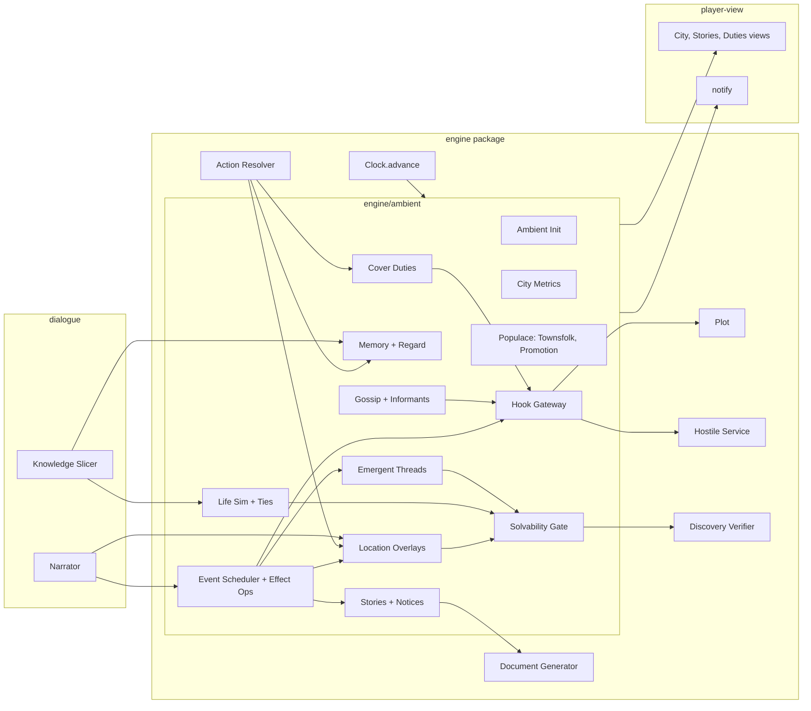

# Design Document

## Overview

The ambient world adds one engine module, `engine/ambient`, that runs inside the slice's clock. It is deterministic TypeScript with no model calls. It extends slice types additively and reaches the Plot, the Hostile Service and Cover Suspicion only through a narrow hook gateway. Players see its effects the same way they see everything else in the slice: Fact Lines, Documents, Notices, Notifications, Observations and NPC speech.

This spec builds on the completed slice (`.kiro/specs/tradecraft/`). Slice requirement numbers are written "slice Req N.M". Slice components and types (`WorldState`, `SimEvent`, `Clock.advance`, `quote`/`resolve`, the verifier, the Knowledge Slicer, the Narrator, `notify`, `SaveSnapshot`) are reused, not redefined.

### Key decisions

| Decision | Choice | Rationale |
|---|---|---|
| Placement | `engine/ambient`, truth side | Ambient state is ground truth; `tui` still imports only `player-view` |
| Randomness | Keyed sub-streams `derive(derive(seed, base + day), key)` | Draws do not depend on processing order, so promotion timing, NPC count and player actions cannot shift unrelated draws |
| Exogenous vs reactive | Two metric components and two event classes | The city's calendar of exogenous events cannot depend on what the player does, which is testable; reactions still exist |
| Effects | Closed set of code-defined Effect_Ops and Ambient_Hooks, parameterised by content | Same pattern as the slice's evaluator kinds: content is data, behaviour is audited code |
| Overlays | Time-bounded overlays over base Location and Route values, never mutation | Removing an overlay restores the base exactly (reversibility property) |
| Solvability | Anchor_Slots for the fast path, Solvable_Set containment for structural changes | Daily life is cheap; only changes that touch witness paths pay for verification |
| Fidelity tiers | `full` (≤ 48) and `coarse` Townsfolk (≤ 160), with deterministic promotion | Depth wherever the player looks, bounded cost everywhere else |
| Budgets | Hard caps with deterministic truncation; wall-clock only measured | Caps keep the Reference Machine fast without breaking determinism |
| Plot coupling | Six Ambient_Hooks; delay and reroute only; no Abort Pressure | The city can complicate the Plot but cannot solve or end it |
| News | Stories with ordered developments feeding the slice's edition selection | Continuity without a new Document pipeline |
| Content | `ambient` pack depending on `core`; city packs depend on `ambient`; ambient kinds registered through content-expansion's Content Kind Registry (`LoadOptions.kinds`) | content-expansion owns the city pack schema and the registry; this spec owns the ambient kinds and their schemas, which live in `engine/ambient/content`, not in `packages/content` |
| Multi-city fidelity | In multi-city mode, implement multi-city's `AmbientSimulator`; every Ambient_Hook is an AmbientCoupling; events, Effect_Ops and Player-Concerning Processing run at both tiers | Couplings are then tier-independent by construction, and only cheap, bounded state is simulated at full detail off-screen |

### Dependencies and interface assumptions

| Spec | What this spec assumes |
|---|---|
| content-expansion | City packs may supply a start date, holidays, Outlets, Civic_Org templates, Townsfolk archetypes and city-specific ambient templates using the kinds defined here. District and Location selectors use content-expansion's `facet:value` Tags and Tag Queries (for example `sector:boundary`, `setting:port`). Cover Identities expose `id` and `tags`. The ambient kinds are registered through its Content Kind Registry (prerequisite: content-expansion task 1.2). |
| plot-library | Side Threads are instantiated through `instantiateSideThread(state, { template, at, bindHints? }, content, rng)`, which returns `{ ok: true, next, thread }` or `{ ok: false, reason: 'ineligible' \| 'unbindable' \| 'inconsistent' \| 'unsolvable' }` and itself re-runs consistency and discovery-path verification (plot-library Req 15.4, 15.5). Only templates whose `spawn` modes include `midgame` are eligible. Side Thread templates may declare an optional pass-through `ambient.spawn` block `{ metric, above, tags? }` (plot-library Req 15.7) that plot-library does not interpret. If the format adds fields, they pass through unchanged. |
| campaign-career | May read `ambientSummary(final)` (Standing-like city facts: Cover_Standing, notable Regard, active Stories). This spec adds nothing to the Outcome Record (schema 2 is plot-library's). |
| multi-city | `AmbientState` is keyed by city id. In multi-city mode this spec implements multi-city's `AmbientSimulator` interface and its coupling union, which includes every Ambient_Hook kind (see Multi-city fidelity). The tier manager and the contract test suite are multi-city's. |

## Architecture



The dependency-cruiser rules gain one: only `engine/ambient/hooks` may import `engine/clock/plot` mutation functions and `engine/hostile` belief writers.

### Ambient streams

| Stream | Seed | Used for |
|---|---|---|
| ambient-init | `derive(seed, 0x50000)`, retry *k* uses `derive(thatSeed, k)` | Civic_Orgs, Outlets, Townsfolk pool, ties, Dormant_Locations, Informants |
| ambient-exo | `derive(seed, 0x51000 + day)` | Exogenous_Event selection, election results, holiday variants |
| ambient-react | `derive(seed, 0x52000 + day)`, keyed by trigger key | Reactive_Event selection |
| ambient-life | `derive(seed, 0x53000 + day)`, keyed by NPC id | Agendas, Life_Events, tie updates |
| ambient-local | `derive(seed, 0x54000 + day)`, keyed by `(locId, phase)` | Local_Incidents |
| ambient-notice | `derive(seed, 0x55000 + day)`, keyed by `(turnId, npcId)` | Notice checks, Regard rules |
| ambient-gossip | `derive(seed, 0x56000 + day)`, keyed by `(sourceId, targetId)` | Gossip transfers, distortion |
| ambient-news | `derive(seed, 0x57000 + day)`, keyed by Outlet id | Story selection, slant distortion |
| townsfolk | `derive(seed, 0x58000)`, keyed by Townsfolk id | Promoted full profiles |
| ambient-cover | `derive(seed, 0x59000 + week)` | Cover_Duties |

All offsets lie in the block `0x50000`–`0x5FFFF` allocated to this spec in the slice PRNG stream registry. In multi-city mode, `seed` in this table is City *i*'s ambient seed `derive(regionSeed, 0x500 + i)` (multi-city design, PRNG streams), with the same offsets.

Keying is `derive(dayStream, fnv1a32(key))`. No stream is consumed sequentially across keys, so adding or reordering keys leaves other keys' draws unchanged.

### Tick order

`Clock.advance` (slice) calls the Ambient_Tick at fixed points:

**Day boundary**, before the slice's Hostile `dailyTick` and newspaper:

1. Metric decay.
2. Exogenous_Event selection, then Reactive_Event selection from yesterday's trigger queue.
3. Stage advancement for active City_Events: Effect_Ops run in `(eventId, opIndex)` order. Structural_Changes go through the Solvability Gate.
4. Ended events: remove their overlays.
5. Cover_Duty generation (on the first day of each week) and due checks.
6. Life sim: Life_Events, then agendas for the day.
7. Emergent_Thread spawn check.
8. Gossip transfers from yesterday's co-presence, then Informant reports.
9. Memory decay and compaction.
10. Story updates, which feed edition candidates to the slice newspaper step.

**Phase boundary:** apply agendas, apply Townsfolk schedules, generate Local_Incidents, update tie affinity from co-presence.

**Inside a Turn Transaction** (slice Req 42): notice checks and Recollections for the player's action, Regard updates, reactive trigger enqueue, and Cover_Duty attendance or misses. These are part of the turn's draft and are discarded with it on failure.

## Components and Interfaces

### Ambient Init (`ambient/init`)

```ts
function initAmbient(world: WorldState, content: ContentSet, preset: DifficultyPreset, scenario: ScenarioConfig): AmbientState; // pure
```

Runs after the slice noise step and its re-verification. It adds Civic_Orgs (police, press per Outlet, 1–2 unions, 2–3 parties, employers, the Cover_Employer), Outlets (1–3), Townsfolk (count `round(160 × densityFactor)`), NPC_Ties (≤ 8 per full-tier NPC), Dormant_Locations (2–4, registered but inactive, not known to the player) and initial metrics from the preset baselines. Informants are designated among Townsfolk and Background NPCs at the preset density, each with a handler (`org:police` or the Hostile Service). Verification then re-runs (Req 3.4). With `ambient.enabled: false`, `initAmbient` is not called and `world.ambient` is absent.

### City Metrics (`ambient/metrics`)

```ts
type MetricId = 'unrest' | 'police' | 'shortage' | 'tension' | 'festivity';
interface Metrics { exo: Record<MetricId, number>; react: Record<MetricId, number>; }
const total = (m: Metrics, k: MetricId) => clamp01(m.exo[k] + m.react[k]);
function decay(m: Metrics, defs: MetricDef[]): Metrics; // toward baseline at rate, per component
```

Exogenous_Event preconditions may read only `exo`. Reactive templates read `total`. Player-caused deltas (Req 4.4) go to `react`.

### Event Scheduler and Effect Ops (`ambient/events`)

```yaml
# packs/ambient/events/labour.yaml
- id: ambient/dock-strike
  category: labour
  class: exogenous                 # exogenous | reactive
  when: { season: [spring, summer, autumn], metrics: { unrest: ">=0.4" }, districtQuery: ["setting:port"] }
  weight: 3
  cooldownDays: 21
  exclusive: [labour-major]
  name: "{pick:union-names} dock strike"
  durationDays: [3, 6]
  stages:
    - day: 0
      ops:
        - { op: post-notice, template: ambient/strike-notice, at: { query: ["setting:port"] } }
        - { op: news-development, story: strike, beat: announced }
        - { op: crowd-modifier, at: { query: ["setting:port"] }, factor: 0.4 }
    - day: 1
      ops:
        - { op: ambient-hook, hook: delay-stage, requires: { stageUses: courier, routeQuery: ["setting:port"] }, days: 1 }
        - { op: metric-delta, metric: unrest, delta: 0.1 }
    - day: last
      ops:
        - { op: news-development, story: strike, beat: resolved }
        - { op: metric-delta, metric: unrest, delta: -0.15 }
  fallback: { op: crowd-modifier, at: { query: ["setting:port"] }, factor: 0.7 }   # used when a structural op is rejected
```

```ts
type EffectOp =
  | { op: 'location-status'; at: LocSelector; status: LocationStatusKind; days: number }
  | { op: 'crowd-modifier' | 'observation-modifier' | 'detection-modifier'; at: LocSelector; factor: number }
  | { op: 'route-checkpoint'; route: RouteSelector; detection: number; coverRisk: number }
  | { op: 'route-closure'; route: RouteSelector }
  | { op: 'curfew'; phases: Phase[]; districts?: DistrictSelector }
  | { op: 'npc-schedule-override'; who: NpcSelector; at: LocSelector; phases: Phase[] }
  | { op: 'metric-delta'; metric: MetricId; delta: number }
  | { op: 'spawn-thread'; tags: string[] }
  | { op: 'news-development'; story: string; beat: string }
  | { op: 'post-notice'; template: TemplateId; at: LocSelector }
  | { op: 'detain-npc'; who: NpcSelector; days: number }          // never Principal NPCs (Req 9.6)
  | { op: 'ambient-hook'; hook: AmbientHook['kind']; requires?: HookGuard; [k: string]: unknown };

interface CityEventState {
  id: EvtId; template: TemplateId; class: 'exogenous' | 'reactive'; name: string;
  start: number; end: number; stage: number; overlays: OverlayId[]; story?: StoryId;
  public: boolean; knownToPlayer: boolean;   // knownToPlayer is a Player View projection input
}
function selectEvents(state: AmbientState, day: number, content: ContentSet, budget: Budgets, rng: KeyedPrng): CityEventState[]; // pure
```

Selection takes eligible templates (preconditions, cooldown, exclusion, Req 5.7), applies the novelty factor (Req 5.8) and the preset density multiplier, and draws without replacement until the start cap or the active cap is reached. Exogenous selection runs first and is evaluated over exogenous inputs only. Reactive triggers are `{ key, templateTags, day }` entries enqueued in turns (Req 4.4). Each is resolved on `ambient-react` keyed by `key` and competes for the remaining cap.

`detain-npc` and `npc-schedule-override` on Principal NPCs, `location-status` other than `open`/`newly-opened`, `route-closure` and Channel outages are Structural_Changes and go through the Solvability Gate.

**Local_Incidents.** Incident templates `{ id, locTypes, phases, crowd, when, factLine, participants, newsworthy, recollect }` are drawn per `(loc, phase)` on `ambient-local`. Each incident is a hidden `incident` Sim event with participants from present NPCs. When the player is present or surveils the Location, the incident yields an Observation and Fact Line. Newsworthy incidents can open a Story.

### Location Overlays (`ambient/locations`)

```ts
type LocationStatusKind = 'open' | 'closed-temporarily' | 'raided' | 'requisitioned' | 'under-renovation' | 'closed-permanently' | 'newly-opened';
interface Overlay { id: OverlayId; source: EvtId; target: LocId | RouteKey | 'city'; from: GameTime; to: GameTime; effect: OverlayEffect; }
function effectiveLocation(base: Location, overlays: Overlay[], t: GameTime): EffectiveLocation; // pure
function effectiveRoutes(base: Route[], overlays: Overlay[], t: GameTime): EffectiveRoute[];     // closures removed, checkpoints attached
```

`quote`, `resolve`, `crowdLevel` and `travelCost` take `EffectiveLocation` and `EffectiveRoute` (Req 8.2). Each route keeps its slice cost of 0 or 1. Closures remove a route only if the graph stays connected, otherwise they become checkpoints (Req 8.5). A checkpoint adds a detection check (`detection`) and a Cover Suspicion delta (`coverRisk`, via the hook gateway) on traversal. Curfew closes non-exempt public Locations in the listed phases. Travel during curfew adds a checkpoint check to every route.

A raid on a Location with a Dead Drop sets the site unavailable and seizes player items. A hidden `drop-raided` event is recorded. The next `service-drop` raises the player-visible `drop-disturbed` event (Req 8.4).

The Map view keeps `lastKnownStatus[loc]`, updated by arrival, by Notices and Documents read, and by Notifications (Req 8.6). The Location Flavour cache key becomes `(locId, phase, crowdBand, statusKind)` (Req 8.7).

### Solvability Gate (`ambient/solvability`)

The slice verifier is extended, without changing its rules, to return witnesses:

```ts
interface VerifierResult { solvable: Set<string>; witnesses: Map<string, [Path, Path]>; } // key: stage key Proposition id or 'mole'
function anchorsOf(r: VerifierResult, world: WorldState): Set<AnchorKey>;                  // meeting edges + pending Plot trace slots
function gate(world: WorldState, change: StructuralChange, cache: GateCache, budget: Budgets): 'accept' | 'reject';
```

- **Fast path** (Req 19.2): if the change's footprint (Locations, NPC slots, Channels, routes) is disjoint from `anchors` and from every witness-path node, accept.
- **Slow path** (Req 19.3): apply the change for its full duration (treated as permanent), run the verifier from the Starting Brief root, and accept iff `after.solvable ⊇ before.solvable`. On acceptance, the cache stores the new witnesses and anchors.
- The daily slow-path count is capped at 6 (Req 2.6). Changes past the cap are rejected, and rejection applies the template `fallback` if one is declared (Req 19.4).

Containment ("does not shrink") rather than "all stages solvable" is used because slice Plot adaptations may already have removed paths that ambient changes did not cause.

### Hook Gateway (`ambient/hooks`)

```ts
type AmbientHook =
  | { kind: 'delay-stage'; stage: StageId; days: 1 | 2 }
  | { kind: 'reroute-location'; stage: StageId; from: LocId }
  | { kind: 'channel-outage'; channel: ChannelId; window: Window }
  | { kind: 'cover-suspicion-delta'; amount: number; cause: string }
  | { kind: 'informant-report'; informant: NpcId; item: GossipRef; handler: 'police' | 'hostile' }
  | { kind: 'detection-bonus'; npc: NpcId; bonus: number };
function applyHook(world: WorldState, h: AmbientHook): { next: WorldState; applied: boolean }; // pure; the only path to plot/hostile writes
```

- `delay-stage` and `reroute-location` call the slice's delay and reroute responses (slice Req 3.4) directly, not `onDisrupted`, so no Abort Pressure and no abort draw (Req 18.2). A delay is applied only while `ambientDelayDays + days ≤ preset.ambient.maxPlotDelayDays` (Req 18.3). A reroute uses the slice's same-type Location rule and goes through the gate.
- `channel-outage` moves the affected stage to an alternate Channel or a courier for the window. It does not add the Channel to `compromisedChannels`, so it is not a disruption.
- `cover-suspicion-delta` is clamped so the day's ambient sum stays within `[−max, +max]` (Req 18.5). Positive and negative sums are tracked separately.
- `informant-report` to the Hostile Service raises a hidden `informant-report` event that the Hostile `dailyTick` reads in its tailing step (slice dailyTick step 6). It may produce a `detection-bonus` for a seen-with NPC (Req 13.5). A report to the police raises `police` reactive pressure.
- Every applied hook is appended to `ambient.hookLedger` (Truth-branded) for the debrief (Req 18.6).
- In multi-city mode `applyHook` is not called from the tick. Each hook is emitted as the AmbientCoupling of the same kind from `couplings`, and multi-city's `applyCouplings` calls the same hook functions with the same caps (Req 25.2).

### Life Sim and Ties (`ambient/life`)

```ts
interface LifeState {
  needs: { money: number; social: number; work: number }; mood: number;
  work: 'employed' | 'unemployed' | 'sick' | 'on-leave'; lastLifeEvent?: number;
}
interface NpcTie { a: NpcId; b: NpcId; kind: 'kin' | 'friend' | 'colleague' | 'romantic' | 'rival' | 'creditor'; affinity: number; prop?: PropId; }
function dailyAgenda(npc: Npc, life: LifeState, overrides: ScheduleOverride[], anchors: Set<AnchorKey>, rng: Prng): ScheduleEntry[]; // pure
function applyLifeEvent(npc: Npc, life: LifeState, tpl: LifeEventTemplate, rng: Prng): { npc: Npc; life: LifeState; props: Proposition[] };
```

Agenda layers apply in the order in Req 9.2. A deviation that would move an Anchor_Slot is skipped (Req 9.3), so no verifier run is needed. Life_Event templates declare `when` (needs, mood, metrics, work status), `effects` (needs, mood, work, MICE deltas, ties, schedule deviations for N days, Propositions) and `excludeFor: [principal]` where the event removes, detains or ends the NPC (Req 9.6). MICE and `moneyNeed` deltas are clamped to 0.15 per lever per rolling 7 days (Req 9.4). Code asserts that allegiances, Station/Hostile/Cell memberships and Plot roles are unchanged after every life step (Req 9.5).

Ties (Req 10): co-presence adds `+0.02` affinity per shared phase, capped at 1. Affinity decays by 0.01 per day without contact. Tie formation and ending add or retract `RELATED_TO`, `INVOLVED_WITH` or `OWES` in the Truth Store and in both participants' Knowledge Slices. The introduce-task trust bonus is `min(0.2, affinity × 0.2)`.

### Populace (`ambient/populace`)

```ts
interface Townsfolk { id: NpcId; archetype: ArchetypeId; descriptor: string; schedule: ScheduleTemplateId; recollections: Recollection[]; regard: Regard; informant: Truth<false | 'police' | 'hostile'>; }
function promote(t: Townsfolk, seed: string, content: ContentSet): Npc;   // pure; uses townsfolk stream keyed by t.id only
function demote(n: Npc, ambient: AmbientState): Townsfolk;                // keeps Regard and top-4 Recollections
```

Townsfolk are not Principal NPCs and have no Knowledge Slice beyond 4 local Propositions. Promotion triggers are listed in Req 11.2. The cap is 3 per day; extra requests queue to the next day, except a talk or approach request, which is served first. When the full tier is at 48, the promoted NPC with the oldest `lastInteraction` is demoted (Req 11.5). Principal and Background NPCs from the slice are never demoted. A promoted NPC's name is drawn on promotion and registered in the Entity Registry then. Before promotion they appear only by descriptor, so the Leak Guard has nothing to catch.

### Memory and Regard (`ambient/memory`)

```ts
interface Recollection {
  id: RecId; kind: 'saw' | 'talked' | 'paid' | 'threatened' | 'seen-with' | 'asked-about' | 'attended' | 'introduced';
  at: GameTime; loc: LocId; with?: EntityId; salience: number;
  ground: { kind: 'participant' | 'witness'; event: EventId } | { kind: 'gossip'; from: NpcId; item: RecId };
}
interface Regard { warmth: number; wariness: number; familiarity: number; }
function noticeCheck(npc: NpcLike, action: ActionResult, crowd: CrowdLevel, rng: Prng): boolean;   // p = base × attentiveness × crowdFactor
function compact(recs: Recollection[], cap: number, floor: number): Recollection[];                 // decay, drop, keep top by salience
```

Notice checks run on `ambient-notice` keyed by `(turnId, npcId)` inside the Turn Transaction (Req 12.1). Each Recollection carries its grounding (Req 12.3). A gossip-grounded item references the source's Recollection id, and the source must have held it at transfer time. Salience decays by 10% per day, the floor is 0.1 and the cap is 16 (full) or 4 (Townsfolk) (Req 12.4). Regard rules per Intent and action are content (`recollection.yaml`), for example `pay → warmth +0.1, familiarity +0.05`, `threaten → warmth −0.2, wariness +0.3`.

The slice formulas gain terms with weights in `scenario.yaml` (`recruitment.firstContact.e`, `recruitment.meeting.regard`) (Req 12.6):

- first contact: `σ(... + e·(warmth − wariness))`
- meeting acceptance: `σ(... + regard·(warmth − wariness))`

Arrival greetings (Req 12.7) are Fact Line templates that fire when a present NPC has `familiarity ≥ 0.6`.

### Gossip and Informants (`ambient/gossip`)

At the day boundary, candidate pairs are NPC_Ties plus pairs co-present that day. Each pair transfers at most one item, chosen by salience, with p = `0.3 × affinityOr(0.3)`, keyed by `(sourceId, targetId)`. Pairs are processed in id order until 40 transfers (Req 2.5, 13.1). Transferred Propositions are distorted with p = `preset.ambient.gossipDistortion` using slice Rumour operators, and the receiver holds the result as a false belief (Req 13.2). Transferred Recollections become gossip-grounded Recollections of the receiver at 0.6× salience.

Informants (Req 13.3–13.5) report each new player-related item once, via `informant-report`. A `seen-with` item adds `detection-bonus(npc, preset.ambient.informantBonus)` to that NPC's next detection check.

### News Cycle and Notices (`ambient/news`)

```ts
interface StoryState { id: StoryId; key: string; source: EvtId | ThreadId | IncidentId | StageId; beats: { beat: string; day: number; props: PropId[] }[]; lastDevelopment: number; status: 'active' | 'closed'; }
interface Outlet { id: OrgId; name: string; slant: 'government' | 'opposition' | 'western' | 'eastern' | 'independent'; covers: string[]; distortion: number; }
function editionCandidates(stories: StoryState[], outlet: Outlet, day: number): ArticleCandidate[]; // ranked: new development > first report > filler
```

Story templates define beats, each with an article template and asserted Propositions. Follow-up templates receive the previous beat as `{prev}` (Req 14.4). A beat is only offered after its cause beat exists. The slice newspaper step (slice Req 30.2) takes the ranked candidates per Outlet, so each Outlet publishes its own 3–6-article edition, and Outlets with no matching candidates fall back to the slice candidate pool. Slant applies the Outlet's distortion rate with Rumour operators to its slant-disfavoured subjects. Distorted asserts get `ClaimTruthRecord`-style truth entries when read (Req 14.5). Stories close after 3 days without development (Req 14.6). The cap of 12 active Stories drops the lowest-priority candidate Story.

Notices extend the slice Document kind union with `'notice'`, with `obtainableAt` set to the target Locations and an expiry (Req 15).

### Emergent Threads (`ambient/threads`)

At step 7 of the day tick, triggers are `spawn-thread` ops plus Side Thread templates whose `ambient.spawn.metric` threshold is crossed. The cap is 1 per 3 days and 3 active (Req 16.2). Only templates whose plot-library `spawn` modes include `midgame` are candidates. `spawn-thread` ops match candidates by `ambient.spawn.tags`; metric triggers compare the City_Metric named by `ambient.spawn.metric` against `ambient.spawn.above`. Participants are chosen from eligible NPCs (Req 16.3), promoting Townsfolk within the promotion cap.

```ts
const r = instantiateSideThread(world, { template: tpl.id, at: now, bindHints: chosenParticipants }, content, streams.keyed('ambient-exo', tpl.id));
if (!r.ok) { /* drop the spawn; world unchanged; log r.reason (Req 16.6) */ } else { world = r.next; /* r.thread */ }
```

Participant choices go in as `bindHints` (role → EntityId). The `rng` is the `ambient-exo` keyed stream for the template id. `ok: false` means the spawn is dropped and the state is unchanged, and the dropped spawn counts toward neither cap. plot-library's API already re-runs consistency and verification on the thread (plot-library Req 15.5), so the Solvability Gate is not run a second time for the thread itself. The gate runs only for any additional Structural_Changes ambient applies around the spawn (for example agenda overrides that move a participant into an Anchor_Slot). The thread's Channels feed the Cipher Engine's Noise Traffic. The thread is stored in `world.sideThreads` with `origin: Truth<'emergent'>`.

### Cover Duties (`ambient/cover`)

```ts
interface CoverDuty { id: DutyId; template: TemplateId; loc: LocId; slot: GameTime; phases: 1 | 2; mandatory: boolean;
                      standingGain: number; suspicionDelta: number; attendees: NpcId[]; status: 'pending' | 'attended' | 'missed'; }
```

On the first day of each week, 2–4 duties are drawn from templates matching the Cover Identity `id` or `tags` (Req 17.1). Attendees include Principal NPCs whose cover employment matches the template's `attendeeTags` (Req 17.5), added as `npc-schedule-override` entries that respect anchors. A new action kind, `{ kind: 'attend-duty'; duty: DutyId }`, is quoted at the duty's phases and requires the player to be at the Location in the slot. It opens a scene with the attendees (Req 17.2). A miss is detected at the slot's end (Req 17.3). Standing changes and Cover Suspicion deltas go through `cover-suspicion-delta`. The low-standing multiplier (Req 17.4) applies in the slice's Cover Suspicion update for high-risk visits.

### Player View, Notifications and Debrief

New player-visible event kinds: `public-announcement` (curfew, authority closure, election result), `cover-duty-due`, `cover-duty-missed`, `cover-employer-message` and `drop-disturbed`. New hidden kinds: `city-event-stage`, `incident`, `life-event`, `gossip`, `informant-report`, `ambient-hook`, `location-status`, `drop-raided`, `promotion`. The Notification union gains the visible kinds (Req 20.2–20.3).

New views (`player-view/city`):

- **City view:** events where `knownToPlayer`, which is set when a Document, Notice, Observation, Notification or Claim names the `evt:` id (Req 20.4).
- **Stories view:** read articles grouped by Story (Req 14.7).
- **Duties view:** pending and past Cover_Duties and Cover_Standing as a band (low, fair, good).

The debrief adds "The city and the case": applied hooks from `hookLedger` and the Emergent_Threads (Req 16.5, 18.6).

### Dialogue and Narration

The Knowledge Slicer adds an ambient sub-block at the end of block 3: up to 8 held ambient Propositions by salience, refreshed only at day boundaries (Req 21.1–21.2). Block 4 gains rendered Recollections ("You remember the trade attaché paying for coffee at the Café Mozart last week"). These are trimmed together with Told List detail when over budget, and the ambient total is capped at 400 tokens. The NPC's known-entity set is the slice set plus entities in held ambient Propositions and Recollections (Req 21.3).

`SceneDescriptor` gains `ambient: { events: string[]; status?: LocationStatusKind; incidents: string[] }`. Event labels join the Specifics Guard allowed-name set (Req 21.4). Incident Fact Lines are printed with the action's Fact Lines.

### Multi-city fidelity (`ambient/fidelity`)

In single-city mode none of this applies and the module behaves as described above (Req 25.8). In multi-city mode the Ambient_Sim implements multi-city's `AmbientSimulator` (multi-city design, Fidelity Tiers) with one `AmbientState` per City (Req 25.1):

```ts
const ambientSimulator: AmbientSimulator = {
  advanceFull(city, ambient, spine, rng)   { /* every step of the tick order */ },
  advanceCoarse(city, ambient, spine, rng) { /* tier-independent steps in full, the rest coarse */ },
  reconcile(city, ambient, spine, disclosed, rng) { /* resample coarse detail, keep disclosed */ },
  couplings(city, ambient, t) { /* derived only from tier-independent state */ },
};
```

**Tier split.** This split is what makes every coupling identical at both tiers (Req 25.3–25.5):

| Runs identically at both tiers | May be coarse at the coarse tier |
|---|---|
| City Metrics; Exogenous_Event and Reactive_Event selection, stages and Effect_Ops (inputs: calendar, exogenous metrics, reactive triggers raised by Spine events and player turns) | Full-tier agendas and their deviations for non-Principal NPCs |
| Location and Route overlays, Dormant_Location activation, Emergent_Thread spawning | Life_Events, needs and mood |
| Player-Concerning Processing: Recollections and Regard about the player (with decay and compaction), gossip of player-related items, Informant reports and their hooks | Tie affinity drift, Local_Incidents, Townsfolk schedules and promotions not triggered by the player |
| Cover_Duty generation and attendance | News texture: Story selection beyond event-driven beats, slant distortion |

- **Tier-independent inputs for the player channel.** Player-related gossip pairs are NPC_Ties plus co-presence computed from base schedules and Spine placements, never from coarse-tier agendas. Recollections about the player come from Turn Transactions (always in the full-tier Current City) and Spine events. The work is bounded by the existing gossip and memory caps.
- **Couplings.** `couplings` maps Location status and curfew overlays to `location-closed`, crowd overlays to `crowd-modifier`, intercity route effects to `route-delay`, and every Ambient_Hook to the coupling of the same kind (Req 25.2). Effect_Ops that would change Spine state with no coupling kind are restricted: `npc-schedule-override` and `detain-npc` target only Background NPCs and Townsfolk, and Cover_Duty attendee overrides include no Principal NPC. Their effect on the Plot is available through `delay-stage` and `reroute-location`.
- **Solvability Gate.** Structural_Changes are checked against multi-city's Regional Verifier instead of the slice verifier, with the same containment rule.
- **Reconciliation.** `reconcile` re-derives coarse detail for the City from its keyed streams and keeps every Disclosed Fact (Req 25.6). Coupling-relevant state is already exact, so it is not resampled.
- **Contract tests.** The ambient-world suite runs multi-city's exported contract test suite against `ambientSimulator` (Req 25.7).

## Data Models

```ts
type EntityId = /* slice kinds */ | `evt:${string}`;   // registered names; Leak Guard aliases

interface AmbientState {
  schema: 1; cityId: CityId; enabled: true; density: 'sparse' | 'standard' | 'rich';
  calendar: { startDate: string; holidays: HolidayId[] };
  metrics: Metrics;
  events: Record<EvtId, CityEventState>; history: Record<TemplateId, number[]>; triggers: ReactiveTrigger[];
  overlays: Overlay[]; dormant: LocId[];
  life: Record<NpcId, LifeState>; ties: NpcTie[]; tier: Record<NpcId, 'full' | 'coarse'>;
  townsfolk: Record<NpcId, Townsfolk>; promotionQueue: NpcId[]; lastInteraction: Record<NpcId, GameTime>;
  memory: Truth<Record<NpcId, Recollection[]>>; regard: Truth<Record<NpcId, Regard>>;
  informants: Truth<Record<NpcId, 'police' | 'hostile'>>;
  stories: Record<StoryId, StoryState>; outlets: Outlet[];
  duties: CoverDuty[]; coverStanding: Truth<number>;
  hookLedger: Truth<AppliedHook[]>; ambientDelayDays: number; coverDeltaToday: { pos: number; neg: number };
  gate: { solvable: string[]; anchors: AnchorKey[]; slowRunsToday: number };
  counters: DayCounters;   // starts, incidents, lifeEvents, gossip, promotions, threads
}

interface WorldState { /* slice fields */ ambient?: AmbientState; }
interface SaveSnapshot { /* slice fields */ version: number; /* bumped */ }   // ambient travels inside world
interface PlayerViewState { /* slice fields */ lastKnownStatus: Record<LocId, LocationStatusKind>; knownEvents: EvtId[]; readStories: Record<StoryId, DocId[]>; }

// content additions (Zod in content package)
interface DifficultyPresetAmbient {
  eventDensity: number; policeBaseline: number; informantDensity: number; gossipDistortion: number;
  informantBonus: number; maxPlotDelayDays: number; maxCoverSuspicionPerDay: number;
}
// scenario.yaml: ambient: { enabled: boolean = true, density: 'sparse' | 'standard' | 'rich' = 'standard' }
```

Default preset values:

| Field | easy | standard | hard |
|---|---|---|---|
| eventDensity | 0.8 | 1.0 | 1.2 |
| policeBaseline | 0.2 | 0.3 | 0.45 |
| informantDensity (share of civilians) | 0.03 | 0.06 | 0.10 |
| gossipDistortion | 0.1 | 0.2 | 0.3 |
| informantBonus | 0.02 | 0.05 | 0.08 |
| maxPlotDelayDays | 3 | 2 | 1 |
| maxCoverSuspicionPerDay | 0.05 | 0.08 | 0.12 |

**Budgets** (`Budgets`, scaled by Density per Req 2.10, `rich` = 1.0):

| Cap | rich | standard | sparse |
|---|---|---|---|
| Full-tier NPCs / Townsfolk | 48 / 160 | 48 / 120 | 48 / 80 |
| Event starts per day / active | 2 / 6 | 1 / 4 | 1 / 3 |
| Local_Incidents per day | 12 | 9 | 6 |
| Life_Events per day | 6 | 4 | 3 |
| Gossip transfers per day | 40 | 30 | 20 |
| Promotions per day | 3 | 3 | 3 |
| Slow gate runs per day | 6 | 6 | 6 |
| Active Stories / Emergent_Threads | 12 / 3 | 12 / 3 | 12 / 3 |

**Period and fiction rules (content lint, Req 22.4):** person-kind slots bind only to registry NPCs or to `role-title` pools ("the Interior Minister", "a sector commandant"). Outlet, party and union names come from content pools. Technology words in templates are checked against the pack's era vocabulary list (telephone exchanges, teleprinters, shortwave, microdots), and anachronism denylist terms are rejected at load.

## Correctness Properties

*A property is a characteristic or behavior that should hold true across all valid executions of a system-essentially, a formal statement about what the system should do. Properties serve as the bridge between human-readable specifications and machine-verifiable correctness guarantees.*

Each property is one fast-check test with `numRuns ≥ 100`. Generators cover the core and ambient packs, every Difficulty Preset, every Density, random action logs (drawn from `actions()` at each step), and fuzzed model outputs where dialogue is involved. "Run" means generate then apply an action log for 1–14 game days. Slice properties 1–32 keep holding with ambient enabled; their generators gain ambient state.

**Property 1: Ambient determinism, save and replay.** For any seed, preset, Density and action log, two runs produce deep-equal World States including `ambient`. This holds with the wall clock mocked to random values and with a gateway that throws if the Ambient_Tick calls it. `load(save(s))` deep-equals `s`, and replaying a recorded session reaches the same final ambient state.
*Validates: Requirements 1.2, 1.3, 2.7, 24.1, 24.3*

**Property 2: Ambient-off equivalence.** For any seed, preset and action log, a run with `ambient.enabled: false` produces a World State, Player View, Notification stream and action log deep-equal to the slice pipeline without the ambient module.
*Validates: Requirements 1.5, 24.2*

**Property 3: Additive initialisation.** For any seed and preset, the day-0 world with ambient enabled, projected onto core and noise entities (ignoring appended known-entity entries), deep-equals the world with ambient disabled. The final world passes discovery-path verification.
*Validates: Requirements 1.6, 3.1, 3.3, 3.4*

**Property 4: Exogenous calendar independence.** For any seed and any two action logs over the same number of days, the sequences of Exogenous_Events (template, start day, stages) and the Exogenous_Metric values are identical.
*Validates: Requirements 4.3, 4.4, 5.1*

**Property 5: Keyed-stream independence.** For any seed and Townsfolk NPC, the promoted profile is identical whether promotion happens on day 0 or on any later day, and whatever other NPCs are promoted first. For any day tick, permuting the processing order of NPC ids leaves each NPC's life draws unchanged.
*Validates: Requirements 1.1, 11.3*

**Property 6: Budget caps.** For any run, on every day: event starts, active City_Events, Local_Incidents (per day and per Location per phase), Life_Events (per day and per NPC per 7 days), gossip transfers, promotions, slow gate runs, active Stories, Emergent_Threads, full-tier count, Townsfolk count, ties per NPC and Recollections per NPC are within their Density-scaled caps. Every City_Event has duration 1–14 days and 1–7 stages, and each week has 2–4 Cover_Duties.
*Validates: Requirements 2.1–2.6, 2.10, 5.3, 10.1, 11.1, 11.4, 12.4, 14.1, 16.2, 17.1*

**Property 7: Cooldown and exclusion.** For any run, no Event_Template starts an instance within its cooldown of its previous instance, and no two simultaneously active City_Events share an exclusion tag. Every started event's preconditions held at selection.
*Validates: Requirements 5.1, 5.7, 6.4*

**Property 8: Overlay reversibility.** For any world and City_Event, the effective Locations and Routes after the event ends equal the effective Locations and Routes of the same world in which that event's overlays were never applied.
*Validates: Requirement 5.6*

**Property 9: Effective location soundness.** For any world, overlay set and time, the effective Route graph is connected and every route cost is 0 or 1. For any allowed action, slice Property 16 (phase and cost accounting) holds using effective values, and an action at a Location that is closed or unavailable under its effective state is disallowed with state unchanged.
*Validates: Requirements 8.1, 8.2, 8.5*

**Property 10: Solvability monotonicity and anchor protection.** For any world and sequence of Structural_Changes, the Solvable_Set after each accepted change contains the Solvable_Set before it. Every change accepted by the fast path would also be accepted by the slow path. No agenda deviation or Cover_Duty attendee override alters an Anchor_Slot.
*Validates: Requirements 9.3, 17.5, 19.1, 19.2, 19.3, 19.4*

**Property 11: Plot truth confinement.** For any world and day of Ambient_Ticks, the diff of `plot`, Hostile Service beliefs, NPC allegiances, Station/Hostile/Cell memberships and Plot roles is exactly the composition of the hooks recorded in `hookLedger` for that day. Abort Pressure, `plot.status` and abort triggers are unchanged. Cumulative ambient delay is at most `maxPlotDelayDays`. No Principal NPC is detained, removed or ended by an ambient effect.
*Validates: Requirements 9.5, 9.6, 18.1, 18.2, 18.3, 18.4*

**Property 12: Ambient Cover Suspicion cap.** For any run, the sum of ambient Cover Suspicion increases on each day is at most `maxCoverSuspicionPerDay`, and the sum of decreases is at most the same amount.
*Validates: Requirement 18.5*

**Property 13: Life bounds.** For any run and NPC, each MICE lever and `moneyNeed` changes by at most 0.15 over any 7-day window through ambient effects. For any promoted NPC, demotion then re-promotion preserves its Regard and its 4 most salient Recollections, and reproduces its profile.
*Validates: Requirements 9.4, 11.5*

**Property 14: Memory grounding.** For any run, every Recollection is grounded in a Sim event in which the NPC was a participant, a Sim event at a Location where the NPC's schedule placed it at that time, or a gossip transfer from an NPC that held the referenced Recollection at transfer time.
*Validates: Requirement 12.3*

**Property 15: Gossip and tie containment.** For any run, every gossip transfer connects NPCs with an NPC_Tie or co-presence that day, and transfers only an item the source held. Every distorted transfer is held by the receiver as a false belief with a Truth Store record. The Truth Store holds a RELATED_TO, INVOLVED_WITH or OWES Proposition if and only if the matching active NPC_Tie exists.
*Validates: Requirements 10.3, 13.1, 13.2*

**Property 16: Ambient prompt containment and budget.** For any NPC and state, every ambient Proposition and Recollection rendered into the NPC's prompt is held by that NPC. Persons the NPC cannot name appear only by descriptor. The ambient additions are within 400 tokens. Within a day with no other knowledge change, prompt block 3 is byte-identical across turns.
*Validates: Requirements 12.5, 21.1, 21.2, 21.3*

**Property 17: Ambient truth isolation and notification soundness.** For any reachable state, the serialized Player View and Case File contain no Regard, Recollection, Informant, hook-ledger, life-state or Emergent_Thread origin field. The City view lists only events the player has learned of, and the Map shows `lastKnownStatus`, not the live overlay. `notify(events, view)` is unchanged when hidden ambient events are added or removed.
*Validates: Requirements 8.6, 13.3, 20.2, 20.3, 20.4, 20.5*

**Property 18: News continuity.** For any run and Story, beats are printed in cause order and never before their cause beat. Every follow-up article references the previous printed beat. Every distorted asserted Proposition has a truth record in the Truth Store.
*Validates: Requirements 14.4, 14.5*

**Property 19: Emergent thread soundness.** For any run, no Emergent_Thread has a Cell member as a participant, spawning an Emergent_Thread never shrinks the Solvable_Set, and a spawn rejected by `instantiateSideThread` (`ok: false`) leaves the World State unchanged.
*Validates: Requirements 16.2, 16.3, 16.6*

**Property 20: Ambient content validation.** For any generated valid ambient pack set, loading succeeds. For any single corruption (an unknown Effect_Op or hook kind, a dangling template or story reference, a person slot bound to a free-text pool, an ambient predicate with an implication rule, or a duplicate id), loading fails with an error locating the pack, file and path.
*Validates: Requirements 5.5, 22.1, 22.2, 22.3, 22.4*

**Property 21: Ambient turn atomicity.** For any pre-turn state and turn, injecting a model failure before commit leaves `ambient` (Recollections, Regard, triggers, duty status, counters) deep-equal to its pre-turn value, and a successful retry yields the same post-turn ambient state as an uninterrupted run.
*Validates: Requirement 1.4*

**Property 22: Tier-independent couplings.** For any Region, City, Spine history, Ambient streams and tier schedule (any assignment of full or coarse to the City at each phase), the sequence of `couplings` results, City_Event state, and Player-Concerning Processing state (Recollections and Regard about the player, player-related gossip and Informant reports) are deep-equal to the all-full run. After `reconcile`, every Disclosed Fact about the City still holds. With multi-city mode disabled, runs are deep-equal to the single-city Ambient_Sim.
*Validates: Requirements 25.2, 25.3, 25.4, 25.5, 25.6, 25.8*

## Error Handling

| Failure | Handling |
|---|---|
| Ambient init cannot pass verification | Retry with derived ambient seeds up to 8 times, then `GeneratorError` naming the seed (Req 3.4) |
| Structural_Change rejected by the gate, or gate cap reached | Apply the template fallback if declared, else drop; log `gate-reject` to the metrics log (Req 19.4, 2.6) |
| Route closure would disconnect the graph | Convert to a checkpoint (Req 8.5) |
| Hook exceeds a cap (delay, Cover Suspicion) | Clamp or skip; record `applied: false` in the ledger |
| Cap reached (events, incidents, gossip, promotions) | Deterministic truncation in priority order; the remainder is skipped or queued as specified |
| Life step changes a protected field | Assertion failure in development builds; the step is discarded in release builds and a `ambient-invariant` entry is logged |
| Plot-library template missing `ambient.spawn` | Template is ineligible for metric-triggered spawning |
| `instantiateSideThread` returns `ok: false` | Drop the spawn, keep the state unchanged, log the `reason` (Req 16.6) |
| Invalid ambient content or `ambient` config block | Refuse to start; report pack/file/path or file/field path (Req 22.3, 23.3) |
| Save without ambient state | Load with ambient disabled for that game (Req 24.2) |
| Ambient tick exceeds time target | Log timing only; behaviour is unchanged (Req 2.8) |

## Testing Strategy

- **Property tests (fast-check)** implement Properties 1–22, each a single test with `numRuns ≥ 100`, tagged `// Feature: ambient-world, Property N: <title>`. Run-based properties use short runs (1–14 days) with Density `rich` to hit caps. The slice's property generators are extended with ambient state so slice Properties 3, 13, 14, 15, 16, 28 and 29 cover ambient additions.
- **Unit tests (Vitest)** cover metric decay, each Effect_Op and hook, event selection with fixed seeds (novelty factor, reactive triggers), election results, curfew and checkpoint travel, raid and drop disturbance, agenda layering, Life_Event effects, tie affinity, notice checks and Regard rules, gossip distortion, story ranking and closure, Notice reading, Cover_Duty attendance and misses, the low-standing multiplier, Density scaling and the Flavour cache key.
- **Content smoke test:** the `ambient` pack loads with `core`, has the category and count minimums of Req 6.2, and a world per preset initialises and runs 14 days.
- **Config tests:** the shipped `scenario.yaml` `ambient` block and each preset's `ambient` block validate; representative bad fields report their paths.
- **Benchmark:** `pnpm bench:ambient` runs 30 days at Density `rich` on three fixed seeds and reports p95 tick times and save growth per day against Req 2.8–2.9. It reports in CI and is gated only on the Reference Machine.
- **Multi-city contract:** the suite runs multi-city's exported ambient contract test suite against the `AmbientSimulator` implementation (Req 25.7). Property 22 uses multi-city's fixture Regions.
- **Golden replays:** at least one recorded 7-day session with ambient enabled joins `evals/replays/`.
- **Eval fixtures:** `gossiping-waiter` and `festival-arrival` (Req 24.4) run in the harness; CI runs them in replay mode.
- **TUI:** `ink-testing-library` snapshots for the City, Stories and Duties views, Notice Fact Lines and the status-bar duty alert. These are not property tests.
