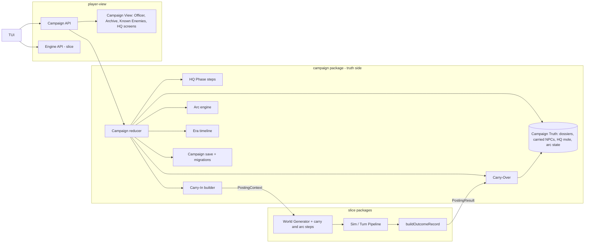
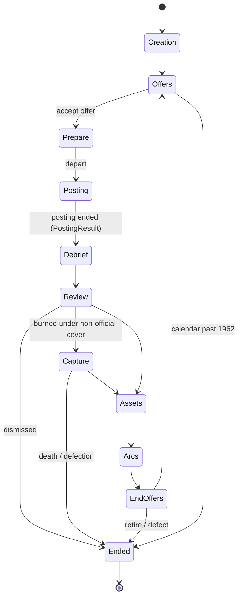

# Design Document

## Overview

The campaign layer wraps the slice. It does not change how a Posting plays. A new truth-side package, `campaign`, owns Campaign state and runs the HQ Phase. Posting inputs reach the slice only through a **Posting Context**. Posting consequences come back only through a **Posting Result**. The slice's Sim, guards, turn pipeline and saves are reused unchanged, apart from three small, opt-in extension points:

1. `generate(…, ctx?: PostingContext)` takes an optional context. With no context, its output is identical to the slice's.
2. Plot template selection calls plot-library's `select(SelectionInput)` when plot-library is installed, with a uniform fallback otherwise.
3. A carry step and an arc step add carried entities and Arc Threads between core verification and noise.



### Key decisions

| Decision | Choice | Rationale |
|---|---|---|
| Campaign logic shape | One pure reducer `step(state, input)` over logged inputs | Determinism and replay come for free; the reducer is property-testable with synthetic Posting Results |
| State split | `CampaignState = { view, truth: Truth<…>, rng, log, archive }` at the type level | The Campaign View is a projection of `view` and `archive.visible` only, so truth isolation is structural, as in the slice |
| Posting seeds | `postingSeed(k) = derive(campaignSeed, k)`; campaign stream `derive(campaignSeed, 0xC0000)` | A Posting's world does not depend on campaign randomness, only on its own seed and the Carry-In |
| Carry into a Posting | Additive Carry-In applied after core verification, on its own streams | The learnability graph only gains edges, so the Plot stays solvable (Req 18) and slice noise independence (slice Property 21) is preserved |
| Carried knowledge | A generated Personal File Document | It reuses the slice's `read` path and Claim sources; no new Claim source kind |
| Debriefs | Redacted while the Campaign runs; full reveal at Campaign End | The slice debrief reveals true allegiances (slice Req 19.6), which would spoil carried Assets, Recognisers, the Nemesis and the Mole Hunt |
| Cross-Posting identity | Campaign-stable entity ids `npc:cp-<n>` for carried persons and HQ figures | Claims about the same person compare across Postings, which the Mole Hunt evidence gate needs |
| Officer effects | Content-mapped, clamped modifiers delivered as preset overrides and scenario weights | Slice formulas stay untouched (Req 4.5); balance is data |
| Hostile service identity | Service Definitions from content-expansion's `service` kind, referenced by id; a City Pack's `services` list names which are active. This spec defines no service schema | One service's Dossier follows the Officer across cities |
| Save layout | A directory per Campaign: `campaign.json` plus per-Posting archives, written by temp file and rename | Atomic writes (Req 23.7) and an Archive that grows without rewriting old Postings |
| Plot repetition | Call plot-library's `select(SelectionInput)` with a `templateHistory` (plot-library's canonical `TemplateHistoryEntry[]`) built from Outcome Record schema-2 `plots[]`; uniform-unused fallback when plot-library is absent | One history model across specs; this spec still runs without plot-library |

## Architecture

### Packages

```
packages/
  campaign/        reducer, HQ Phase, carry-over, carry-in, arcs, era, review board, capture,
                   hostile dossier, campaign save and migrations, campaign config
  campaign/content + campaign content kinds and schemas, registered through content-expansion's Content Kind Registry (LoadOptions.kinds)
  content/         + packs/core/campaign/ data only
  engine/          + worldgen carry step and arc step, PostingContext input, Plot selection call (plot-library select or fallback),
                   Recogniser detection hook, buildPostingResult
  player-view/     + campaign API, Campaign View projections, redacted debrief view
  tui/             + campaign screens
config/campaign.yaml
saves/campaigns/<campaignId>/
```

Boundary rules (dependency-cruiser, extending the slice's rules):

- `tui` imports only `player-view` (unchanged).
- `player-view` may import `campaign` only through its exported view functions (`campaignView`, `hqStepView`, `archiveView`). It never imports Campaign Truth types.
- `campaign` imports `engine`, `content` and `llm` types (for recordings), never `tui`.

### PRNG streams (additions to the slice's table)

| Stream | Seed | Used for |
|---|---|---|
| campaign | `derive(campaignSeed, 0xC0000)`, saved state | HQ cast, arcs, offers, Review Board ties, captures, Tension, Mole leaks |
| posting *k* | `derive(campaignSeed, k)` | Passed as the slice `seed`; the slice derives core, noise, daily and runtime from it |
| carry | `derive(postingSeed, 0x60000)`, retry *j* uses `derive(thatSeed, j)` | Carried NPC placement, schedules, Personal File |
| arc | `derive(postingSeed, 0x61000)`, retry as carry | Arc Thread instantiation |

The carry and arc offsets lie in the block `0x60000`–`0x6FFFF` allocated to this spec in the slice PRNG stream registry; the campaign stream stays `derive(campaignSeed, 0xC0000)`. The carry and arc streams sit between core and noise in generation order but are independent of both.

### Campaign lifecycle



Each box is an `HqStep`. A step takes choices until it is complete. Then an `advance` input moves to the next step. Steps with no player decision (Debrief, Review) still need one `advance`, so the player reads the Cable.

## Components and Interfaces

### Campaign reducer (`campaign/reducer`)

```ts
type CampaignInput =
  | { kind: 'choice'; choice: CampaignChoice }
  | { kind: 'posting-result'; index: number; result: PostingResult };

function quoteChoice(s: CampaignState, c: CampaignChoice, content: ContentSet): ChoiceQuote;          // pure; allowed, reason, cost
function step(s: CampaignState, input: CampaignInput, content: ContentSet): Result<CampaignState, CampaignError>; // pure
function replayCampaign(seed: string, log: CampaignLogEntry[], content: (m: ContentManifest) => ContentSet,
                        postingResult: (entry: PostingLogRef) => PostingResult): CampaignState;
```

`step` appends to `s.log`, draws only from `s.rng` (campaign stream) and returns a new value. A disallowed choice returns an error and leaves the state unchanged. `replayCampaign` folds the log. It obtains each Posting Result by replaying that Posting through the slice's `ReplayGateway` (slice Property 14), then checks the logged `resultHash`.

```ts
type CampaignChoice =
  | { kind: 'create'; seed?: string; preset: string; officerName: string; background: BackgroundId; startYear: number }
  | { kind: 'accept-offer'; offer: OfferId }
  | { kind: 'asset-decision'; asset: CampaignPersonId; decision: 'handover' | 'exfiltrate' | 'bring' }
  | { kind: 'train'; skill: SkillId } | { kind: 'leave' }
  | { kind: 'requisition'; id: RequisitionId } | { kind: 'legend'; cover: CoverIdentityId; name: string }
  | { kind: 'accuse'; figure: CampaignPersonId }
  | { kind: 'adopt-manifest'; manifest: ContentManifest }
  | { kind: 'retire' } | { kind: 'defect' } | { kind: 'decline-end-offer' }
  | { kind: 'advance' };
```

### Posting Context and generator extension (`engine/worldgen`)

```ts
interface PostingContext {
  campaignId: string; index: number; seed: string;
  city: CityPackId; service: ServiceId; year: number; tension: number; epoch: EpochId; epochFlags: string[];
  presetOverrides: DeepPartial<DifficultyPreset>;     // officer, rank, tier, era, requisitions; already clamped
  scenarioOverrides: DeepPartial<ScenarioConfig['recruitment']>;
  legend: { cover: CoverIdentityId; name: string; official: boolean };
  carry: Truth<CarryIn>;
  history: PlayerHistory;
}
generate(seed, content, preset, scenario, ctx?: PostingContext): WorldState;
```

With `ctx` present, generation runs:

1. **Core** steps 1–10 of the slice (after content-expansion's setting step when it is loaded). Two changes: step 2 names the Hostile Service org from the Service Definition `ctx.service`, and step 4 picks the Plot template through plot-library's `select` (or the fallback, see Player History and Plot selection). Core discovery verification runs as in the slice.
2. **Carry step** on the carry stream:
   - Place each `CarriedNpcPlacement` as a Principal NPC with its stable id, persona, descriptor and allegiance. Give each a schedule from its archetype's schedule templates, at Locations of the new city.
   - Add Contact Channels for carried Assets and handed-over Assets.
   - Add Recognisers to the Hostile Service org.
   - Render the Personal File Document and add it to the Starting Brief's Documents. Add its carried persons to the known entities.
   - Pre-allocate campaign-level Unidentified Subject ids (see Carried knowledge).
   - Apply bounded modifiers: starting Cover Suspicion, starting tail, doctrine shift and pattern detection multipliers.
3. **Arc step** on the arc stream: instantiate each Arc Thread like a Side Thread template, binding participant slots to carried or HQ persons. No Cell member may fill a slot.
4. **Verify**: Plot paths (slice Req 1.4) plus at least one path per Arc Clue. On failure, retry steps 2–3 with the next derived carry and arc seeds, up to 8 attempts. Then drop optional placements in a fixed order (non-Nemesis Recognisers, the Nemesis, then Arc Threads from lowest priority) and retry until the check passes.
5. **Noise** and noise re-verification as in the slice.

**Why Plot paths cannot be broken.** Carry and arc steps only add vertices and edges to the learnability graph. They never remove an NPC, Channel, Location or schedule entry. Two disjoint paths that existed after core verification still exist. The re-verification is kept as a guard against bugs, and Property 7 tests it. Only the Arc Clue check can fail, and the drop order resolves it.

`WorldState` gains `carry?: Truth<CarryState>` (placements, Recogniser ids, campaign unk map). It is truth-branded and never projected.

**Recogniser hook.** In the slice's detection checks (surveil, follow, meeting, travel arrival), each present Recogniser runs the check with `security = 1`. On a hit, the Recogniser adds `recogniserSuspicion` (campaign config) to Cover Suspicion and emits a hidden `officer-recognised` event. The player sees only the slice's normal "you may have been made" Fact Line, at the preset reveal probability.

### Posting Result (`engine/outcome`)

```ts
interface PostingResult {
  schema: 1; index: number;
  outcome: OutcomeRecord;                 // schema 2 (plot-library: plots[], selection.historyHash); schema 1 normalised to 2; optional multi-city region block ignored; truth-bearing (e.g. survivingAssets[].doubled)
  plots: OutcomeRecord['plots'];          // view-safe copy of schema-2 plots[] (revealed by the debrief), source of templateHistory
  stats: PostingStats;                    // view-safe
  carry: PlayerCarry;                     // view-safe
  debrief: { full: Truth<DebriefView>; redacted: RedactedDebrief };
  extract: Truth<PostingTruthExtract>;
  plotTemplate: PlotTemplateId;           // revealed by the slice debrief's Plot timeline, so view-safe
}
function buildPostingResult(final: WorldState, truth: TruthStore, log: ActionLogEntry[],
                            view: PlayerView, cf: CaseFile, protectedIds: Set<EntityId>): PostingResult; // pure

interface PostingStats {                  // counts from the action log and ActionResults only
  decrypts: number; recruits: number; turned: number; surveilObservations: number; followsCompleted: number;
  arrestsCorrect: number; arrestsWrongful: number; madeFactLines: number; meetingsHeld: number; dropsServiced: number;
}
interface PlayerCarry {
  identified: { person: CampaignPersonId | NpcId; name: string; aliases: string[]; apparentAffiliation?: string }[];
  unidentified: { person: CampaignUnkRef; descriptor: string; sightings: { city: CityPackId; year: number }[] }[];
  heldClaims: Claim[];                    // Claims about carry-eligible persons, for the Personal File and Mole Hunt evidence
  grades: { source: string; grade: AdmiraltyGrade }[]; notes: JournalNote[];
  observedBurns: LegendId[];              // Legends whose burn the player saw (burned ending, "made" lines)
}
interface PostingTruthExtract {
  survivingHostiles: CarriedNpc[];        // hostile-service officers at large, with persona, descriptor, rank, allegiance
  assets: { person: CampaignPersonId; npc: Npc; rel: Relationship }[];
  arcClues: { clue: ClueId; present: boolean }[];
  service: ServiceId; cityId: CityPackId;
}
```

`PlayerCarry.unidentified[].person` is a `CampaignUnkRef`: an opaque player-side token for an Unidentified Subject. The NPC behind it is stored only in `extract`. A Background NPC never becomes carry-eligible, so `heldClaims` stays small.

### Carry-Over (`campaign/carry-over`)

```ts
function carryOver(s: CampaignState, r: PostingResult, content: ContentSet): CampaignState; // pure, called by step()
```

It runs these sub-steps in order, each a pure function:

1. `archivePosting`: append `r` to the Archive. `r.debrief.full` and `r.extract` go to `truth.archive`. `r.redacted`, `r.stats`, `r.carry` and `r.plots` go to `archive.visible`.
2. `advanceCalendar` by the offer's tour length (Req 5.4).
3. `growSkills` from `stats` through content XP rules (Req 3.2), and `applyTraitTriggers` (Req 3.3).
4. `applyStress` (Req 3.4).
5. `mergeHostileMemory` into `truth.dossiers[service]` (Req 12.1–12.3).
6. `updateCarriedPersons`: merge `survivingHostiles` into `truth.carriedHostiles`, and stage `assets` for the Assets step. Carried allegiance, `doubled`, reliability and access stay in truth.
7. `advanceArcs` from player-held clues in `r.carry.heldClaims` and from truth in `r.extract.arcClues` (Req 14.5).
8. `stageReview`: queue the Review Board inputs.

### Officer and modifiers (`campaign/officer`)

```ts
interface Officer {
  name: string; background: BackgroundId; rank: Rank;
  skills: Record<SkillId, { level: 0 | 1 | 2 | 3 | 4 | 5; xp: number }>;
  traits: TraitId[]; stress: number; reprimands: number;
  legends: { id: LegendId; cover: CoverIdentityId; name: string; official: boolean; posting: number; observedBurnedBy: ServiceId[] }[];
  careerStanding: number; careerPoints: number; factions: Record<FactionId, number>;
}
type Rank = 'case-officer' | 'senior-case-officer' | 'deputy-chief' | 'chief-of-station' | 'controller';
function officerModifiers(o: Officer, content: ContentSet): { preset: DeepPartial<DifficultyPreset>; weights: DeepPartial<RecruitmentWeights> }; // pure, clamped
```

`legends[].observedBurnedBy` is player-visible (Req 20.5). The true burn set lives in `truth.dossiers[*].burnedLegends`. Legend eligibility (Req 10.5) checks the truth set, but the refusal reason shown is generic ("HQ judges this legend unsafe for this city"), so the check reveals nothing beyond what HQ would say.

Modifier mapping (content):

```yaml
# packs/core/campaign/skills.yaml
- id: surveillance
  xp: { from: [surveilObservations, followsCompleted], perLevel: [6, 14, 24, 36, 50] }
  effects:
    - { path: detection.surveil, op: mul, perLevel: -0.06, bounds: [0.7, 1.0] }
- id: cryptanalysis
  xp: { from: [decrypts], perLevel: [3, 7, 12, 18, 25] }
  effects:
    - { path: tradecraftErrorProbability, op: add, perLevel: 0.02, bounds: [0, 0.1] }
```

Effects are applied in a fixed order: Rank, then Skills, then Traits, then posting tier, then era, then Requisitions. Every effect is clamped to its own bounds. The merged overrides are then validated against `DifficultyPreset` via the slice's override resolution (slice design, Config schemas). At load, a `path` must name a numeric preset or weight field.

**Rank table** (core content, tunable):

| Rank | Budget × | Arrest authority | Station staff | Training cap | Promote at score | Demote below |
|---|---|---|---|---|---|---|
| Case Officer | 1.0 | 2 | 2 | 3 | 6 | −4 (reprimand) |
| Senior Case Officer | 1.2 | 3 | 2 | 4 | 8 | −3 |
| Deputy Chief | 1.4 | 3 | 3 | 4 | 10 | −2 |
| Chief of Station | 1.7 | 4 | 3 | 5 | 12 | −1 |
| Controller | 2.0 | 4 | 3 | 5 | — | 0 |

### Review Board (`campaign/review`)

```ts
function careerScore(r: PostingResult, o: Officer, w: ReviewWeights): number; // pure
// w.outcome[success|failure-plot|failure-burned] + w.standing·standing + w.directiveMet·met − w.directiveFailed·failed
//   − w.wrongful·arrestsWrongful − w.assetLost·assetsLost + w.faction·Σ factions/10
function reviewDecision(score: number, o: Officer, table: RankTable): 'promote' | 'hold' | 'demote' | 'reprimand' | 'dismiss'; // pure
```

Dismissal applies when `reprimands ≥ 3` or `careerStanding < floor`. Career Points awarded are `max(0, round(score))`. Career Standing accumulates the Posting Standing plus Handover bonuses. The decision Cable is rendered from `campaign-templates.yaml`.

### Posting Offers (`campaign/offers`)

```ts
interface PostingOffer { id: OfferId; city: CityPackId; service: ServiceId; year: number; tourYears: 1 | 2 | 3;
                         tier: 'quiet' | 'standard' | 'hot'; theme: DirectiveThemeId; assigned: boolean; }
function makeOffers(s: CampaignState, content: ContentSet, rng: Prng): PostingOffer[]; // pure
```

Candidates are City Packs available in the current year. A city is excluded where an active service has `descriptorKnown` and Notoriety ≥ 0.9 (Req 9.4). Weights favour cities matching the Officer's languages and avoid the previous city. The tier comes from Rank and Tension. While Career Standing is below the assignment threshold, one offer is drawn with `assigned: true` (Req 9.3). After medical leave there are two offers, both `quiet`. With only the core city, it is always offered. The new Posting seed alone gives it a different world.

### HQ preparation (`campaign/prepare`)

- **Training**: 2 slots. `train(skill)` raises the level by one up to the Rank cap. `leave` uses a slot and lowers Stress by `leaveRelief`.
- **Requisitions** (content): `{ id, cost, effect }`. Effect kinds come from a closed enum: `budget-credit` (ledger start), `extra-player-drop`, `trace-priority` (trace delay −1, minimum 1), `cipher-aid` (unlocks a workbench aid such as a Kasiski helper; view-side only), `prepared-legend` (Cover Suspicion growth ×0.9 for this Legend), `language-crash-course` (temporary +1 in one language). Every effect maps to a preset override or a Carry-In addition.
- **Legend**: the player picks a Cover Identity from the City Pack's allowed set, minus Legends burned to an active service, and names it. It is `official` per the Cover Identity's `official` flag (content-expansion field; defaults to `true` in the core pack).
- **Accusation**: see Mole Hunt.
- **Adopt manifest**: allowed only at Prepare. It records the new manifest for later Postings (Req 23.6).

### Asset continuity (`campaign/assets`)

The Assets step lists `staged.assets`. Each needs one decision:

| Decision | Allowed | Effect |
|---|---|---|
| Handover | always | Career Standing + `handoverBonus × trust`; `cities[city].handedOver` gains the Asset (truth record) |
| Exfiltrate | Career Points ≥ cost | Points debited; Asset leaves play; archetype benefit (e.g. one extra lead in the next Personal File, a language +1, a Faction +1) |
| Bring | archetype `mobile: true` | Placed in the next Posting as a Principal NPC with a Contact Channel and its carried trust |

In a later Posting in that city, every handed-over Asset still at large is placed with trust `trust × (1 − decay)^years` (Req 11.3). The `hostileControlled` flag travels unchanged in truth (Req 11.6). A doubled Asset that is brought along keeps reporting through the Hostile Service's feed selection (slice design, Asset reporting). A carried Asset's view projection shows only name, apparent affiliation, rapport band and the player's history with them.

### Hostile Dossier (`campaign/dossier`)

```ts
interface HostileDossier {
  service: ServiceId; notoriety: number; descriptorKnown: boolean;
  burnedLegends: LegendId[];                                     // monotone
  patterns: { locType: LocationTypeId; uses: number }[]; channelKinds: { kind: Channel['kind']; uses: number }[];
  suspectedAssets: CampaignPersonId[]; doctrineShift: Partial<Doctrine>;
}
function mergeHostileMemory(d: HostileDossier, hm: OutcomeRecord['hostileMemory'], cover: OutcomeRecord['cover'],
                            legend: LegendId, localTypes: (id: DeadDropId | ChannelId) => LocationTypeId | Channel['kind']): HostileDossier; // pure
function dossierCarry(d: HostileDossier, legend: LegendId, preset: DifficultyPreset, cfg: CampaignConfig): CarryModifiers;   // pure, clamped
```

Merge rules:

- `knownCover` adds the Legend to `burnedLegends` and sets `descriptorKnown`.
- Each compromised drop or channel increments the matching Location Type or Channel kind.
- Notoriety becomes `min(1, n + a·coverSuspicion + b·knownCover + c·|suspectedAssets|)`.
- `doctrineShift` is summed, then clamped to ±`maxDoctrineShift`.

Carry modifiers:

- Starting Cover Suspicion is `min(0.5 × burnThreshold, k·notoriety)` (Req 18.4).
- The tail starts when `descriptorKnown ∧ notoriety ≥ tailFrom`.
- Each pattern Location Type multiplies detection by `1 + min(patternCap, 0.1·uses)`.

Between Postings, Notoriety decays by `notorietyDecay` per year (Req 12.7). The HQ Mole raises it as described below.

### Carried knowledge (`campaign/personal-file`, `engine/carry`)

`personalFile(carry: PlayerCarry[], placements, content)` is a pure renderer. It lists every carry-eligible person the player identified (carried hostiles, Assets and HQ figures), most recent first, capped at `personalFileMax` (default 24). For each person it gives names, aliases and the player's carried `MEMBER_OF` / `WORKS_FOR` / `IS_ALIAS_OF` Claims, rendered through the predicate third-person templates. The Document's `asserts` are those Propositions. Reading it uses the slice's `read` (Req 13.2).

Neither the list nor the cap depends on placement, so the file does not reveal who is in the city (Req 7.6). The same holds for the entity registry: every listed person is registered as a known entity in every Posting. Placement only gives a person a schedule. An absent person is simply never seen.

**Campaign Unidentified Subjects.** For each `PlayerCarry.unidentified` entry whose person is placed in this Posting, the carry step pre-allocates a `unk:N` and records `identityOf(unk) = npc` in the Truth Store. It also stores the old descriptor and sightings in view state. On the first new sighting, the Fact Line appends "You have seen this face before: {city}, {year}." (Req 13.3). Entries for persons who are not placed stay dormant. A placed person the player never observed gets no pre-allocation (Req 13.4).

### Arc engine (`campaign/arcs`)

```yaml
# packs/core/campaign/arcs/nemesis.yaml
id: nemesis
priority: 2
binds: { nemesis: { from: carried-hostile, else: generate, archetype: core/hostile-officer } }
stages:
  - id: shadow
    when: [{ kind: posting-index-at-least, n: 1 }, { kind: service-is, slot: nemesis }]
    thread: core/nemesis-shadow        # places the Nemesis as Recogniser and Principal NPC
    advance: [{ kind: clue-held, clue: nemesis-identified }]
  - id: duel
    when: [{ kind: stage-done, stage: shadow }, { kind: service-is, slot: nemesis }]
    thread: core/nemesis-duel
    allowsPitch: true
resolve: [{ kind: person-status, slot: nemesis, in: [arrested, turned, dead] }]
```

- Condition kinds come from a closed enum, validated at load, like predicate evaluator kinds: `posting-index-at-least`, `year-between`, `service-is`, `stage-done`, `clue-held`, `clue-present`, `rank-at-least`, `notoriety-at-least`.
- Arc Thread templates have the Side Thread template shape (slice content kinds), plus `clues: [{ id, prop }]` and participant slots bound to arc bindings.
- `advanceArcs` is pure. `clue-held` checks player-held Claims. `clue-present` and `person-status` check truth. A stage's Arc Thread is injected while the stage is active and its `when` holds.
- **Nemesis growth** (Req 15.3): on surviving a Posting, the Nemesis's rank +1 (to a cap). Its archetype `securityConsciousness` and `tradecraft` each rise by 0.1, capped at 0.9.
- **Pitch** (Req 15.5): in a stage with `allowsPitch`, the arc thread schedules a Walk-in, or loads a letter Document in a player drop. Accepting needs no in-Posting action. The pitch registers a `defection-offer` in Campaign state, and the next End Offers step lets the player choose `defect`.

### Mole Hunt (`campaign/molehunt`)

- **HQ cast**: at creation, 5–7 fictional HQ figures are drawn from HQ cast templates. Each gets a Faction, a role and an `access` set (`cables`, `directives`, `personnel`, `legends`). Each has a campaign-stable id. The HQ Mole is one candidate, drawn on the campaign stream and stored in `truth.hqMole`.
- **Leaks** (Req 16.2): between Postings, if the mole's access includes `legends`, then with p = `moleLeak` the active service learns the next Legend. The Legend is added to `burnedLegends` before the Posting starts, so starting Cover Suspicion rises. If access includes `directives`, the service gets a doctrine shift toward the Directive theme. Leaks never appear directly in the view.
- **Clues**: Mole Hunt threads use existing predicates with HQ figures as entities. Examples: `MEETS_AT(hq-figure, hostile-officer, place, window)` during an HQ "inspection visit" placement, or an intercept asserting `KNOWS(org:hostile, <Legend name>)` with a header pattern that matches one figure's cable access.
- **Accusation gate**: `moleEvidence(archive.visible.heldClaims ∪ current Case File, figure)` reuses the slice's `evidenceCount` (slice design, Arrest Evidence) over the union of player-held Claims. It uses campaign-stable ids and treats the Hostile Service org as the hostile mark. The accusation is allowed when the count ≥ `moleThreshold`. Like the slice's arrest gate, it never reads truth.
- **Outcomes**: a correct accusation resolves the arc and adds Standing and Security reputation. A wrong one adds a reprimand and lowers Security reputation, with a fixed Cable that names only the accused (Req 16.6). After a correct accusation, the mole is removed from the HQ cast and leaks stop.

### Era timeline (`campaign/era`)

```ts
interface Epoch { id: EpochId; years: [number, number]; ciphers: CipherKind[]; flags: string[]; tension: [number, number]; events: EventTemplateId[]; }
function epochAt(year: number, content: ContentSet): Epoch;
function tensionAt(year: number, e: Epoch, rng: Prng): number;    // within e.tension; drawn once per year and cached
function eraOverrides(e: Epoch, tension: number, preset: DifficultyPreset): DeepPartial<DifficultyPreset>; // ciphers ∩, doctrine shift
```

Core Era Pack (fictional events, real cities):

| Epoch | Years | Ciphers | Flags | Tension |
|---|---|---|---|---|
| Occupation Years | 1948–1950 | caesar, columnar, vigenere, book, otp | `courier-heavy` | 0.4–0.6 |
| Hardening | 1951–1955 | + all | `radio-sets`, `microdot` | 0.5–0.7 |
| Crisis Years | 1956–1958 | all | `burst-transmission`, `microdot` | 0.6–0.9 |
| Wall Years | 1959–1962 | all | `burst-transmission`, `transistor` | 0.6–1.0 |

The cipher strength order for the empty-intersection fallback (Req 17.3) is caesar < columnar < vigenere < book < otp. Tension shifts every doctrine range by `(tension − 0.5) × eraDoctrineScale`, clamped into [0, 1]. The slice consumes only ciphers and doctrine. Flags, year and Tension are passed through the Posting Context for ambient-world and plot-library. Background events render into the Review Board Cable and the Personal File's "world situation" section, from fictional templates only.

### Captures and Campaign End (`campaign/endings`)

```ts
function resolveCapture(o: Officer, tension: number, cfg: CampaignConfig, rng: Prng):
  { kind: 'exchange' | 'imprisonment'; yearsLost: number; defectionOffer: boolean } | { kind: 'death' }; // pure
type CampaignEnd = { kind: 'retirement' | 'death' | 'disgrace' | 'defection'; at: { year: number; posting: number }; cause: string };
function endTrigger(s: CampaignState): CampaignEnd | null; // pure; the only place that sets ended
```

The draw uses `pDeath = clamp(deathBase × (0.5 + tension) − 0.02·careerStanding, deathMin, deathMax)`. The remaining probability splits into exchange (weighted by Career Standing) and imprisonment (1–3 years). A burn under Official Cover is an expulsion: the Legend is burned and Stress rises, and nothing else happens.

`endTrigger` fires on:

- `death`: a death Capture.
- `disgrace`: a dismissal.
- `retirement`: accepted retirement (Postings ≥ 3), or the calendar past 1962.
- `defection`: an accepted defection offer.

On end, `archive.reveal` copies every `truth.archive` debrief, the HQ Mole, the arc truths and the Dossiers into the visible Archive.

### Player History and Plot selection (`engine/plot-select`)

```ts
import type { TemplateHistoryEntry, SelectionInput, SelectionContext } from 'engine/plotgen/select';   // plot-library, canonical
interface PlayerHistory {
  campaignId: string; postingIndex: number; city: CityPackId;
  templateHistory: TemplateHistoryEntry[];  // from archive.visible[].plots (schema-2 plots[]), oldest first
  context: SelectionContext & { year: number; skills: Record<SkillId, number> };  // optional selection context: year, tension, epochFlags, rank, scaling
}
function toTemplateHistory(visible: CampaignState['archive']['visible']): TemplateHistoryEntry[]; // pure
function selectPlot(h: PlayerHistory, input: Omit<SelectionInput, 'history' | 'context'> | null,
                    candidates: PlotTemplate[], rng: Prng): PlotTemplateId;
// with plot-library: select({ ...input, year: h.context.year, history: h.templateHistory, context: h.context }, rng).primary
// without plot-library: fallbackSelect, uniform over candidates whose id is not in h.templateHistory, else all
```

`PlayerHistory` is built from `archive.visible` and `view` only (Req 21.1). Archived schema-1 records were normalised to schema 2 when their Posting Result was built (Req 21.6), so each Posting contributes at least its Primary entry. Selection draws from the stream passed in (plot-library's `select` stream, or the core stream for the fallback), so it is deterministic per Posting seed.

### Interface assumptions on other specs

| Spec | Assumed interface | Fallback if absent |
|---|---|---|
| plot-library | `select(SelectionInput)`, `TemplateHistoryEntry`, `SelectionContext`; Outcome Record schema 2 with `plots[]` | `fallbackSelect` over core-pack templates; schema-1 records normalised |
| content-expansion | City Pack: `{ id, displayName, years: [from, to], languages, services: ServiceId[], covers: CoverIdentityId[], districts, locations }`, where `services` reference content-expansion Service Definitions (`{ id, name, aliases, kind, country, doctrineBase }`); Cover Identity gains `official: boolean`; Era Pack: `Epoch[]`; the Content Kind Registry | The core pack ships one generic city, one Service Definition, and the core Era Pack |
| ambient-world | Reads `ctx.year`, `ctx.tension`, `ctx.epochFlags` from the Posting Context | Ignored by the slice |
| multi-city | None; a Posting stays one city. The optional schema-2 `region` block is ignored | — |

### Campaign API (`player-view/campaign`)

```ts
interface CampaignApi {
  newCampaign(c: Extract<CampaignChoice, { kind: 'create' }>): Promise<CampaignView>;
  view(): CampaignView;                      // officer, calendar, step, alerts
  hq: { step(): HqStepView; options(): HqOptionView[]; quote(c: CampaignChoice): ChoiceQuote; choose(c: CampaignChoice): Result<HqStepView, CampaignError> };
  posting(): EngineApi | null;               // the slice API, bound to the current Posting
  archive(): ArchiveView; officer(): OfficerView; enemies(): KnownEnemiesView;
  saves: { list(): CampaignSaveInfo[]; save(): Promise<CampaignSaveInfo>; load(id: string): Promise<Result<CampaignView, CampaignLoadError>> };
}
type CampaignLoadError = LoadError | { kind: 'campaign-version'; saved: number; supported: number }
                       | { kind: 'migration-failed'; from: number; issues: string[] } | { kind: 'hash-mismatch'; file: string };
```

When the slice reports an `ended` chunk, the Campaign API builds the Posting Result, calls `step`, saves, and switches to the Debrief step. The slice's own game-over and debrief screens are replaced in campaign mode by the redacted debrief.

`KnownEnemiesView` lists carried hostile persons who appear in Player Carry, either identified or observed. It shows name or descriptor, with cities and years.

### Campaign save and migrations (`campaign/save`)

```
saves/campaigns/<campaignId>/
  campaign.json            CampaignSave (current), includes file hashes
  postings/<k>/result.json PostingResult (validated)
  postings/<k>/actions.jsonl, recording.jsonl
  current-posting.json     slice SaveSnapshot while a Posting is in progress
```

```ts
interface CampaignSave { version: number; savedAt: string; state: CampaignState; files: { path: string; sha256: string }[]; }
const migrations: Record<number, { from: ZodType; to: ZodType; up: (s: unknown) => unknown }>;  // version n → n+1
function migrate(raw: unknown, current: number): Result<CampaignSave, CampaignLoadError>;     // pure
```

- **Write**: serialize to `campaign.json.tmp`, fsync, then rename. Archive files are written before `campaign.json`, so a crash leaves the old `campaign.json` pointing at valid files.
- **Load**: read the version. A newer version is refused. An older one runs `up` steps in order, validating with `from` before and `to` after each. Then check the file hashes and the manifest of the in-progress Posting (slice Req 31.6). On any failure, nothing changes.
- Schema 1 ships with an empty migration table. The runner is tested with synthetic migrations, and each released version adds a golden fixture.

### Campaign config (`config/campaign.yaml`)

Zod-validated, `.strict()`, with errors reported as `<file>: <path>: <message>`:

```ts
const CampaignConfig = z.object({
  savePath: z.string().default('saves/campaigns'),
  review: z.object({ weights: ReviewWeights, assignmentThreshold: z.number(), dismissalFloor: z.number() }).strict(),
  carry: z.object({ coverSuspicionK: z.number().min(0), tailFrom: z.number().min(0).max(1), patternCap: z.number().min(0).max(1),
                    maxDoctrineShift: z.number().min(0).max(0.5), recogniserSuspicion: z.number().min(0).max(0.5),
                    assetTrustDecay: z.number().min(0).max(1), handoverBonus: z.number().min(0) }).strict(),
  notorietyDecay: z.number().min(0).max(1).default(0.1),
  stress: z.object({ burned: z.number(), capture: z.number(), assetArrested: z.number(), leaveRelief: z.number() }).strict(),
  capture: z.object({ deathBase: z.number(), deathMin: z.number().min(0), deathMax: z.number().max(1) }).strict(),
  mole: z.object({ leak: z.number().min(0).max(1), threshold: z.number().int().min(1) }).strict(),
  eraDoctrineScale: z.number().min(0).max(0.5).default(0.2),
  archiveReveal: z.enum(['at-end', 'never']).default('at-end'),
}).strict();
```

## Data Models

```ts
type CampaignPersonId = `cp-${number}`;          // slice NpcId in every Posting is `npc:cp-<n>`
type LegendId = `lg-${number}`;

interface CampaignState {
  schema: 1; id: string; seed: string; preset: string;
  manifests: ContentManifest[];                    // [0] at creation; appended on adopt-manifest
  calendar: { year: number }; postings: number;   // completed postings
  step: HqStep | { kind: 'posting'; ctx: PostingContextRef } | { kind: 'ended'; end: CampaignEnd };
  view: {
    officer: Officer; offers: PostingOffer[]; chosen?: OfferId; pendingRequisitions: RequisitionId[];
    staged: { review?: ReviewOutcomeView; assets: CarriedAssetView[]; capture?: CaptureView; endOffers: ('retire' | 'defect')[] };
    hqCast: { id: CampaignPersonId; name: string; faction: FactionId; role: string }[];
    arcs: { id: ArcId; stage: string; status: 'active' | 'resolved' }[];   // stage ids only; no truth
    unk: Record<CampaignUnkRef, { descriptor: string; sightings: { city: CityPackId; year: number }[] }>;
  };
  truth: Truth<{
    dossiers: Record<ServiceId, HostileDossier>;
    carriedHostiles: CarriedNpc[]; nemesis?: CampaignPersonId; hqMole: CampaignPersonId;
    cities: Record<CityPackId, { handedOver: CarriedAsset[] }>;
    stagedAssets: CarriedAsset[]; brought: CarriedAsset[];
    arcs: Record<ArcId, { bindings: Record<string, CampaignPersonId>; stage: string; clues: Record<ClueId, boolean> }>;
    unkMap: Record<CampaignUnkRef, CampaignPersonId>;
    tensionByYear: Record<number, number>;
    archive: { debrief: DebriefView; extract: PostingTruthExtract }[];
  }>;
  archive: { visible: { index: number; city: CityPackId; year: number; legend: LegendId; rankAtStart: Rank;
                        outcome: OutcomeRecord['outcome']; redacted: RedactedDebrief; stats: PostingStats; carry: PlayerCarry;
                        caseFileRef: string; plotTemplate: PlotTemplateId; plots: OutcomeRecord['plots'] }[];
             reveal?: ArchiveReveal };
  rng: PrngState;                                  // campaign stream
  log: CampaignLogEntry[];
}

interface CarriedNpc {                             // truth-side record of a person who persists across Postings
  id: CampaignPersonId; archetype: ArchetypeId; name: string; aliases: Alias[]; persona: Npc['persona'];
  descriptor: string; allegiance: { true: OrgOrServiceRef; apparent: OrgOrServiceRef }; mice: Npc['mice']; loyalty: number;
  service?: ServiceId; rank?: number; status: 'at-large' | 'arrested' | 'dead' | 'turned';
  seen: { posting: number; city: CityPackId }[];
}
interface CarriedAsset { person: CarriedNpc; trust: number; exposure: number; reliability: number;
                         hostileControlled: boolean; turned: boolean; lever: MiceLever; city: CityPackId; leftYear: number; }

interface CarryIn {
  placements: { person: CarriedNpc; as: 'asset' | 'handed-over' | 'recogniser' | 'nemesis' | 'arc' | 'hq-visitor';
                trust?: number; contact: boolean; hostileControlled?: boolean; optional: boolean; priority: number }[];
  personalFile: PersonalFileSpec;                  // built from PlayerCarry only
  arcThreads: { arc: ArcId; template: ThreadTemplateId; bindings: Record<string, CampaignPersonId>; clues: ClueId[]; priority: number }[];
  modifiers: CarryModifiers;                       // { coverSuspicion, tailed, doctrineShift, patternDetection }
  unkPrealloc: { ref: CampaignUnkRef; person: CampaignPersonId }[];
  requisitions: RequisitionEffect[];
}

interface RedactedDebrief {                        // slice DebriefView with protected items replaced
  sections: { id: DebriefSectionId; items: ({ kind: 'shown'; item: DebriefItem } | { kind: 'redacted'; ref: string })[] }[];
}

type HqStep = { kind: 'creation' | 'offers' | 'prepare' | 'debrief' | 'review' | 'capture' | 'assets' | 'arcs' | 'end-offers' };
type CampaignLogEntry = { seq: number } & (
  | { kind: 'choice'; choice: CampaignChoice }
  | { kind: 'posting'; index: number; seed: string; manifest: ContentManifest; actions: string; recording: string; resultHash: string }
);
```

**Redaction rule.** A debrief item is protected if any entity it names is in `protectedIds`. That set holds carried Assets that continue, surviving hostile officers who become `CarriedNpc`s, the Nemesis, HQ figures and Arc Thread participants. A protected item is still shown if the player's Case File held a corroborated Claim of the same Proposition. Otherwise it is redacted. Plot timeline, Cell allegiances, lies by non-carried NPCs, and Side Thread and Rumour reveals are shown as in the slice.

## Correctness Properties

*A property is a characteristic or behavior that should hold true across all valid executions of a system-essentially, a formal statement about what the system should do. Properties serve as the bridge between human-readable specifications and machine-verifiable correctness guarantees.*

Each property is one fast-check test with at least 100 runs. Generators produce:

- Campaign Seeds and content sets (the core pack plus generated campaign content);
- synthetic but schema-valid Posting Results: Outcome Records, Player Carry, truth extracts and debriefs;
- choice sequences, filtered through `quoteChoice` so that both allowed and disallowed choices appear;
- Hostile Dossiers, Carry-Ins and saves.

The slice's Properties 1–32 must continue to pass unchanged.

**Property 1: Campaign determinism.** For any Campaign Seed, content and sequence of campaign inputs (choices and Posting Results), folding the inputs with `step` twice gives deep-equal Campaign states. `replayCampaign` over the resulting log reproduces the same state. Every accepted choice appends exactly one log entry, and every rejected choice leaves the state deep-equal to its input.
*Validates: Requirements 1.4, 2.3, 2.4, 2.5, 10.6*

**Property 2: Posting seed independence.** For any Campaign Seed and any two choice logs, the seed of Posting *k* is the same in both. Generating a Posting from a given Posting Context does not read or advance the campaign stream.
*Validates: Requirements 2.1, 2.2*

**Property 3: Carry-Over purity and validation.** For any Campaign state and Posting Result:

- `carryOver` is deterministic and does not mutate its inputs;
- the Archive grows by exactly one entry;
- the year advances by exactly the tour length plus any years lost;
- every surviving Asset in the Outcome Record is staged exactly once;
- any single-field corruption of the Posting Result is rejected with its field path, and the state is left deep-equal.

*Validates: Requirements 5.3, 5.4, 6.1, 6.2, 6.3, 6.4*

**Property 4: Campaign truth isolation.** For any reachable Campaign state, the serialized Campaign View, Archive view (before reveal), Known Enemies view, Officer view and Player History contain:

- no truth-branded field, no `hostileControlled` or `doubled` value, no HQ Mole identity and no Hostile Dossier content;
- only carried persons who appear in some Posting's Player Carry;
- only Legend burn statuses that are listed in a Player Carry's `observedBurns`.

*Validates: Requirements 7.1, 7.2, 11.6, 16.1, 20.3, 20.5*

**Property 5: Player-side derivations ignore truth.** For any Posting final state and any modification of the Truth Store or Campaign Truth, these are unchanged:

- `PostingStats`, `PlayerCarry` and `PlayerHistory`;
- the Mole Hunt accusation gate;
- the Cable rendered for a wrongful accusation, under any choice of true HQ Mole other than the accused.

*Validates: Requirements 6.5, 7.5, 16.4, 16.6, 21.1*

**Property 6: Debrief redaction and reveal.** For any debrief, protected set and Case File:

- every shown item either names no protected entity or matches a corroborated Claim in the Case File;
- every item that names no protected entity is shown verbatim;
- after Campaign End, the reveal contains every item of every full debrief.

*Validates: Requirements 7.3, 7.4*

**Property 7: Personal File provenance.** For any Player Carry history and any two placement sets, the Personal File is byte-identical, and every Proposition it asserts is a Claim held in some Player Carry.
*Validates: Requirements 7.6, 13.1*

**Property 8: Posting solvability under Carry-In.** For any Posting seed, preset and Carry-In (arbitrary Hostile Dossier, carried persons, Arc Threads and Requisitions), the generated world satisfies all of the following:

- it passes the slice's discovery-path verification;
- every retained Arc Clue has at least one discovery path;
- no Cell member is an Arc Thread participant;
- starting Cover Suspicion is at most half the burn threshold;
- the core learnability graph is a subgraph of the final one.

*Validates: Requirements 12.4, 14.4, 14.6, 18.1, 18.2, 18.3, 18.4*

**Property 9: Generator neutrality.** For any seed and scenario, `generate` with no Posting Context is deep-equal to the slice generator's output. With a Posting Context whose Carry-In and Arc Threads are empty, the core projection is deep-equal to generation with the same Plot template and overrides. The noise additions are deep-equal under any change to the Carry-In.
*Validates: Requirements 4.5, 14.3, 18.5*

**Property 10: Bounded Officer modifiers.** For any Officer (any Rank, Skill levels, Traits, Stress), posting tier, Epoch, Tension and Requisition set, each applied effect lies within its declared bounds, and the merged preset passes the `DifficultyPreset` schema.
*Validates: Requirements 4.1, 4.2*

**Property 11: Skill growth.** For any sequence of Posting Stats and training choices, every Skill level is non-decreasing, never exceeds 5, never exceeds the Rank training cap through training alone, and equals the number of XP thresholds reached plus the training steps taken.
*Validates: Requirements 3.2, 10.1*

**Property 12: Review monotonicity.** For any Officer and two career scores *a ≤ b*, the decision for *b* is at least as favourable as for *a* (dismiss < reprimand < demote < hold < promote). The resulting Rank always stays on the ladder.
*Validates: Requirements 8.2, 8.3*

**Property 13: Offer validity.** For any Campaign state, `makeOffers` returns:

- 2–4 offers, or exactly one assigned offer while Career Standing is below the assignment threshold;
- only cities available in the current year;
- no city excluded by Notoriety.

*Validates: Requirements 1.5, 9.1, 9.3, 9.4*

**Property 14: Career Point conservation.** For any sequence of awards, Requisitions and Exfiltrations, the balance equals awards minus applied costs. It never goes negative, and a rejected purchase leaves the state unchanged.
*Validates: Requirements 10.2, 10.3, 11.4*

**Property 15: Legend eligibility.** For any Hostile Dossiers and chosen city, the offered Legends exclude every Legend burned to a Hostile Service active in that city.
*Validates: Requirement 10.5*

**Property 16: Hostile Dossier monotonicity and bounds.** For any sequence of Hostile Memory merges and year decays:

- `burnedLegends` only grows, and pattern counts never decrease;
- Notoriety stays within [0, 1] and never rises under decay alone;
- `doctrineShift` stays within ±`maxDoctrineShift`.

*Validates: Requirements 12.1, 12.2, 12.3, 12.7*

**Property 17: Asset continuity.** For any carried Asset and any sequence of decisions and Postings:

- a handed-over Asset is placed only in Postings in its own city, with trust `trust × (1 − decay)^years`;
- a brought Asset is placed only in the next Posting;
- an exfiltrated Asset is never placed;
- `hostileControlled` is unchanged in Campaign Truth throughout.

*Validates: Requirements 11.2, 11.3, 11.5, 11.6*

**Property 18: Unidentified Subject continuity.** For any carried person the player saw only as an Unidentified Subject, the first sighting of that person in a later Posting uses the pre-allocated `unk` id and produces the "seen before" Fact Line. A placed person the player never observed gets no pre-allocation and no such Fact Line.
*Validates: Requirements 13.3, 13.4*

**Property 19: Era gating.** For any year in 1948–1962 and any preset, the Posting's allowed ciphers are the intersection of Epoch and preset ciphers, or the Epoch's weakest cipher when that intersection is empty. They are never outside the Epoch. Tension lies within the Epoch range and is the same on every call for the same year, and the shifted doctrine ranges lie within [0, 1].
*Validates: Requirements 17.2, 17.3, 17.4*

**Property 20: Fallback Plot selection.** For any Player History and candidate set, `fallbackSelect` returns a template whose id is not in `history.templateHistory` whenever one exists, and otherwise returns a candidate. `toTemplateHistory` yields one entry per archived schema-2 `plots[]` entry, in Posting order.
*Validates: Requirements 21.1, 21.2, 21.6*

**Property 21: Campaign End soundness.** For any reachable sequence of inputs, `ended` is set if and only if one of these triggers occurred: a death Capture, a dismissal, an accepted retirement after at least three Postings, an accepted defection offer, or the calendar passing 1962. Once set, `ended` never changes, and `resolveCapture` is deterministic.
*Validates: Requirements 8.4, 17.6, 19.2, 19.4, 19.5, 19.6, 19.7*

**Property 22: Campaign content validation.** For any generated valid campaign content set, loading succeeds and every cross-reference resolves. For any single corruption, loading fails with an error whose pack, file and path locate it. Corruptions include a dangling archetype or Trait reference in an arc, an unknown arc condition kind, a modifier `path` that is not a numeric preset field, or inverted bounds.
*Validates: Requirements 14.1, 22.1, 22.2*

**Property 23: Campaign save round-trip.** For any reachable Campaign state, with or without an in-progress Posting snapshot, `load(save(s))` deep-equals `s`, including the campaign PRNG state and the embedded slice snapshot.
*Validates: Requirements 5.5, 23.1, 23.2*

**Property 24: Migration.** For any valid save at version *v* under a generated chain of synthetic migrations, `migrate` yields a save that validates at the latest version and equals applying each `up` in order. Migrating a save already at the current version is the identity. A save at a newer version, or one whose intermediate result fails validation, returns an error and leaves the current game unchanged.
*Validates: Requirements 23.3, 23.4*

## Error Handling

| Failure | Handling |
|---|---|
| Disallowed campaign choice (cost, eligibility, wrong step) | `quoteChoice` returns `allowed: false` with a player-side reason; `step` returns an error and the state is unchanged |
| Invalid Posting Result | Rejected with field paths; Campaign stays at the Posting step; the slice end state is kept so the result can be rebuilt (Req 6.4) |
| Arc Clue unplaceable after retries | Drop optional placements in fixed order; log the drop to the generation report (Req 18.3) |
| Officer modifier out of bounds | Clamped; at content load an invalid `path` or inverted bounds is a `ContentError` |
| Campaign Save newer than supported | Refuse with `campaign-version` (Req 23.4) |
| Migration failure | Refuse with `migration-failed` and the issue paths; files untouched |
| Archive file hash mismatch | Refuse with `hash-mismatch` naming the file |
| In-progress Posting manifest differs | Refuse to resume that Posting and name the packs (slice Req 31.6); the Campaign View stays browsable |
| Interrupted save write | The previous `campaign.json` remains valid (temp file and rename) |
| Invalid `config/campaign.yaml` | Refuse to start; report each issue as file, field path and message (Req 24.2) |
| No City Pack available for the year | Offer the core city (Req 9.5) |
| Model endpoint failures during a Posting | Handled by the slice (slice Req 16); the campaign layer makes no model calls |

## Testing Strategy

- **Property tests (fast-check)** implement Properties 1–24, each as one test with `numRuns ≥ 100`, tagged `// Feature: campaign-career, Property N: <title>`. Generators live in `packages/campaign/test/arbitraries.ts`. They produce schema-valid Posting Results directly, so most properties run without generating whole Postings. Properties 8 and 9 do generate worlds, with small presets to keep runtime reasonable.
- **Unit tests (Vitest)** cover: background application, trait triggers, Stress thresholds and medical leave, the Rank table, career score arithmetic, Review Board Cable rendering, Handover and Exfiltration effects, Recogniser detection raising Cover Suspicion with only a hidden event, Nemesis selection and growth caps, Mole leaks, accusation outcomes, Capture outcome splits, the Official Cover expulsion path, Personal File rendering, manifest adoption, and the atomic write under injected failures at each write step.
- **Config tests**: the shipped `config/campaign.yaml` validates, and representative bad fields are reported with their paths.
- **Content smoke test**: the core pack's campaign content loads, and a Campaign can be created with each background.
- **Golden campaign replay**: a recorded two-Posting Campaign, including one Handover, one carried Recogniser and a Mole Hunt clue, lives in `evals/replays/campaign/`. CI replays it with `replayCampaign` and the slice `ReplayGateway` and asserts an identical final Campaign state.
- **TUI** snapshot tests (`ink-testing-library`) for the HQ Phase screens, Archive, Officer and Known Enemies views and the Campaign End screen. These are not property tests.
