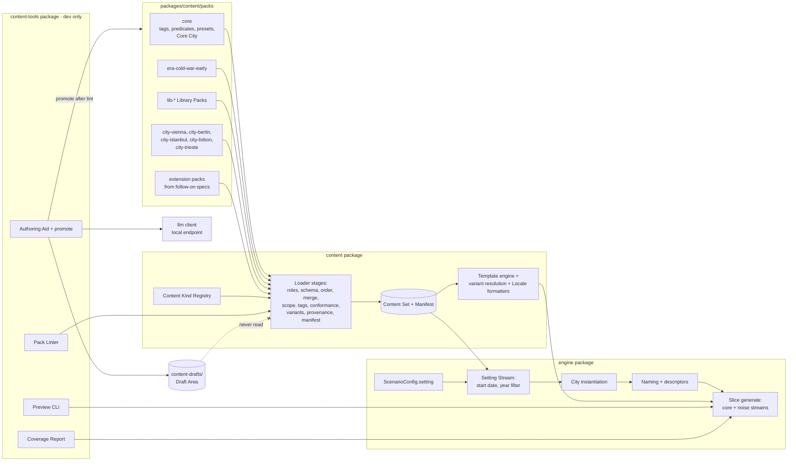

# Design Document

## Overview

This spec turns the slice's single core pack into a layered content system for an early Cold War world set in real cities. It builds on the completed slice (`.kiro/specs/tradecraft/`) and changes no slice mechanism except where stated below.

Three kinds of change are made:

1. **Content model** (`content` package). New Pack Roles, content kinds and loader stages:
   - City Definitions, Era content, Culture Groups, the Tag Vocabulary, Template Variants and Locales;
   - a Content Kind Registry that follow-on specs use to add their own kinds;
   - Tag Conformance, city-scope checks and the Provenance gate.
2. **Generation** (`engine` package):
   - a setting selection in `scenario.yaml` and a new Setting Stream;
   - authored city instantiation from a City Definition;
   - Culture-Group naming, descriptor uniqueness, Year Range filtering, currency scaling and Locale formatting.
3. **Authoring tooling** (new `content-tools` package). The Pack Linter, Preview CLI, Coverage Report and the offline Authoring Aid. No runtime package imports it.

On top of these the spec ships the content: one Era Pack, Library Packs and five City Packs (Vienna, Berlin, Istanbul, Lisbon and Trieste).

### Invariants carried over from the slice

| Slice invariant | How this spec preserves it |
|---|---|
| The Sim owns ground truth; models never create facts (Req 2) | All new content is committed static data rendered by the slice template engine. The Authoring Aid is offline and its output must be reviewed before it is loaded (Req 16) |
| Determinism `(seed, generatorVersion, ContentManifest, DifficultyPreset)` (Req 1.2) | Extended with the setting selection. Setting draws use their own derived stream. `generatorVersion` is bumped |
| The loader refuses on any error, collecting all errors (Req 31.2) | New stages add `ContentError`s to the same collection |
| Saves with a different manifest are refused (Req 31.6) | Unchanged. City, Era and Library Packs are hashed like any pack |
| Truth and Player View separation (Req 2.2) | New NPC fields (culture, gender, languages) are apparent data. The Preview CLI shows truth only with `--reveal` |
| Leak Guard and Specifics Guard (Req 5, 20) | Unchanged logic. The Locale adds allowlist entries, and a lint rule stops those entries from colliding with entity aliases |
| `tui` imports only `player-view` (dependency-cruiser) | A new rule stops runtime packages from importing `content-tools` |

### Key decisions

| Decision | Choice | Rationale |
|---|---|---|
| Setting | Early Cold War (1945–1965), real cities, fictional people | Immersive period texture without speech or plots put on real individuals |
| Real individuals | Documents name offices by title. The Real-Person Blocklist is checked at lint time and at name generation | Mechanical enforcement, not only a guideline |
| Intelligence organisations | Fictional Service Definitions (`service` kind) in Era and City Packs; each City Definition references the services active in it by id | No fictional operations attributed to real agencies; one service keeps one id across cities, regions and campaigns |
| Newspapers | Fictional mastheads in period styles | Real mastheads would print fictional stories about plots |
| Core City | The slice's procedural core-pack city (Vienna) stays the default, but its step 1 runs on the setting stream (the Core City Path) | The city is generated before Plot selection and is invariant under Template History (plot-library Req 14.4). Slice Req 31.7 still holds; slice output changes, so golden replays are re-recorded under the shared `generatorVersion` bump |
| Authored cities | City Packs supply a catalogue of at least 25 Locations. Each game instantiates 10–14 of them | Variety between seeds ("keeps finding new content") within slice scale |
| Tag binding | Templates bind through Tag Queries. Mandatory slots use Required Queries that City Packs must satisfy | Plot-library templates bind in every conforming city by construction |
| Localisation | Template Variants (city, then era, then base) with identical slot sets, plus Locale formatters | Local voice without forking templates or changing their bindings |
| Currency | One currency per game (the city's). Preset money values are scaled at preset resolution | Keeps slice Req 28.1 (single-currency ledger) and Property 20 |
| Extension | A Content Kind Registry passed into the loader, with Field Declarations for lint | `content` keeps depending only on `zod` and `yaml`. Follow-on specs add kinds without editing the loader |
| LLM authoring | Offline only. It writes drafts that the loader cannot read, and promotion requires a reviewer and a clean lint | Keeps models out of runtime facts |
| Near-duplicate detection | Exact word 3-shingle Jaccard within (kind, field) groups | Exact results make the lint rule testable as a property. Group sizes are within the low thousands |

## Architecture



**Dependency rules** (dependency-cruiser, CI):

- `content` imports only `zod` and `yaml` (slice rule, unchanged).
- `content-tools` may import `content`, `engine`, `player-view` and `llm`.
- No runtime package (`engine`, `dialogue`, `llm`, `player-view`, `tui`) imports `content-tools` (Req 16.1).

### Package and pack layout

```
packages/
  content/
    src/kinds/            registry + slice kinds + new kinds (city, era, library, tags, locale, variant)
    src/loader/           stages: roles, scope, tags, conformance, variants, provenance
    src/locale/           pure formatters (date, currency, honorific, address)
    packs/
      core/               slice core pack + tags.yaml (contentSchema 2)
      era-cold-war-early/ era.yaml technology.yaml ciphers.yaml anachronisms.yaml blocklist.yaml
                          style.yaml sensitivity.yaml locale.yaml document-styles/ public-texts/ variants/
      lib-central-europe/ lib-western/ lib-russian/ lib-eastern-mediterranean/ lib-iberian/
                          culture-groups/*.yaml
      lib-archetypes/     archetypes/*.yaml
      lib-descriptors/    descriptors/*.yaml
      city-vienna/ city-berlin/ city-istanbul/ city-lisbon/ city-trieste/
                          pack.yaml city.yaml districts.yaml locations/*.yaml routes.yaml
                          location-types.yaml newspapers.yaml orgs.yaml services.yaml weather.yaml
                          cover-identities.yaml streets.yaml locale.yaml sources.yaml
                          variants/*.yaml articles/*.yaml rumours.yaml lint.yaml
  engine/src/lib/setting/ stream, calendar, instantiate, names, descriptors, currency
  content-tools/          lint/ preview/ coverage/ author/ cli.ts
content-drafts/           Draft Area (git-ignored by default)
config/authoring.yaml     Authoring Aid endpoint and model (not a game Model Role)
```

### PRNG streams (adds to the slice table)

| Stream | Seed | Used for |
|---|---|---|
| setting | `derive(seed, 0x30000 + j)` for setting attempt *j* (block `0x30000`–`0x30FFF` in the slice PRNG stream registry) | Start Date, Instantiated City selection, and slice step 1 on the Core City Path |

The slice's core, noise, daily and runtime streams are unchanged. When a City Pack is selected, slice world-generation step 1 (City) is replaced by city instantiation on the setting stream, and steps 2–10 run on the core stream as before. **Core City Path:** with the Core City selected, the setting stream draws the Start Date and then runs the slice's step 1 logic (Districts, Locations, Routes) unchanged in content but on the setting stream, not the core stream (Req 9.10). Steps 2–10 run on the core stream. Either way the city exists before Plot selection and depends only on the seed, the Content Set and the setting selection (Req 9.11), which is what plot-library Req 14.4 (city invariance under Template History) relies on. Moving step 1 off the core stream changes slice output for the same seed (see Setting selection, generator version).

## Components and Interfaces

### Pack Roles (`content/loader/roles`)

```yaml
# pack.yaml (contentSchema 2)
id: city-vienna
version: 1.0.0
contentSchema: 2
role: city                       # core | era | city | library | extension
requires:
  - { id: core, range: "^2.0.0" }
  - { id: era-cold-war-early, range: "^1.0.0" }
  - { id: lib-central-europe, range: "^1.0.0" }
  - { id: lib-western, range: "^1.0.0" }
  - { id: lib-russian, range: "^1.0.0" }
overrides: []
```

Role rules (Req 1):

| Role | May contain | Constraints |
|---|---|---|
| core | every slice kind, `tag-vocabulary` | A schema-1 pack with no role is core |
| era | `era`, `technology`, `cipher-conventions`, `anachronisms`, `blocklist`, `style-guide`, `sensitivity`, `locale`, `service`, document templates, public texts, era-scoped variants | At most one era pack may be required by a City Pack |
| library | `culture-group`, archetypes, `descriptor-fragment`, persona libraries | No City-Scoped Content |
| city | `city`, `district`, `location`, `route`, `location-type`, `newspaper`, `local-org`, `service` (City-Scoped), `weather`, Cover Identities, `streets`, `locale`, `sources`, city-scoped variants, document and Rumour templates, `lint` | Exactly one `city` record and exactly one era in `requires` |
| extension | kinds registered by follow-on specs for this role | As registered |

A City-Scoped Content id is owned by its City Pack. No other pack may override it (Req 1.5). This is checked in the merge stage before the slice `overrides` logic runs.

### Content Kind Registry (`content/kinds`)

```ts
type PackRole = 'core' | 'era' | 'city' | 'library' | 'extension';
type JsonPath = string;                       // e.g. "items[].description"
interface FieldDeclarations {
  text?: JsonPath[];                          // scanned by anachronism, sensitivity, blocklist, duplicate rules
  tags?: JsonPath[];                          // must be vocabulary tags applicable to this kind
  tagQueries?: JsonPath[];                    // each value is TagId[1..3]
  years?: JsonPath[];                         // Year Range fields
  templates?: { path: JsonPath; style: 'fact-line' | `document:${DocKind}` | 'other' }[];
  refs?: { path: JsonPath; kind: string }[];  // cross-references checked by the loader
  names?: JsonPath[];                         // person-name fields checked against the blocklist
}
interface ContentKindRegistration<T = unknown> {
  kind: string; dir: string;                  // directory or file stem inside a pack
  schema: ZodType<T>; roles: PackRole[]; cityScoped: boolean;
  fields: FieldDeclarations; owner: string;   // owning package, for error messages
}
interface LoadOptions { kinds?: ContentKindRegistration[]; }   // extra kinds from follow-on specs
interface ContentLoader { load(dirs: string[], selected: string[], opts?: LoadOptions): Result<ContentSet, ContentError[]>; }
```

The slice kinds and this spec's kinds are registered by `content` itself. Follow-on packages pass their registrations through `LoadOptions.kinds`, so `content` never imports them. A file whose kind is not registered is an error (Req 17.2). The registry is also the Pack Linter's source of Field Declarations (Req 13.8).

**Interface assumptions for parallel specs.** ambient-world, plot-library, campaign-career and multi-city all register their kinds through `LoadOptions.kinds` with Field Declarations and add no schemas inside `packages/content` (Req 17.7). Task 1.2 (the registry) is their prerequisite.

- **ambient-world** registers its event and news kinds with `roles: ['city', 'extension']`, `cityScoped: true` for city instances, and Field Declarations for its text, Tag Query and Year Range fields. Its schema is its own. This spec only lints and loads instances (Req 17.3).
- **plot-library** registers its template kinds with every role and place slot expressed as `tagQueries`, and uses Required Queries for mandatory slots. It may add Required Queries (and Tags and facets for its own kinds) through its pack (Req 4.7). Non-required queries are soft preferences, and plot-library owns the fallback when they fail to bind (Req 17.4). Its Binder reads the city only through `CityView` (below), after the setting step.
- **multi-city** consumes `ContentSet.cities`, `ContentSet.services` and the City-Scoped Content ownership map. It extends Service Definitions with residency, rivalry and liaison fields through its own region content kinds, keyed by `ServiceId`. It owns runtime travel and identity between cities (Req 10.4).
- **campaign-career** references `CityId`, `CoverIdentityId` and `ServiceId`. Removing any of them within a major version is a lint error against the Baseline Manifest (Req 17.5, 19.4, 13.7).

### Tag Vocabulary (`content/kinds/tags`, core pack `tags.yaml`)

```yaml
facets:
  - { id: venue,     appliesTo: [location, location-type] }
  - { id: function,  appliesTo: [location, location-type] }
  - { id: access,    appliesTo: [location, location-type, route] }
  - { id: setting,   appliesTo: [location, district] }
  - { id: sector,    appliesTo: [district, route] }
  - { id: climate,   appliesTo: [city, descriptor-fragment] }
  - { id: role,      appliesTo: [archetype] }
  - { id: trade,     appliesTo: [archetype, persona-background] }
  - { id: access-to, appliesTo: [archetype, local-org] }
  - { id: social,    appliesTo: [archetype, persona-background] }
  - { id: skill,     appliesTo: [archetype] }
  - { id: org,       appliesTo: [local-org] }
  - { id: cover,     appliesTo: [cover-identity] }
  - { id: item,      appliesTo: [technology] }
tags:
  - { id: "function:dead-drop-site", description: "Concealment possible; low passing attention" }
  - { id: "venue:cafe", description: "Café or coffee house" }
  # ...
requiredQueries:
  - { id: rq-station,      query: ["venue:station-office"],                    minStatic: 1, minInstantiated: 1 }
  - { id: rq-text-source,  query: ["function:public-text-source"],             minStatic: 2, minInstantiated: 1 }
  - { id: rq-news-outlet,  query: ["function:newspaper-outlet"],               minStatic: 3, minInstantiated: 2 }
  - { id: rq-public-meet,  query: ["function:meeting-spot", "access:public"],  minStatic: 6, minInstantiated: 3 }
  - { id: rq-drop,         query: ["function:dead-drop-site"],                 minStatic: 5, minInstantiated: 2 }
  - { id: rq-transit,      query: ["function:transit-hub"],                    minStatic: 2, minInstantiated: 1 }
  - { id: rq-materiel,     query: ["function:materiel-store"],                 minStatic: 2, minInstantiated: 1 }
  - { id: rq-diplomatic,   query: ["setting:diplomatic"],                      minStatic: 2, minInstantiated: 1 }
  - { id: rq-private,      query: ["access:private"],                          minStatic: 3, minInstantiated: 1 }
  - { id: rq-courier,      query: ["role:cell-courier"],                       minStatic: 2, minInstantiated: 0 }
  - { id: rq-civilian,     query: ["role:civilian"],                           minStatic: 12, minInstantiated: 0 }
  # one Required Query per slice archetype role and per slice Location Type function used by the generator
```

- A Tag Query is a set of 1–3 Tags. An item binds when its Effective Tags contain every Tag in the query.
- The Effective Tags of a Location are its own Tags together with its Location Type's Tags.
- `minInstantiated` applies only to Location queries. Archetype queries are satisfied from the Content Set as a whole, because archetypes are not instantiated per city.
- Static conformance for a city counts Binders among that city's Locations within its Period Window, and among the archetypes reachable from the City Pack and its dependencies whose schedule Tag Queries bind in the city. A conformance failure is a `ContentError` with path `requiredQueries[id]` and message `city <id>: <n> binders, minimum <m>` (Req 4.5).
- Required Queries added by an extension pack are checked against every loaded City Pack (Req 4.7). A plot-library pack that needs a new mandatory slot type adds the Required Query, and the City Packs it is loaded with must satisfy it.

### City Definition (`content/kinds/city`)

```ts
interface CityDefinition {
  id: CityId; name: string; country: string; climate: TagId;
  period: YearRange; startDates: { from: IsoDate; to: IsoDate };
  currency: { name: string; symbol: string; subunit: string; format: string; rounding: number; budgetScale: number };
  languages: { id: string; name: string; share: number }[];
  cultureWeights: { group: CultureGroupId; weight: number; years?: YearRange }[];
  services: ServiceId[];          // Service Definitions active in the city: own, hostile, local-security, liaison (Req 3.5, 19.2)
  instantiation?: { districts?: [number, number]; locations?: [number, number] }; // defaults from slice step 1
}
interface District { id: DistrictId; city: CityId; name: string; aliases: Alias[]; description: string;
  atmosphere: string[]; tags: TagId[]; sector?: { power: string; years: YearRange }; }
interface CityLocation extends SliceLocationFields {          // slice Req 21.1 fields
  city: CityId; tags: TagId[]; basis: 'real-landmark' | 'real-inspired' | 'fictional';
  years?: YearRange; sources?: SourceId[]; weight?: number; }
interface CityRoute { a: DistrictId; b: DistrictId; cost: 0 | 1; tags?: TagId[]; years?: YearRange; }
interface Newspaper { id: string; city: CityId; masthead: string; language: string; stance: string;
  register: string; days: Weekday[]; price: number; soldAt: TagQuery; years?: YearRange; }
interface LocalOrg { id: OrgId; city: CityId; name: string; aliases: Alias[]; kind: string; tags: TagId[];
  members: TagQuery[]; years?: YearRange; }
interface WeatherTables { city: CityId; months: Record<1|2|3|4|5|6|7|8|9|10|11|12, SliceWeatherTable>; }
interface Source { id: SourceId; title: string; author?: string; year?: number; kind: 'book' | 'map' | 'guide' | 'archive' | 'newspaper' | 'other'; note?: string; }
```

- Weather tables use the slice's `city.yaml` weather table format per month. The daily draw selects the month from the calendar date (Req 2.6).
- Location Types specific to a city (for example a wine tavern or a ferry pier) are ordinary slice Location Types defined in the City Pack and are City-Scoped.
- The Sources List is required for every `real-landmark` Location (Req 3.1). Sources are bibliographic records; URLs are optional.

### Service Definitions (`content/kinds/service`)

```ts
type ServiceKind = 'own' | 'hostile' | 'local-security' | 'liaison';
interface ServiceDefinition {
  id: ServiceId; name: string; aliases: Alias[];      // fictional name (Req 3.5)
  kind: ServiceKind; country: string;
  doctrineBase: Partial<Doctrine>;                     // slice Hostile Service doctrine fields
  years?: YearRange; tags?: TagId[];
}
```

- `service` items shared by several cities (the Station's own service, the hostile services, allied liaison services) live in the Era Pack. A local security service may live in its City Pack, where it is City-Scoped (Req 19.1).
- `CityDefinition.services` references Service Definition ids. An unresolved id is a `ContentError` (Req 19.2), reported by CE-REF.
- multi-city adds residency, rivalry and liaison fields in its own region kinds keyed by `ServiceId`. campaign-career references services by id and defines no service schema of its own.

### Era Pack content (`content/kinds/era`)

```ts
interface Era { id: EraId; period: YearRange; climateDefault?: TagId; }
interface TechnologyItem { id: string; name: string; aliases: string[]; category: string; introduced: number; tags: TagId[]; }
interface CipherConventions {
  ownerWeights: Record<'hostile' | 'diplomatic' | 'commercial' | 'criminal' | 'station', Partial<Record<CipherKind, number>>>;
  headers: string[];                     // template strings, e.g. "NR {groupNo} {dateGroup}"
  padFormat: { groupSize: 5; groupsPerLine: number };
  numbersFormat: { callup: string; groups: number; repeat: number };
}
interface AnachronismEntry { term: string; pattern: string; earliest: number; city?: CityId; note: string; }
interface BlocklistEntry { name: string; familyOnly?: boolean; note: string; }   // real historical individuals
interface StyleRule { id: string; appliesTo: ('fact-line' | `document:${DocKind}`)[];
  check: 'max-words' | 'terminal-stop' | 'no-exclamation' | 'no-first-person' | 'hedging' | 'spelling' | 'upper-case' | 'headline-words' | 'manual';
  value?: number | string[]; message: string; }
interface SensitivityTerm { term: string; pattern: string; }
interface PublicText { id: string; title: string; kind: 'almanac' | 'timetable' | 'anthology' | 'directory' | 'manual' | 'guide';
  provenance: { kind: 'original' | 'public-domain'; source?: string }; body: string[] /* pages of lines */; city?: CityId; }
```

- `CipherKind` is the slice's closed set (Req 9.2). The Cipher Engine's `makeIntercept` reads `ownerWeights`, `headers`, `padFormat` and `numbersFormat` from the Content Set in place of its built-in defaults (Req 5.6). A tradecraft error such as a "fixed header" picks from `headers`.
- Public texts keep the slice's book-cipher length rule (slice Req 30.3). City Packs may add city-scoped public texts, such as a local tram timetable.
- The Style Guide's `manual` rules are listed in lint output as review reminders and never fail the lint.

### Library content (`content/kinds/library`)

```ts
interface CultureGroup {
  id: CultureGroupId; name: string; languages: string[];
  naming: NamingRule;
  given: { f: string[]; m: string[] }; family: FamilyName[];
  voiceTraits: string[]; mannerisms: string[];
  backgrounds: { text: string; tags: TagId[]; years?: YearRange }[];
}
type FamilyName = string | { m: string; f: string };          // gendered forms, e.g. Novák / Nováková
interface NamingRule {
  display: string;                // e.g. "{given} {family}"
  formal: string;                 // e.g. "{honorific} {family}"; honorific from the Locale
  parts?: { family2?: boolean; patronymic?: { m: string; f: string } };   // Iberian second surname, Russian patronymic
}
interface DescriptorFragment { id: string; slot: 'build' | 'age' | 'clothing' | 'headwear' | 'feature' | 'carried';
  text: string; gender?: 'f' | 'm'; years?: YearRange; climate?: TagId[]; }
// Archetypes use the slice archetype schema with two changes:
//   tags: TagId[]                                       (required)
//   schedule: { weekday, phase, at: TagQuery }[]        (Tag Query instead of Location Type id)
```

At generation a schedule entry resolves to the Instantiated City's Binders of `at`, chosen on the generating stream. If there are none, it falls back to the archetype's `fallback` Tag Query, and then to the NPC's home District's public meeting spot. The archetype linter rule CE-CONFORM counts an archetype for a city only if every non-fallback schedule query has a static Binder in that city.

### Locale and Template Variants (`content/kinds/locale`, `content/locale`)

```ts
interface Locale {
  scope: { city: CityId } | { era: EraId };
  date: { long: string; short: string; months: string[]; weekdays: string[] };   // English output, local order
  currency: { pattern: string };                                                  // e.g. "{amount} {symbol}"
  honorifics: { f: string[]; m: string[] };                                       // e.g. "Frau", "Herr", "Senhora"
  address: string;                                                                // e.g. "{street} {number}, {district}"
  terms: { term: string; definition: string }[];                                  // Local Terms → help glossary
  allowNames: string[];                                                           // Specifics Guard allowlist additions
}
interface TemplateVariant { id: string; base: TemplateId; scope: { city: CityId } | { era: EraId }; template: string; }

function resolveTemplate(set: ContentSet, base: TemplateId, city: CityId | 'core'): CompiledTemplate; // pure
function formatDate(t: GameTime, start: IsoDate, loc: Locale[]): string;                             // pure, fallback chain
function formatMoney(amount: number, cur: CityDefinition['currency'], loc: Locale[]): string;
```

- At load each variant is compiled and its slot set is compared with the base template's slot set. A mismatch is a `ContentError` (Req 8.3).
- Resolution order is city, then era, then base (Req 8.2). It is resolved once per game and cached by `(base, city)`.
- The slice `render(ast, bindings, namer, rng)` is unchanged. Locale formatters are supplied through the existing bindings for `{when}` on Documents and for amount and address slots. Fact Lines keep the slice's weekday and phase phrasing.
- The Specifics Guard's allowed-name set (slice design, Narrator) gains `allowNames` and the Local Terms (Req 8.6). Lint rule CE-ALLOWLIST rejects allowlist entries equal to a distinctive alias of any registered entity, so the allowlist cannot hide an entity name from the guards' intent.

### Loader pipeline (extends slice loading steps 1–7)

1. Parse `pack.yaml` files. Check `contentSchema` ∈ {1, 2} and the role rules. Resolve `requires`. *(slice step 1 + Req 1.1–1.4)*
2. Order topologically, breaking ties by id. *(slice step 2)*
3. Parse files with registered kind schemas. Files are either a bare list or `{ provenance?, items }`. *(slice step 3 + Req 17.1–17.2)*
4. **Provenance gate:** refuse files with `generated: true` without `reviewedBy` and `reviewedAt`. Refuse any pack directory under the Draft Area path. *(Req 16.3–16.4)*
5. Merge. City-Scoped ids may not be overridden across City Packs. *(slice step 4 + Req 1.5)*
6. Cross-references, including **city scope**: a City-Scoped item may reference only its own city's City-Scoped items plus non-scoped content. *(slice step 5 + Req 10.2)*
7. **Tags:** every Tag and Tag Query field is checked against the vocabulary and facet applicability. *(Req 4.3–4.4, 4.8)*
8. Compile templates, the predicate registry and **variants**. *(slice step 6 + Req 8.3)*
9. **Tag Conformance** per City Pack. *(Req 4.5, 4.7)*
10. Hash packs and build the Content Manifest. *(slice step 7)*

`ContentSet` gains `cities: Record<CityId, CityBundle>` (definition, districts, locations, routes, newspapers, orgs, weather, locale, variants, sources), `era`, `cultureGroups`, `tagVocabulary` and `cityScopeOwner: Record<ContentId, CityId>`.

### Setting selection (`engine/config`, `engine/setting`)

```ts
// added to the slice ScenarioConfig (strict object) as one new key
setting: z.object({
  city: z.string().default('core'),                         // 'core' or a loaded CityId
  startDate: z.string().regex(/^\d{4}-\d{2}-\d{2}$/).optional(),
}).strict().default({}),
```

After schema validation, the config resolver checks that `city` is `core` or a loaded City Definition, and that `startDate` lies within the city's `startDates` and the era's Period Window. Each failure is a field error with path `setting.city` or `setting.startDate` (slice Req 41.2).

```ts
interface SettingSelection { city: CityId | 'core'; startDate: IsoDate; year: number; attempt: number; }
function drawSetting(set: ContentSet, cfg: ScenarioConfig['setting'], rng: Prng): SettingSelection;        // pure
function yearFilter(set: ContentSet, year: number, city: CityId | 'core'): ContentSet;                     // pure
function instantiateCity(def: CityBundle, year: number, vocab: TagVocabulary, rng: Prng): InstantiatedCity | 'infeasible'; // pure
```

**Year filtering** (Req 9.3) removes every item whose Effective Year Range excludes the Game Year: Locations, Routes, District sectors, newspapers, orgs, Culture Weight entries, persona backgrounds, Descriptor Fragments, Template Variants and Rumour or article templates.

**City instantiation** (Req 9.4, 4.6):

1. Draw the target counts: Districts in `instantiation.districts` (default [4, 5]) and Locations in `instantiation.locations` (default [10, 14]).
2. For each Required Query with `minInstantiated > 0`, in id order: count the selected Binders. While fewer than the minimum, add a Binder drawn uniformly (weighted by `weight`) from the city's unselected Binders.
3. Take the selected Locations' Districts. If there are more than the maximum, retry from step 2 (up to 16 times).
4. While there are fewer Districts than the minimum, add a District adjacent by Route to the selected set.
5. If the selected Districts are not connected by Routes, add the Districts on the shortest connecting Route path if the maximum allows, otherwise retry.
6. Fill up to the Location target from the selected Districts' remaining Locations, weighted by `weight`.
7. The Routes are the city's Routes between selected Districts.

The result replaces slice step 1. Steps 2–10 run on the core stream. If the discovery-path verifier exhausts its core attempts (with plot-library loaded: after its retry and reselection loop is exhausted), the generator moves to setting attempt *j* + 1 with a new instantiation. After 4 setting attempts it throws `GeneratorError { seed, city }` (Req 9.9). The linter's CE-FEASIBLE rule runs `instantiateCity` over 256 fixed seeds at each Period Window boundary year and errors on any `'infeasible'`.

**Organisations and documents.** The Station and Hostile Service organisations take their names from the city's `services`: the first `own` and the first `hostile` Service Definition in id order, unless a caller (for example a campaign-career Posting Context) names a service id (Req 19.3). Local organisations are added to `WorldState.orgs` as non-player organisations (employers and Rumour subjects, with no slice mechanics). Newspapers supply mastheads to the slice newspaper generator, and today's edition is obtainable at Locations binding `soldAt`. Local Cover Identities join the Cover Identity draw (slice step 8).

**Currency** (Req 9.6). At preset resolution, every money field of the Difficulty Preset and the scenario (starting Budget, funds base and cap, retainers, pitch amounts) is multiplied by `budgetScale` and rounded to `rounding`. The ledger stays single-currency, and amounts render through `formatMoney`.

**Generation order and generator version.** The setting step (Start Date, then city instantiation or the Core City Path) runs first, before any Plot template selection (Req 9.11). plot-library's selection runs after it, on its own `select` stream. Both changes alter slice output, so they share one `generatorVersion` bump, declared here and implemented in task 3.8. plot-library does not declare a separate bump, and golden replays are re-recorded once (slice design, PRNG stream registry).

### CityView (`engine/setting/city-view`)

`CityView` is the read-only projection that binders in other specs (plot-library's Binder, ambient-world selectors) use. It is built once per game after the setting step, from the Instantiated City (or the Core City) and the year-filtered Content Set (Req 17.6).

```ts
type BindableKind = 'loc' | 'district' | 'org' | 'item' | string;   // string: a registered kind with `tags` Field Declarations
interface CityView {
  city: CityId | 'core'; year: number; startDate: IsoDate;
  entities(kind: BindableKind): { id: EntityId; tags: TagId[] }[];          // Effective Tags, sorted by id
  binders(kind: BindableKind, q: TagQuery): EntityId[];                     // Effective Tags ⊇ q, sorted by id
  archetypesWithTags(q: TagQuery): ArchetypeId[];                           // archetype Tags ⊇ q, sorted by id
  locationTypesWithTags(q: TagQuery): LocationTypeId[];
  requiredQueries: RequiredQuery[];                                         // core plus extension-pack queries
  services: ServiceDefinition[];                                            // the city's referenced services
}
function cityView(set: ContentSetV2, city: InstantiatedCity | CoreCity, setting: SettingSelection): CityView; // pure
```

- Locations, Districts and local organisations come from the Instantiated City. `item` and other registered tagged kinds come from the Content Set (they are not city-scoped), filtered by Year Range.
- Public or private access is expressed by the `access:public` and `access:private` Tags, not a separate field.
- The view holds no truth-side state and draws no randomness, so a binder's draws depend only on its own stream and the view.


### Naming and descriptors (`engine/setting/names`, `engine/setting/descriptors`)

```ts
function nameNpc(groups: CultureGroup[], weights: CultureWeights, gender: 'f' | 'm',
                 used: Set<string>, blocklist: NormalisedBlocklist, rng: Prng): { culture: CultureGroupId; name: string; formal: string }; // pure
function describeNpc(frags: DescriptorFragment[], gender: 'f' | 'm', climate: TagId, used: Set<string>, rng: Prng): string;            // pure
```

- **Order:** draw the gender (uniform), then the Culture Group from the year-filtered `cultureWeights`. The role is not an argument to `nameNpc` (Req 3.7). Then draw the given name, the family name (gendered form) and any `parts`, and render `display` and `formal`.
- **Rejection:** the name is redrawn if the normalised full name is already used or is on the blocklist. Normalisation is case-folding, diacritic folding and whitespace collapse. A `familyOnly` entry also rejects the family name alone. After 32 rejections the generator walks the pool combinations in a fixed order from a drawn offset, which is guaranteed to terminate because the pools are much larger than any world's NPC count.
- **Descriptors:** one fragment is drawn per slot (with `carried` optional), filtered by gender, climate and year. A collision is redrawn up to 32 times, and then a further `feature` fragment is appended in enumerated order until the descriptor is unique (Req 6.5).
- Principal NPCs are named on the core stream and Background NPCs on the noise stream, as in the slice. Slice Property 21 (noise independence) is preserved because the core-stream draws do not depend on noise names: core names are drawn first and the noise stream adds names to `used` afterwards.

### Pack Linter (`content-tools/lint`)

```ts
interface LintRule { id: string; defect: string; severity: 'error' | 'warning' | 'info'; suppressible: boolean;
  releaseOnly?: boolean; check(ctx: LintContext): LintFinding[]; }
interface LintFinding { rule: string; severity: 'error' | 'warning' | 'info'; pack: string; file: string; path: string; message: string; suppressed?: string; }
interface LintContext { set: ContentSet | null; loadErrors: ContentError[]; registry: ContentKindRegistration[];
  profile: 'draft' | 'release'; baseline?: BaselineManifest; files: ParsedFile[]; }
function lint(dirs: string[], selected: string[], opts: { profile; baseline?; kinds? }): LintReport; // deterministic
```

Every loader `ContentError` becomes a finding under the matching loader rule. The lint rules then run over the parsed files even when loading failed, wherever their inputs exist.

| Rule id | Defect Class | Severity | Suppressible |
|---|---|---|---|
| CE-SCHEMA | Schema violation | error | no |
| CE-REF | Dangling or cross-city reference | error | no |
| CE-DUPID | Duplicate id or illegal override | error | no |
| CE-SLOT | Undeclared template slot | error | no |
| CE-TAG | Unknown or inapplicable Tag | error | no |
| CE-CONFORM | Tag Conformance shortfall | error | no |
| CE-FEASIBLE | Instantiation infeasible for some seed or year | error | no |
| CE-ANACH | Anachronism term or technology item before its year | error | yes |
| CE-PERIOD | Year Range outside the city or era Period Window | error | yes |
| CE-DUPTEXT | Exact duplicate text within (kind, field) | warning | yes |
| CE-NEARDUP | Near-duplicate text (Jaccard ≥ 0.8, ≥ 12 words) | warning | yes |
| CE-NAMEDUP | Duplicate entry within a Name Pool | error | yes |
| CE-REALPERSON | Real-Person Blocklist match | error | no |
| CE-SENSITIVE | Sensitivity Term match | error | no |
| CE-QUANTITY | Quantity Target shortfall | warning in draft, error in release | no |
| CE-VARIANT | Template Variant slot mismatch | error | no |
| CE-ALLOWLIST | Locale allowlist entry equals a distinctive entity alias | error | yes |
| CE-SOURCE | `real-landmark` Location without a source | error | yes |
| CE-PROVENANCE | Generated content missing reviewer or review time | error | no |
| CE-STYLE | Mechanical Style Guide rule broken | warning | yes |
| CE-IDSTABLE | Id removed against the Baseline Manifest within a major version | error | no |

- **Text scanning.** Text fields come from Field Declarations (`text`, `templates`, `names`). Text is tokenised into words after diacritic folding and case folding. A pattern matches as a contiguous whole-word token sequence. Template slots (`{...}`) are skipped, not scanned.
- **Effective Year Range.** This is the item's `years` ∩ the city Period Window (for City-Scoped items) ∩ the era Period Window. CE-ANACH fires when `entry.earliest > range.from` and the entry's city scope (if any) matches the item's city. CE-ANACH also fires for technology catalogue items, matched by name and aliases.
- **Near-duplicates** use exact Jaccard similarity over word 3-shingle sets within each (kind, field) group. Pairs are sorted for deterministic output.
- **Suppressions** live in a pack's `lint.yaml`: `{ rule, path, justification }`. A Suppression for a non-suppressible rule produces a CE-SCHEMA error on the `lint.yaml` entry (Req 13.6).
- **Quantity Targets** (Req 11) are a data table in `content-tools` keyed by target id. Each target is evaluated over the Content Set: per city, per Culture Group, and across the shipped set.
- **Output.** Findings are sorted by (pack, file, path, rule). The text form is one line per finding. The JSON form is `{ findings, suppressions, summary }`. The exit code is non-zero if any finding has error severity.
- **CLI:** `pnpm content lint [--packs a,b] [--profile draft|release] [--baseline path] [--json]`.

### Preview CLI (`content-tools/preview`)

`pnpm content preview --packs <ids> --city <id> --seed <s> --preset <p> --kind <k> [--count n] [--reveal] [--out file]`

The kinds are `locations`, `npcs`, `newspaper`, `documents`, `dossiers`, `cables`, `fact-lines`, `intercepts` and `city` (a summary of the Instantiated City with Districts and Routes).

- It calls the engine's `generate` and then the `player-view` projections. Without `--reveal` it prints only projection output.
- `fact-lines` renders the third-person predicate templates for a deterministic sample of Sim events from the first 3 days, through the player-perspective namer. `intercepts` prints plaintexts only with `--reveal` and ciphertexts otherwise.
- It has no `llm` import path (Req 14.4). Output is plain UTF-8 with `\n` line endings, so it is byte-stable (Req 14.3).
- `--reveal` prints a one-line warning header.

### Coverage Report (`content-tools/coverage`)

```ts
interface UsageSink { use(kind: string, id: string): void; }          // write-only; optional generate() argument
function coverage(set: ContentSet, cities: CityId[], presets: string[], seeds: number, opts: { underuse: number }): CoverageReport; // deterministic
```

- `generate` accepts an optional `UsageSink`. The sink is write-only and never read by the generator, so output is identical with or without it (tested).
- Seeds are `coverage-<city>-<preset>-<i>`.
- **Expected use** of an item is (total draws of its kind) ÷ (eligible items of that kind). An item is underused when its count is below `underuse` × the expected use, and unused when the count is 0.
- **Variety Metric:** the mean Jaccard similarity of Instantiated City Location sets over all seed pairs per city and preset. The target is ≤ 0.6, reported as pass or fail but not linted.
- **Output:** `coverage.md` (summary tables, worst offenders first) and `coverage.csv` (`city,preset,kind,id,count,expected,flag`).
- **CLI:** `pnpm content coverage --packs <ids> [--cities ...] [--presets ...] [--seeds 50] [--out dir]`.

### Authoring Aid (`content-tools/author`)

```yaml
# config/authoring.yaml
endpoint: http://localhost:1234/v1
model: <model id as LM Studio reports it>
temperature: 0.9
maxTokens: 2000
allowRemote: false
```

- `pnpm content author --pack <id> --kind <kind> --count <n> [--brief "<text>"] [--remote]`. It builds a prompt from the kind's JSON Schema, the Style Guide, the Anachronism Entries (the terms in the pack's Period Window), the Real-Person Blocklist, the Sensitivity Term List, a sample of existing items (to steer away from duplicates) and the brief. It requests schema-constrained output through the `llm` package's OpenAI-compatible client and validates with Zod. Valid items are written to `content-drafts/<pack>/<kind>/<UTC timestamp>.yaml` with `provenance: { generated: true, model, promptHash, generatedAt }`. Invalid output is written to a `.rejected.json` sidecar for inspection.
- `pnpm content promote <draft-file> --into <pack-file> --reviewer <name>` lints the pack set with the draft merged into the target file. If there are no errors, it writes the items with `reviewedBy` and `reviewedAt` and deletes the draft. Otherwise it prints the findings and changes nothing (Req 16.5).
- **Endpoint check:** the host must be `localhost`, `127.0.0.1` or `::1`, unless both `allowRemote: true` and `--remote` are given (Req 16.7). A remote endpoint sends pack content off the machine, which the CLI states before sending.
- The tool uses no game Model Role. The slice `Role` set and `config/models.yaml` are unchanged.

## Data Models

```ts
type YearRange = { from: number; to: number };            // inclusive
type IsoDate = `${number}-${number}-${number}`;
type TagId = `${string}:${string}`;
type TagQuery = TagId[];                                    // length 1..3
type CityId = `${string}/${string}`;                        // namespaced like every content id
type CultureGroupId = `${string}/${string}`;

interface PackManifestV2 {
  id: string; version: string; contentSchema: 1 | 2; role?: PackRole;
  requires: { id: string; range: string }[]; overrides: string[];
}
interface Provenance { generated: boolean; model?: string; promptHash?: string; generatedAt?: string; reviewedBy?: string; reviewedAt?: string; }
interface ContentFile<T> { provenance?: Provenance; items: T[]; }       // or a bare T[]

interface RequiredQuery { id: string; query: TagQuery; minStatic: number; minInstantiated: number; }
interface TagVocabulary { facets: { id: string; appliesTo: string[] }[]; tags: { id: TagId; description: string }[]; requiredQueries: RequiredQuery[]; }

interface CityBundle {
  def: CityDefinition; districts: District[]; locations: CityLocation[]; routes: CityRoute[];
  locationTypes: LocationType[]; newspapers: Newspaper[]; orgs: LocalOrg[]; weather: WeatherTables;
  covers: CoverIdentity[]; streets: string[]; locale: Locale; variants: TemplateVariant[]; sources: Source[];
}
interface ContentSetV2 extends ContentSet {                // slice ContentSet plus:
  cities: Record<CityId, CityBundle>; era?: EraBundle; cultureGroups: Record<CultureGroupId, CultureGroup>;
  descriptorFragments: DescriptorFragment[]; tagVocabulary: TagVocabulary; services: Record<ServiceId, ServiceDefinition>;
  cityScopeOwner: Record<string, CityId>; registry: ContentKindRegistration[];
}

interface InstantiatedCity { city: CityId; districts: DistrictId[]; locations: LocId[]; routes: CityRoute[]; }

// Slice WorldState.meta gains:
interface SettingMeta { setting: SettingSelection; }
// Slice Npc gains (apparent, not truth-branded):
interface NpcSettingFields { culture: CultureGroupId; gender: 'f' | 'm'; languages: string[]; formalName: string; }

interface BaselineManifest { manifest: ContentManifest; ids: Record<string /*pack*/, string[]>; }
interface LintReport { findings: LintFinding[]; suppressions: { rule: string; path: string; justification: string }[];
  summary: { errors: number; warnings: number; info: number }; }
interface CoverageRow { city: CityId; preset: string; kind: string; id: string; count: number; expected: number; flag: 'ok' | 'underused' | 'unused'; }
interface CoverageReport { rows: CoverageRow[]; requiredQueryMargins: { city: CityId; query: string; binders: number; min: number }[];
  variety: { city: CityId; preset: string; meanJaccard: number; pass: boolean }[]; }
```

`generatorVersion` is bumped once for this spec and plot-library together (see Setting selection). Saves record `meta.setting`, so loading restores the setting exactly (slice Property 13). A save made before this spec has no `meta.setting` and is refused by the slice's version check.

### Shipped content plan

| Pack | Period | Contents |
|---|---|---|
| `era-cold-war-early` | 1945–1965 | ≥ 60 technology items, ≥ 200 Anachronism Entries, Real-Person Blocklist, Style Guide, Sensitivity Term List, cipher conventions, era Locale, document styles, ≥ 6 public texts (original or public domain) |
| `lib-central-europe` | | Culture Groups: Austrian German, German (Berlin), Czech, Hungarian, Polish |
| `lib-western` | | American English, British English, French |
| `lib-russian` | | Russian |
| `lib-eastern-mediterranean` | | Turkish, Istanbul Greek, Armenian, Sephardic (Ladino-speaking), Levantine |
| `lib-iberian` | | Portuguese, Spanish |
| `lib-archetypes` | | ≥ 40 civilian archetypes plus period variants of the slice role archetypes, all with Tag Query schedules |
| `lib-descriptors` | | ≥ 150 Descriptor Fragments across all slots, with period clothing and climate tags |
| `city-vienna` | 1945–1955 | Four-power occupation: each District carries a `sector` (the Innere Stadt is the international sector), with sector checkpoint Routes. Kaffeehäuser, Heurigen, Prater, Ringstrasse, railway stations, Danube canal |
| `city-berlin` | 1948–1961 | Four sectors, the airlift-era years and S-Bahn and U-Bahn transit hubs. Sector-crossing Routes carry Year Ranges |
| `city-istanbul` | 1950–1965 | Beyoğlu, Galata, Sirkeci, Kadıköy, ferries across the Bosphorus and Golden Horn, bazaars, consulates |
| `city-lisbon` | 1945–1965 | Baixa, Chiado, Alfama, Cais do Sodré, trams and funiculars, port and airport, émigré hotels |
| `city-trieste` | 1947–1954 | Free Territory of Trieste: Zone A (Allied military government, the city) and Zone B (Yugoslav military government). Districts carry a `sector` for their zone, with zone-line checkpoint Routes. Borgo Teresiano, Città Vecchia, the Molo Audace and port, Piazza Unità, the railway station, cafés, Opicina tram |

Sector and political texture is period fact rendered as setting. The Style Guide covers restraint for wartime aftermath and for political repression, and its `manual` review rules flag those passages for an extra human read.

## Correctness Properties

*A property is a characteristic or behavior that should hold true across all valid executions of a system-essentially, a formal statement about what the system should do. Properties serve as the bridge between human-readable specifications and machine-verifiable correctness guarantees.*

Each property is implemented as a single fast-check property test with at least 100 runs, tagged `// Feature: content-expansion, Property N: <title>`. The generators are:

- **Generated pack sets:** a core pack with a random Tag Vocabulary and Required Queries, an Era Pack, 1–3 Library Packs and 1–3 City Packs. Their tagging, Year Ranges, Culture Weights and route graphs are random but conforming unless a defect is seeded.
- **Shipped pack sets:** the committed packs, sampled as random subsets closed under `requires`.

The slice Properties 1–32 remain in force. Properties 2, 19 and 21 are re-run over City Packs by Property 13 here.

**Property 1: Bindability in every conforming city.** For any pack set and any City Pack in it, the loader accepts the set if and only if a naive recount finds at least `minStatic` Binders for every Required Query (including Required Queries added by extension packs). For every accepted City Pack and every seed and Game Year in its Period Window, the Instantiated City:

- has District and Location counts within bounds and Districts connected by Routes;
- contains at least `minInstantiated` Binders of every Required Query;
- binds every mandatory slot of any generated template whose mandatory slots use Required Queries.

*Validates: Requirements 4.5, 4.6, 4.7, 9.4, 17.4*

**Property 2: Load-order independence for any conforming subset.** For any set of conforming packs of any roles closed under `requires`, loading from any permutation of input directories yields an identical Content Set and Content Manifest.
*Validates: Requirements 1.6, 10.1*

**Property 3: Side-by-side projection.** For any conforming set S containing several City Packs and any City Pack A in S:

- the Content Set of S projected onto A and its dependencies equals the Content Set of A and its dependencies loaded alone;
- a world generated with `setting.city = A` from S equals the world generated from A and its dependencies alone, apart from the Content Manifest field;
- the world references no City-Scoped Content of any other city.

*Validates: Requirements 9.5, 10.1, 10.3*

**Property 4: Linter detects every seeded defect.** For any conforming pack set:

- the Pack Linter reports no error finding, and exits with status 0, on the clean set;
- for any non-empty set of independently seeded defects drawn from the Defect Classes of Req 13.2 (also covering role and era-requirement errors, missing Tags, cross-city references, unregistered kinds, Quantity shortfalls under `release`, style violations and defects in an extension-registered kind), the linter reports at least one finding of each seeded class, located at the seeded pack, file and path, and exits non-zero if any seeded class has error severity;
- the output is identical across repeated runs and directory permutations.

*Validates: Requirements 1.3, 1.4, 1.5, 3.1, 3.4, 3.8, 4.3, 4.4, 4.8, 10.2, 11.8, 12.6, 13.1, 13.2, 13.3, 13.4, 13.8, 17.2, 19.2*

**Property 5: Suppression semantics.** For any pack set with seeded findings and any set of Suppressions, a finding is downgraded to informational if and only if a Suppression with a non-empty justification matches its rule and path and the rule is suppressible. Every Suppression naming a non-suppressible rule produces an error.
*Validates: Requirements 13.5, 13.6*

**Property 6: Anachronism rule is exact.** For any text, Anachronism Entry, Effective Year Range and item city, CE-ANACH reports the text if and only if all of the following hold:

- the entry's pattern occurs as a whole-word, case-insensitive and diacritic-insensitive token sequence outside template slots;
- `earliest > range.from`;
- the entry has no city scope or its scope equals the item's city.

The same holds for technology catalogue item names and aliases against `introduced`.
*Validates: Requirements 12.2, 12.3*

**Property 7: Id stability against a baseline.** For any Baseline Manifest and current pack version, the CE-IDSTABLE findings are exactly the ids in the baseline that are missing from the current version when the major version is unchanged, and are empty when the major version increased.
*Validates: Requirements 13.7, 17.5*

**Property 8: Year filtering.** For any pack set, City Pack, seed and optional configured Start Date within range:

- the Start Date lies within the city's `startDates` and the era Period Window;
- every Location, Route, newspaper, organisation, Culture Weight, persona background, Descriptor Fragment, Template Variant and template used in the generated world has an Effective Year Range containing the Game Year.

*Validates: Requirements 6.4, 9.2, 9.3*

**Property 9: Naming soundness.** For any Culture Groups, Culture Weights, Real-Person Blocklist (including entries salted from pool combinations) and seed, every generated world satisfies the following:

- every NPC's full name is distinct after normalisation;
- no NPC's name matches a blocklist entry (full name, or family name for `familyOnly` entries);
- each name's parts come from its Culture Group's pools (in the NPC's gendered form) and render by the group's Naming Rule;
- the Culture Weights used for every NPC, whatever its role, equal the year-filtered city weights.

*Validates: Requirements 3.3, 3.7, 7.1, 7.2, 7.3*

**Property 10: Descriptor uniqueness.** For any Descriptor Fragment set, city climate, Game Year and seed, all NPC descriptors in the generated world are distinct, and each uses only fragments eligible for the NPC's gender, the city's climate and the Game Year.
*Validates: Requirements 6.4, 6.5*

**Property 11: Template Variant resolution.** For any base templates and any set of era- and city-scoped variants:

- the loader accepts a variant if and only if its slot set equals its base's;
- `resolveTemplate(base, city)` returns the city variant if one exists, else the era variant, else the base;
- rendering the resolved template with any complete binding of the base slots leaves no unresolved slot.

*Validates: Requirements 8.2, 8.3*

**Property 12: Locale date round-trip.** For any Locale, Start Date and GameTime, parsing `formatDate(t, start, locale)` with the Locale's long-date pattern yields the calendar date of `t`. The formatter uses the city Locale's fields where they are defined and the era Locale's fields otherwise.
*Validates: Requirement 8.4*

**Property 13: Solvability for every city.** For any conforming City Pack (generated or shipped), Difficulty Preset and seed, the generated world passes the slice's discovery-path verification (slice Properties 2 and 19), and no Side Thread has a Cell member as a participant (slice Property 21). If generation fails instead, the generator raises a `GeneratorError` naming the city and seed, and CE-FEASIBLE reports the same pack.
*Validates: Requirements 9.7, 9.9*

**Property 14: Setting determinism.** For any pack set, seed, preset and setting selection, `generate` called twice yields deep-equal World States, including `meta.setting`, names and descriptors. Passing a `UsageSink` does not change the result.
*Validates: Requirements 7.4, 9.8, 15.1*

**Property 15: Cipher conventions applied.** For any cipher conventions and Intercept source:

- every generated Intercept uses a cipher kind with non-zero weight for its owner kind;
- its header, when present, is rendered from a convention header template;
- pad and numbers-broadcast groups match the convention formats;
- decrypting with the true spec and parsing yields the source Propositions (slice Property 9 under conventions).

*Validates: Requirement 5.6*

**Property 16: Preview determinism and gating.** For any pack set, city, seed, preset and preview kind:

- two runs produce byte-identical output;
- output without `--reveal` contains no truth-branded field, true allegiance, MICE value, cipher spec or concealed Proposition (slice Property 3 applied to preview output).

*Validates: Requirements 14.3, 14.5*

**Property 17: Coverage accounting.** For any pack set, city list, preset list, seed count and underuse fraction:

- every coverage count equals a naive recount of the `UsageSink` events;
- every expected value equals total draws ÷ eligible items;
- an item is flagged `unused` if and only if its count is 0, and `underused` if and only if its count is positive and below the fraction × expected;
- the Required Query margins equal the static Binder recounts;
- the Markdown and CSV output is identical across runs.

*Validates: Requirements 15.1, 15.2, 15.3, 15.5*

**Property 18: Provenance gate.** For any pack set and any assignment of Provenance Records to files and of files to pack or Draft Area paths, the loader accepts a file if and only if it is outside the Draft Area and either `generated` is false or absent, or both `reviewedBy` and `reviewedAt` are present.
*Validates: Requirements 16.3, 16.4*

**Property 19: Setting step isolation.** For any pack set, seed, setting selection (including the Core City) and setting attempt *j*, the setting step's output (Start Date and the Instantiated City, or the Core City's Districts, Locations and Routes) and the `CityView` built from it are deep-equal under any change to the inputs consumed after the setting step: the Difficulty Preset, Template History and plot selection exclusions. On the Core City Path, step 1 draws only from the setting stream, and the core stream state at the start of step 2 is the same as the core seed's initial state.
*Validates: Requirements 9.10, 9.11, 17.6*

## Error Handling

| Failure | Handling |
|---|---|
| Unknown `contentSchema` or `role`, or a City Pack without exactly one Era Pack | Loader refuses; `ContentError` on `pack.yaml` (Req 1.3–1.4) |
| Cross-city override or reference | Loader refuses; `ContentError` naming both cities and the id (Req 1.5, 10.2) |
| Unknown or inapplicable Tag, or an item with no Tag | Loader refuses; error at the item path (Req 4.3–4.4) |
| Tag Conformance shortfall | Loader refuses; `city <id>: query <rq> has <n> binders, minimum <m>` (Req 4.5) |
| Template Variant slot mismatch | Loader refuses; lists missing and extra slots (Req 8.3) |
| Unregistered content kind | Loader refuses; names the file and the unknown kind (Req 17.2) |
| Generated content without review, or a pack in the Draft Area | Loader refuses; names the file (Req 16.3–16.4) |
| Invalid `setting.city` or `setting.startDate` | Startup refuses with a field-path error (slice Req 41.2) |
| City `services` entry with no Service Definition | Loader refuses; `ContentError` naming the city and the id (Req 19.2) |
| City instantiation infeasible for a seed | Retry up to 16 times per setting attempt and 4 setting attempts, then `GeneratorError { seed, city }` (Req 9.9) |
| Name or descriptor collision | Redraw up to 32 times, then deterministic enumeration (Req 6.5, 7.2) |
| Blocklisted generated name | Redraw (Req 7.3) |
| Lint error findings | Non-zero exit; full report (Req 13.4) |
| Suppression of a non-suppressible rule | Error on the `lint.yaml` entry; the suppression is ignored (Req 13.6) |
| Preview with an invalid pack set | Loader errors printed; non-zero exit (Req 14.6) |
| Authoring output fails the schema | Written to a `.rejected.json` sidecar; nothing added to the Draft Area's valid items |
| Promotion with lint errors | Findings printed; the pack is unchanged and the draft is kept (Req 16.5) |
| Authoring endpoint not local | Refused unless `allowRemote` and `--remote` are both set (Req 16.7) |
| Authoring endpoint unreachable | Error naming the endpoint; no files written |

## Testing Strategy

- **Property tests (fast-check):** Properties 1–19, each one test with `numRuns ≥ 100`, tagged `// Feature: content-expansion, Property N: <title>`. Pack-set generators live in `packages/content/test/arbitraries/` and are shared by `content`, `engine` and `content-tools`. Each defect class has a seeding function that returns the expected (rule, pack, file, path). Properties 1, 13 and 14 cap generated cities at 30 Locations and run `generate` at the `easy` and `standard` presets to bound run time. Property 13 also runs over the shipped City Packs with random seeds.
- **Unit tests (Vitest):**
  - each schema's minimal valid and invalid examples;
  - each mechanical Style Guide check;
  - currency scaling and `formatMoney` examples per shipped city;
  - Specifics Guard acceptance of Locale allowlist names;
  - glossary inclusion of Local Terms;
  - the `GeneratorError` path with an infeasible city;
  - the Authoring Aid with a mocked client (draft writing, rejected sidecar, prompt contents, the remote-endpoint refusal table, promote success and failure).
- **Smoke tests:**
  - the core pack alone still passes the slice content smoke test and the slice golden replays, re-recorded once for the shared `generatorVersion` bump because the Core City Path moves step 1 to the setting stream (Req 1.7, 9.10);
  - the shipped pack set passes `pnpm content lint --profile release` in CI (Req 18.4);
  - one world per shipped city and preset generates;
  - dependency-cruiser rejects imports of `content-tools` from runtime packages (Req 16.1);
  - the Preview CLI runs with a gateway stub that throws on any call (Req 14.4).
- **Golden previews:** `pnpm content preview` output for each shipped city at fixed seeds (`city`, `npcs`, `newspaper`, `fact-lines`) is checked into `packages/content-tools/test/golden/`. An intentional content change re-records them.
- **Coverage gate:** CI runs the Coverage Report on the shipped set (50 seeds, `standard`). It publishes the Markdown as an artifact and fails if any city's Variety Metric exceeds 0.6. Underused items are reported, not failed.
- **Manual review:** the Style Guide's `manual` rules (historical respect, aftermath restraint, period voice) are listed in lint output, and each City Pack's first release gets a human review against its Sources List. These are not automated tests.
