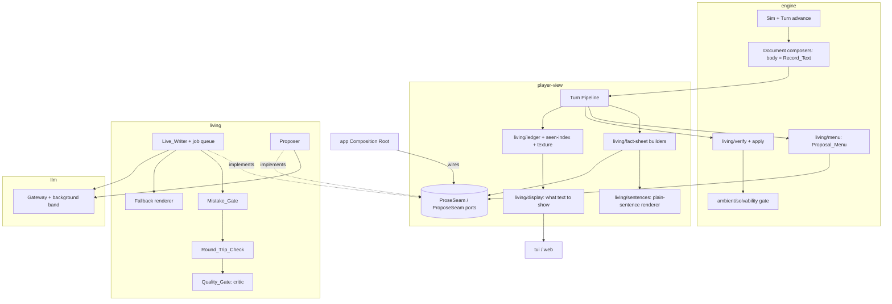

# Design Document

## Overview

The living world makes every game read differently and grow in its own direction, without one factual mistake reaching the player. It rests on a single rule: **the engine owns every fact.** Models write text *from* facts the engine hands them, and propose changes the engine checks *before* they become facts. Every model output that reaches the player or the world is recorded, so saves and replays stay exact.

Three layers, each usable without the next:

1. **Variety at scale.** Offline, local models grow the content libraries through the existing Authoring Aid, with a second model reviewing and the repo's gates proving each batch before the owner signs it off. `config/scenario-living.yaml` turns the plot library, the ambient world and the authored cities on together.
2. **Living prose.** Every text surface can be written live. A Prose_Job carries a Fact_Sheet built only from Player View data. The text must pass the Mistake_Gate, the Round_Trip_Check and the Quality_Gate before release, or the surface shows authored text inside its deadline.
3. **World proposals.** Once a day, a model proposes small additions from a closed menu the engine builds without any Plot data. The engine verifies each one and commits the survivors as recorded World Inputs at the next day boundary.

### Key decisions

| Decision | Choice | Rationale |
|---|---|---|
| What models may change | Text (Prose) and Proposals only; facts only through the Proposal_Verifier | Fairness and replay by construction (amends Slice Req 2.3 as the requirements Introduction states) |
| Where Prose lives | A presentation layer beside Record_Text, never in `Document.body` | Slice Req 30.1 stays literally true; Claims come from `asserts`, whatever text was shown |
| Fact_Sheet builder | `player-view` | It can read only Player View data, so truth isolation is enforced by the package boundary, not by care |
| Model orchestration | New package `living` behind seams the Composition Root wires | Same pattern as `dialogue`'s live seams. `player-view` may not import `llm` or `dialogue` |
| Proposal menu, verifier, apply | `engine/living` (pure, model-free) | The engine stays the only writer of truth. The Ambient_Sim stays model-free (ambient-world Req 1.3) |
| When proposals commit | Day boundaries only, from proposals already ready at turn start | Model calls never run inside a Turn Transaction (Slice Req 42.2) |
| What the proposer sees | A menu with the Protected_Set removed | Proposer_Blindness: a model that never sees the Plot cannot steer it |
| Fact check | Mechanical gates, then round-trip extraction, then a different-model critic | Mechanical checks catch names and numbers; extraction catches invented or dropped facts; the critic catches bad writing |
| Fallback | Authored text (Template Variants, `fallback-template` content), else Record_Text | Prose is a bonus; a failure costs nothing but the bonus |
| Shown text | Final for the game | No flicker, no "the paper changed", identical after load |
| New roles | `writer`, `proposer` (default: the narrator's MoE model), `critic` (default: the dense voice model) | No new resident model (Slice Req 14.5); critic differs from writer |
| Scheduling | New `background` priority band, preemptible | Interactive calls always win (Slice Req 15.3) |
| Determinism | Living PRNG stream family; Living_Ledgers in saves and replays | No change to existing streams, goldens or `generatorVersion` |
| Rollout | Off by default; separate scenario; per-surface release gates | The shipped scenario stays core-only (project rule) |

### Dependencies and interface assumptions

- content-expansion: Content Kind Registry, Template Variants (Req 8), Style Guide, Anachronism Entries, Real-Person Blocklist, Sensitivity Terms (Req 12), Authoring Aid (Req 16).
- plot-library: template schema v2, Plot Lab (Req 18), libraries (Req 19–20).
- ambient-world: Stories and Outlets (Req 14), notices (Req 15), Emergent_Threads (Req 16), Life_Events (Req 9), Townsfolk (Req 11), City_Events and Local_Incidents (Req 5), the Solvability Gate (Req 19), Recollections and Regard (Req 12).
- natural-language-commands: none required; the proposal menu follows its closed-menu pattern.
- The audit's plain-sentence renderer is task 1.1 here.

## Architecture



### Flow 1: a deferred surface (the morning paper)

1. The day boundary runs inside the turn that crosses it. The newspaper hook composes the edition; each article keeps its `asserts`; the `body` is Record_Text (Slice Req 30.2).
2. After commit (Slice Req 42.2), the pipeline builds one Fact_Sheet per article from the edition's player-visible content and submits one Prose_Job per sheet through `ProseSeam.submit`.
3. In `living`, each job runs in the background band: writer → Mistake_Gate (per sentence) → Round_Trip_Check → Quality_Gate. On a failure it regenerates with notes up to the retry limit, then falls back.
4. The released text, with provenance, goes into the Prose_Ledger via `ProseSeam.onReleased`. Shingles go into the Seen_Text_Index and descriptive details into the Texture_Ledger.
5. When the player opens the paper, `living/display` returns the ledger text for each article if released, else the Authored_Fallback, and marks the choice final.

### Flow 2: an interactive surface (arriving at a café)

1. The action resolves, the turn commits, and the Fact Lines stream first (Slice Req 15.5).
2. `scene` Prose streams sentence by sentence through the Mistake_Gate on the existing Narrator path (Slice Req 20.3–20.5), still in the `narrator` role for latency, now with the Location's Texture details and recent openings in its sheet.
3. Scene Flavour has no Must_Cover facts, so the Round_Trip_Check does not run (Requirement 7.5). The Quality_Gate runs on the cached Location Flavour only, in the background, and a failing Location Flavour is replaced on the next visit (it is cached per phase and crowd band, Slice Req 20.7, so the next visit is a new Shown_Text).

### Flow 3: a world proposal

1. Early each day (the first turn of the day), the pipeline asks `engine/living/menu` for the Proposal_Menu for the next boundary and the Pacing_Signal, and submits a proposal job through `ProposeSeam.request`.
2. In `living`, the proposer returns schema-constrained Proposals whose ids are enums of the menu entries; the pitch is short free text.
3. The ready Proposals wait in the pipeline as data. When a later turn's advance crosses the boundary, the pipeline passes them to the engine as `AdvanceWorldDeps.living.inputs`.
4. `engine/living/verify` re-validates each against the draft state at the boundary, runs Structural_Changes through the Solvability Gate, and applies survivors through their existing deterministic mechanism (`ambient/threads`, `ambient/life`, `ambient/populace`, `ambient/events`, `ambient/incidents`, `noise/rumours`).
5. The committed list goes into the World_Input_Ledger in the same Turn Transaction. Replay reads the ledger instead of asking a model.

### Streams

A new stream family `LIVING_STREAM_BASE = 0x90000` (block `0x90000`–`0x9FFFF`, in `engine/living/streams.ts`), keyed by Fact_Sheet hash or by `(day, proposal index)` with the same `derive(derive(seed, base + day), fnv1a32(key))` shape the ambient streams use. It serves style-variant choice, opening rotation, Record Facts and proposal tie-breaks. The used blocks today are `0x10000` noise, `0x20000` daily, `0x30000` setting and cipher, `0x31000` plot selection, `0x50000`–`0x5FFFF` ambient, `0x60000`/`0x61000` carry and arcs, `0x70000` region and `0x80000` street ops, so `0x90000` is free. Nothing in those families is drawn by living code (Requirement 10.7).

**A pre-existing overlap, and its fix.** `SETTING_STREAM_BASE` (`setting/stream.ts`) and `CIPHER_STREAM_BASE` (`cipher/world-intercepts.ts`) are both `0x30000`. The setting step runs in every game, the Core City included, and always opens setting attempt 0. So in every game the city-layout draws and the Intercept-seeding draws read the same sequence of random numbers. Nothing crashes and no player is likely to notice, but the two are secretly linked, which breaks the registry rule that streams are independent (Requirement 10.8).

The effect of fixing it was measured on 9 October 2026 against engine source (not the stale `dist` build, which an earlier run had tested by mistake):

- Moving the setting stream to `0x40000` changed 40 of 40 generated worlds in every configuration tried: the shipped core game, core with the Era Pack, and each of the five City Packs. It fails all five slice golden replays.
- Moving the cipher stream to `0x40000` instead fails the same five slice golden replays (`01`–`05`, artifact and final-state hash) and the app's golden campaign replay. The region golden replay and the engine, campaign, player-view and plot-lab suites pass unchanged.
- `config/featured-seeds.json` is vetted for one generator version, so it must be re-vetted (`pnpm seeds:vet`) after either move.

The fix moves the cipher stream, because the registry and three specs (content-expansion, plot-library, tradecraft) already give `0x30000`–`0x30FFF` to the setting stream. The cipher stream claims `0x40000`–`0x40FFF` as a slice stream. Every game changes, so the fix needs a `GENERATOR_VERSION` bump and re-recorded goldens, which `AGENTS.md` reserves for the owner. It is task 1.12: owner-approved, its own change, and best bundled with the next generator bump the owner plans, so the goldens are re-recorded once. Until it lands, the registry test (task 1.6) allows this one overlap by name and fails on any other.

### Priority bands

`llm/gateway/resilience/priority.ts` gains `CallPriority.Background = 4`. All living calls submit with `preemptible: true`. The scheduler already preempts preemptible jobs when a higher band waits; a preempted living job is re-queued with its attempt count unchanged.

### Package boundaries

New package `packages/living`. Dependency-cruiser rules added:

- `living` may import `llm`, `dialogue`, `content`, `engine` and `player-view`.
- `engine`, `player-view`, `dialogue`, `llm`, `content`, `tui` and `web` may not import `living` (`living-is-wired-not-imported`).
- `living` may not import `content-tools`, `plot-lab`, `app`, `tui` or `web`.
- `app` and `evals` may import `living`.
- The Authoring_Factory lives in `content-tools` (already barred from runtime packages by `no-content-tools-in-runtime`).

## Components and Interfaces

### Plain-sentence renderer (`player-view/living/sentences`)

```ts
export interface SentenceRenderer {
  /** One period-appropriate English sentence for a Proposition; names or descriptors only. */
  sentence(p: Proposition, namer: PlayerNamer): string;
  /** The same for a Claim, including its source attribution ("HQ's cable says …"). */
  claimSentence(c: ClaimView, namer: PlayerNamer): string;
}
```

Predicate sentence patterns come from the predicate registry (a new optional `sentence` field on predicates, a template with `{subject}`, `{object}`, `{place}`, `{window}`), falling back to a built-in table. The Case File (both shells), the Journal and Fact Lines adopt it in the same task.

### Fact Sheets (`player-view/living/fact-sheet`)

```ts
export type ProseSurface =
  | 'newspaper-article' | 'newspaper-headline' | 'hq-cable' | 'dossier-narrative'
  | 'rumour-telling' | 'scene' | 'notice' | 'employer-message'
  | 'walk-in-opener' | 'case-history';

export type DeadlineClass = 'interactive' | 'deferred' | 'post-game';

export interface SheetFact {
  readonly sentence: string;            // plain sentence from SentenceRenderer
  readonly propId?: PropId;             // present when the fact is a Proposition
  readonly mustCover: boolean;
}

export interface AllowedEntity {
  readonly id: EntityId;                // a known, public or (case-history only) revealed id
  readonly label: string;
  readonly aliases: readonly string[];
}

export interface FactSheet {
  readonly surface: ProseSurface;
  readonly subject: string;             // DocId, event id, scene key, or 'case-history'
  readonly audience: 'player' | 'debrief';
  readonly facts: readonly SheetFact[];
  readonly allowedEntities: readonly AllowedEntity[];
  readonly allowedSpecifics: {
    readonly names: readonly string[];
    readonly numbers: readonly string[];
    readonly dates: readonly string[];
    readonly places: readonly string[];
  };
  readonly context: {
    readonly city?: string; readonly district?: string;
    readonly weather?: string; readonly phase?: Phase; readonly dateLabel?: string;
  };
  readonly style: { readonly id: string; readonly register: string; readonly samples: readonly string[]; readonly avoid: readonly string[] };
  readonly texture: readonly { readonly about: EntityId; readonly detail: string }[];
  readonly avoidOpenings: readonly string[];
  readonly era: { readonly year: number; readonly cityId?: string };
  readonly length: { readonly minWords: number; readonly maxWords: number };
  readonly deadline: DeadlineClass;
}

export type SheetHash = string & { readonly __brand: 'SheetHash' };

export interface FactSheetBuilders {
  newspaperArticles(state: WorldState, edition: DocId): readonly FactSheet[];
  headline(state: WorldState, edition: DocId, article: number): FactSheet;
  cable(state: WorldState, cable: DocId): FactSheet;
  dossier(state: WorldState, dossier: DocId): FactSheet;
  rumour(state: WorldState, rumour: string, heardAt: LocId): FactSheet;
  scene(view: SceneView, factLines: readonly string[]): FactSheet;
  notice(state: WorldState, notice: DocId): FactSheet;
  employerMessage(state: WorldState, event: EventId): FactSheet;
  walkInOpener(state: WorldState, npc: NpcId): FactSheet;
  caseHistory(debrief: DebriefView): FactSheet;
}

export function hashSheet(sheet: FactSheet): SheetHash; // canonical JSON → sha256
```

Each builder reads only `WorldState` fields the Player View projections already expose, plus the Document or event it is about. A shared `assertSheetSafe(sheet, state)` checks that every allowed entity is in `player.known` or public (or the debrief's revealed set) and that no value carries a Truth brand; the builders call it before returning.

### Ports (`player-view/living/ports`)

```ts
export interface ProseSeam {
  /** Queue a job; resolves when released (live or fallback). Never rejects. */
  submit(sheet: FactSheet, hash: SheetHash): Promise<ReleasedText>;
  /** Stream an interactive surface sentence by sentence, already gated. */
  stream(sheet: FactSheet, hash: SheetHash, signal: AbortSignal): AsyncIterable<string>;
  cancelAll(): void;
}

export interface ReleasedText {
  readonly hash: SheetHash;
  readonly text: string;
  readonly provenance: 'live' | 'authored' | 'record';
  readonly models: { readonly writer?: string; readonly critic?: string };
  readonly scores?: Readonly<Record<string, number>>;
  readonly attempts: number;
  readonly ms: number;
}

export interface ProposeSeam {
  request(menu: ProposalMenu, pacing: PacingSignal): Promise<readonly ProposalCandidate[]>;
}
```

`TurnPipelineConfig` gains optional `prose?: ProseSeam` and `propose?: ProposeSeam`. Both absent means the Living_World is inert.

### Ledgers and display (`player-view/living/ledger`, `seen-index`, `texture`, `display`)

```ts
export interface ProseLedgerEntry extends ReleasedText {
  readonly surface: ProseSurface;
  readonly subject: string;
  readonly shownAt?: GameTime;          // set the first time the player sees it; final thereafter
}

export interface SeenTextIndex {
  add(text: string, surface: ProseSurface): void;
  overlap(candidate: string): number;   // max shingle overlap with any earlier text, 0..1
}

export interface TextureLedger {
  details(about: EntityId): readonly string[];
  add(about: EntityId, details: readonly string[]): void;  // capped at 6 per entity
}

export interface LivingDisplay {
  /** The text to show for a surface instance now; records `shownAt` and freezes it. */
  show(surface: ProseSurface, subject: string, fallback: () => string): ShownText;
}
```

`overlap` ignores shingles that appear in the surface's fixed-formula list (mastheads, cable routing headers).

### Live Writer and gates (`living/writer`, `living/gates/*`)

```ts
export interface LiveWriter extends ProseSeam {}

export interface GateVerdict {
  readonly ok: boolean;
  readonly gate: 'mistake' | 'round-trip' | 'quality';
  readonly class?: MistakeClass | 'invented-fact' | 'missing-fact' | 'extraction-failed' | 'below-threshold';
  readonly notes?: string;             // fed back to the writer on retry; never shown
}

export type MistakeClass =
  | 'unknown-entity' | 'specific' | 'anachronism' | 'real-person' | 'sensitive'
  | 'refusal' | 'meta' | 'style' | 'language' | 'repetition';

export interface MistakeGate {
  /** Sentence-level for streaming; whole-text for deferred. */
  checkSentence(sentence: string, sheet: FactSheet, seen: SeenTextIndex): GateVerdict;
  checkText(text: string, sheet: FactSheet, seen: SeenTextIndex): GateVerdict;
}
```

- **Mistake_Gate** composes existing checks: `checkLeak` (`dialogue/leak-guard`) with the sheet's allowed entities; `checkSpecifics` (`dialogue/specifics-guard`) with the sheet's allowed specifics as the allowance; `classifyReply` (`dialogue/refusal-guard`); plus new mechanical checks reusing the era pack data: anachronism patterns for the game year and city, blocklist, sensitivity terms, the surface's `CE-STYLE` mechanical rules, a language check against English plus the Locale allowlist, and the Seen_Text_Index overlap. The era checks are factored out of `content-tools/lint` into a runtime-safe module in `content` (pure functions over loaded era data), so runtime code does not import `content-tools`.
- **Round_Trip_Check** calls the `bookkeeping` role with `buildExtractionSchema` (`dialogue/extract/schema`) restricted to the sheet's allowed entities, then compares predicate, subject, object and place under alias resolution against the sheet's propositions. Extraction failure fails closed.
- **Quality_Gate** calls the `critic` role with the surface rubric (`living/rubrics`) and a JSON verdict schema `{ criterion: 1..5, notes }`. Rubrics extend `evals/judge/rubric.ts`'s shape so the evals harness can reuse them.
- **Fallback renderer** resolves the surface's Template Variant (content-expansion Req 8) or `fallback-template` content, rendered from the sheet's facts; else Record_Text.
- **Circuit breaker** per surface, per session, counting consecutive final failures.

Writer prompts: system content holds the fiction frame, the surface's instructions and the Style Guide excerpts; user content holds the sheet as delimited JSON-like data. Order is static to dynamic for prefix caching (Slice Req 15.1).

### Surfaces (`living/surfaces/*`)

| Surface | Built from | Must_Cover | Notes |
|---|---|---|---|
| `newspaper-article` | Edition article: its asserted Propositions, outlet, district, weather, date | The article's asserts | Outlet slant style sheet (ambient-world Req 14); Record_Text = composer `body` paragraph |
| `newspaper-headline` | The article's sheet | None | ≤ the Style Guide headline words |
| `hq-cable` | The cable's engine decision and fields | Decision, amounts, trace result facts, Directive terms | Routing header and cryptonyms from `cryptonym-pool`; numbered paragraphs; upper case |
| `dossier-narrative` | The dossier's asserts plus Record Facts (below) | All asserts | HQ voice; reliability grade unchanged |
| `rumour-telling` | The rumour's asserted (possibly false) Proposition, the teller's descriptor, place | The rumour proposition | Café register; hedged; the distortion is the engine's |
| `scene` | Scene descriptor, Fact Lines, Texture | None | Existing Narrator path; cached per phase/crowd |
| `notice` | The notice Document | Its asserts | Officialese |
| `employer-message` | The `cover-employer-message` event | Its content | Employer persona style |
| `walk-in-opener` | Walk-in NPC's persona, descriptor, Station | None | Opens a Talk Scene; dialogue continues in the existing voice pipeline |
| `case-history` | Debrief view | Outcome, cause, key timeline facts | Post-game; truth allowed; up to 600 words |

### Record Facts for dossiers (`engine/living/records`)

Dossiers need more than a name to be real. When the Living_World is enabled, generation adds a deterministic Record per NPC on the living stream: birth year range, birthplace from the culture group's origin pool, occupation from the archetype, address district from the schedule's home Location, and the physical descriptor. Records are *HQ beliefs*, not truth: they are composed into Dossier `asserts` as HQ-sourced Propositions (one voice, Slice Req 40 rules unchanged), and an HQ false-belief draw (preset `hqFalseBeliefRate`) may corrupt a field. Nothing is generated when the Living_World is disabled.

### Walk-in scenes (`player-view/living/walk-in`)

With `walk-in-opener` enabled, a `walk-in` event queues a pending visitor. On the player's next Station arrival the pipeline opens a Talk Scene with that NPC, starting with the gated opener; the dialogue then runs through the existing voice pipeline with the NPC's Knowledge Slice. Genuine versus Dangle stays in the hidden `walk-in-approach` event. The walk-in candidate pool excludes Station staff and NPCs the player has arrested.

### Proposals (`engine/living/menu`, `protected`, `verify`, `apply`, `pacing`)

```ts
export type ProposalKind =
  | 'rumour' | 'local-incident' | 'life-event'
  | 'townsfolk-introduction' | 'emergent-side-thread' | 'city-event';

export interface MenuEntry {
  readonly kind: ProposalKind;
  readonly template: string;                               // content id
  readonly slots: Readonly<Record<string, readonly string[]>>; // slot → bindable ids
  readonly params: Readonly<Record<string, { min: number; max: number }>>;
}

export interface ProposalMenu {
  readonly forDay: number;
  readonly entries: readonly MenuEntry[];
  readonly budget: number;
}

export interface ProposalCandidate {
  readonly entry: number;                                  // index into menu.entries
  readonly bindings: Readonly<Record<string, string>>;
  readonly params: Readonly<Record<string, number>>;
  readonly pitch: string;                                  // ≤ 40 words; writing material only
}

export interface PacingSignal {
  readonly daysSinceNotable: number;
  readonly recentPublicActions: readonly string[];         // plain sentences, player-visible
  readonly openStories: readonly string[];
  readonly observableMetrics: Readonly<Record<string, 'low' | 'mid' | 'high'>>;
}

export interface Verdict { readonly accepted: boolean; readonly reason?: RejectReason }
export type RejectReason =
  | 'schema' | 'not-in-menu' | 'protected' | 'implicating' | 'budget'
  | 'noise-bound' | 'solvability' | 'stale';

export function proposalMenu(state: WorldState, content: ContentSet, day: number): ProposalMenu;
export function protectedSet(state: WorldState, truth: TruthAccess): ProtectedSet;
export function verifyProposal(draft: WorldState, truth: TruthAccess, c: ProposalCandidate, menu: ProposalMenu): Verdict;
export function applyProposal(draft: WorldState, c: ProposalCandidate, menu: ProposalMenu): { next: WorldState; events: readonly SimEvent[] };
export function pacingSignal(state: WorldState): PacingSignal;   // player-visible inputs only
```

**Menu scope.** With `ambient.enabled` false, the menu offers only `rumour` entries, because every other kind applies through an ambient mechanism (Requirement 12.8). Townsfolk and life events bind only non-principal NPCs; side threads and city events bind only templates the loaded packs register. Any template whose effects carry an Ambient_Hook (`delay-stage`, `reroute-location`, `channel-outage`, `cover-suspicion-delta`, `informant-report`, `detection-bonus`) is left out of the menu entirely, so no proposal can reach the Plot or counterintelligence (Requirements 2.5, 12.9).

**Protected_Set.** Every Cell member, the Plot leader, the mole, Hostile Service officers, Plot items and Channels, every Location bound by a pending Plot trace, every Anchor_Slot and witness node the ambient gate stores, and every NPC with a Station relationship (contacts and Assets). The menu omits them; the verifier rejects any candidate that names one. `protectedSet` is the only living function that reads truth, and its output is never passed to a model.

**Implication check.** A candidate is rejected if any Proposition it would add uses a predicate that carries an `implication` rule (Slice Req 40), so no proposal can create or weaken arrest evidence.

**Noise bounds.** Accepted rumours and side threads count toward the preset's `noiseCounts`, with a living headroom of +50% over the preset at `standard` and never more than double.

**Solvability.** `location-status` effects, schedule changes and NPC departures are Structural_Changes; they go through `ambient/solvability.gate`, with its fast path, slow path and daily cap. A rejection is final for that candidate.

**Apply.** Each kind applies through its existing mechanism: rumours through `noise/rumours` (the slice's distortion templates), incidents through `ambient/incidents`, life events through `ambient/life.applyLifeEvent`, townsfolk through `ambient/populace` promotion, side threads through `ambient/threads`, city events through `ambient/events`. The living layer adds no new effect kinds.

### Proposer (`living/proposer`)

The `proposer` role receives the menu (entries numbered, slots as enums), the Pacing_Signal, the Style Guide's restraint rules and a brief: pick at most `budget` candidates that would make the next day more interesting for a player in this situation, favouring kinds and places the player has not seen lately. The structured-output schema is generated per call from the menu, so any out-of-menu value fails at the gateway (Slice Req 14.4). Candidates that fail parsing are dropped individually.

### Model roles (`llm/config`)

`MODEL_ROLES` gains `writer`, `critic` and `proposer`. `ProfileSchema` accepts them as optional. The loader derives absent ones (`writer` and `proposer` ← `narrator`'s RoleConfig with `maxTokens: 600`, `temperature: 0.8`; `critic` ← `voice`'s model with `temperature: 0`, `reasoning: 'low'`). `requiredModels` is unchanged in behaviour (it de-duplicates Load Identifiers), so the resident set does not grow. Config validation rejects `critic.model === writer.model` under `quality: strict`.

### Authoring Factory (`content-tools/factory`)

```text
pnpm content factory --brief content-briefs/<file>.yaml [--rounds 3] [--stage]
```

A brief names a pack, a kind, a count, a theme and constraints. The factory runs the Authoring Aid with the `writer`-class model as author, then a reviewer pass with the other resident model that writes `<stamp>.review.md` (checklist: Style Guide manual rules, anachronisms, blocklist, sensitivity, stereotyping, period plausibility, duplicates). It loops the author on review findings up to `--rounds`, then with `--stage` runs every gate the content-authoring steering file lists and writes `content-drafts/<pack>/SIGN-OFF.md` with samples copied from preview output. Promotion stays `pnpm content promote … --reviewer "Jessica Mulein"` after the owner approves.

### Variety Report (`evals/living/variety`)

```text
pnpm living:variety --scenario config/scenario-living.yaml --seeds 50 [--prose recorded|fake]
```

Structural: plot template and city per seed, cast archetype multisets, side-thread and rumour templates instantiated. Textual: displayed Prose from a scripted honest-player walk (the audit's truth-blind player) per seed, shingled. Reports the Requirement 16 metrics and compares them with `living.variety.bands.ts`.

### Living suite and Model Playtester (`evals/living/suite`, `evals/living/playtester`)

The suite builds sheets from scripted walks over the CI seed prefix, runs the live writer and gates against the configured endpoint, and writes Markdown and CSV to `logs/evals/living/`. The playtester drives `EngineApi` with the `proposer`-class model as the player: it sees only the rendered status, here, menu, documents and transcript text, answers with an option index or a typed line, and plays to an ending or a turn cap. The `judge` role scores immersion, repetition and coherence per session.

## Data Models

### `living` scenario block

```yaml
living:
  enabled: true
  prose:
    surfaces: [newspaper-article, newspaper-headline, hq-cable, rumour-telling, scene, case-history]
    quality: strict          # strict | standard
    retries: 2
    maxOverlap: 0.15
    breakerFailures: 5
    breakerMinutes: 10
  proposals:
    enabled: false
    rate: standard           # low | standard | high  → 1 | 3 | 5 per day
    kinds: [rumour, local-incident, life-event, townsfolk-introduction, emergent-side-thread, city-event]
  allowRemote: false
```

Zod schema in `engine/config/scenario-config.ts`, optional with no defaults, so the pinned standard preset comparison stays valid. `config/scenario-living.yaml` is `config/scenario-region.yaml`-style: it loads `core`, `era-cold-war-early`, the library packs, `coldwar-plots`, `ambient` and `city-vienna`, sets `setting.city`, `plotSelection.enabled`, `ambient.enabled` and the block above. Surfaces are listed only as each passes its Surface_Release_Gate.

### `models.yaml` additions (optional per profile)

```yaml
    writer:   { model: qwen-moe, temperature: 0.8, maxTokens: 600, timeoutMs: 30000, reasoning: off }
    critic:   { model: qwen-27b-local, temperature: 0.0, maxTokens: 300, timeoutMs: 30000, reasoning: low }
    proposer: { model: qwen-moe, temperature: 0.9, maxTokens: 500, timeoutMs: 45000, reasoning: off }
```

### Save version 5

```ts
interface LivingSaveBlock {
  readonly choice: 'off' | 'prose' | 'prose-and-proposals';
  readonly proseLedger: readonly ProseLedgerEntry[];
  readonly worldInputs: readonly { readonly boundary: GameTime; readonly accepted: readonly ProposalCandidate[]; readonly menuHash: string }[];
  readonly seenIndex: SerializedShingles;     // compact: shingle hashes per surface
  readonly texture: Readonly<Record<EntityId, readonly string[]>>;
  readonly breakers: Readonly<Record<ProseSurface, number>>;
}
// SaveSnapshot gains `living?: LivingSaveBlock`. A save with a `living` block is written as version 5;
// a save without one is written exactly as version 4 today. readableSaveVersion accepts 3, 4, 5.
```

A save without `living` loads with the Living_World off. Replay reads `worldInputs` in boundary order and ignores the proposer.

### New content kinds (registered through the Content Kind Registry)

| Kind | Dir | Role | Shape |
|---|---|---|---|
| `prose-style` | `prose-styles/` | era, city | `{ id, surfaces[], scope?, register, samples[1..5], avoid[], length? }` — outlets, HQ desks, personas, employer |
| `cryptonym-pool` | `cryptonyms/` | era | `{ id, digraphs[], words[], agentNumbering }` |
| `fallback-template` | `fallback-templates/` | core, era, city | `{ id, surface, scope?, template }` with slots from Fact_Sheet fields |

Predicates gain an optional `sentence` template (content schema minor version). Descriptor Fragments gain optional `exclusive` tags.

## Correctness Properties

### Property 1: Prose never changes state
For any game, action sequence and arbitrary Prose returned by a fake writer (including adversarial text), the World State, Truth Store, Case File, Journal fact log and Notifications after each turn equal those of the same run with every Prose replaced by its Record_Text.
**Validates: Requirements 2.1, 7.6, 10.5**

### Property 2: Claims are text-independent
For any Document and any displayed text for it, reading the Document adds exactly the Claims named by its `asserts`.
**Validates: Requirements 2.2, 2.3**

### Property 3: Disabled is inert
For any seed and action script with `living.enabled` absent, no living seam is invoked, the save has no `living` block, and the world matches the same run on a scenario with no `living` key.
**Validates: Requirements 1.1, 1.3**

### Property 4: Fact Sheet truth isolation
For any state and any player-audience Fact_Sheet, every allowed entity is known to the player or public, and no field holds a Truth-branded value.
**Validates: Requirements 3.1, 3.4**

### Property 5: Fact Sheet determinism
For any state and job, building the Fact_Sheet twice yields the same sheet and the same hash.
**Validates: Requirement 3.5**

### Property 6: Entity containment
For any released text, every registered entity it names is in its sheet's allowed entities.
**Validates: Requirements 6.1, 6.7**

### Property 7: Specifics containment
For any released text, every numeral, number word, day name, date, clock time and proper name it contains is in its sheet's allowed specifics.
**Validates: Requirements 6.2, 6.7**

### Property 8: Era safety
For any released text, no Anachronism Entry for the game year and city, Real-Person Blocklist entry or Sensitivity Term matches it.
**Validates: Requirement 6.3**

### Property 9: Round-trip soundness
For any released text with Must_Cover facts, every claim the (fake, deterministic) extractor finds is entailed by the sheet, and every Must_Cover fact is found.
**Validates: Requirements 7.2, 7.3, 7.4**

### Property 10: Fallback totality
For any sheet and any seam behaviour (timeouts, errors, malformed output, permanent rejection, breaker open), the surface yields a displayable text within its Deadline_Class, and the turn never pauses for Prose.
**Validates: Requirements 5.5, 9.1, 9.2, 9.3, 18.1**

### Property 11: Shown text is final
For any surface instance, once shown, the displayed text never changes in that game, including after later job completion and after save and load.
**Validates: Requirements 5.5, 5.6, 11.4**

### Property 12: Freshness
For any game, no released text shares more than `maxOverlap` of its non-formula shingles with any earlier released text.
**Validates: Requirements 10.1, 10.2**

### Property 13: Ledger replay determinism
For any recorded session, replaying from seed, action log and Living_Ledgers with no model reachable yields the same final state and the same displayed text sequence.
**Validates: Requirements 11.2, 11.5**

### Property 14: Living save round-trip
For any game with the Living_World on, save then load restores an identical `living` block and identical display decisions.
**Validates: Requirements 11.1, 11.3, 11.4**

### Property 15: Proposal closure
For any committed World_Input, its template, bindings and parameters are members of the menu it was proposed against, and the menu's hash is recorded.
**Validates: Requirements 12.3, 12.5, 13.1**

### Property 16: Proposer blindness
For any state, the Proposal_Menu and the Pacing_Signal contain no Protected_Set member and no Truth-branded value.
**Validates: Requirements 12.4, 12.7, 12.9**

### Property 17: Protected and implication safety
For any candidate, if it names a Protected_Set member or would add a Proposition whose predicate carries an implication rule, the verifier rejects it.
**Validates: Requirements 2.5, 13.1**

### Property 18: Solvability preservation
For any sequence of accepted Proposals, the Solvable_Set after each boundary contains the Solvable_Set before it.
**Validates: Requirement 13.2**

### Property 19: Budgets and noise bounds
For any day, accepted Proposals never exceed the rate budget, and living-spawned rumours and side threads never exceed the preset's noise counts plus the living headroom.
**Validates: Requirements 13.1, 13.6**

### Property 20: Missing proposals are a no-op
For any boundary with no ready Proposals, the boundary's result equals the result with proposals disabled.
**Validates: Requirement 13.5**

### Property 21: Background never blocks interactive
For any interleaving of background and interactive submissions, an interactive job never waits behind a running background job beyond one preemption.
**Validates: Requirement 5.3**

### Property 22: Critic independence
For any models config with `quality: strict`, validation fails when the critic's model equals the writer's.
**Validates: Requirement 8.3**

### Property 23: Descriptor exclusivity
For any generated NPC with the Living_World on, its descriptor has at most one fragment per slot and no two fragments sharing an `exclusive` tag.
**Validates: Requirement 15.8**

### Property 24: Living stream isolation
For any seed, enabling the Living_World leaves the sequence of values drawn from the slice, noise, daily, runtime and ambient stream families unchanged until the first World_Input commit. (Living changes may change what a draw selects, such as the narrowed walk-in pool, but never the draws themselves.)
**Validates: Requirements 10.7, 1.3**

## Error Handling

| Situation | Behaviour |
|---|---|
| Writer, critic or extraction endpoint down | Surface shows fallback within its deadline; breaker counts; game never pauses (Requirement 9.2). Dialogue keeps Slice Req 16.1 pause behaviour |
| Model returns malformed structured output | Gateway schema validation fails; job counts an attempt; proposals drop that candidate only |
| Gate rejects repeatedly | After `retries`, fallback; ledger records `authored` or `record` |
| Breaker open | Surface skips the writer until the window ends; metrics record it |
| Interactive call arrives during background work | Background job preempted and re-queued |
| Proposal stale at boundary | Verifier rejects `stale`; nothing applied |
| Solvability gate cap reached | Structural candidates rejected for the day (`solvability`) |
| Save v3 or v4 | Loads with Living_World off |
| Save v5 with corrupt `living` block | Load refused with a `corrupt` LoadError naming the block; no partial load |
| Replay finds a boundary with no ledger entry | Treated as no proposals (Property 20); a ledger entry with no matching menu hash is a replay error naming the boundary |
| Invalid `living` config | Launcher refuses to start, reporting `<file>: <path>: <message>` |
| Remote endpoint configured without both flags | Living_World refuses to send; logs once; surfaces fall back |

## Testing Strategy

- **Fakes.** `living/fakes` provides a deterministic Fake Writer (modes: good, each Mistake class, slow, error, malformed), a Fake Extractor that parses the fake writer's tagged text, a Fake Critic with scripted scores, and a seeded Fake Proposer that emits valid candidates and adversarial ones (protected ids, implicating predicates, out-of-menu ids, over-budget lists). CI uses only fakes.
- **Property tests.** One fast-check test per Correctness Property, in the package that owns the code under test.
- **Golden tests.** A disabled Living_World reproduces every existing golden byte for byte. New fixtures for the living scenario are added under `packages/evals/replays/living-*` (new files; no existing golden is re-recorded).
- **Adversarial suite.** Each Mistake class, invented and missing facts, and injection strings at least 50 times each through the real gates; 100% blocked (Requirement 17.4).
- **Calibration.** `probeSeed` with the Fake Proposer at `standard` on the CI sample (30 expert / 15 idle / 15 reckless per preset) must hold the existing bands. A failing band is a stop-and-ask, never a band change.
- **Variety.** `pnpm living:variety` on 50 seeds per preset with fake prose in CI; with recorded live prose before each release.
- **Living suite and playtester.** Run by the owner on the Reference Machine against LM Studio; results recorded in the README. A surface enters the living scenario's defaults only after its Surface_Release_Gate passes and the owner approves samples.
- **Bench.** Latency targets (Requirement 14.4) measured by the Living suite and reported with p50 and p95.
