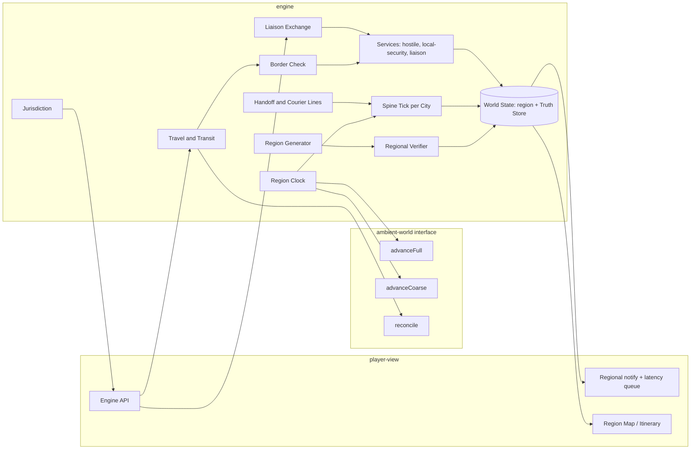

# Design Document

## Overview

Multi-city extends the slice engine from one `city` to a `region` of 2–4 Cities without weakening any slice invariant. Three decisions do most of the work.

1. **Spine/Ambient split with per-City streams.** Everything that can affect the mystery (the Spine) advances identically in every City at every Fidelity Tier, from that City's own Spine PRNG stream. Only Ambient simulation (owned by ambient-world) changes with tier. This makes coarse simulation exact on the Spine, by construction, and confines divergence to Ambient facts that the Spine never reads.
2. **Services generalise the Hostile Service.** The slice's single `hostile: HostileServiceState` becomes `services: Record<ServiceId, ServiceState>` with a Service Kind. Hostile, local-security and liaison Services share one doctrine engine, keep separate beliefs and are linked by a Rivalry table.
3. **Travel is an action with Transit.** Intercity travel is a slice `Action` whose cost is quoted (Slice Req 13.2, Property 16). Transit is a pseudo-Location (the Carriage). Border Checks are pure functions run inside the Turn Transaction.

Setting: early Cold War, with real cities and fictional characters. Service identities and names come from content-expansion Service Definitions, which `region-core` references by id and extends. They are fictional analogues, for example "the Directorate" (Soviet-bloc analogue), "the Sicherheitsdienst-Ost" (satellite analogue), "Staatspolizei" (Austrian analogue) and "the Bureau" (allied liaison analogue).

### Key decisions

| Decision | Choice | Rationale |
|---|---|---|
| Coarse simulation | The Spine runs per phase in every City and only Ambient is tiered | The Spine is cheap (tens of Principal NPCs, a few Channels). Exactness beats a lossy approximation of the mystery |
| Stream layout | Per-City streams `core/noise/daily/spine/ambient`, plus a region stream | Changing one City's tier, noise or content cannot perturb another City or the Spine |
| Player runtime stream | Slice runtime stream only for player-initiated checks | Player action checks stay independent of how many Cities tick |
| Services | One `ServiceState` type with kinds; the Rivalry table drives sharing | Reuses the slice doctrine, `dailyTick` and `ingestFeed` code, with no parallel AI |
| Liaison | Liaison Reports come from a Service Knowledge Slice through the slice Claim path | Truth isolation reuses the slice mechanism: the Player View gets `Claim`s and truth goes to `ClaimTruthRecord` |
| Borders | `borderCheck` is a pure function with a fixed outcome enum and fixed Fact Line templates | Deterministic, testable, and the outcome text never leaks Watch List contents |
| Communication Latency | Per City-pair class (same country, cross-border, across the Curtain) from the Regional Preset | Era texture; keeps remote information late and partial |
| Backward compatibility | `region` unset gives the slice code path and streams unchanged | Golden slice replays stay valid |
| Content split | `region-core` holds region-level kinds; cities come from content-expansion city packs | Matches the boundary map; a fixture pack keeps tests independent |

## Architecture



**Region Clock.** `clock.advance(n)` (Slice design Clock) becomes:

```
for each phase step:
  for city in cityIndexOrder:            # fixed order
    spineTick(city, spineRng[city])      # plot stages, schedules, channels, transits, handoffs
  for city in cityIndexOrder:
    tier(city) == 'full' ? ambient.advanceFull(city, ambientRng[city], spineView)
                         : ambient.advanceCoarse(city, ambientRng[city], spineView)
    applyCouplings(city)                 # identical at both tiers
  transits.step()                        # arrivals, border posts reached this phase
  at day boundary: for service in serviceIdOrder, city in residency order: dailyTick
                   then sharing relations, penetrations, liaison deliveries
```

The Spine never reads Ambient state except through `couplings`, so `spineTick` results do not depend on tier.

**Boundary rules.** These are unchanged from the slice: `tui` imports only `player-view`. New truth-bearing types (`Truth<WatchList>`, `Truth<number>` for Travel Document quality and Liaison Reliability, `Truth<Penetration>`) are branded and stripped by projections.

### Package changes

```
packages/
  content/   + schemas: region-template, intercity-route, border, border-post, travel-document-kind,
               service, rivalry, regional-preset, cross-city-hook; region-core and fixture packs
  engine/    + region/ (generator, streams, verifier), travel/, border/, services/ (generalised hostile),
               liaison/, handoff/, jurisdiction/, fidelity/ (tier manager, ambient adapter)
  player-view/ + region map, itinerary, papers view, latency-aware notify, liaison requests in the API
  tui/       + region map screen, departures board, papers panel, Carriage scene
  evals/     + regional fixtures and perf benchmarks
```

### PRNG streams

The slice streams are unchanged when `region` is unset. In region mode, City *i* (0-based, region template order):

| Stream | Seed |
|---|---|
| region | `derive(seed, 0x70000)` (block `0x70000`–`0x7FFFF` in the slice PRNG stream registry), retry *k*: `derive(regionSeed, k)`: City binding, Intercity Routes, Services, Rivalry, Plot |
| city core *i* | `derive(regionSeed, 0x100 + i)` |
| city noise *i* | `derive(regionSeed, 0x200 + i)`, retry *k*: `derive(that, k)` |
| city daily *i* | `derive(derive(regionSeed, 0x300 + i), day)` |
| spine *i* | saved `PrngState`, initialised from `derive(regionSeed, 0x400 + i)` |
| ambient *i* | saved `PrngState`, initialised from `derive(regionSeed, 0x500 + i)` |
| runtime | saved `PrngState` (slice): player-initiated checks only (approach, surveil detection, border checks of the player, visa) |

NPC Border Checks draw from the spine stream of the departure City, so they happen identically at both tiers. The per-City streams are derived from `regionSeed`, not the game seed, so they do not collide with any registry block. ambient-world's keyed Ambient sub-streams use City *i*'s ambient seed `derive(regionSeed, 0x500 + i)` in place of the game seed (ambient-world design, Ambient streams).

## Components and Interfaces

### Region Generator (`engine/region`)

```ts
interface RegionGenerator {
  generate(seed: string, content: ContentSet, preset: DifficultyPreset, rpreset: RegionalPreset,
           scenario: ScenarioConfig): WorldState; // pure
}
```

Steps (region stream first, then per-City streams):

1. Pick the region template from `scenario.region.template`. Bind its City slots to city definitions and set each City's era date.
2. Build the Intercity Routes from route templates (Travel Mode, Terminals, timetable, duration, fare, Borders) and the Border Posts with their Controlling Services.
3. Instantiate the Services from Service definitions: kinds, doctrine from Regional Preset ranges, Residencies, Rivalry table and Jurisdiction map.
4. Choose a Plot template that is compatible with the City count. Bind its Cross-City Stage Hook City roles to Cities that satisfy each role's constraints (the Hub City is eligible unless a role excludes it). Create one Cell per touched City and one Plot leader.
5. For each City *i* on its core stream, run slice worldgen steps 1, 3, 5, 6 and 9 scoped to the City (Districts, Locations, Principal NPCs, Channels, Dead Drops, Knowledge, public texts). Principal NPC caps apply (Req 1.4).
6. Build the Regional Station (or per-City Stations), Outstations, the mole if enabled, Courier Lines for Handoffs, and Liaison Service Knowledge Slices (with false beliefs at the liaison reliability rate).
7. Build the Starting Brief: the slice brief plus `papers`, known Cities, known Intercity Routes and known Liaison Services.
8. Run the Regional Verifier. On failure, restart from step 1 with retry *k*.
9. Run per-City noise on the noise streams (slice Noise Generator, scoped to the City), then re-verify (Slice Req 29.6).

Generation is per-City after step 4, so step 5 can be split into independent pure calls. The 8 s budget (Req 19.1) assumes about 2 s per City, as in the slice.

### Travel and Transit (`engine/travel`)

```ts
interface IntercityRoute {
  id: IRouteId; mode: 'rail' | 'air' | 'road' | 'sea'; from: LocId; to: LocId;   // Terminals
  timetable: { weekday: number; phase: Phase }[]; duration: 1|2|3|4|5|6|7|8; fare: number;
  borders: BorderPostId[];  // in crossing order, each with phase offset into the Transit
  cancelWeather?: WeatherKind[];
}
interface Transit {
  id: TransitId; departure: { route: IRouteId; at: GameTime }; travellers: (NpcId | 'player')[];
  carriage: LocId; nextBorder: number; arrivesAt: GameTime; status: 'running' | 'held' | 'arrived' | 'cancelled';
}
type Action = SliceAction
  | { kind: 'depart'; route: IRouteId; at: GameTime; papers: TravelDocId[] }
  | { kind: 'request-papers'; doc: TravelDocKindId; holder: 'player' | NpcId }
  | { kind: 'apply-visa'; country: CountryId }
  | { kind: 'liaison-request'; service: ServiceId; about: EntityId }
  | { kind: 'liaison-share'; service: ServiceId; claims: ClaimId[] }
  | { kind: 'exfiltrate'; asset: NpcId; route: IRouteId; at: GameTime; papers: TravelDocId[] };
```

- `quote({ kind: 'depart' })` returns the phases to wait, the Transit duration and the fare, and lists the Borders. It returns `allowed: false` when the player is not at the origin Terminal or is Persona Non Grata at the destination, or when a required Travel Document kind is missing from the selected Papers. A missing document is a player-visible fact, because Border requirements are published content.
- Booking a later Departure is `wait` + `depart`. `resolve` runs the clock to the Departure and then through the Transit, phase by phase, with Border Checks at their offsets. A secondary inspection or detention extends the Transit. Quotes show the base duration, and the extension is reported as a Fact Line. Slice Property 16 is amended so that border extensions are accounted separately (Property 10).
- The Carriage is a Location of type `carriage` (public, crowd from the Departure's traveller count). It allows talk, approach, surveil and wait. A wait inside a Carriage cannot exceed the remaining Transit.
- NPC travel: schedule entries can name a Departure. `spineTick` moves the NPC into the Transit at the Departure and out at arrival.

### Border Check (`engine/border`)

```ts
interface BorderPost { id: BorderPostId; border: BorderId; service: ServiceId; strictness: number;
                       requires: TravelDocKindId[][]; /* any-of groups, all groups required */ }
type BorderOutcome = 'pass' | 'secondary' | 'seizure' | 'refused' | 'detained';
interface BorderInput {
  post: BorderPost; at: GameTime; traveller: { identity: EntityId; descriptor: string; cover?: CoverIdentity };
  papers: TravelDocument[]; items: ItemRef[]; watch: Truth<WatchList>; rpreset: RegionalPreset;
}
function borderCheck(input: BorderInput, rng: Prng): { outcome: BorderOutcome; seized: ItemRef[];
                                                        suspicionDelta: number; phasesAdded: number }; // pure
```

Order of evaluation:

1. **Document validity.** A missing required kind, an expired window, or a holder that does not match the identity returns `refused`. If the traveller is on the Watch List, it returns `detained`.
2. **Suspicion score.** `s = strictness × (1 − meanQuality) + watchMatch × rpreset.watchSensitivity + coverMismatch`. `watchMatch` is 1 for an identity match, 0.5 for a descriptor match and 0 otherwise. `coverMismatch` is non-zero when the Cover Identity's employer has no business across this Border, from Cover Identity content.
3. **Draw.** A single runtime draw `u` gives `detained` if `u < s²`, else `secondary` if `u < s`, else `pass`. The single-draw design makes the outcome monotone in `s` for a fixed `u` (Property 9).
4. **Secondary.** A deterministic item search (second draw). Contraband found gives `seizure`, plus `suspicionDelta`.

**Extension Seam.** `borderCheck` takes an optional `BorderExtension`:

```ts
interface BorderExtension<Ctx = unknown, Detail = unknown> {
  readonly id: string;                                   // e.g. 'street-ops.vehicle'
  applies(traveller: BorderInput['traveller'] & { ext?: Ctx }): boolean;
  check(input: BorderInput & { ext: Ctx }, rng: Prng): { outcome: BorderOutcome; seized: ItemRef[]; suspicionDelta: number; phasesAdded: number; detail?: Detail };
}
```

When an extension applies, it replaces steps 1 to 4 for that traveller and returns one outcome from the fixed set. The extension keeps its own richer results (for example street-ops's `vehicle-seized` or `turned-back`) in `detail`, and the Border Check maps them to the nearest core outcome for the shared rules. Suspicion, detention and Cable handling are applied by this module, not by the extension. With no extension registered the function runs as above, so Property 2 (slice compatibility) and Property 9 (monotonicity) are unchanged. The seam is exercised first by the street-ops add-on.

The Fact Line is chosen only by `outcome` and the Border Post name, so it reveals nothing about the Watch List. The Watch List is derived from the Controlling Service's beliefs: persons it suspects and descriptors from detected surveillance.

### Services (`engine/services`)

```ts
type ServiceKind = 'own' | 'hostile' | 'local-security' | 'liaison';
interface ServiceState {
  id: ServiceId; kind: ServiceKind; country?: CountryId; doctrine: Doctrine;
  residencies: Record<CityId, { officers: NpcId[]; channels: ChannelId[]; drops: DeadDropId[]; capacity: number }>;
  beliefs: HostileBeliefs & { coverSuspicion: number; watch: WatchList };
  knowledge: KnowledgeSlice;                          // what this Service knows (truth and false beliefs)
  liaison?: { reliability: Truth<number>; agenda: LiaisonAgenda; trust: number; delayPhases: number };
  penetratedBy?: Truth<{ service: ServiceId; agent: NpcId; delayPhases: number }>;
}
interface RivalryEdge { from: ServiceId; to: ServiceId; share: boolean; delayPhases: number;
                        compete: boolean; expose: number /* 0..1 doctrine weight */ }
```

- The slice `HostileService` code becomes the per-Service doctrine engine. `dailyTick(service, city)` runs per Residency. A Local Security Service runs the detection steps against everyone (the player, all Services' agents) and makes public arrests that print in the newspaper. It does not run Plot adaptation.
- **Belief sharing.** When an adopted belief arrives on a `share` edge, it is queued with `delayPhases` and adopted by the receiver at delivery. This is a hidden event.
- **Competition and exposure.** When two rival Hostile Services both target an NPC, the higher doctrine `riskTolerance` pitches first. With probability `expose`, a Service that detects a rival's agent passes the agent's identity to the Local Security Service, which arrests it. Such arrests are public and can disrupt the Plot if the agent is a Cell member. This creates leads the player did not cause.
- **Cover Suspicion** is per Service. The burn rule (Slice Req 12.5) is checked per Hostile Service. Local Security Services trigger Persona Non Grata (Req 6.8). Expulsion is a forced `depart` on the next Departure out of the country, with no Border Check on exit.

### Liaison Exchange (`engine/liaison`)

```ts
function liaisonAnswer(svc: ServiceState, about: EntityId, rng: Prng): Proposition[];          // pure
function liaisonShare(svc: ServiceState, props: Proposition[]): ServiceState;                  // pure
```

- **Answer.** Candidates are the Service's `knowledge` Propositions (truth and false beliefs) concerning `about`, excluding the `agenda.conceal` list. The agenda's `promote` items about `about` are added. Each candidate is returned with p = `reliability`, with distortion as in slice Asset reporting. At most `ceil(3 × trust)` Propositions are returned. They are delivered as a scheduled player-visible `liaison-report` event after `delayPhases` (plus latency). The Claims have source `{ kind: 'liaison'; service }`. The extraction-equivalent truth step (Slice design Claim Extractor steps 1–4) writes `ClaimTruthRecord`s.
- **Share.** Shared Claims' Propositions are adopted into the liaison `beliefs`, and trust rises by 0.05 per Proposition (capped at 1). If `penetratedBy` is set, a hidden `penetration-relay` event delivers the same Proposition list to the penetrating Service after its delay, through `ingestFeed` with the penetration agent as source and full credibility. The relayed set is exactly the shared set (Property 8).
- **Trust falls** by 0.1 for each refused request from the Liaison Service (it asks for material in the agenda's `obtain` list through a Cable) and by 0.3 for each arrest of its agent.
- **Border crossing records** (Req 7.7). These are Claims `TRAVELS_TO(npc, city, window)` for Border Checks at that Service's posts, filtered by the same reliability and agenda.

### Handoffs and Cross-City Stage Hooks (`engine/handoff`)

Hook schema (the content kind is owned here and used by plot-library templates):

```yaml
stages:
  - id: acquire
    city: A                       # City role, bound at generation
    fallback: acquire-local       # optional: local stage used in single-city play (plot-library Req 16)
  - id: deliver
    city: B
    requires: [acquire.item]
    handoff: { from: acquire, carrier: courier-line | cell-member, modes: [rail, road] }
cityRoles: { A: { not: hub }, B: {} }
```

This schema is canonical: plot-library declares hooks in it. `fallback` is optional and names a normal stage of the same template. It is read only in single-city play, where plot-library binds the first declared City role to the game's city and replaces stages of other roles with their `fallback` or marks them Off-map. In region mode `fallback` is ignored.

- At generation, the role binding must satisfy `cityRoles` constraints, and an Intercity Route between the bound Cities must exist in an allowed mode. Otherwise the template is ineligible for this region.
- A Handoff is a Spine entity `{ item, from, to, route, carrier, status }`. When the producing stage executes, the carrier boards the next allowed Departure. Arrival marks the requirement satisfied. Border Checks on the way can seize the item, which counts as a disruption with key `handoff:<id>`.
- **Reroute order** (Req 10.4): alternative Departure on the same route, then an alternative route or mode, then an alternative City role binding that satisfies the constraints. If none exists, the result is `no-reroute`, and the slice aborts.
- Traces are emitted in the origin City, in every Carriage, and in the destination City (Terminal sightings).

### Fidelity Tiers and the ambient-world interface (`engine/fidelity`)

ambient-world must implement this interface. This spec owns the contract.

```ts
interface AmbientSimulator {
  advanceFull(city: CityId, ambient: AmbientCityState, spine: SpineView, rng: Prng): AmbientStep;
  advanceCoarse(city: CityId, ambient: AmbientCityState, spine: SpineView, rng: Prng): AmbientStep;
  reconcile(city: CityId, ambient: AmbientCityState, spine: SpineView, disclosed: Proposition[], rng: Prng): AmbientCityState;
  couplings(city: CityId, ambient: AmbientCityState, t: GameTime): AmbientCoupling[];   // must be tier-independent
}
interface AmbientStep { next: AmbientCityState; events: SimEvent[] /* tagged origin: 'ambient' */ }
type AmbientCoupling = { kind: 'location-closed'; loc: LocId; phases: number }
                     | { kind: 'crowd-modifier'; loc: LocId; factor: number }
                     | { kind: 'route-delay'; route: IRouteId; phases: number }
                     // one kind per ambient-world Ambient_Hook (ambient-world Req 18.1), same payloads:
                     | { kind: 'delay-stage'; stage: StageId; days: 1 | 2 }
                     | { kind: 'reroute-location'; stage: StageId; from: LocId }
                     | { kind: 'channel-outage'; channel: ChannelId; window: Window }
                     | { kind: 'cover-suspicion-delta'; amount: number; cause: string }
                     | { kind: 'informant-report'; informant: NpcId; item: GossipRef; handler: 'police' | ServiceId }
                     | { kind: 'detection-bonus'; npc: NpcId; bonus: number };
```

`applyCouplings` applies the six hook kinds through the same functions as ambient-world's hook gateway, with ambient-world's caps (Plot delay, daily Cover Suspicion), and records them in its hook ledger. In region mode, `informant-report` names the handling Service (a Local Security Service or a Hostile Service with a Residency in the City).

Contract obligations:

- `couplings` must return the same value at both tiers for the same `(city, t)`, Spine history and Ambient stream draws.
- **Tier split.** To make that feasible, the implementation computes these at both tiers, from inputs that exist at both tiers: City Events and their Effect_Ops (from the City daily calendar, exogenous metrics, and reactive triggers raised by Spine events and player turns), and NPC memory, gossip and Informant processing concerning the player (bounded and cheap). Every coupling is derived only from these. Other life-sim detail (agendas, Life_Events, tie drift, Local_Incidents, Townsfolk schedules, news texture) may be coarse at the coarse tier.
- `reconcile` must preserve every `disclosed` Proposition (Req 11.6). It may resample everything else.
- Ambient events never carry Spine-mutating payloads. `applyCouplings` is the only bridge.
- ambient-world implements this interface (ambient-world Req 25) and runs the contract test suite below against its implementation. In single-city mode ambient-world runs as its own spec describes and this interface is not used.
- **Fallback adapter.** If ambient-world is not loaded, `SliceAmbient` wraps the slice Background NPC schedules: coarse = full = the slice behaviour, and `reconcile` is the identity.

The tier manager sets `full` for the Current City and `coarse` elsewhere and in Transit. On arrival it calls `reconcile` with the Case File and Journal Ambient Propositions for that City before the arrival Fact Lines (Req 11.5).

### Regional Verifier (`engine/region/verify`)

This is the slice learnability graph with new node kinds (City, Intercity Route, Liaison Service, Travel Document kind) and edges:

| Edge | Condition |
|---|---|
| travel to City C | A route chain from a reachable City to C exists, and every Border on it is satisfiable by root Papers or by a papers-request or visa kind that the content marks obtainable |
| surveil Terminal | Terminal known → travellers on Departures at it (Spine events) |
| Carriage meeting | NPC with a scheduled Departure on a reachable route → that NPC's knowledge |
| liaison request | Known Liaison Service and a known entity X → the Liaison Service's non-concealed knowledge about X |
| remote tasking | Asset-recruitable NPC in a reachable City with a Contact Channel |
| Courier Line intercept | Known Courier Line → the Handoff plaintext |

Disjointness extends to Liaison Services (Req 14.2), so the two paths cannot both go through one possibly-biased liaison. Jurisdiction reachability (Req 14.3): at least one of {the Plot leader is scheduled in a City where Jurisdiction permits arrest, a Handoff with key materiel passes a reachable Terminal or Carriage, the abort-pressure route} must hold. Cost: the graph is built per City, with region edges added once, and BFS is linear in edges. A four-City Region is about 4× the slice graph.

### Jurisdiction (`engine/jurisdiction`)

`jurisdiction: Record<CityId | DistrictId, ServiceId>` is published content, and the player knows it (an occupation sector belongs to an occupying power). `quote({ kind: 'arrest' })` adds the Jurisdiction condition from Req 15.2. Liaison trust is a Player View value shown as a band, because the player can feel the relationship. The arrest-gate inputs stay player-side (Slice Property 12).

### Regional Notifications (`player-view/notify`)

Each event carries its `city`. `notify` (Slice design) is unchanged. A latency queue before it holds player-visible events from city X until `at + latency(X, playerCity)`, and holds everything during Transit except Carriage events (Req 13.5). New Notification kinds: `departure-cancelled`, `border-outcome`, `papers-issued`, `visa-decision`, `liaison-report`, `outstation-report`, `courier-delivery`, `asset-arrived`, `expelled`. Other Cities' newspapers become obtainable as Documents at kiosks the next day.

### Station and Cables

`station` becomes `stations: StationState[]` with `outstations`. Cable delay = slice delay + `latency(city, hub)`. `intercept` at an Outstation filters by `channel.reception.includes(city)`. Directive objectives gain a `city?` field. The mole's `visible` set is the Cables routed through its posting and the Case File summaries that the Station sends there.

### Content (`content`)

| Kind | Key fields |
|---|---|
| Region template | id, era date (within every referenced City's Period Window; `central-1953` uses 1953, inside Vienna 1945–1955, Berlin 1948–1961 and Trieste 1947–1954), City slots (city id ref, hub flag), countries, Sector Lines, Jurisdiction map, Service refs, Rivalry table, route template refs, allowed Plot templates |
| Intercity Route template | mode, Terminals (Location Type refs or named Locations), timetable pattern, duration, fare, Borders, cancelling weather |
| Border / Border Post | country pair or Sector Line, Controlling Service, strictness, required document groups |
| Travel Document kind | id, issuer kinds, validity days, base quality, cost, obtainable-by (Station, consulate, none) |
| Service extension | references a content-expansion Service Definition id (which supplies name, aliases, kind, country and doctrine base); adds Residency cities, doctrine overrides, officer naming pools and liaison agenda pools |
| Regional Preset | every Req 20.2 field, keyed by Difficulty Preset id |
| Cross-City Stage Hook | `city`, `handoff`, `cityRoles`, optional `fallback` (schema extension of the Plot template; canonical, used by plot-library) |

Every regional kind is registered through content-expansion's Content Kind Registry (`LoadOptions.kinds`) with Field Declarations, not added inside `packages/content` directly. City definitions come from content-expansion city packs: a `city` kind with Districts, Location instances or Location Type weights, Terminals, Sector Lines, landmarks, a style sheet and an era range. The fixture pack defines synthetic Cities that use the same kind. Every entry carries an era range (Req 1.5).

### Regional config (`engine/config`)

The slice `ScenarioConfig` gains an optional strict `region` section. Its preset is resolved as in the slice: the named Regional Preset for the selected Difficulty Preset, deep-merged with `overrides` and re-validated.

```ts
region: z.object({
  template: z.string(), stationModel: z.enum(['regional', 'per-city']).default('regional'),
  overrides: RegionalPreset.deepPartial().default({}),
}).strict().optional(),   // unset: slice mode (Req 1.6)
```

### Regional UI (`tui`)

- **Region map:** Cities with their Intercity Routes (mode, duration, fare, Borders), drawn as an adjacency list as in the slice Map view.
- **Departures board:** at a Terminal, the next Departures, each with its quote.
- **Papers panel:** every Travel Document held (Req 4.5).
- **Carriage scene:** travellers on the Departure, plus the slice talk and observe actions.
- **Status bar:** `City · day · phase`, or `In transit → City (arrives day/phase)`.
- **Case File and People view:** the Case File gains a City filter, and the People view shows each person's last known City (Req 17).

## Data Models

```ts
type CityId = `city:${string}`;
interface CityState {
  id: CityId; name: string; country: CountryId; eraDate: string; hub: boolean;
  districts: District[]; locations: Record<LocId, Location>; routes: Route[];
  weather: Record<number, Weather>; sectorLines: { a: DistrictId; b: DistrictId; post: BorderPostId }[];
  tier: 'full' | 'coarse'; ambient: AmbientCityState;
}
interface TravelDocument {
  id: TravelDocId; kind: TravelDocKindId; holder: EntityId; issuer: ServiceId | CountryId;
  valid: { from: GameTime; to: GameTime }; quality: Truth<number>;
}
interface Handoff { id: HandoffId; stage: StageId; item: ItemId; from: CityId; to: CityId;
                    carrier: NpcId; transit?: TransitId; status: 'pending' | 'moving' | 'delivered' | 'seized' | 'rerouted'; }

interface WorldState /* region mode */ extends Omit<SliceWorldState, 'city' | 'hostile' | 'station'> {
  region: { template: string; cities: Record<CityId, CityState>; order: CityId[];
            intercity: Record<IRouteId, IntercityRoute>; borderPosts: Record<BorderPostId, BorderPost>;
            jurisdiction: Record<CityId | DistrictId, ServiceId>; latency: Record<`${CityId}|${CityId}`, number> };
  rng: { runtime: PrngState; spine: Record<CityId, PrngState>; ambient: Record<CityId, PrngState> };
  services: Record<ServiceId, ServiceState>; rivalry: RivalryEdge[];
  stations: { hub: StationState; outstations: Record<CityId, OutstationState> };
  transits: Record<TransitId, Transit>; handoffs: Record<HandoffId, Handoff>;
  locationOf: Record<NpcId | ItemId, { city: CityId; loc: LocId } | { transit: TransitId }>;   // single source of placement
  player: SlicePlayer & { city: CityId | null; papers: TravelDocId[]; png: CountryId[] };
  documents: Record<DocId, Document>; travelDocs: Record<TravelDocId, TravelDocument>;
  pendingNotices: { event: SimEvent; releaseAt: GameTime }[];
}
```

`locationOf` is the only placement record. NPC `schedule` entries are intents, and `spineTick` writes `locationOf`. This makes Req 12.1 a structural property.

New `SimEvent` kinds: hidden `transit-started`, `transit-arrived`, `border-check`, `handoff-moved`, `belief-shared`, `penetration-relay`, `rival-exposure`; player-visible `departure-cancelled`, `border-outcome` (player only), `papers-issued`, `visa-decision`, `liaison-report`, `outstation-report`, `courier-delivery`, `asset-arrived`, `expelled`. Every event gains `city: CityId | null`.

`Claim.source` gains `{ kind: 'liaison'; service: ServiceId }`. `SaveSnapshot.version` is bumped. Region fields are added, and slice saves still load in slice mode. `OutcomeRecord` schema 2 (introduced by plot-library) gains an optional `region` block (Req 18.4). Schema 1 records never carry it, and no schema number is added for it, so campaign-career reads schema 2 with or without the block.

## Correctness Properties

*A property is a characteristic or behavior that should hold true across all valid executions of a system-essentially, a formal statement about what the system should do. Properties serve as the bridge between human-readable specifications and machine-verifiable correctness guarantees.*

Each property is one fast-check test with `numRuns ≥ 100`. Generators cover the fixture pack (2–4 synthetic Cities), `region-core`, every Difficulty Preset and Regional Preset, random action sequences that include travel, and fuzzed model outputs. Slice Properties 1–32 continue to hold. Properties 16, 17, 18, 23 and 26 also run with regional generators (see Testing Strategy). In this section, "spine projection" means the World State restricted to the Spine, with Ambient state and Fidelity Tier fields removed.

### Property 1: Regional determinism and stream independence

For any seed, region template, Difficulty Preset and Regional Preset, generating twice gives deep-equal World States, and every generated Region satisfies these invariants:

- 2–4 Cities;
- Principal NPC caps: at most 22 per City and 48 per Region;
- City role bindings that satisfy `cityRoles`;
- every content entry used falls within its era range.

Changing only City *j*'s noise or Ambient settings leaves the core and Spine state of every other City deep-equal.

**Validates: Requirements 1.1, 1.2, 1.3, 1.4, 1.5, 6.3, 10.1**

### Property 2: Slice compatibility

For any seed and scenario with `region` unset, the World State and the replay final state are deep-equal to those of the slice engine.

**Validates: Requirements 1.6**

### Property 3: Spine tier equivalence

For any Region, player action sequence and tier schedule (any assignment of full or coarse to each City at each phase, including all-full), the spine projection after each action is deep-equal to the all-full run. This includes NPC Border Checks and every Ambient Coupling kind, including the six hook kinds, and the player-concerning memory, gossip and Informant state.

**Validates: Requirements 11.2, 11.4, 11.8, 3.8**

### Property 4: Bounded Ambient divergence on arrival

For any Region, action sequence ending in arrival at City C, and conforming `AmbientSimulator`:

- after Arrival Reconciliation, every Disclosed Fact about C still holds;
- every difference between the reconciled run and the all-full run is in Ambient state;
- the arrival Fact Lines derived from the Spine (visible Principal NPCs, Spine Observations, Documents) are identical.

**Validates: Requirements 11.5, 11.6**

### Property 5: Cross-City truth consistency

For any reachable state:

- every NPC and item has exactly one `locationOf` entry, either in a City or in a Transit;
- every NPC in Transit is listed in that Transit's Carriage;
- every Truth Store Proposition with a place in City C has all participants located in C throughout its window;
- for any two consecutive placements of an NPC in different Cities, the interval is at least the duration of the Departure that the NPC took.

**Validates: Requirements 2.5, 2.6, 12.1, 12.2, 12.3, 12.4**

### Property 6: Regional solvability

For any seed and presets:

- the Regional Verifier's root equals the Starting Brief, Papers included;
- every Plot Stage key Proposition (and the mole's identity, when the mole is enabled) has two paths that share no intermediate NPC, Channel or Liaison Service, one human and one signal;
- every Border on a path is satisfiable by root or obtainable Papers;
- at least one success condition is reachable through a Jurisdiction-permitted action.

This holds after noise generation too.

**Validates: Requirements 14.1, 14.2, 14.3, 14.5, 4.1**

### Property 7: Liaison truth isolation

For any reachable state and any sequence of liaison requests and shares:

- the serialized Player View and Case File contain no Liaison Reliability, Liaison Agenda, Penetration, Watch List, Travel Document quality or other truth-branded field;
- every Liaison Report Proposition belongs to the Service's Knowledge Slice (truth or false beliefs), its promote list, or a distortion of one of those;
- `relation` and `evidenceCount` are unchanged under any Truth Store modification.

**Validates: Requirements 4.5, 7.1, 7.2, 7.6**

### Property 8: Shared-intelligence leakage bound

For any Services, Rivalry table, Penetrations, mole posting and sequence of shares, Cables and detections:

- every belief a Service adopts comes from its own detections or ingestion, a `share` edge delivered after exactly its delay, or a Penetration relay;
- the Propositions relayed by a Penetration are exactly those shared with the penetrated Service;
- a mole's reports contain only material visible to its posting.

**Validates: Requirements 5.6, 6.2, 6.4, 7.4**

### Property 9: Border Check determinism and monotonicity

For any Border Post, traveller, Papers, items, Watch List, Regional Preset and PRNG state:

- `borderCheck` is deterministic;
- a missing, expired or mismatched required document yields `refused` or `detained`;
- raising any document's quality never yields a worse outcome for the same draws (ordering pass < secondary < seizure < detained);
- the Fact Line depends only on the outcome and the Border Post.

**Validates: Requirements 3.1, 3.2, 3.3, 3.9**

### Property 10: Intercity travel accounting

For any reachable state and allowed `depart`:

- the clock advances by exactly the quoted wait plus the quoted duration plus the `phasesAdded` reported by Border Fact Lines;
- the Budget changes by exactly the fare (refunded on cancellation);
- the player ends at the destination Terminal, or at the origin Terminal on cancellation or refusal.

A disallowed `depart` leaves the state unchanged.

**Validates: Requirements 2.2, 2.3, 2.4**

### Property 11: Handoff semantics

For any Plot with Cross-City Stage Hooks and any sequence of seizures, arrests and compromise beliefs:

- a stage whose requirement comes from another City executes only after a Handoff of that requirement completes;
- every Handoff stage deadline is at least the producer deadline plus the shortest Transit;
- each distinct Handoff disruption adds exactly 1 to Abort Pressure;
- reroutes follow the order: same route, then alternative route or mode, then alternative City.

**Validates: Requirements 9.2, 10.2, 10.3, 10.4**

### Property 12: Regional latency and notification soundness

For any event sequence across Cities:

- no Notification, Cable reply, remote tasking delivery or remote Asset result reaches the player before the event time plus the Communication Latency between the event City and the player's City at delivery;
- during Transit only Carriage Notifications are delivered;
- the Notification stream equals the stream computed from player-visible events alone.

**Validates: Requirements 5.4, 8.1, 8.2, 13.1, 13.3, 13.5**

### Property 13: Jurisdiction gate independence

For any Case File, Starting Brief, Jurisdiction map, liaison trust band and target, `quote({ kind: 'arrest' })` is granted if and only if the slice evidence gate holds and Jurisdiction permits it. The quote is unchanged under any Truth Store modification.

**Validates: Requirements 15.1, 15.2, 15.3, 15.4**

### Property 14: Regional save, replay and outcome

For any reachable regional state:

- `load(save(s))` deep-equals `s`, including every City Stream, Fidelity Tier, Transit and pending Handoff;
- replaying the seed, action log and recorded model responses reaches a deep-equal final state;
- `buildOutcomeRecord` produces a schema-valid record whose region block matches the final state.

**Validates: Requirements 18.1, 18.2, 18.3, 18.4**

## Error Handling

| Failure | Handling |
|---|---|
| Region template references a missing City or route Terminal | Loader refuses to start and reports pack, file and path (Req 16.2) |
| No eligible Plot template for the region's City count or routes | Generator error naming the template set and the region |
| Regional verification fails after the attempt limit | `GeneratorError` naming the seed (Req 14.4) |
| `AmbientSimulator` coupling differs between tiers (contract violation) | Debug builds run both tiers on a sampled City and throw `AmbientContractError`; release builds log it to the metrics log |
| Reconciliation contradicts a Disclosed Fact | Reject the reconciled state, fall back to the coarse state for that City, and log `AmbientContractError` |
| Departure cancelled | Refund, Notification and Fact Line; player stays at the origin Terminal (Req 2.4) |
| Border refusal or detention | Fixed Fact Line; refusal returns the player to the origin Terminal; detention holds the player and sends a Cable (Req 3.6) |
| Persona Non Grata while in that country | Forced expulsion Departure; if no City is enterable, the game ends burned (Req 6.8–6.9) |
| Arrest forbidden by Jurisdiction | `quote` returns `allowed: false` with a Jurisdiction reason and the observed Cities (Req 15.3) |
| Liaison request to a Service with trust 0 | Allowed; returns an empty report after its delay (no information about why) |
| Perf budget exceeded | Recorded in the metrics log; eval perf benchmarks fail in CI replay mode |
| Invalid `region` config | Refuse to start with file and field path (Req 20.3) |
| Slice save loaded in region build | Loads in slice mode; a region save loaded by a build without regional packs is a `manifest-mismatch` |

## Testing Strategy

- **Property tests (fast-check):** Properties 1–14, one test each, `numRuns ≥ 100`, tagged `// Feature: multi-city, Property N: <title>`. Generators:
  - fixture Regions with 2–4 synthetic Cities, random routes, Borders, Sector Lines, Services and Rivalry tables, and Plot templates whose roles push Principal NPC counts up to the caps (22 per City, 48 per Region);
  - random Papers, Watch Lists and tier schedules;
  - action sequences mixing slice actions with `depart`, liaison and papers actions;
  - a reference `AmbientSimulator` with deliberately path-dependent full-tier state, so that Property 4 tests a real divergence and not the identity fallback.
- **Extended slice properties:** Slice Properties 16 (accounting), 17 (surveillance, including Terminals and Carriages), 18 (interception with reception sets), 23 (content validation with regional kinds and corruptions) and 26 (Outcome Record) re-run with regional generators. These are generator extensions, not new tests.
- **Unit tests:** visa resolution, papers issue cost and delay, the contraband search, rival competition and exposure, Persona Non Grata expulsion, liaison trust changes, crossing records, Outstation Cable delay, per-City newspapers, Exfiltration outcomes, and the reroute order.
- **Ambient contract test suite:** exported from `engine/fidelity` so that ambient-world runs it against its implementation (coupling tier independence for every coupling kind, tier-independent player-concerning memory, gossip and Informant state, disclosure preservation, no Spine writes outside couplings).
- **Smoke tests:** `region-core` loads alongside content-expansion city packs (or the fixture pack); one Region generates per preset.
- **Performance benchmarks (Req 19):** a `bench` suite in `evals` measures generation, coarse and full advance, reconciliation, the 8-phase travel action, heap and save size on the fixture four-City Region. It runs manually on the Reference Machine, and in CI with thresholds scaled by a machine factor.
- **Golden replays:** one regional session per starter region in `evals/replays/`. Slice golden replays must still pass unchanged (Property 2).
- **TUI:** `ink-testing-library` snapshots for the region map, departures board, papers panel, Carriage scene and the status bar in Transit. These are not property tests.
- **Eval fixtures:** border interrogation dialogue at secondary inspection, a liaison officer meeting, and a Carriage conversation, all scored with the slice harness (Slice Req 18).
