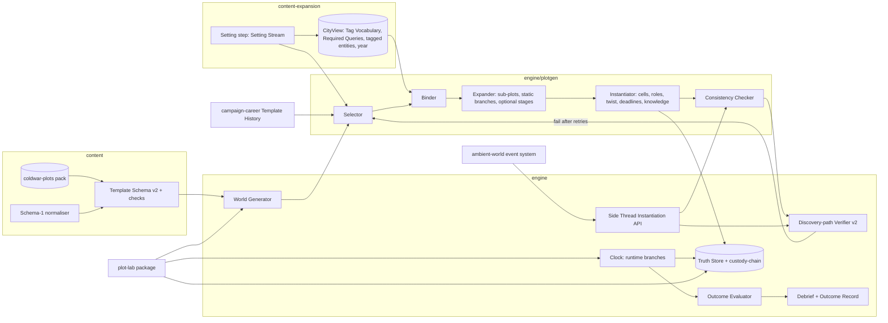

# Design Document: Plot Library

## Overview

This spec adds three things on top of the completed slice:

1. **Template Schema v2**: a superset of the slice's Plot and Side Thread template format. It adds tag-bound parameters, optional stages, static and runtime branches, Sub-Plots, multiple Cells, Twists, template-declared Outcome Conditions, concurrency tags, per-preset scaling, era ranges and Cross-City Hooks.
2. **Engine support**: a Selector, Binder, Expander and Instantiator in a new `engine/plotgen` module, plus runtime branch resolution, an outcome evaluator, a cross-plot consistency checker, one new evaluator kind (`custody-chain`) and an extended discovery-path verifier.
3. **The `coldwar-plots` Library Pack** and the **Plot Lab** harness that authors use to prove each template is solvable, reachable, winnable and coherent.

Slice types and components are reused by name: `PlotState`, `StageState`, `TruthStore`, `WorldGenerator`, the discovery-path verifier, `Clock.advance`, `abortCheck`, `HostileServiceState`, `evidenceCount`, `ContentLoader` and `OutcomeRecord`. Where this design changes a slice type, it does so by addition and states the change.

### Key decisions

| Decision | Choice | Rationale |
|---|---|---|
| Format evolution | `contentSchema: 2` is a strict superset; schema-1 templates are normalised to v2 at load | Slice packs keep working; one instantiator path |
| Generality | All branching, outcome and condition logic uses closed enums of kinds | Authors get variety from data; code changes stay rare and reviewable |
| Branch timing | Static branches at instantiation (core stream); runtime branches when predecessors finish (runtime stream) | Static gives replay variety; runtime makes the Hostile Service react to the player |
| Solvability with branches | Verify every Branch Configuration; cap at 32 per template | Exhaustive and cheap; the cap keeps generation bounded |
| City independence | The city comes from content-expansion's setting step on its Setting Stream (City Packs, or the Core City Path for the Core City), which runs before selection. This spec has no `city` stream | City is invariant under Template History and template retries |
| Twists | Twist structure lives only in the Truth Store and engine state; the debrief reveals it | Preserves truth isolation |
| Concurrency | One Primary Plot ends the game; Secondary Plots move Standing | Keeps the slice's end conditions intact |
| Cross-plot coherence | Functional Predicates plus one-place-per-phase scheduling, checked at generation | Contradictions the player finds are always deliberate |
| New evaluator | Only `custody-chain` | Smuggling, forgery and document theft all hinge on who holds an item |
| Plot Lab | Separate `plot-lab` package with Truth Store access, banned from `tui` and `player-view` | Authors get an oracle without weakening the game's boundary |
| Generator version | Covered by the single `generatorVersion` bump declared in content-expansion's design (Setting selection); this spec declares no bump of its own | Stream layout and selection change slice outputs; golden replays are re-recorded once |

## Architecture



**Generation order** (replaces the slice's core steps 1–4 and 10; steps 5–9 are unchanged):

1. **Setting step (content-expansion).** The Start Date and Instantiated City on the Setting Stream from a City Pack, or, with the Core City, the slice's step 1 logic on the Setting Stream's Core City Path (content-expansion design, PRNG streams). This is the fallback when no City Pack is selected: the Core City is still generated first, on the Setting Stream, before selection. The `CityView` is built from the result.
2. Selection on the `select` stream: one Primary and `preset.secondaryPlots` Secondary templates.
3. Binding, expansion and instantiation of each selected template on the core stream, Primary first, then Secondaries by template id.
4. Organisations: the Station, the Hostile Service and one Cell per Cell Spec of each Plot.
5. Principal NPCs for all roles (cap 22).
6. Slice steps 5–9 (Channels, Dead Drops, knowledge, mole, brief, public texts).
7. Consistency check, then verification over every Branch Configuration of every Plot. On failure, retry steps 3–7 with `derive(seed, k)` (slice retry limit). If a template is still failing, exclude it, reselect on `derive(selectSeed, attempt)` and log `{ templateId, seed }`.
8. Noise (slice Noise Generator, now with Lookalike share), then re-verification as in Slice Req 29.6.

**PRNG streams added:**

| Stream | Seed | Used for |
|---|---|---|
| select | `derive(seed, 0x31000)`; reselection *k* uses `derive(thatSeed, k)` | Template selection |

The block `0x31000`–`0x31FFF` is allocated to this spec in the slice PRNG stream registry. This spec has no `city` stream: Districts, Locations and Routes come from content-expansion's Setting Stream (`0x30000` block). The `core`, `noise`, `daily` and `runtime` streams are as in the slice.

**Boundary.** `plot-lab` may import `engine`, `content` and `player-view`. A dependency-cruiser rule forbids `tui` and `player-view` from importing `plot-lab` (Req 18.7).

## Components and Interfaces

### Template Schema v2 (`content/schemas/plot-v2`)

```yaml
# packs/coldwar-plots/plots/rail-junction.yaml
id: cw/rail-junction
kind: plot
displayName: "The Junction"
archetype: sabotage
era: { from: 1948, to: 1962 }
minPreset: standard
selection: { weight: 1.0 }
concurrency: { tags: [sabotage, military], allowWith: [kompromat, smuggling, document-theft] }
params:                             # every query is a Tag Query of 1–3 `facet:value` Tags
  junction:  { kind: loc, query: ["function:rail-yard", "access:private"] }        # Required Query rq-rail-yard, added by this pack
  shipment:  { kind: item, query: ["materiel:military-cargo"] }                     # Library Pack item pool (city-independent)
  safehouse: { kind: loc, query: ["function:lodging"], exclude: ["setting:diplomatic"], group: venues }   # rq-lodging, added by this pack
  meetPoint: { kind: loc, query: ["function:meeting-spot", "access:public"], group: venues }              # core rq-public-meet
  lookout:   { kind: loc, query: ["function:observation-post"], mandatory: false,
               fallback: ["function:meeting-spot", "access:public"] }               # soft preference; fallback is a Required Query
roleSlots:                          # role holders bind by archetype Tag Query; mandatory slots use Required Queries
  leader:        { query: ["role:cell-leader"] }                     # core Required Query for the slice role
  spotter:       { query: ["role:cell-member"] }
  railwayman:    { query: ["role:cell-member", "trade:railway"] }    # rq-railwayman, added by this pack
  demolitionist: { query: ["role:cell-member", "skill:explosives"] } # rq-demolitionist, added by this pack
  courier:       { query: ["role:cell-courier"] }                    # core rq-courier
cells:
  - { id: recon,  roles: [spotter, railwayman] }
  - { id: action, roles: [leader, demolitionist] }
cutouts: [{ role: courier, links: [recon, action] }]
materiel: explosive-charge          # an item slot; seizure counts per Slice Req 38
stages:
  - { id: case-junction, cell: recon, requires: [], deadline: [2, 4], traces: [...] }
  - { id: pass-timetable, cell: recon, requires: [case-junction], produces: [HANDS_OVER], traces: [...] }
  - { id: obtain-charge, cell: action, optional: { weight: 0.6 }, requires: [], traces: [...] }
  - branch: approach
    resolve: runtime
    after: [pass-timetable]
    alternatives:
      - id: night-entry
        when: [{ kind: alertness-at-least, value: 0.5, negate: true }]
        stages: [{ id: plant-night, requires: [pass-timetable], ... }]
      - id: inside-job
        when: [{ kind: default }]
        stages: [{ id: plant-inside, requires: [pass-timetable], ... }]
  - { id: detonate, requires: [plant-night | plant-inside], deadline: [6, 9] }
  - subplot: { template: sub/border-crossing, as: escape, map: { traveller: demolitionist, crossing: { $any: ["function:border-crossing"] } } }
stageCount: { min: 5, max: 8 }
outcomes:
  success: [{ kind: arrest-role, role: leader }, { kind: seize-item, item: materiel }, { kind: abort }]
  failure: [{ kind: stage-completed, stage: detonate }]
difficulty:
  easy:     { optionalWeights: { obtain-charge: 0.2 }, tradecraft: -0.1 }
  hard:     { tradecraft: +0.15 }
secondary: { standingPenalty: 3, standingReward: 2 }
```

Notes on the format:

- **`requires` across branches.** `a | b` means "whichever Alternative's stage is active". The loader checks that the listed stages are in sibling Alternatives of the same Branch Point.
- **`{ $any: <Tag Query> }`** in Sub-Plot maps binds a fresh entity by Tag Query. The same Required Query rule applies as for Mandatory Parameters.
- **Tag Queries** follow content-expansion's Tag Vocabulary. An npc, loc or org param, or a role slot, is mandatory unless it declares `mandatory: false`. A mandatory query must equal the query of a Required Query, from the core pack or added by this pack's `tags.yaml` (content-expansion Req 4.7), so that it binds in every conforming city by construction. A non-mandatory param declares a `fallback` Tag Query that is a Required Query (Req 2.6, 2.7).
- **`item` params** bind against this pack's `plot-item` pools (a kind registered through content-expansion's Content Kind Registry, tagged with this pack's `materiel` facet). They are city-independent, so the loader checks only that each item query has at least one item Binder in the loaded packs.
- **Twists** are declared as:

  ```yaml
  twist:
    kind: facade            # false-flag | facade | inside-man
    mandatory: false
    facadeStages: [walk-in, noisy-recon]   # facade only
    facadeTraceRate: 1.6                    # multiplier on trace emission
    decoy: { kind: org, query: ["org:emigre-group"] }   # false-flag only; rq-emigre-group, added by this pack
    insideRole: courier                     # inside-man only
    propositions:
      - { predicate: REPORTS_TO, subject: role:walk-in, object: org:hostile }
  ```

- **Cross-City Hooks** use the multi-city Cross-City Stage Hook schema, which is canonical (multi-city design, Handoffs and Cross-City Stage Hooks). See Cross-City Hooks below.

**Static checks at load** (each failure is a `ContentError` with pack, file and path):

| Check | Requirement |
|---|---|
| v2 fields only when `contentSchema: 2` | 1.1 |
| Every Tag Query has 1–3 vocabulary Tags whose facets apply to the slot's kind; mandatory npc, loc and org params and role slots equal a Required Query; non-mandatory params declare a Required-Query `fallback`; no literal city ids | 2.2, 2.5, 2.6, 2.7 |
| Stage Graph acyclic after expansion; `requires` resolvable per Alternative | 3.5 |
| Branch Configurations ≤ 32 (product of runtime Alternatives counts, after Sub-Plot expansion) | 3.5 |
| Runtime Branch has one `default` Alternative, declared last | 4.4 |
| Sub-Plots non-recursive, depth ≤ 2, all slots mapped or bindable; `subOnly` used only embedded | 5.3, 5.4 |
| 1–3 Cells; Cutouts link existing Cells | 6.1 |
| At most one Twist; required fields per kind; Twist Propositions use declared roles and predicates | 7.1 |
| Success conditions reference stages, roles or items present in every Branch Configuration; facade success conditions reference only Real elements | 10.6, 10.7 |
| Hook fields match the multi-city hook schema (`cityRoles`, stage `city`, `handoff`, `fallback`); no Outcome Condition on an Off-map-capable stage without `fallback` | 16.1, 16.4 |
| Era range present; `minPreset` is a known preset | 13.2, 21.1 |
| Proper-noun check on literal template text | 21.2 |

**Proper-noun check.** The loader tokenises literal text in titles, trace templates and article templates (outside `{…}` slots). A capitalised token that is not sentence-initial must be in the pack's `allowedProperNouns` list (institutions, real places, ship classes and so on) or in the shared common-word allowlist. This stops literal person names. It does not judge historical accuracy; content review covers that.

**Schema-1 normaliser.** It maps a slice template to v2 with one Cell named `cell`, every stage required, no branches and default outcomes (Req 1.2). The instantiator's v2 path, given a normalised template, makes the same PRNG draws in the same order as the slice instantiator, so Req 1.3 holds.

### Selector (`engine/plotgen/select`)

```ts
interface TemplateHistoryEntry { templateId: string; variantKey: string; archetype: string; outcome: string; }
type TemplateHistory = TemplateHistoryEntry[];          // most recent last; canonical type, built by campaign-career from Outcome Record schema-2 plots[]
interface SelectionContext { tension?: number; epochFlags?: string[]; rank?: string; scaling?: number; }   // optional, from campaign-career
interface SelectionInput {
  content: ContentSet; city: CityView; preset: DifficultyPreset; year: number;
  history?: TemplateHistory; context?: SelectionContext; excluded: string[]; cfg: PlotSelectionConfig;
}
interface SelectionResult { primary: string; secondaries: string[]; historyHash: string; }
function select(input: SelectionInput, rng: Prng): SelectionResult | 'no-eligible-template'; // pure
```

1. **Eligibility:** not `subOnly`; `era` contains `year`; `minPreset ≤ preset`; a dry-run `bindable(template, city)` succeeds (Binder without drawing); not in `excluded`.
2. **Hard exclusion:** drop templates used in the last 2 history entries, unless that leaves no candidate.
3. **Weights:** `w = selection.weight × archetypePenalty^(n_arch) × variantPenalty^(seenVariant ? 1 : 0)`. `n_arch` counts the archetype in the last `historyWindow` entries. Defaults: `archetypePenalty 0.3`, `variantPenalty 0.5`, `historyWindow 5`. Because a template's possible Variant Keys are known only after instantiation, `seenVariant` applies when every Static Branch combination of the template appears in history.
4. **Draw** the Primary, ordering candidates by id. Then draw each Secondary from candidates whose `concurrency.tags` are in the Primary's `allowWith` (and the reverse) and that differ in archetype from the chosen Plots.

`context` is recorded in `meta.selection`. The default weights ignore it, so selection without a campaign is unchanged; it is the hook for campaign-driven weighting. `select` is the only Plot selection entry point: campaign-career calls it directly and keeps its own uniform fallback only for when this spec is absent.

`PlotSelectionConfig` is a new optional `plotSelection` block in `scenario.yaml` (`archetypePenalty`, `variantPenalty`, `historyWindow`) with the defaults above. `historyHash` is SHA-256 over the canonical JSON of the history (empty string hash when absent).

### Binder (`engine/plotgen/bind`)

```ts
type BindingResult = { ok: true; bindings: Record<ParamId, EntityId> } | { ok: false; missing: { param: string; query: TagQuery }[] };
function bind(t: PlotTemplateV2, city: CityView, world: WorldDraft, rng: Prng): BindingResult; // pure; candidates from city, group use from world
```

Parameters are bound in declared order. For each, candidates are `cityView.binders(kind, query)`: entities whose Effective Tags contain every Tag of the param's Tag Query, minus those carrying any `exclude` Tag and those already used within the same `group`. Public or private access is part of the query (`access:public`, `access:private`). Candidates are sorted by id and drawn uniformly. A non-mandatory param with no candidate is bound through its `fallback` query. Role slots are bound later by the Instantiator through `cityView.archetypesWithTags(slot.query)`.

The Binder reads the city only through content-expansion's `CityView` (content-expansion design, CityView). This spec does not define that interface. Until content-expansion's setting step is available, tests and the Plot Lab use a test-city fixture (task 3.1): an adapter that presents the slice's core city with a Tag overlay as a `CityView`.

`item` params bind against the `plot-item` pools that the Library Pack provides (materiel, documents, currency plates), tagged with the pack's `materiel` facet and exposed through `cityView.entities('plot-item')`.

### Expander (`engine/plotgen/expand`)

```ts
interface ExpandedPlot {
  stages: ExpandedStage[];                  // namespaced ids, e.g. "escape/cross"
  runtimeBranches: RuntimeBranch[];         // unresolved, with Alternatives' stage ids
  staticChoices: Record<string, string>;    // branch path → Alternative id
  optionalIncluded: string[];
  variantKey: string;
}
function expand(t: PlotTemplateV2, bindings: Bindings, preset: DifficultyPreset, content: ContentSet, rng: Prng): ExpandedPlot; // pure
```

Order of draws (fixed so that the result is reproducible):

1. Sub-Plots are expanded depth-first in declared order. Sub-Plot params are bound with the Binder at their position. Ids are prefixed with the `as` path.
2. Static Branches are resolved by weighted draw in document order (with preset overrides applied). The stages of unchosen Alternatives are removed.
3. Optional Stages are included by weighted draw in document order until `clamp(preset.plotStages, min, max)` active stages are reached. An Optional Stage is skipped if any of its `requires` was removed. Stages inside Runtime Branches count as one stage per Branch Point (the longest Alternative) toward the target.
4. Variant Key: `templateId@packVersion|s:<path=alt,…>|o:<ids,…>|t:<twist|->`, with lists sorted and Sub-Plot keys nested in brackets.

### Instantiator (`engine/plotgen/instantiate`)

It turns an `ExpandedPlot` into extended `PlotState` and world additions:

- **Cells.** One `Org` per Cell Spec (`org:cell-<plot>-<cell>`) with `REPORTS_TO` the Hostile Service. Role holders come from archetypes matching the role's tags. Security starts from doctrine plus per-preset `tradecraft` overrides.
- **Knowledge (Req 6.3).** Members know their own Cell's members and the stages they take part in. Cutouts also know both linked Cells. The leader knows every stage, including all Runtime Branch Alternatives as contingency plans. Contingent knowledge of an Alternative that never activates evaluates false at debrief, with `speakerBelieved = true`, so it is not a lie.
- **Deadlines.** As in the slice, with preset slack. Runtime Alternatives get deadlines relative to the branch resolution time.
- **Twists:**
  - `false-flag`: bind the Decoy org. Each Cell member gets a Cover Story `MEMBER_OF(self, decoy)`. A planted Document and at least one Rumour carry the same assertion. Twist Propositions are the true `REPORTS_TO` and `MEMBER_OF` chain.
  - `facade`: mark the facade stages in `Truth<twist>`. Their traces are emitted at `facadeTraceRate` (default 1.6×), and real-stage tradecraft rises by 0.1.
  - `inside-man`: pick a starting contact or Station staff NPC who is not the mole and assign them `insideRole`. True allegiance becomes the Hostile Service; apparent allegiance stays the Station.
  - Twist presence is drawn against `preset.twistProbability` unless `mandatory`.
- **Secondary Plots** get `role: 'secondary'` and their template's Standing values.

**Extended `PlotState`** (additive to the slice's type):

```ts
interface PlotStateV2 extends PlotState {
  id: PlotId; templateId: string; role: 'primary' | 'secondary'; variantKey: string;
  cells: { org: OrgId; spec: string; security: number }[]; cutouts: NpcId[];
  bindings: Record<string, EntityId>;
  runtimeBranches: { id: string; after: StageId[]; alternatives: AltState[]; resolved?: { alt: string; cause: string; at: GameTime } }[];
  twist?: Truth<{ kind: 'false-flag' | 'facade' | 'inside-man'; facadeStages: StageId[]; decoy?: OrgId; inside?: NpcId; propositions: PropId[] }>;
  outcomes: { success: OutcomeCondition[]; failure: OutcomeCondition[] };
  offMap: StageId[];
  resolution?: { result: 'disrupted' | 'succeeded'; at: GameTime; by: string };
}
// WorldState.plot stays the Primary Plot; WorldState.plots: PlotStateV2[] holds all Plots (Primary first).
```

`abortCheck` and the abort triggers (Slice Req 38) run per Plot. The slice's `leader` becomes the role named by the first `arrest-role` success condition, or the `leader` role by default. Facade-stage disruptions are skipped when counting Abort Pressure (Req 7.3).

### Runtime Branch Resolution (`engine/clock`, plot step)

```ts
function resolveBranch(b: RuntimeBranch, plot: PlotStateV2, state: WorldState, rng: Prng): { alt: string; cause: string }; // pure
```

During `Clock.advance`, after stages execute, each unresolved branch whose `after` stages are all executed or disrupted is resolved. Alternatives are tested in declared order. A condition list holds when every condition holds:

| Kind | Holds when |
|---|---|
| `belief-adopted` | `hostile.beliefs.adopted` contains a Proposition matching the pattern (role refs resolved through bindings) |
| `stage-disrupted` | the referenced stage is disrupted |
| `participant-status` | the role holder's `status` equals the given status |
| `alertness-at-least` | `hostile.alertness ≥ value` |
| `weighted` | one runtime-stream draw, shared across all `weighted` Alternatives of the branch, selects this Alternative |
| `default` | always |

Any condition may set `negate: true`. The branch then emits a hidden `branch-resolved` event. **Reroute integration (Req 4.5):** when `onDisrupted` draws `reroute` for a stage inside a resolved Alternative, and a sibling Alternative that does not require the disrupted stage exists and has not been used, the branch switches to it. That Alternative's stages are scheduled from now, and the switch is logged as `cause: 'reroute'`. Otherwise the slice's reroute rules apply.

### Outcome Evaluator (`engine/outcome/conditions`)

```ts
type OutcomeCondition =
  | { kind: 'arrest-role'; role: string } | { kind: 'seize-item'; item: string } | { kind: 'abort' }
  | { kind: 'protect-until'; entity: string; until: 'final-deadline' | number }  // entity active and not in hostile custody
  | { kind: 'identify-role'; role: string }
  | { kind: 'stage-completed'; stage: string }
  | { kind: 'entity-status'; entity: string; status: Npc['status'] | 'hostile-custody' };
function evaluateOutcomes(plot: PlotStateV2, state: WorldState): { result: 'disrupted' | 'succeeded'; by: string } | null; // pure
```

It runs after every Turn Transaction's simulation step and at each phase boundary, inside the transaction. Success is checked before failure in the same step. Primary resolution sets `ended` (Slice design `WorldState.ended`), with cause `outcome:<kind>`. Secondary resolution applies Standing and, on Hostile success, schedules a player-visible `cable` event (an HQ damage report) whose body is rendered from the template's `secondary.damageReport` document template.

**Identification reports (Req 10.4–10.5).** The slice's `report` Cable gains an `identify: { entity, roleTag }` form. `quote` allows it only when `evidenceCount(cf, entity) ≥ preset.arrestThreshold`, which uses Player View data only. On send, the Sim alias-resolves the entity through the Truth Store and compares it with the role holder. A correct report satisfies `identify-role`. A wrong report applies the wrongful-arrest penalty. Both get the same acknowledgement Cable. The template's `roleTag` (for example `dangle`, `mole-hunter`) is the player-facing name of the role.

### Consistency Checker (`engine/plotgen/consistency`)

```ts
type Conflict = { kind: 'functional'; predicate: PredicateId; subject: EntityId; a: PropId; b: PropId }
              | { kind: 'double-booked'; npc: NpcId; at: GameTime; a: string; b: string };
function checkConsistency(world: WorldDraft, preds: PredicateRegistry): Conflict[]; // pure
```

The checker indexes facts by `(predicate, subject)` for Functional Predicates and finds overlapping windows with different objects. It merges all schedule sources (routines, every Plot's traces and every Side Thread's traces) per NPC per phase. Resolution follows Req 9.4 precedence: the later instance shifts the conflicting trace to the nearest free phase within its stage deadline. If no free phase exists, the generation attempt fails and the retry loop runs.

### Predicates and `custody-chain` (`engine/truth`)

Library Pack predicate definitions (Slice Req 32.2 format plus `cardinality`):

| Predicate | Subject → object | Place / window | Evaluator | Cardinality | Implication |
|---|---|---|---|---|---|
| HANDS_OVER | npc/unk → npc/unk/org, instrument: item | place required, window required | fact-match | multi | either, other: materiel, hostile-person |
| HOLDS | npc/unk/loc → item | none, window required | custody-chain | functional | subject, other: materiel |
| FORGES | npc/unk → item | optional, optional | fact-match | multi | subject, other: none |
| CROSSES | npc/unk → loc (border crossing) | none, required | fact-match | multi | subject, other: hostile-channel |
| COMPROMISES | npc/unk → npc | optional, optional | fact-match | multi | subject, other: none |
| PHOTOGRAPHS | npc/unk → item/doc | required, required | fact-match | multi | subject, other: none |
| SHELTERS | npc/org → npc | place required, optional | fact-match | multi | — |
| CUTOUT_FOR | npc/unk → npc/unk | none, none | fact-match-symmetric | multi | either, other: hostile-person |

The Library Pack also redeclares the core `LOCATED_AT` with `cardinality: functional` through an explicit `overrides` entry (Slice Req 31.4).

HANDS_OVER needs three entities (giver, recipient, item). The slice's `Proposition` has subject, object, place and window, so the item goes in a new optional `instrument?: EntityId` field on `Proposition`, declared per predicate as `instrument: { entity: [item] }`. This is an additive change to the slice's Proposition type and predicate schema. Renderers expose it as `{instrument}`, field messages encode it as a third id, and the extractor schema gains it for predicates that declare it.

```ts
// custody-chain: HOLDS(h, item) at t
function custodyHolds(facts: Fact[], h: EntityId, item: ItemId, t: GameTime, origin: EntityId): boolean {
  const handovers = facts.filter(f => f.predicate === 'HANDS_OVER' && f.instrument === item && f.window.from <= t)
                         .sort(byTimeThenId);
  return handovers.length ? handovers.at(-1)!.object === h : origin === h;
}
```

The item's origin is set by the instantiator (for example the forger or the depot). Seizure (Slice Req 24.7) is recorded as `HANDS_OVER(holder, org:station, item)`.

### Verifier v2 (`engine/worldgen/verify`)

```ts
function branchConfigurations(plot: PlotStateV2): Configuration[];             // ≤ 32
function verifyWorld(world: WorldDraft, brief: StartingBrief): VerifyReport;    // pure
interface VerifyReport { ok: boolean; failures: { plot: PlotId; config: string; target: StageId | PropId; reason: 'no-human' | 'no-signal' | 'not-disjoint' }[]; }
```

The slice's learnability graph is built once from the combined world: every Plot, Side Threads, noise and the brief. For each Plot and each Branch Configuration, the verifier adds that configuration's trace edges and checks the slice's two-disjoint-paths rule for:

- each Active Stage's key Proposition, skipping Off-map Stages;
- each Twist Proposition;
- the mole's identity, once (slice).

Runtime Alternatives that are not in the configuration contribute no trace edges.

### Side Thread Instantiation API (`engine/plotgen/sidethread`)

```ts
interface SideThreadSpawn { template: string; at: GameTime; bindHints?: Record<string, EntityId>; }
function instantiateSideThread(state: WorldState, spawn: SideThreadSpawn, content: ContentSet, rng: Prng):
  { ok: true; next: WorldState; thread: ThreadId } | { ok: false; reason: 'ineligible' | 'unbindable' | 'inconsistent' | 'unsolvable' }; // pure
```

This is the entry point for ambient-world (Req 15.4). It requires `spawn` to include `midgame`. It binds parameters, expands, and instantiates with participants drawn from Background NPCs and non-Cell Principal NPCs (Req 15.6). Then it runs `checkConsistency` and `verifyWorld`. Any failure returns `ok: false`, and the caller's state is untouched (Req 15.5). Callers supply chosen participants as `bindHints` (role → EntityId), which the binder honours when they satisfy the role's Tag Query and the Cell exclusion; otherwise the call returns `unbindable`. Schema note: Side Thread templates accept an optional `ambient?: { spawn?: { metric: string; above: number; tags?: string[] } }` field (Req 15.7). This spec validates only its shape, never reads it, and passes it through unchanged on the loaded template; ambient-world owns its meaning (metric ids, thresholds, tag matching). At world generation the Noise Generator calls the same function with spawn mode `worldgen`. Lookalikes fill `round(preset.lookalikeShare × sideThreadCount)` slots first. A Lookalike's `mimics` value decides which of the archetype's trace templates it borrows: the Library Pack defines per-archetype trace pools, and Lookalikes use them with Side Thread participants and no Cell.

### Cross-City Hooks

Hooks are declared in multi-city's Cross-City Stage Hook schema, which is canonical. This spec adds nothing to it; `fallback` is an optional field of that schema.

```yaml
cityRoles: { home: {}, abroad: { not: hub } }          # first declared role is the Local City Role
stages:
  - { id: acquire, city: abroad, fallback: acquire-local, traces: [...] }
  - { id: acquire-local, city: home, traces: [...] }   # a normal stage in the same template, named as acquire's fallback
  - { id: deliver, city: home, requires: [acquire.item],
      handoff: { from: acquire, carrier: courier-line, modes: [rail, road] } }
```

Single-city semantics (Req 16.2–16.5):

- The Local City Role (the first role in `cityRoles`) is bound to the game's city. A stage with no `city` belongs to it.
- A stage bound to any other City role is replaced by its `fallback` stage. With no fallback, the stage is listed in `plot.offMap`: it is excluded from verification, executes at its deadline as a hidden `stage-executed` event with no traces, and satisfies the `requires` of its successors.
- A `handoff` between two Local City Role stages is an ordinary `requires` edge. A `handoff` whose `from` stage is Off-map is satisfied when that stage executes.

multi-city replaces these semantics in region mode. This spec preserves `cityRoles` and each stage's `city`, `handoff` and `fallback` in `PlotStateV2` for that spec to read (Req 16.6).

### Debrief and Outcome Record

`DebriefView` (slice) gains a `plots` section, one entry per Plot:

```ts
interface PlotDebrief {
  displayName: string; archetype: string; role: 'primary' | 'secondary'; result: string;
  timeline: { at: GameTime; stage: string; status: 'executed' | 'disrupted' | 'off-map'; facade?: boolean }[];
  branches: { id: string; taken: string; cause: string }[];
  subPlots: string[]; cells: { name: string; members: string[]; cutouts: string[] }[];
  twist?: { kind: string; propositions: { text: string; heldInCaseFile: boolean }[] };
}
```

The Side Threads section adds `mimics` for Lookalikes. The Outcome Record goes to `schema: 2` and adds `plots: { templateId, variantKey, archetype, role, outcome }[]` and `selection: { historyHash }`. Schema 2 is the single successor of the slice's schema 1. Other specs extend it only with optional blocks: multi-city adds an optional `region` block, and ambient-world adds nothing. campaign-career builds its `templateHistory` (this spec's `TemplateHistoryEntry[]`) from `plots[]`, and normalises schema-1 records to schema 2.

### Plot Lab (`packages/plot-lab`)

```
pnpm plot-lab check [--template <id>] [--seeds 200] [--presets easy,standard,hard]
                    [--cities core,<city-pack-ids>] [--out reports/plot-lab] [--thresholds file.yaml]
pnpm plot-lab sidethreads [--seeds 100] [--cities core]
```

```ts
interface TemplateCheck {
  templateId: string; city: string; preset: string; seeds: number;
  bindRate: number; firstPassRate: number; finalPassRate: number; failingSeeds: string[];
  passiveCompletion: number; stageExecRate: Record<string, number>; neverExecuted: string[];
  oracleWinRate: number; coherence: { ok: boolean; issues: string[] };
}
function checkTemplate(id: string, opts: LabOptions): TemplateCheck[]; // pure given inputs; used by content-expansion's linter
```

- **Forced selection.** Each run generates the world with the selection result pinned to the template under test (Primary). Secondaries are disabled unless `--with-secondaries` is set.
- **Passive run.** Repeated `wait 4` actions until the Plot resolves or `maxDays` (template final deadline + slack + 3) pass. It records stage execution, and records Alternatives through `branch-resolved` events. `neverExecuted` lists stages and Alternatives with rate 0 across all seeds and presets. Runtime Alternatives that need player action to trigger (`stage-disrupted`) are exercised in the oracle runs and are counted there.
- **Oracle Player.** A model-free scripted agent that reads the Truth Store to pick a target: the cheapest success condition. It acts only through `quote`/`resolve`: travel, surveil and follow at the stage's trace windows, intercept, decrypt with the true key, service hostile drops (`seize`), cable identification, and arrest once `quote` allows it. It never talks to NPCs, so it proves winnability through signal paths. A second oracle mode disrupts the first stage of each Alternative in turn to exercise reroutes.
- **Coherence.** Builds `DebriefView` at end and checks the rules of Req 18.5.
- **Report.** `report.md` (table per template, failing seeds, flagged stages) and `report.csv` (one row per template × city × preset). Exit code 1 if any threshold fails. Seeds are `plot-lab:<templateId>:<i>`, so runs are reproducible.

### Difficulty Preset extension

New optional fields in `DifficultyPreset`, with defaults from the slice's core `difficulty.yaml` patched by the Library Pack's overrides:

| Field | easy | standard | hard |
|---|---|---|---|
| `secondaryPlots` | 0 | 1 | 2 |
| `twistProbability` | 0 | 0.35 | 0.6 |
| `maxCells` | 2 | 3 | 3 |
| `lookalikeShare` | 0.25 | 0.4 | 0.5 |

Templates whose Cell count exceeds `maxCells` are ineligible at that preset.

### Library catalogue (`packs/coldwar-plots`)

Plot templates (≥ 16). RB = runtime branch, MC = multi-cell, SP = Sub-Plot, Sec = Secondary-eligible.

| Id | Archetype | Shape | Win condition highlights |
|---|---|---|---|
| cw/nightingale | defector abduction | RB (snatch / silence), SP border-crossing | protect-until defector; arrest leader |
| cw/burnt-illegal | exfiltration of a blown illegal | SP border-crossing, static branch (sea / land), Sec | arrest-role illegal before crossing |
| cw/rail-junction | sabotage | MC (recon, action), RB on alertness | arrest leader; seize charge |
| cw/dockside-fire | sabotage | false-flag (decoy: criminal gang or union) | seize materiel; abort |
| cw/emigre-congress | assassination | RB (venue switch), optional false-flag | protect-until target; arrest shooter |
| cw/quiet-physicist | scientist recruitment | SP honey-trap, static branch (ideology / compromise) | protect-until departure; identify-role recruiter |
| cw/ministry-photographs | kompromat | SP honey-trap, PHOTOGRAPHS/COMPROMISES, Sec | seize negatives; arrest photographer |
| cw/cipher-clerk | document theft | SP courier-relay, HANDS_OVER, Sec | seize documents; arrest-role handler |
| cw/gift-horse | dangle against the Station | runtime branch on player behaviour (belief-adopted) | identify-role dangle |
| cw/hall-of-mirrors | document theft behind a dangle | facade (dangle is the facade) | seize real documents; arrest real handler |
| cw/fox-in-the-attic | mole hunt | RB (narrowing on adopted beliefs) | protect-until Station source; arrest-role hunter |
| cw/counterfeit-tide | currency forgery | MC (printers, distributors), FORGES, custody-chain | seize plates; abort |
| cw/green-border | border-crossing network | RB per crossing, CROSSES, Sec | arrest-role guide; abort |
| cw/machine-tools | embargoed materiel smuggling | MC (buyers, shippers), HOLDS, Sec | seize shipment |
| cw/refugee-train | people smuggling (agent insertion) | SP border-crossing, Sec | identify-role inserted agent; arrest courier |
| cw/trusted-friend | technical penetration (bugging a conference venue) | inside-man twist | arrest-role inside man; seize device |

Sub-Plot templates (`subOnly`, ≥ 4): `sub/border-crossing`, `sub/honey-trap`, `sub/courier-relay`, `sub/safehouse-setup`, `sub/forged-papers`.

Side Thread templates (≥ 24; L = Lookalike, mimicked archetype in brackets; M = `midgame` spawn):

| Id | Notes |
|---|---|
| st/penicillin-ring | L (materiel smuggling), M |
| st/nylons-and-cigarettes | L (materiel smuggling) |
| st/the-affair | L (kompromat) |
| st/embezzling-clerk | L (document theft) |
| st/emigre-press | L (currency forgery): an émigré circle printing leaflets |
| st/gambling-debts | M |
| st/art-forger | L (currency forgery) |
| st/jealous-husband | M: a husband tails his wife (surveillance traces) |
| st/journalist-story | L (document theft), M |
| st/radio-amateur | L (document theft): night transmissions |
| st/family-reunion-smuggler | L (people smuggling), M |
| st/insurance-arson | L (sabotage) |
| st/trade-delegation | L (scientist recruitment): commercial espionage |
| st/student-circle | M |
| st/blackmailer | L (kompromat), M |
| st/exchange-racket | L (currency forgery) |
| st/runaway-heir | M |
| st/stolen-car-ring | — |
| st/porter-informant | a hotel porter informs for the police |
| st/dockside-pilfering | M |
| st/missing-letters | postal theft |
| st/nightclub-protection | M |
| st/amateur-sleuth | M |
| st/old-grudge | L (assassination): a wartime grudge |

That gives 14 Lookalikes across 7 archetypes and 11 `midgame` templates.

## Data Models

The new and changed types are defined inline above: `PlotTemplateV2` (the YAML schema), `TemplateHistory`, `SelectionResult`, `BindingResult`, `ExpandedPlot`, `PlotStateV2`, `OutcomeCondition`, `Conflict`, `VerifyReport`, `SideThreadSpawn`, `PlotDebrief` and `TemplateCheck`. Changes to slice types:

| Slice type | Change |
|---|---|
| `Proposition` | optional `instrument?: EntityId` |
| Predicate definition | optional `cardinality`, optional `instrument` argument kind; new evaluator kind `custody-chain` |
| `DifficultyPreset` | fields in the preset extension table |
| `ScenarioConfig` | optional `plotSelection` block |
| `WorldState` | `plots: PlotStateV2[]`; `plot` aliases `plots[0]`; `meta.selection: SelectionResult & { context?: SelectionContext }` |
| `SimEvent` | hidden `branch-resolved`, `plot-resolved` (per Plot); player-visible damage-report Cables reuse `cable` |
| `CableRequest` | `report` gains `identify: { entity, roleTag }` |
| `DebriefView` | `plots: PlotDebrief[]`; Side Thread entries gain `mimics` |
| `OutcomeRecord` | `schema: 2`, `plots[]`, `selection.historyHash` (multi-city may add an optional `region` block to schema 2) |
| `SaveSnapshot` | carries the above through `world`; save `version` bumped |

The new truth-bearing fields (`twist`, facade marks, `resolution.by`, branch `cause`) are `Truth<…>`-branded, or live inside engine state that the Player View projections already exclude.

## Correctness Properties

*A property is a characteristic or behavior that should hold true across all valid executions of a system-essentially, a formal statement about what the system should do. Properties serve as the bridge between human-readable specifications and machine-verifiable correctness guarantees.*

Property numbers are local to this spec, and "Slice Property" references point to the slice design. Each property is one fast-check test with at least 100 runs, tagged with the feature name and property number as described in the Testing Strategy.

### Property 1: v2 content validation

For any generated valid v2 pack set, loading succeeds. For any single corruption from the static-check table (v2 field under schema 1, unknown Tag, inapplicable facet, Tag Query of 0 or 4 Tags, mandatory query that is not a Required Query, missing `fallback` on a non-mandatory param, literal city id, cycle, unresolvable cross-branch `requires`, more than 32 configurations, missing or misplaced `default`, recursive or too-deep Sub-Plot, unmapped slot, two Twists, facade success on a facade element, success condition absent from some configuration, Off-map outcome stage without fallback), loading fails with an error whose pack, file and path locate the corruption.

**Validates: Requirements 1.1, 1.4, 2.2, 2.5, 2.6, 2.7, 3.5, 4.4, 5.3, 7.1, 10.6, 10.7, 15.1, 16.1, 16.4**

### Property 2: Schema-1 backward compatibility

For any generated schema-1 Plot or Side Thread template, seed and preset, the normalised template has one Cell, no branches, Optional Stages, Sub-Plots or Twist and default outcomes. Instantiating it through the v2 path produces a Plot deep-equal to the slice instantiator's output from the same streams.

**Validates: Requirements 1.2, 1.3, 10.2**

### Property 3: Binding soundness

For any conforming `CityView` (content-expansion's, or the test-city fixture) and template, `bind` is deterministic. When it succeeds, every bound entity has the parameter's kind, Effective Tags containing every Tag of the parameter's Tag Query (or of its `fallback` query when the parameter is not mandatory and the primary query has no Binder) and no excluded Tag, and entities within a distinctness group are pairwise distinct. When it fails, each reported parameter has no candidate left after the earlier bindings.

**Validates: Requirements 2.3, 2.4, 2.7**

### Property 4: Expansion well-formedness

For any valid template (including nested Sub-Plots), bindings, preset and seed, the expanded plot:

- has unique stage ids and an acyclic Stage Graph in which every `requires` resolves;
- keeps exactly one Alternative per Static Branch;
- has an active stage count equal to `clamp(preset.plotStages, min, max)` whenever enough Optional Stages are includable, and within `[min, max]` otherwise;
- has a Variant Key that, between any two expansions of the same template, is equal if and only if their static choices, included Optional Stages and Twist are equal.

**Validates: Requirements 3.2, 3.4, 3.6, 5.2**

### Property 5: Runtime branch determinism

For any instantiated Plot, World State and runtime PRNG state, `resolveBranch` returns the same Alternative on repeat calls. That Alternative is the first in declared order whose conditions hold under a reference evaluator. The result is unchanged under any modification of the Player View, Case File or Journal.

**Validates: Requirements 4.2, 4.3**

### Property 6: Reroute through Alternatives

For any Plot with a resolved Runtime Branch and any disruption of a stage in the active Alternative that draws `reroute`, if an unused sibling Alternative that does not require the disrupted stage exists, then the new active Alternative is such a sibling. In every case exactly one Alternative of each resolved branch is active.

**Validates: Requirements 4.5**

### Property 7: Cell compartmentation

For any multi-cell instance, the Sim creates one Cell organisation per Cell Spec. A Cell member's known entities include a member of another Cell only if the member is a Cutout linking those two Cells. An adaptation applied to a member's Cell changes the security of that Cell only.

**Validates: Requirements 6.2, 6.3, 6.4**

### Property 8: Twist instantiation

For any template with a Twist, seed and preset:

- the Twist is present if and only if it is mandatory or the Twist-probability draw passed;
- for `false-flag`, the Decoy is not the Hostile Service and every Cell member's Cover Story asserts membership of the Decoy;
- for `inside-man`, the inside NPC is a starting contact or Station staff, is not the mole, has true allegiance to the Hostile Service and has apparent allegiance to the Station.

**Validates: Requirements 7.2, 7.4, 13.4**

### Property 9: Twist and branch isolation

For any reachable state before the game ends, the serialized Player View, Case File and Notifications contain no Twist kind, facade mark, Decoy binding, branch `cause` or Secondary Plot resolution field. This extends Slice Property 3.

**Validates: Requirements 7.5**

### Property 10: Outcome and abort accounting

For any set of Plots and any sequence of disruptions, arrests, seizures, stage executions and status changes:

- each Plot resolves at the first step where one of its success or failure conditions holds (success first), as computed by a reference evaluator;
- Abort Pressure counts only non-facade disruptions;
- the game ends exactly when the Primary Plot resolves;
- each Secondary resolution changes Standing by exactly the template's reward or penalty and leaves `ended` unset.

**Validates: Requirements 7.3, 8.4, 8.5, 8.6, 10.3**

### Property 11: Identification is truth-blind

For any Case File, Player View and identification report, whether `quote` allows the report is unchanged under any Truth Store modification. The acknowledgement Cable text is identical whether the named entity is correct or not.

**Validates: Requirements 10.4, 10.5**

### Property 12: Cross-plot consistency

For any generated world with Secondary Plots and Side Threads:

- no two Truth Store facts share a Functional Predicate and subject with different objects and overlapping windows;
- no NPC is scheduled at two Locations in one phase;
- no NPC holds roles in two Plots unless both templates declare the role shareable.

**Validates: Requirements 8.3, 9.2, 9.3, 9.4**

### Property 13: Custody chain

For any item, origin and sequence of HANDS_OVER facts, at every time t exactly one holder satisfies `HOLDS(holder, item)`. That holder equals the result of folding the handovers in time order up to t, starting from the origin.

**Validates: Requirements 11.2**

### Property 14: Instrument round-trip

For any generated predicate set including predicates with an `instrument` argument and any well-typed Proposition over it, `parseFieldMessage(encodePropositions([p]))` equals `[p]`, and the derived extractor schema accepts the Proposition's claim form. This extends Slice Property 25.

**Validates: Requirements 11.4**

### Property 15: Library solvability

For every library Plot template, any seed and every preset at or above its `minPreset`, in any conforming test city where it binds, the generated world passes verification within the retry limit. Every Active Stage of every Branch Configuration of every Plot (Primary and Secondary), and every Twist Proposition, has two disjoint discovery paths, one human and one signal.

**Validates: Requirements 12.1, 12.2, 12.3, 19.5**

### Property 16: Off-map fallback

For any template with Cross-City Hooks in the multi-city schema, instantiated in single-city mode, each stage bound to a City role other than the Local City Role is replaced by its `fallback` or listed Off-map. Off-map Stages are excluded from verification targets and are referenced by no Outcome Condition. When they execute, they emit only a hidden `stage-executed` event and no traces. A `handoff` between Local City Role stages behaves as a `requires` edge, a `handoff` from an Off-map Stage is satisfied when it executes, and every hook declaration is preserved in the Plot state.

**Validates: Requirements 12.4, 16.2, 16.3, 16.5, 16.6**

### Property 17: Selection soundness

For any Content Set, `CityView`, preset, year, Template History, selection context and seed:

- `select` is deterministic;
- every chosen template is eligible (not `subOnly`, era-compatible, at or below the preset, bindable);
- there are exactly `preset.secondaryPlots` Secondaries, or fewer only when no compatible candidate remains, and each is mutually concurrency-compatible with the Primary;
- no template used in the last 2 history entries is chosen while another eligible template exists.

**Validates: Requirements 5.4, 8.1, 8.2, 13.2, 14.1, 14.2, 14.3, 21.1**

### Property 18: City invariance under selection

For any seed, preset, setting selection (a City Pack or the Core City) and two Template Histories, the Districts, Locations and Routes produced by content-expansion's setting step are deep-equal whenever both generations complete on the same setting attempt.

**Validates: Requirements 14.4**

### Property 19: Side Thread spawning

For any reachable World State and `midgame` Side Thread spawn:

- on success, the next state differs from the input only by added entities, Propositions, schedules and traces, it passes consistency and verification, and no participant is a Cell member;
- on failure, the returned state is the input state;
- at world generation, the number of Lookalike Side Threads equals `round(lookalikeShare × sideThreadCount)` whenever enough eligible Lookalike templates exist.

**Validates: Requirements 15.2, 15.4, 15.5, 15.6**

### Property 20: Debrief coherence and Outcome Record

For any reachable final state:

- every debrief Plot timeline entry references a stage that executed, was disrupted or was Off-map;
- every Plot appears in the debrief, and every declared Twist lists its Twist Propositions;
- the Outcome Record validates against schema 2, and its `plots` entries match `WorldState.plots` in template id, Variant Key, role and outcome.

**Validates: Requirements 17.1, 17.3, 18.5**

## Error Handling

| Failure | Handling |
|---|---|
| Invalid v2 template | Refuse to start; every `ContentError` with pack, file and path (Req 1.4) |
| Template unbindable in this city | Excluded from selection; the Plot Lab reports the parameter and its Tag Query (Req 2.4) |
| No eligible template at all | `GeneratorError('no-eligible-template', seed, city, preset)`; the start screen shows it |
| Verification fails after retries | Exclude the template, reselect and log `{ templateId, seed }` (Req 12.5); a `GeneratorError` after 4 reselections |
| Consistency conflict that cannot be rescheduled | Fail the attempt and enter the slice retry loop (Req 9.4) |
| Mid-game Side Thread fails any check | Return `{ ok: false, reason }`; state unchanged (Req 15.5) |
| Identification report below evidence threshold | `quote` returns `allowed: false` with a player-side reason |
| Save from the previous `generatorVersion` or Outcome Record schema 1 | Rejected with the slice's `version` LoadError; Outcome Record readers accept schema 1 and 2 |
| Plot Lab threshold failure | Non-zero exit; the report lists templates, cities, presets and failing seeds |

## Testing Strategy

- **Property tests (fast-check):** Properties 1–20, one test each, `numRuns ≥ 100`, tagged `// Feature: plot-library, Property N: <title>`. Generators cover v2 templates (stage DAGs with branches, Optional Stages and Sub-Plots up to depth 2, Tag Queries over a generated Tag Vocabulary with Required Queries, and multi-city hook declarations), corrupted templates, `CityView`s (content-expansion's over generated City Packs, or the test-city fixture), Template Histories, handover sequences, disruption sequences and fuzzed Player View changes. Property 15 runs with fixed library templates and generated seeds and presets. Its `numRuns` is the number of seeds per template, so the full library run is part of the Plot Lab CI job rather than the unit suite.
- **Unit tests (Vitest):** proper-noun check token classes, each Branch Condition kind, each Outcome Condition kind, Variant Key format, the preset extension defaults, `plotSelection` config validation, the damage-report Cable, and debrief rendering of each Twist kind.
- **Content smoke tests:** the Library Pack loads with the core pack; counts and coverage meet Req 19.1–19.4 and 20.1–20.3; only slice Channel and cipher kinds are used (Req 21.4).
- **Boundary test:** dependency-cruiser fails if `tui` or `player-view` imports `plot-lab` (Req 18.7).
- **Plot Lab CI:** `pnpm plot-lab check --seeds 50` over the core city on every change to `packs/coldwar-plots`. Authors run the default 200 seeds over every reference city pack before release (Req 19.5, 20.4). A determinism test runs the Plot Lab twice on one template with 5 seeds and compares reports byte for byte (Req 18.6).
- **Golden replays:** re-recorded once for the shared `generatorVersion` bump declared in content-expansion's design.
- PBT is not used for the authored YAML content itself. Library templates are checked by the Plot Lab and smoke tests.
