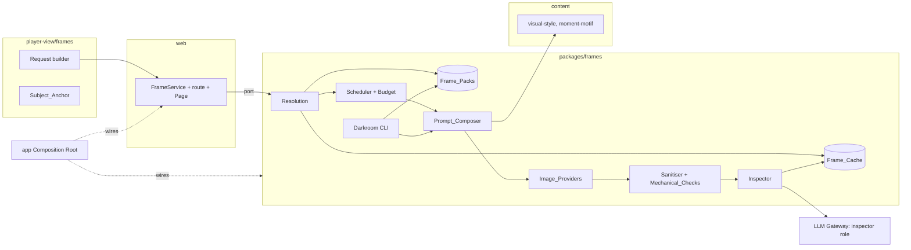

# Design Document

## Overview

Scene frames turn the web shell's empty Still-Frame Hook into a picture pipeline that cannot show the player anything the text does not already say. The rule is **a picture may show only what the player's text already says.** Everything else follows from it.

Five parts, each usable without the next:

1. **Requests (`player-view/frames`).** A pure builder makes a Frame Request from Player View data. It holds public descriptions and bands, an opaque Subject_Anchor for portraits, and no names, ids or typed text.
2. **Prompts (`frames/compose`).** A deterministic Prompt_Composer turns a request into a prompt from reviewed `visual-style` pack content. No language model writes an image prompt.
3. **Checks (`frames/sanitise`, `frames/inspect`).** Every picture is decoded and re-encoded, passes mechanical checks, and (in strict mode) passes a vision model's fixed checklist before it is stored or shown.
4. **Packs (`frames/packs`, `frames/darkroom`).** An offline Darkroom renders whole cities, filters candidates, and shows the rest on contact sheets. Pictures the owner approves become signed-off Frame_Packs. Most players only ever see pack pictures.
5. **Live rendering (`frames/live`).** Optional. It runs only in idle time, inside a measured memory budget, one job at a time, and never delays a turn.

### Key decisions

| Decision | Choice | Rationale |
|---|---|---|
| Where requests are built | `player-view/frames` | The package boundary makes truth unreachable. The current builder in `web` copies names into descriptors and gives batch and live frames different keys. Both defects go away. |
| Who writes prompts | A pure composer over pack phrase tables | Reproducible, lintable for anachronism, and no model can invent a detail. |
| What a scene shows | Place, time, weather, anonymous crowd | Scenes carry no individuals, so they can never contradict who the player has identified. |
| Portraits | One per Subject_Anchor, descriptor only, candid-photo framing | The picture says no more than the descriptor the player already has. Two unlinked handles never share a face. |
| Safety checks | Mechanical checks, then a vision Inspector with a fixed checklist, blind to the prompt | A pixel count catches blanks. Only a vision model catches an anachronism or a legible sign. |
| Image models in the live game | Optional, opt-in, memory-measured | The two-model rule (Slice Req 14.5) stays true for language models. An image model loads only when it fits. |
| Where most pictures come from | Frame_Packs made offline and signed off by the owner | Review happens once, off the player's machine. Licence status is recorded per picture. |
| Consistency | Shown_Frame is final for a request in a game | No flicker, same place looks the same after a reload. Different seeds give different variants. |
| Determinism | Frames are outside it entirely | No engine stream is drawn. Goldens and saves cannot change. |
| Rollout | `mode: off` by default; per-kind release gates; owner approval to enable | Matches the repo rule that new features ship off. |

### Dependencies and interface assumptions

- web-shell: the Frame Hook, `FrameService`, the frame route, `GET /api/frames/:key`, the Page script. Task 1.1 here moves the interface; web-shell tasks 8.1 and 8.2 are unticked and are absorbed.
- content-expansion: Content Kind Registry, Era Pack and City Packs, Anachronism Entries, Real-Person Blocklist, Sensitivity Terms, Provenance gate (Req 12, 16, 17).
- llm: the gateway's priority bands and the Model Manager's estimate check. Living-world adds `CallPriority.Background`; if it is not yet in, task 5.1 adds it in the same form.
- ambient-world (optional): Stories supply `press` events.
- living-world (optional): Texture_Ledger for Requirement 18.

## Architecture



### Package changes

- **`packages/player-view`**: new `frames/` with the Frame Request types, the builder, the Subject_Anchor and the `SceneFrameProvider` port (moved from `web`). `web` re-exports them.
- **`packages/frames`** (new): resolution, cache, packs, scheduler, budget, composer, providers, sanitiser, inspector, Darkroom CLI and report tools. Depends on `player-view` (types only), `content`, `llm` and `sharp` (decode and re-encode) .
- **`packages/web`**: `FrameService` keeps its public behaviour and now delegates to the port. The Page script gains picture display, the Pictures setting, the credits panel and the hide control. `web` does not import `frames`.
- **`packages/app`**: the Composition Root builds the `frames` pipeline from `config/frames.yaml` and passes it to `web` as the provider.
- **`packages/content`**: new kinds `visual-style` and `moment-motif`, and the `frame-notes` field on pack pictures.
- **`packages/llm`**: optional `inspector` role.
- **`.dependency-cruiser.cjs`**: `frames` may import `player-view` (types), `content` and `llm`. Nothing but `app` may import `frames`. `player-view` never imports `frames`. `engine`, `dialogue`, `living` and `tui` never import `frames`.
- **`config/frames.yaml`** (new, shipped with `mode: off`).
- **`docs/frames.md`** (new).

### Flow 1: entering a scene

1. The route builds a `scene` request with `player-view/frames` and reads its key. It answers the turn without waiting for a picture.
2. Resolution looks for the Shown_Frame, the Frame_Cache, an exact pack match, a fallback pack match, and finally (live mode, idle) a render.
3. On a hit, the server pushes a `frame` event and the Page fades the picture in, unless the player has already left the scene.
4. On a miss in live mode, the request joins the queue. It is rendered when the machine is idle, checked, cached and pushed the same way.

### Flow 2: a live render

1. Scheduler picks the next request by priority (current scene, then reachable Locations, then the rest) when an Idle_Window opens and the Frame_Budget check passed.
2. The Prompt_Composer builds a Frame_Prompt with the seed derived from the Frame Key, the Frame_Variant and the attempt number.
3. The provider renders. The Sanitiser decodes and re-encodes; Mechanical_Checks run.
4. The Inspector (background band) answers the checklist. A fail goes back to step 2 with the next attempt, up to the limit.
5. A pass is written to the Frame_Cache atomically and announced.

### Flow 3: the Darkroom

1. `frames plan --packs ...` enumerates every request for the loaded era and City Packs, using the same builder and composer as the game.
2. `frames render` runs candidates through the live path, with no scheduler, and writes accepted candidates to `frame-drafts/`.
3. `frames sheet` writes a Contact_Sheet per city. The owner picks, rejects and writes notes.
4. `frames promote` copies chosen pictures to a Frame_Pack with Frame_Provenance and reviewer stamp. `frames eval` produces the release report.

### Flow 4: first-time setup

`frames doctor` probes the provider, reports the model it uses, measures peak memory with one render, and writes the figure to `.cache/frames/machine.json`. The Frame_Budget check reads that file at game start.

## Components and Interfaces

### Frame Requests (`player-view/frames`)

```ts
export type FrameKind = 'scene' | 'title' | 'portrait' | 'press' | 'moment';

export interface FrameStyleRef {
  readonly era: string;            // e.g. 'era-cold-war-early'
  readonly city: string | null;    // City Pack id, null on the Core City
  readonly year: number;           // the Game Year as the Player View shows it
  readonly artOverride: string | null;
}

export interface FrameSubject {
  readonly anchor: string;         // opaque, from SubjectAnchor.derive
  readonly descriptor: string;     // the scene panel's descriptor, verbatim
}

export interface FrameRequestBody {
  readonly kind: FrameKind;
  readonly style: FrameStyleRef;
  readonly location: {
    readonly name: string; readonly type: string; readonly description: string;
    readonly atmosphere: readonly string[]; readonly districtTags: readonly string[];
  };
  readonly phase: string;
  readonly season: string;
  readonly weatherTags: readonly string[];
  readonly crowd: 'empty' | 'sparse' | 'busy' | 'packed';
  readonly subject?: FrameSubject;           // portrait only
  readonly event?: { readonly kind: string; readonly headline: string };  // press only
  readonly motif?: string;                   // moment only: the Moment_Motif id
  readonly details: readonly string[];       // Texture details, at most 4 (live only)
}

export interface FrameRequest extends FrameRequestBody { readonly key: string; }

export function buildSceneRequest(pv: FramePlayerView, style: FrameStyleRef): FrameRequest;
export function buildTitleRequest(pv: FramePlayerView, style: FrameStyleRef): FrameRequest;
export function buildPortraitRequest(pv: FramePlayerView, who: PersonHandle, style: FrameStyleRef): FrameRequest | undefined;
export function buildPressRequest(pv: FramePlayerView, story: StoryView, style: FrameStyleRef): FrameRequest | undefined;
export function buildMomentRequest(pv: FramePlayerView, action: ActionKind, style: FrameStyleRef): FrameRequest | undefined;
export function buildBatch(pv: FramePlayerView, style: FrameStyleRef): readonly FrameRequest[];
export function frameKey(body: FrameRequestBody): string;   // sha256 of canonical JSON
```

`FramePlayerView` is a read-only slice of the `EngineApi` views (scene, here, map, people, newspaper). The builder takes it, not the engine. `buildBatch` calls the same `buildSceneRequest` code path with the Location's phase, so batch and live keys match (Req 2.6).

`SubjectAnchor.derive(handle)` returns `sha256('anchor:' + gameSeed + ':' + handle)` truncated to 128 bits. `handle` is the first handle the player held. It is the `unk:` id if one was ever allocated. When the player identifies the person, the existing anchor is kept through a small map in the Shown_Frame record, so the portrait carries over (Req 15.3).

### Visual style (`content/kinds/visual-style`, `moment-motif`)

```ts
export interface VisualStyle {
  id: string;
  appliesTo: { era: string; city?: string };
  artDirection: string;                     // "1950s documentary photograph, black and white, 35mm grain"
  monochrome: boolean;
  negative: string[];
  phrases: {
    locationType: Record<string, string[]>;
    atmosphere: Record<string, string[]>;
    weather: Record<string, string[]>;
    phase: Record<string, string[]>;
    season: Record<string, string[]>;
    district: Record<string, string[]>;
    crowd: Record<string, string[]>;
  };
  portrait: { framing: string[]; sexAge: Record<string, string[]> };
  sizes: Record<FrameKind, { width: number; height: number }>;
}
export interface MomentMotif { id: string; action: string; phrases: string[]; }
```

Pack merge order is core, then era, then city. A city style refines the era style. The `core` fallback style is complete on its own, so any Content Set renders.

### Prompt composer (`frames/compose`)

```ts
export interface RenderProfile {
  provider: string; model: string; modelLicenceId: string;
  width: number; height: number; steps: number; sampler: string; cfg: number;
  tokenLimit: number; canEdit: boolean;
}
export interface FramePrompt { positive: string; negative: string; width: number; height: number; steps: number; cfg: number; seed: number; }
export const COMPOSER_VERSION = 1;
export function composePrompt(req: FrameRequest, style: VisualStyle, profile: RenderProfile, variant: number, attempt: number): FramePrompt | PromptRefusal;
```

Phrase order is fixed by priority: kind framing, place type, atmosphere, time, weather, season, district, crowd, art direction. Lower priorities drop first when the prompt would overflow `tokenLimit`. The seed is `fnv1a32(key + ':' + variant + ':' + attempt)`. The composer refuses a request whose assembled text contains a blocked term (Real-Person Blocklist, Sensitivity Terms, or any name the builder was handed), which cannot happen unless pack content is bad. The lint also catches it earlier.

### Depiction rules (`frames/depict`)

A per-kind table of `mayShow`, `mustNotShow`, `negativeTerms` and the Inspector checklist keys. Versioned with `COMPOSER_VERSION`. A test compares each table with the requirement text it implements.

### Providers (`frames/providers`)

```ts
export interface ImageProvider {
  readonly id: string;
  readonly capabilities: { edit: boolean; interrupt: boolean; release: boolean; reportsModel: boolean };
  probe(signal: AbortSignal): Promise<ProbeResult>;
  render(p: FramePrompt, signal: AbortSignal): Promise<RenderResult>;
  edit?(p: FramePrompt, reference: Uint8Array, strength: number, signal: AbortSignal): Promise<RenderResult>;
  release?(): Promise<void>;
}
export type RenderResult =
  | { ok: true; bytes: Uint8Array; model?: string }
  | { ok: false; error: 'timeout' | 'refused' | 'malformed' | 'unavailable' | 'aborted'; detail: string };
```

| Provider | Transport | Notes (checked 9 October 2026 against vendor docs) |
|---|---|---|
| Draw Things | `POST http://127.0.0.1:7860/sdapi/v1/txt2img` (A1111-style fields: `prompt`, `negative_prompt`, `steps`, `cfg_scale`, `width`, `height`, `seed`, `sampler_name`); the API server is enabled in the app's settings | Uses whichever model is selected in the app, so `reportsModel` is false and the Darkroom refuses it for pack work unless the owner records the model in `frames.yaml`. Dimensions are multiples of 64. One request at a time. |
| ComfyUI | `POST :8188/prompt` with a checked-in workflow template, then websocket progress or `GET /history/{id}` and `GET /view`; `POST /interrupt`; `POST /free` | Workflow JSON names the checkpoint, so the model is known. Supports edit workflows. |
| Ollama | `POST :11434/api/generate` for `x/flux2-klein` or `x/z-image-turbo`, base64 PNG in the response | Experimental on macOS. The request and response shapes are not fully documented, so the adapter is isolated and pinned by recorded fixtures. |
| mflux | Subprocess `mflux-generate-z-image-turbo` and relatives with `--prompt --width --height --seed --steps -q` | Cold-loads per call, so it suits the Darkroom, not live play. `capabilities.release` is true by construction. |

Contract suite: every provider passes the same tests against a fake server (success, timeout, malformed bytes, abort mid-job, connection refused). Each provider also has recorded responses from the Reference Machine, replayed in CI.

### Sanitiser and Mechanical_Checks (`frames/sanitise`)

```ts
export function sanitise(bytes: Uint8Array, profile: RenderProfile): SanitiseResult;   // pure
export function mechanical(img: DecodedImage, style: VisualStyle, kind: FrameKind): MechanicalResult;  // pure
```

`sanitise` uses a pixel limit, re-encodes to WebP at the profile size, and drops all metadata. `mechanical` checks luminance variance, black and white fractions, saturation (for monochrome styles) and a 64-bit perceptual hash against the accepted set.

### Inspector (`frames/inspect`)

```ts
export interface InspectionAnswer {
  legibleWriting: boolean; prominentFace: boolean; peopleCount: number;
  violence: boolean; nudity: boolean; weapon: boolean; flagOrInsignia: boolean;
  anachronism: 'none' | 'possible' | 'clear'; timeOfDay: string; weather: string;
  placeType: string; quality: number;   // 1–5
}
export function inspect(png: Uint8Array, kind: FrameKind, gateway: ImageChatPort, signal: AbortSignal): Promise<InspectionVerdict>;
```

The call goes through a new `ImageChatPort` that the Composition Root wires to the gateway's `inspector` role. The Inspector sees the picture, the kind and the checklist schema. It never sees the prompt. The verdict compares answers with the request (`timeOfDay` against `phase`, `placeType` against `location.type`) and the kind's thresholds.

### Resolution, cache and Shown_Frames (`frames/resolve`, `frames/cache`)

```ts
export interface FrameResolver {
  resolve(req: FrameRequest, game: GameFrameState): Promise<ResolvedFrame | undefined>;
}
export interface GameFrameState { seed: string; shown: ShownFrames; reports: FrameReports; }
```

Cache directory layout: `<dir>/<aa>/<sha256-of-cacheId>.webp` and `<dir>/<aa>/<id>.json` (bytes sha256, profile id, composer version, Inspector verdict, licence id). Writes go to a temp file and `rename`. `shown/<game-id>.json` records the Shown_Frame per request key. Eviction is least-recently-shown first, skipping games saved in the last 30 days.

`cacheId = sha256(requestKey + variant + COMPOSER_VERSION + profileIdentity)`. The request key already covers the style (including the art override), so a style change gives a new id.

Frame_Variant is `fnv1a32(gameSeed + ':' + requestKey) % variantsPerScene`.

### Frame_Packs (`frames/packs`, `content-tools/frames`)

```yaml
# frame-packs/<id>/manifest.yaml
id: vienna-1950
forPacks: [era-cold-war-early, city-vienna]
fallback: { locationToType: true, similarWeather: { rain: [drizzle], snow: [sleet] } }
pictures:
  - match: { kind: scene, location: loc:vienna/cafe-central, phase: morning, weather: [clear], season: autumn, crowd: busy, variant: 0 }
    file: scene/cafe-central-morning-0.webp
    sha256: "…"
    notes: "Marble tables, a waiter with a tray, steamed windows."
    provenance: { model: z-image-turbo, licence: apache-2.0, provider: draw-things, profile: zit-1024, promptHash: "…", seed: 1234, generatedAt: "…", inspector: { quality: 4, anachronism: none }, reviewedBy: "owner", reviewedAt: "…" }
```

The loader verifies every hash, requires `reviewedBy`, `reviewedAt` and a licence marked shippable in the Model_Licence_Registry (`config/image-model-licences.yaml`, committed), checks `forPacks` against the loaded packs, and refuses a manifest whose fallback rules cross a city or era.

### Scheduler and budget (`frames/live`)

```ts
export interface FrameBudget { check(): BudgetVerdict; }       // reads machine.json and the Model Manager estimate
export interface FrameScheduler {
  enqueue(req: FrameRequest, priority: 0 | 1 | 2): void;
  setIdle(idle: boolean): void;
  abortCurrent(): void;
  stop(reason: string): void;
}
```

Idle is derived from the gateway's queue depth (no player job running or queued) and the pipeline's turn state. A player call arriving mid-render calls `abortCurrent`. Memory pressure comes from a periodic read of `vm_stat`-style data through a `MemoryProbe` port, with a fake in tests.

### Press Photos and Moments (`frames/kinds`)

`buildPressRequest` takes only a story's public fields. The Page shows the headline as caption; no model writes it. `buildMomentRequest` takes the action kind from the committed turn record (not the outcome) and picks a `moment-motif` for it. Moments have no face by construction (the motif has no portrait phrases).

### Web changes (`web`)

`FrameService` becomes a thin adapter around a `FrameProvider` port: `lookup(req)` (cache and pack only, instant), `request(req)` (may queue a render), `prepare(batch, onProgress)`. The existing route `/api/frames/:key` serves by cache id. New routes: `POST /api/frames/:key/report` (hide this picture), `GET /api/frames/credits`, `GET/POST /api/frames/settings`. The Page script renders the frame, the Pictures setting, the credits panel and the hide control, and gives portraits and Press_Photos their `alt`.

### Darkroom CLI (`frames/darkroom`)

Commands: `frames doctor`, `frames plan`, `frames render`, `frames sheet`, `frames promote`, `frames eval`, `frames licences`. All are resumable through a `plan.json` and a `done.jsonl`.

### Living-world bridge (`frames/living`)

A small adapter implementing living-world's `TextureSource` port: for a Location with a Shown_Frame from a pack it returns the Frame_Notes. It reads the Texture_Ledger for live requests, never writes it.

## Data Models

### `config/frames.yaml`

```yaml
frames:
  mode: off                  # off | packs | live
  quality: strict            # strict | standard
  kinds: { scene: false, title: false, portrait: false, press: false, moment: false }
  variantsPerScene: 3
  provider:
    id: draw-things          # draw-things | comfyui | ollama | mflux
    url: http://127.0.0.1:7860
    timeoutMs: 120000
    model: null              # required when the provider cannot report it
  profile: { width: 1024, height: 640, steps: 8, cfg: 1.0, sampler: null, format: webp }
  thresholds: { scene: 3, title: 3, portrait: 3, press: 3, moment: 3 }
  maxAttempts: 3
  budget: { headroomBytes: 4294967296, releaseAfterBatch: true }
  cache: { dir: .cache/frames, maxBytes: 4294967296 }
  packs: [frame-packs/vienna-1950]
  artOverride: null
```

The file is validated with Zod, strict objects, no defaults for `mode` (so a missing key is an error, not a silent choice).

### Models additions

`models.yaml` profiles may name an `inspector` role. Default: the `judge` model when LM Studio reports it as image-capable. Candidate models in the current profiles are the Qwen 3.6 35B-A3B MoE, which its model card lists as vision-capable. Whether the Gemma 4 31B profile accepts images in LM Studio is not confirmed from the sources found, so `frames doctor` tests it with a sample picture and reports the result.

### New content kinds

`visual-style` and `moment-motif`, registered with Field Declarations. Lint rules: Anachronism, Real-Person Blocklist, Sensitivity, Provenance (cannot be suppressed); and "phrase coverage" (Req 4.5).

### Shown_Frames record

`{ gameId, entries: { [requestKey]: { cacheId, shownAt } }, anchors: { [anchor]: string } }`, stored in `shown/<game-id>.json` next to the cache.

## Correctness Properties

### Property 1: Request truth isolation
For any generated world and any Player View state, every Frame Request contains no entity id, no persona name, no alias and no Truth-branded value, and contains no text the player typed.
**Validates: Requirements 2.1, 2.2, 20.1, 20.2**

### Property 2: Request determinism and key agreement
For any Player View state, building a request twice yields identical requests and keys, and the batch request for a Location at the current phase, weather and crowd has the same key as the live request for it.
**Validates: Requirements 2.6, 2.9**

### Property 3: Scenes hold no individuals
For any Player View state, a `scene` request has no subject, and its content does not vary with who is present beyond the crowd band.
**Validates: Requirements 2.3, 3.2**

### Property 4: Portrait descriptor only
For any Player View state and any person, a portrait request's text fields equal the descriptor the scene panel shows for that person, and a person identified by name has the same request as before identification.
**Validates: Requirements 2.4, 2.8, 15.1, 15.3**

### Property 5: Subject_Anchor separation
For any two handles the player has not linked, their anchors differ; for any one person, the anchor is unchanged by identification.
**Validates: Requirements 2.5, 15.3, 15.5**

### Property 6: Composer purity and phrase provenance
For any request, style and profile, composing twice yields the same prompt, and every phrase in the prompt is one of the style's phrases, the request's public text fields or the kind's Depiction_Rules terms.
**Validates: Requirements 5.1, 5.2, 5.5**

### Property 7: Blocked terms never reach a provider
For any request, style (including hostile ones with blocked terms in phrases) and profile, a prompt containing a blocked term or a name is refused and never passed to a provider.
**Validates: Requirements 3.5, 5.6**

### Property 8: Prompts fit the model
For any request and any token limit, the composed prompt fits the limit, drops phrases only in priority order, and never cuts a phrase.
**Validates: Requirements 5.4**

### Property 9: Sanitiser output is clean
For any byte string, the Sanitiser either rejects it or returns an image of the profile's size and format with no metadata, and a decompression-bomb input is rejected before full decode.
**Validates: Requirements 7.1, 7.2, 7.5, 20.3**

### Property 10: Mechanical checks
For any image, near-uniform, near-black, near-white, off-palette (for monochrome styles) and near-duplicate images are rejected, and the result depends only on the bytes and the profile.
**Validates: Requirements 7.3, 7.4, 7.6**

### Property 11: No unchecked picture in strict mode
For any sequence of provider outputs and Inspector verdicts, in strict mode a picture is shown only if it passed the Mechanical_Checks and the Inspector's hard checks and threshold; after the maximum attempts, no picture is shown for that request.
**Validates: Requirements 8.3, 8.4, 8.5**

### Property 12: Inspector blindness
For any request, the Inspector's input contains the picture, the kind and the checklist and nothing from the prompt.
**Validates: Requirements 8.7**

### Property 13: Frames are inert
For any provider, including one that throws, hangs or returns garbage, every response to a state-changing request and the final world-state hash are identical to those with the null provider, and no frame draw touches an engine PRNG stream.
**Validates: Requirements 1.8, 9.7, 20.3**

### Property 14: Disabled is inert
For any session with `frames.mode` off or a kind disabled, no request of that kind is built, no provider starts, and responses equal those without this spec.
**Validates: Requirements 1.1, 1.3, 1.4**

### Property 15: Resolution order and determinism
For any request, installed packs, cache and reports, resolution returns the first hit in the stated order, and the same inputs give the same result.
**Validates: Requirements 10.1, 10.6**

### Property 16: Shown frames are final
For any game and any request key, once a picture has been shown, every later resolution of that key in the same game, including after a restart, returns the same picture, while different seeds usually choose different variants.
**Validates: Requirements 10.4, 10.5**

### Property 17: Cache integrity
For any cache state with corrupted, truncated or mismatched entries, resolution never returns a corrupt picture, discards the bad entry, and an interrupted write leaves no valid-looking partial entry.
**Validates: Requirements 11.1, 11.2, 11.5**

### Property 18: Cache bound and protection
For any sequence of insertions, the cache stays under its byte limit, evicts the least recently shown first, and never evicts a recent game's Shown_Frame.
**Validates: Requirements 11.3**

### Property 19: Key covers inputs
For any change to the style, art override, composer version, profile identity, Frame_Variant or any request field, the cache id changes.
**Validates: Requirements 4.7, 5.7, 11.1**

### Property 20: Pack loader refusals
For any manifest with a bad hash, a missing reviewer, an unshippable or unknown licence, a `forPacks` mismatch or a fallback that crosses a city or era, the loader refuses the affected picture, and a valid picture is never refused.
**Validates: Requirements 12.2, 12.3, 12.4, 12.5**

### Property 21: Scheduler never blocks the player
For any interleaving of player calls and render jobs, no player call waits behind a render beyond one abort, at most one render runs at a time, and the queue order is current scene, then reachable Locations, then the rest.
**Validates: Requirements 9.3, 9.4, 9.7**

### Property 22: Budget gate
For any measured peak, headroom and available memory, live rendering starts only when peak plus headroom fits, never without a measurement, and stops for the session on a pressure signal.
**Validates: Requirements 9.2, 9.6**

### Property 23: Provider containment
For any provider failure mode, the failure is returned as a typed error, no exception escapes the frame service, and no connection is made to a non-loopback address.
**Validates: Requirements 6.3, 6.5, 20.5**

### Property 24: Darkroom never promotes unreviewed pictures
For any run, no file reaches a Frame_Pack except through `promote` on an owner-chosen candidate; drafts carry no reviewer, and a run with an unshippable model or an unreported model is refused.
**Validates: Requirements 13.3, 13.5, 13.6**

### Property 25: Darkroom resumes
For any interruption point, a resumed run produces the same set of candidates as an uninterrupted run.
**Validates: Requirements 13.7**

### Property 26: Press and Moment inputs are public
For any story and any committed action, a `press` or `moment` request is a function of the story's public fields or the action kind alone, and does not vary with the action's outcome.
**Validates: Requirements 16.1, 16.2, 16.4**

### Property 27: Hidden pictures stay hidden
For any Frame_Report, the reported picture is never resolved again on this machine, and resolution of the same request falls through to the next source.
**Validates: Requirements 17.3**

### Property 28: Visual style coverage
For any loaded packs, the lint reports every Location Type, atmosphere tag, weather tag or district tag that has no phrase in the effective style, and a style with a blocked or anachronistic phrase fails the lint.
**Validates: Requirements 4.4, 4.5**

### Property 29: Texture isolation
For any live render, the Texture_Ledger is unchanged, and the details in a request are a subset of the ledger's released details for that Location.
**Validates: Requirements 18.2, 18.3**

## Error Handling

| Failure | Behaviour |
|---|---|
| `config/frames.yaml` missing | `mode: off`. No message. |
| Config invalid | Launcher refuses to start frames with `<file>: <path>: <message>`. The game starts with frames off. |
| Provider missing or wrong port | One setup message at start. The game continues in `packs` mode. |
| Provider timeout, refusal, bad bytes | Typed error. Request marked failed for this session. Never retried in a loop. |
| Sanitiser or Mechanical_Checks reject | Next attempt, then give up for this request. |
| Inspector unavailable | Strict mode shows no live pictures. Standard mode shows them marked unchecked. |
| Budget does not fit or no measurement | Live off for the session, with a reason on the settings panel. |
| Memory pressure | Live stops for the session. |
| Cache entry corrupt | Entry discarded, treated as missing. |
| Pack picture fails verification | That picture is skipped. Others load. A summary is logged once. |
| Request builder cannot build (for example no `unk:` id yet) | No request. No error shown. |
| Picture arrives after the player has left | Cached, not shown. |

Nothing above reaches the turn pipeline.

## Testing Strategy

- **Property tests** (fast-check) for Properties 1–29. Properties 1–5 run over generated worlds and scripted games. Property 7 uses a hostile style generator. Properties 9–10 use generated and adversarial byte strings. Properties 13 and 23 use a hostile provider.
- **Contract tests** for every provider against a fake server, and replay of recorded responses.
- **Golden tests**: golden replays, the calibration sample and the web-shell parity test run unchanged with frames off and with a fake provider on.
- **Composer snapshots**: one snapshot per kind per shipped style, reviewed in the PR.
- **Inspector fixtures**: a small committed set of pictures with known problems (text, a flag, a face, a modern car) and expected answers, run only with a live model on the Reference Machine as an owner run. CI uses a fake `ImageChatPort`.
- **Dependency check.** `pnpm dep-cruise` fails on a forbidden import.
- **Page tests**: picture shown after text, no reserved space on none, reduced-motion, hide control, credits panel, `alt` text.
- **Owner runs** (not in CI): `frames doctor`, the Darkroom, the blind review and the two-hour live session on the Reference Machine.
- **No live model in CI.** Everything runs on fakes.
