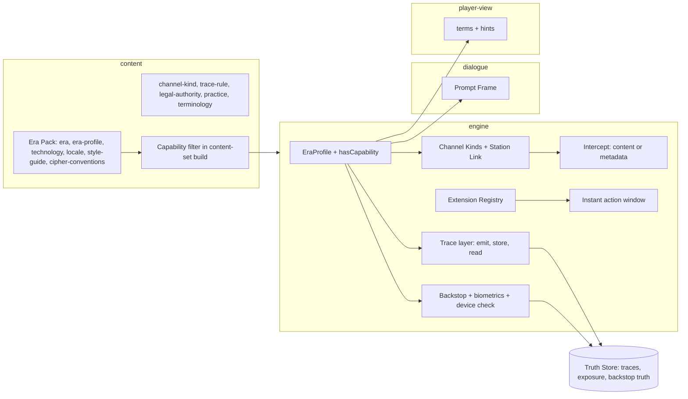

# Design Document

## Overview

Setting generalization lets the game be set in 2020 as well as 1945–1965. The year itself is the easy part: Era Packs already declare a Period Window and year-ranged content is already filtered against it. What breaks in a modern setting is the set of mechanics that quietly assume a Cold War world. Reading the code and specs, those are:

- **Communications.** Four Channel kinds (radio, numbers broadcast, courier, dead drop), a Cable to the Station and a Cipher Engine whose output the player breaks by hand on a Workbench. Modern strong encryption cannot be broken that way.
- **Surveillance and detection.** Watchers sit at places. A modern service reads phone location, payments, cameras and plate readers.
- **Cover.** A Cover Identity and Papers. In 2020 a legend needs an online history and has to pass a biometric match.
- **Time.** Every action costs a phase or more (Slice Req 3.1), which does not fit an instant message.
- **Prompts.** The Intent Classifier's system prompt says "a Cold War spy game" and the Narrator's says "a Cold War espionage drama" (`dialogue/intent/classifier.ts`, `dialogue/live/live-seams.ts`).
- **Defaults.** The Core City falls back to a start date of 1 January 1950 (`engine/setting/setting.ts`).

The design replaces all of those assumptions with one data-declared concept and leaves everything else alone.

1. **Era Profile.** A profile names the **Capabilities** that are active, the terminology, the prompt frame, the start-date default, the communications parameters and the content rules. The existing setting becomes the **Cold War Profile**. If an Era Pack names no profile, the loader uses a built-in constant that reproduces today's behaviour exactly. The Cold War Profile is therefore not "migrated". It is the identity.
2. **Mechanics test capabilities, never years.** `hasCapability(profile, 'cctv')` replaces any year comparison. Content that needs a capability is filtered out when the profile lacks it.
3. **Opaque is a property of a channel, and it changes what an Intercept yields.** An opaque channel produces metadata, and content is reachable only through the endpoint, a human source or operator error. The Workbench is unchanged and active for non-opaque channels.
4. **A Digital Trace layer is data-driven and inert in the Cold War.** Trace rules map actions to Trace Sources. Services read traces within their Legal Authority. Both use content, and neither draws randomness when no rules are loaded.
5. **Everything the player sees is truth-safe.** Traces, Trace Exposure, Backstop quality and what a Service has read live in the Truth Store. The player gets qualitative hints. The debrief reveals the rest.

### Key decisions

| Decision | Choice | Rationale |
|---|---|---|
| Era model | An `era-profile` content kind plus a built-in Cold War constant | The loader needs no profile in old packs. The constant guarantees byte-identical Cold War behaviour |
| Capability set | A closed enumeration in code, activated by name in data | Mechanics can be exhaustive over it. A typo in a profile fails validation |
| Gating | Content `requires` plus `hasCapability` in engine code | Two enforcement points: the loader removes unavailable content, the engine skips unavailable mechanics |
| Cold War prompts | Prompt Frame text for the Cold War Profile equals the current literals | The LLM recording and replay layer keys on request hashes. Changing a prompt would invalidate every recording |
| Opaque channels | Metadata Intercepts instead of ciphertext | Honest to the setting, and keeps the Workbench meaningful for the channels where it still applies |
| Instant actions | A profile-declared per-phase allowance, using the sub-phase mechanism of the Extension Registry | One mechanism for street-ops steps and instant messages. Default zero |
| Trace rules | Content (`trace-rule` kind), evaluated in a post-resolve hook | No edits to every action resolver. Data-driven. Easy to turn off |
| Services reading traces | A day-boundary hook, from content-defined Legal Authority | Reuses the slice's belief mechanism, so there is no parallel AI |
| Real-world safety | Fictional brands, platforms, agencies and people. Abstract game practices, not instructions | The same rule as the existing packs, extended to a setting full of real brands |
| Mixed eras | Not supported. One profile per game | Requirement 1.5. Avoids a large class of cross-era rules |

## Architecture



### Package changes

- **`content`**: new kinds `era-profile`, `channel-kind`, `trace-rule`, `legal-authority`, `practice` and `terminology` (the last may live inside the profile). Optional fields on existing kinds: `requires: Capability[]` on Channel, action-related content, Location Type, Technology Item and Travel Document kinds; `until` on Technology Item; `backstop` and `biometric` on Cover Identity; `surveillance:cctv` Tag in the Tag Vocabulary. The `capabilityFilter` joins `yearFilter` in `content-set-build`.
- **`engine/era`** (new): `Capability`, `EraProfile`, `hasCapability`, the built-in `COLD_WAR_PROFILE`, and the profile resolver.
- **`engine/comms`** (changed): Channel becomes data-driven by `ChannelKind`. The existing four kinds are built-in definitions with today's numbers.
- **`engine/trace`** (new): the Trace Store, emission hook, read function and practices.
- **`engine/cover`** (small additions): Backstop and biometric checks.
- **`engine/action/cable`** (changed): the Station Link and the instant window.
- **`engine/setting`** (changed): the default start date comes from the profile.
- **`engine/extension`**: **not new here.** The Extension Registry is specified in the street-ops design (`engine/extension`). Whichever of the two specs is built first builds it. Because setting-generalization comes first in the proposed order, its task list includes building the registry, and street-ops then consumes it.
- **`dialogue`**: the Intent Classifier, Narrator and `voice` prompts take their setting line from the Prompt Frame.
- **`player-view`**: `GameView` gains `era` (id) and `terms`; hints for Trace Exposure; no truth.
- **`tui`**, **`web`**: render terms through the map.
- **`content-tools`**: lint rules for capability gating, anachronism in both directions, and the contemporary content rules.

## Components and Interfaces

### Capabilities and Era Profile (`engine/era`)

```ts
export const CAPABILITIES = [
  // communications
  'cable', 'radio-intercept', 'numbers-broadcast', 'courier', 'dead-drop-physical', 'book-cipher',
  'secure-messaging', 'phone-call', 'email', 'dead-drop-digital',
  // identity and travel
  'paper-papers', 'electronic-travel-docs', 'biometric-borders', 'device-inspection', 'internet-open-source',
  // surveillance and tracking
  'physical-surveillance', 'cctv', 'alpr', 'geolocation-tracking', 'payment-trace', 'mobile-phone',
  'navigation-aid',
] as const;
export type Capability = (typeof CAPABILITIES)[number];

export interface EraProfile {
  readonly id: string;                                   // 'cold-war', 'contemporary-2020'
  readonly capabilities: ReadonlySet<Capability>;
  readonly startDate: { readonly from: IsoDate; readonly to: IsoDate; readonly default: IsoDate };
  readonly terms: Readonly<Record<TermKey, string>>;
  readonly promptFrame: PromptFrame;
  readonly link: StationLinkParams;
  readonly instant: { readonly perPhase: number; readonly kinds: readonly ActionKind[] };
  readonly contentRules: ContentRuleSet;                 // lint and runtime guards
}

export const COLD_WAR_PROFILE: EraProfile;                // exactly today's behaviour
export function hasCapability(p: EraProfile, c: Capability): boolean;
export function resolveEraProfile(content: ContentSet): EraProfile;   // pack's named profile, or COLD_WAR_PROFILE
```

- The Cold War Profile activates `cable`, `radio-intercept`, `numbers-broadcast`, `courier`, `dead-drop-physical`, `book-cipher`, `paper-papers` and `physical-surveillance`. These are the capabilities the slice and the earlier follow-on specs assume, and the first task of this spec is an audit that confirms the list against the code.
- The Contemporary Profile activates `secure-messaging`, `phone-call`, `email`, `dead-drop-digital`, `courier`, `dead-drop-physical`, `electronic-travel-docs`, `biometric-borders`, `device-inspection`, `internet-open-source`, `physical-surveillance`, `cctv`, `alpr`, `geolocation-tracking`, `payment-trace`, `mobile-phone` and `navigation-aid`.
- `resolveEraProfile` reads the loaded Era Pack's `eraProfile` id and finds the `era-profile` record. A pack with no `eraProfile`, or only the core pack, resolves to `COLD_WAR_PROFILE`. Two Era Packs (Requirement 1.5) must resolve to the same profile id or loading fails.
- `WorldState.meta.eraProfile` records the id. A save without it migrates to `cold-war`. The Content Manifest includes it, so a save under a different profile is refused.

### Capability gating

1. **Content.** `capabilityFilter(content, profile)` runs with the year filter. A content item whose `requires` is not a subset of `profile.capabilities` is excluded from the Content Set. The Pack Linter reports each exclusion at `info` level in the `draft` profile.
2. **Tag minimums.** After filtering, Tag Conformance (content-expansion Req 4.5) is checked. A mandatory Required Query with too few Binders left makes the loader refuse to start and name the shortfall.
3. **Engine.** Each capability-dependent mechanism calls `hasCapability`. A repository lint rule bans comparisons of the Game Year (`startDate`, `time.year`) in `engine/` outside `setting`, so that a year check cannot creep back.
4. **Plot generation.** The generator filters Plot templates whose stages require an unavailable capability, through the same `requires` field (plot-library templates gain it).

### Channels and the Station Link (`engine/comms`, `engine/action/cable`)

```ts
interface ChannelKind {
  readonly id: string;                         // 'radio', 'numbers', 'courier', 'dead-drop', 'secure-messaging', …
  readonly requires: readonly Capability[];
  readonly latencyPhases: number;
  readonly opacity: 'plain' | 'weak' | 'opaque';          // what an Intercept can yield
  readonly interceptable: 'content' | 'metadata' | 'none';
  readonly traceSource?: TraceSourceId;
  readonly schedule: 'broadcast' | 'on-demand' | 'scheduled-drop';
}
interface StationLinkParams {
  readonly requestDelayPhases: number; readonly replyDelayPhases: number;
  readonly traceSource?: TraceSourceId; readonly interceptable: boolean;
}
```

- `radio`, `numbers`, `courier` and `dead-drop` are built-in `ChannelKind`s with today's parameters (opacity `plain` or `weak` as the cipher tier dictates), so Cold War behaviour is unchanged.
- The Contemporary Profile's kinds come from `channel-kind` content: `secure-messaging` (opaque, metadata interceptable, trace source `mobile-network`), `phone-call` (opaque or weak by configuration, metadata), `email` (weak, content interceptable by a service with authority), `dead-drop-digital` (opaque, no metadata except at access, trace source `online-account`).
- The **Station Link** is the `cable` action under a profile-dependent parameter set. Cold War: `requestDelayPhases` and `replyDelayPhases` as today. Contemporary: both 0, with the instant window deciding whether the action costs a phase (below). The action kind id `cable` and its sub-kinds (`trace`, `funds`, `report`) stay, so saves, logs and the natural-language Phrasebook are unaffected. The player-facing word comes from the Terminology Map.

### Intercepts and the Workbench (`engine/cipher`)

The Intercept record gains a variant:

```ts
type Intercept =
  | { kind: 'content'; /* existing fields: channel, ciphertext, spec ref, metadata */ }
  | { kind: 'metadata'; channel: ChannelId; parties: readonly EntityRef[]; at: GameTime; sizeBand: SizeBand; where?: LocId };
```

- `interceptAtStation` (existing) generates content Intercepts for non-opaque channels exactly as today and **metadata Intercepts** for opaque ones whose `interceptable` is `metadata`. Opaque channels with `interceptable: 'none'` yield nothing.
- A metadata Intercept never opens the Workbench. It is a Case File observation (who talked to whom, when) filed with the slice's observation source, so it can corroborate or contradict other claims.
- **Content paths for opaque channels.** Three are modelled:
  1. **Endpoint compromise.** The player seizes or clones a device. A new action `device-read` (registered through the Extension Registry, requires `device-inspection`) quotes cost and risk, resolves from the target's opsec and the Location, leaves a Trace, and yields plaintext Propositions as Document-like content (a "device extraction" Document kind).
  2. **A human source.** The existing recruitment and dialogue paths.
  3. **Operator error.** The Sim sometimes lets a Hostile Service or an NPC send content over a weaker channel (a drawn event, keyed as the existing noise draws are), which the slice's generator marks as a Plot Stage's secondary discovery path.
- The Cipher Engine is unchanged. Cold War: all existing tests pass unchanged. Contemporary: the Workbench applies to non-opaque channels, including hand-enciphered paper notes and legacy codes, which a Contemporary scenario can still use.

### Digital Trace layer (`engine/trace`)

```ts
type TraceSourceId = 'mobile-network' | 'payment' | 'camera' | 'plate-reader' | 'border-system' | 'travel-booking' | 'online-account';

interface Trace {
  readonly id: TraceId;
  readonly source: TraceSourceId;
  readonly actor: EntityId;            // the player or an NPC
  readonly at: GameTime;
  readonly loc?: LocId;
  readonly kind: string;               // 'ping', 'purchase', 'sighting', 'plate-hit', 'crossing', 'booking', 'login'
  readonly ref?: EntityId | string;    // counterpart (a number called), merchant, plate
  readonly expiresDay: number;         // at + retention window
}

interface TraceRule {                  // content kind `trace-rule`
  readonly id: string;
  readonly requires: readonly Capability[];
  readonly on: { readonly action: ActionKind; readonly locationTag?: TagId; readonly channel?: string; readonly actor?: 'player' | 'npc' | 'any' };
  readonly source: TraceSourceId;
  readonly kind: string;
  readonly suppressedBy: readonly PracticeId[];
}
```

- **Emission.** The Turn Pipeline gains a post-resolve hook `emitTraces(state, action, result)`. It evaluates the loaded Trace Rules against the action, the Location tags and the player's current Practices, and appends Traces to `Truth.ext.trace`. NPC movement traces are emitted by the day-boundary hooks from the NPC schedule for the sampled Trace Sources (a bounded sample, not every NPC every phase: the Sim emits traces only for NPCs a Service is currently interested in, to keep the budget).
- **Retention.** Each Source has a retention window from its Trace Source definition (content). Expired Traces are dropped at the day boundary.
- **Practices.** `practice` content: `{ id, label, requires, suppresses: TraceSourceId[], cost: { money?, phases?, access? }, side: { anomaly?: AnomalyKind } }`. Examples (game abstractions): phone off, phone left behind, cash, burner, clean device. The player toggles a Practice with an instant `practice-set` action. A Practice that suppresses a Source stops the matching rule from emitting, but may add an **Anomaly Trace** (a gap in an otherwise regular pattern, a cash purchase where the card is usual) that a Service can notice. This is how "going dark" has a cost, and it is data.
- **Legal Authority.** `legal-authority` content, referenced by a Service Definition: `{ service, sources: TraceSourceId[], retentionDays: Record<TraceSourceId, number>, requires: { suspicionAtLeast: number }, cadenceDays: number, scope: 'domestic' | 'foreign' | 'liaison-only' }`.
- **Reading.** A day-boundary hook `serviceReadsTraces` runs for each Service with traces and an authority. For each target the Service suspects above the authority's threshold, it computes pure belief deltas:

```ts
function readTraces(store: TraceStore, service: ServiceState, authority: LegalAuthority, targets: readonly EntityId[], day: number, preset: DifficultyPreset): BeliefDeltas;
```

  Deltas come from joins over Traces in the retention window: co-location of the player's phone with a known Asset's, repeated visits, gaps, an entry at a camera-covered Location, a border crossing that contradicts the cover story. Each rule has a content weight. The result feeds the slice's belief functions (Cover Suspicion, Exposure, Watch List). No draw is needed except to order ties, which use the stream `trace` keyed `(day, serviceId, targetId)`.
- **Trace Exposure.** `Truth.ext.trace.exposure` is the sum of weights of Traces that a Service with authority could read. It is hidden. The Player View shows only hint text from a `trace-hint` content kind keyed by the player's own Practices and recent actions ("your phone has been with you all day", "you paid by card at the café"), never by what a Service has read.
- **Debrief.** Reveals each read, by whom, and what it led to.
- **Cold War.** There are no Trace Rules and no Trace Sources, so the hook is a no-op and draws nothing.

### Identity, cover and the border (`engine/cover`, multi-city `border`)

- **Backstop.** `CoverIdentity.backstop: 0..3` (optional; absent means 0 and means "no online history needed" when `internet-open-source` is inactive). An `osintCheck` is a pure function of `(backstop, identityAgeDays, service.reach, preset)` returning a suspicion delta. It is monotone: a higher Backstop never raises the suspicion it returns. It runs when a Service first meets a new identity (a contact, a booking, a border crossing).
- **Raising the Backstop.** A Station request (`cable` kind `papers` in multi-city, extended with `backstop`) with a delay and cost. The Player View shows the Backstop as a band.
- **Biometrics.** `CoverIdentity.biometric: 'enrolled' | 'real' | 'none'`. Where `biometric-borders` is active, `borderCheck` compares the traveller's true biometric enrollment with the identity on the Papers. A mismatch returns secondary inspection or detention. `enrolled` means HQ enrolled the cover's biometrics (a Station request with delay and cost). `real` means the traveller is using their own identity and so matches. The traveller's true enrollment is Truth.
- **Device inspection.** Where `device-inspection` is active, a secondary inspection at a strictness above a content threshold reads the carried device: it exposes message traces on a device not wiped and not clean (a Practice). The Border Outcome Fact Line stays templated.
- **Electronic Travel Documents.** `travel-document-kind` records in multi-city with `requires: ['electronic-travel-docs']` (e-passport, electronic travel authorisation, electronic visa) replace paper kinds in the Contemporary content. The validity rules are those of multi-city Requirement 4.
- **Cold War.** None of this is active. `borderCheck` runs as it does today.

### Surveillance and tracking

- **Surveillance Methods** (street-ops kind) carry `requires`. The Contemporary Profile ships physical, GPS tracker, plate-reader and camera methods. The Cold War ships physical and radio-car.
- **Cameras.** Locations get the Tag `surveillance:cctv` (added to the Tag Vocabulary). A person entering such a Location emits a `camera` Trace via the Trace Rules.
- **Plate readers.** Street Segments gain an optional `alpr: boolean`. A Vehicle on such a Segment emits a `plate-reader` Trace. A plate on a Watch List raises an alert for the Controlling Service.
- **Trackers.** A Service with `geolocation-tracking` authority may place a tracker on a Vehicle or locate a phone, resolved from its Legal Authority and the player's Practices. The player finds a tracker only through a `sweep` action with a quoted cost. A sweep that finds nothing says "nothing found" and never "none present".

### Terminology Map and Prompt Frame

```ts
interface PromptFrame { readonly setting: string; readonly genre: string; readonly period: string }
```

- The Intent Classifier's first line becomes `You classify a single line of a player's dialogue in ${frame.genre} into exactly one intent category…`. The Narrator and `voice` prompts take `frame.setting` and `frame.period` the same way.
- **Cold War frame text equals the current strings byte for byte.** A snapshot test fixes every static prompt under the Cold War Profile, because the recording and replay Gateway hashes requests and a changed prompt would break every recording.
- `terms` maps a `TermKey` (such as `cable`, `station`, `dead-drop`) to the player-facing term. `GameView.terms` carries the map, and the TUI and Web Shell render through it. Missing keys fall back to the existing English text.

### Instant actions (`engine/extension`, `engine/action`)

- `EraProfile.instant = { perPhase, kinds }`. For Cold War, `perPhase: 0`.
- State: `ext.instant: { phaseKey: string; used: number }`, reset when the phase changes.
- Built-in kinds listed in `instant.kinds` (initially `cable` messages and `practice-set`) quote `phases: 0` while `used < perPhase`, otherwise `phases: 1`. The Turn Pipeline accepts a zero-phase result only for those kinds and only while the allowance lasts, using the same sub-phase rule as street-ops steps. A zero-phase action still runs the full Turn Transaction, so every Trace it emits is recorded and replay is unchanged.
- This amends Slice Req 3.1 only for profiles that declare a non-zero allowance.

### Settings, start date and the Core City

`CORE_CITY_DEFAULT_START_DATE` is removed from `setting.ts`. The default comes from `profile.startDate.default` (`1950-01-01` for the Cold War). A Contemporary scenario draws its Start Date from `profile.startDate.from..to` (the year 2020 by default), restricted by the Era Pack's Period Window as content-expansion Req 9.2 already requires. The setting draw stays on the Setting Stream and takes the same inputs as today, so Cold War seeds draw the same dates.

### Content rules and quality gates

- **Anachronism.** Technology Items gain `until?: number` (last year of ordinary use). The linter's existing `CE-ANACH` rule flags a document that names an item before `introduced`. A new rule flags one that names it after `until`, unless the document context is marked historical. In Cold War content a modern term (smartphone, text message) already fails `CE-ANACH` because its `introduced` year is after 1965. In Contemporary content a period term (telegram, typewriter, ration card) fails the new rule unless allow-listed.
- **Real persons, brands and organisations.** The Contemporary Profile's Real-Person Blocklist is category-level: no real person appears at all, and the linter checks names against a maintained list of public figures. A `real-brand` list blocks trademarks, platforms, parties, candidates and real agencies by name. Content uses fictional equivalents.
- **Sensitivity.** The Sensitivity Term List is extended for contemporary terms.
- **Style Guide.** Contemporary Fact Line and Document templates for messages, email, call records and device extractions.
- **Practices are abstractions.** A Practice is a game concept with a cost and an effect on Trace Sources. The content states no real-world procedure, tool name or technique. This keeps the setting a fiction and not a manual.

### Multi-city integration

| multi-city element | Contemporary behaviour |
|---|---|
| Region Template | Names the Contemporary Profile. All Cities share one Game Year |
| Air Travel Mode | Booking Trace (`travel-booking`), electronic Travel Documents, check-in at an airport Terminal Location |
| Border Check | Biometric match and device inspection per Backstop and biometric rules |
| Cable and Courier Lines | Station Link and Channel Kinds above |
| Regional Station and Outstations | The Station Link is near-instant. Outstation delay is a Preset value |
| Services and Liaison | Legal Authority per Service, with `scope` limiting cross-border reads. Liaison sharing of traces follows the liaison mechanism of multi-city Requirement 7 |
| Sector Lines | Still available. Not required |
| Latency by city-pair class | Parameters in the profile's link settings. Near zero for secure links, unchanged for physical courier |

### Reference content

- **Era Pack `era-contemporary-2020`**: `era` (period 2020 to 2020), `era-profile`, technology catalogue (fictional brands), US Locale, document styles, cipher conventions for the non-opaque channels, trace rules, trace sources, practices, legal authorities, trace hints, terminology, anachronism and real-brand lists, public texts.
- **One minimal US City Pack** for **Washington, D.C.**, that meets Tag Conformance, with district, Location and Route content, and fictional Service Definitions for a domestic counterintelligence service, a metropolitan police service and a foreign Hostile Service. Real landmarks and neighbourhoods are real places and are allowed. Every agency, official, party and brand is fictional. Because Washington is the seat of real institutions, the content rules above apply with extra force: no real office-holder, no real agency by name, no depiction of real political events, and the Service Definitions are invented analogues. The pack is a proof of the mechanics. The engine contains nothing city-specific.
- **Quantity targets.** The release profile accepts the proof pack's declared lower targets and names them (Requirement 9.5). Full American and world city packs follow content-expansion's normal process.

## Data Models

```yaml
# packs/era-contemporary-2020/era-profile/profile.yaml
id: contemporary-2020
capabilities: [secure-messaging, phone-call, email, dead-drop-digital, courier, dead-drop-physical,
               electronic-travel-docs, biometric-borders, device-inspection, internet-open-source,
               physical-surveillance, cctv, alpr, geolocation-tracking, payment-trace, mobile-phone, navigation-aid]
startDate: { from: "2020-01-01", to: "2020-12-31", default: "2020-06-01" }
promptFrame:
  genre: "a contemporary spy thriller"
  setting: "a contemporary espionage drama set in 2020"
  period: "2020"
link: { requestDelayPhases: 0, replyDelayPhases: 0, traceSource: mobile-network, interceptable: true }
instant: { perPhase: 3, kinds: [cable, practice-set] }
terms: { cable: "secure message", dead-drop: "drop", station: "Station" }
```

```ts
interface TraceStoreSlice { readonly traces: readonly Trace[]; readonly exposure: number; readonly anomalies: readonly Anomaly[] }
interface PracticeState { readonly active: readonly PracticeId[] }     // view-safe: the player chose them
```

The Cold War profile is a TypeScript constant and has no file.

## Correctness Properties

### Property 1: Cold War identity

For every golden seed, scripted game and replay in the repository (the slice's and every earlier follow-on spec's), the World State, action results, prompts and replay hashes under the resolved Cold War Profile are identical to those produced before this spec.

### Property 2: No year comparisons in the engine

No module in `engine/` other than `setting` compares the Game Year or a date to a literal year. Checked by a lint rule and a test over the source.

### Property 3: Capability gating of content

For any profile and Content Set, every loaded item's `requires` is a subset of the profile's capabilities, and no item removed by the filter is reachable from any generated world.

### Property 4: Capability gating of mechanics

For any profile, a mechanism whose capability is inactive emits no Trace, produces no Intercept variant, offers no action and draws no randomness. Checked for each capability by generated worlds under profiles that omit it.

### Property 5: Opaque channels yield no plaintext

For any world and any Intercept of an opaque channel, the Intercept is a metadata Intercept or absent, and no Workbench-solvable ciphertext is ever produced for it.

### Property 6: Solvability under the profile

For any seed under the Contemporary Profile, discovery-path verification gives two independent paths per Plot Stage using only active capabilities, and none requires an opaque plaintext.

### Property 7: Trace isolation

For any world, no Player View projection, Notification, Journal entry or prompt contains a Trace, Trace Exposure, a Service's read set or Backstop quality, until the debrief.

### Property 8: Trace determinism and stream independence

For any seed and action log, repeated runs give identical Trace stores. Adding or removing the Trace layer's rules changes no draw of any other stream.

### Property 9: Retention

For any Trace and Service, a read at day `d` includes the Trace only if `d ≤ expiresDay` and the Source is in the Service's authority.

### Property 10: Practice monotonicity

For any action and Trace Rule, adding a suppressing Practice never increases the number of Traces from that Source for that action, and the Anomaly it may add is the only new Trace.

### Property 11: Backstop monotonicity

For any two identities that differ only in a higher Backstop, `osintCheck` returns a suspicion delta no larger than for the lower.

### Property 12: Biometric match

For any traveller whose true enrollment equals the identity on the Papers, the biometric step never raises suspicion. For any whose enrollment differs and where the capability is active, it raises suspicion or refuses.

### Property 13: Instant window

For any phase, at most `perPhase` zero-phase actions are accepted, each leaves its Traces, and the clock advances by whole phases only. With `perPhase: 0`, no action is zero-phase.

### Property 14: Prompt frame snapshot

Under the Cold War Profile, every static model prompt equals the committed snapshot. Under any profile, no static prompt contains a setting phrase that is not from the Prompt Frame.

### Property 15: Anachronism both ways

For the shipped packs, no Cold War item matches a modern Anachronism Entry and no Contemporary item matches a period entry, except allow-listed ones.

## Error Handling

- **Unknown capability name in a profile.** The loader refuses to start and names the pack, file and value.
- **Two Era Packs with different profiles.** The loader refuses to start and names the cities.
- **A required Binder missing after the capability filter.** The loader refuses to start and names the Required Query and the shortfall.
- **A save under a different profile.** Refused with the existing Content Manifest mismatch error, extended to name the profile.
- **A Trace Rule naming an unregistered action kind.** Load error. An unmatched rule is a lint warning.
- **A Practice with unaffordable cost.** The action is disallowed with the quote's reason.
- **Metadata Intercept for a missing channel.** Treated as no Intercept. Logged once.
- **Missing term.** Falls back to the English default.

## Testing Strategy

- **Golden equivalence (first, and in CI forever).** All existing golden replays and determinism and replay properties run with the resolved Cold War Profile and must pass unmodified.
- **Unit tests** (Vitest): profile resolution, capability filter, `hasCapability` gating of each mechanism, channel kinds, metadata Intercepts, Trace emission and expiry, `readTraces` joins, Practice suppression and Anomalies, `osintCheck`, biometric branch, instant window, Terminology Map, Prompt Frame substitution.
- **Property tests** (fast-check): Properties 3–13 over generated worlds under both profiles; Property 14 as a snapshot; Property 15 as a content test.
- **Lint tests** (`content-tools`): both anachronism directions, real-brand and public-figure lists, the capability exclusion report, the instant-allowance consistency check.
- **Contemporary reference world**: generated over the preset and seed corpus with discovery-path verification, a scripted game that exercises a message, a trace read and a border crossing with a biometric mismatch, and a replay of it.
- **Evals**: the Intent Classifier and Narrator run with the Contemporary Prompt Frame on a small phrase set, to check nothing in the prompts assumes the Cold War.
- **Budget**: per-turn trace emission and the day-boundary read stay within the slice's per-turn budget on the Reference Machine for the largest generated Contemporary world.

## Open Items for the Author

- **Proof city (decided).** Washington, D.C. The setting itself is not yet selected as a shipped scenario. This spec only makes it possible, and the expansions decide what ships.
- **2020 events.** The pandemic and 2020's political events are real, heavily charged and easy to get wrong. This design avoids them. If you want them, they fit best as optional ambient-world Era Events with the same real-brand and real-person rules, after the mechanics exist.
- **How far to take modern tradecraft.** The design keeps Practices abstract on purpose. If you want more mechanical depth (specific device states, network types), say so and I will extend the Practice and Trace Source definitions without making them instructional.
- **Extension Registry timing.** The registry is specified in street-ops but needed first here. The task list will put it in setting-generalization's first group, unless you would rather build street-ops first.
- **Audit task.** The Cold War capability list is my reading of the code. The first task confirms it against the repository, and the golden tests will catch any I missed.
