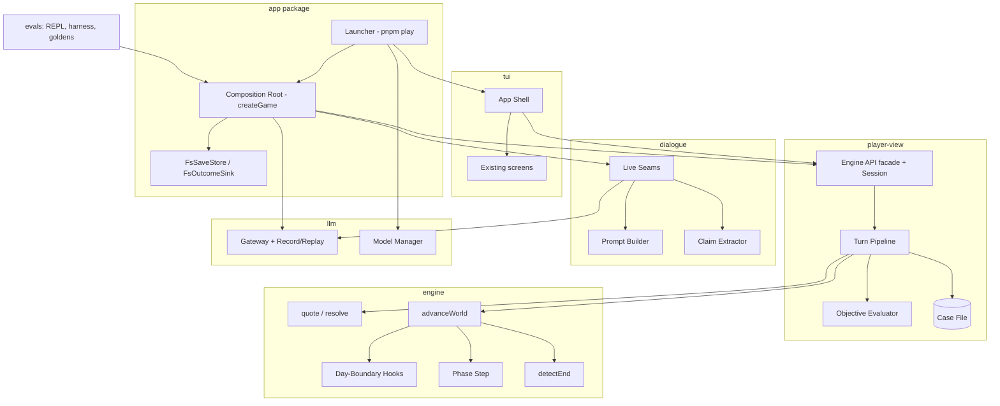

# Design Document

## Overview

This spec assembles the slice's finished components into a playable game. It adds no mechanics. Every change is wiring, a missing seam, or a small engine function that the slice design already names but nothing calls. References of the form "Slice Req N.M" and "slice Property N" point at `.kiro/specs/tradecraft/`.

The work falls into six areas:

1. **Simulation of time.** A new engine function, `advanceWorld`, runs the clock phase by phase over a Draft World State. At each Day Boundary it runs the four Day-Boundary Hooks as state reducers, then the per-phase Phase Step. It stops early at a meeting slot or an End Condition. The Turn Pipeline calls it in place of the events-only `advance`.
2. **Actions.** `decrypt`, `cable` and `task` get real quote and resolve functions. Every resolver reports the source of each Proposition it observed, so the Turn Pipeline can record Claims in the Case File. The pipeline also builds the per-turn Resolver Context projections (`claims`, `turnEvidence`, `arrestEvidence`, `events`) that `confront`, `turn-agent` and `arrest` already read but nothing supplies today.
3. **Dialogue.** The Talk Scene becomes real state. `applyIntent` and `resolvePitch` run on the Draft before the reply streams. The live voice seam builds its prompt with `buildPrompt`. The real Claim Extractor commits at the turn boundary.
4. **Facade.** `newGame`, saves and `validateFeed` are implemented. The facade owns one swappable Session, so a new game or a load replaces every store at once.
5. **Composition and the client.** A new package, `@tradecraft/app`, holds the Composition Root (`createGame`) and the `pnpm play` Launcher. The TUI gets an App Shell that routes between the existing screens.
6. **Models.** `config/models.yaml` gains per-profile Load Identifiers, Model Sources (MLX preferred, GGUF fallback) and a Context Length field. The Model Manager and `models:pull` follow.

### Key decisions

| Decision | Choice | Rationale |
|---|---|---|
| Where hook state lives | Hooks are engine-side reducers `(draft, ctx) → { state, events }` run by `advanceWorld` | The Sim owns ground truth. Keeping hook application in the engine means player-view never touches Plot, Hostile or Truth internals, and the reducers are testable without the pipeline. |
| The existing `advance` | Kept, re-implemented over the same stepping core | Existing clock tests and the events-only adapters stay valid. `advanceWorld` and `advance` share one loop, so day-boundary ordering cannot diverge. |
| PRNG streams | Weather, newspaper selection and Walk-ins stay on the daily stream. Plot disruption draws, the Hostile tick and every Phase Step draw move to the runtime stream in the Draft | Matches the slice PRNG table ("runtime: action resolution, checks, Hostile Service ticks") and Req 5.1. The existing day-boundary adapters drew Plot and Hostile coins from the daily stream; that changes, and the Golden Replays are re-recorded once (Req 24.1). |
| Composition Root package | New `packages/app` (`@tradecraft/app`) | `tui` may import only player-view, and player-view must not import dialogue or llm. The root needs all of them, so it must be a leaf package above them. evals depends on it; nothing else does. |
| `applyIntent` location | Moved to `engine/recruit/intent.ts`; dialogue re-exports it unchanged | The Turn Pipeline (player-view) must call it on the Draft and cannot import dialogue. It is a pure Sim transition, which is where the slice design already places it. |
| Voice routing | The voice seam receives the scene kind and the Intent and calls `routeTurnRole` | Routing stays in dialogue next to its Role type. The pipeline passes the facts and records the chosen role in the action log. |
| Claim sources | Each Proposition Observation carries an engine-side `ObservationSource` | Today `resolve` returns Observations and the Case File never sees them, except by hand in the REPL. A source tag lets one pipeline step record every Claim with the right `source`. |
| Truth Store writes | Staged in a `TruthDraft` and applied at commit | The Truth Store is mutable and lives outside World State. Staging keeps Req 5.4 atomicity: a failed turn discards staged writes with the Draft. |
| Saves | `SaveSnapshot` version 2 adds the Case File, Truth Store, view state and pipeline counters | Version 1 omits the Case File and Truth Store, so Req 13.3, 13.8 and 13.9 cannot hold. Version-1 saves are refused with a `version` error; there are no shipped saves to migrate. |
| File I/O | Injected `SaveStore` and `OutcomeSink`; the fs implementations live in `app` | player-view and the pipeline stay I/O-free, so the Scripted Full Games run in memory and Req 5.6 holds. |

### Dependencies and follow-on specs

This spec depends only on the completed slice. The follow-on specs (content-expansion, plot-library, ambient-world, campaign-career, multi-city) extend `advanceWorld`'s hook list, the Composition Root and the App Shell defined here. In particular, ambient-world's tick orchestrator and campaign-career's Outcome Record reader assume the hook-application contract and the one-time Outcome Record write below.

**Observed issue, not changed here.** `engine/src/lib/generate.ts` derives the Hostile doctrine stream as `derive(seed, 0x30000)`, which lies inside content-expansion's registry block (`0x30000`–`0x30FFF`, setting attempt 0). Moving it changes generated worlds and needs a `generatorVersion` bump, so it belongs with content-expansion's generator bump. It is listed in that spec's scope, not this one's.

## Architecture



### Dependency rules

`.dependency-cruiser.cjs` gains three rules and keeps every existing one:

- `engine-no-player-view`: `^packages/engine/` may not import `^packages/(player-view|dialogue|llm|tui|app|evals)/`. This makes the stated boundary explicit (the current config enforces it only through package manifests).
- `app-is-a-leaf`: no package except `evals` may import `^packages/app/`.
- `player-view-no-models`: `^packages/player-view/` may not import `^packages/(dialogue|llm|tui|app)/`. The pipeline reaches models only through injected seams.

`tui-imports-only-player-view` and the two `content` rules are unchanged, and `app` sits outside `tui`, so `tui` still imports only player-view (Req 18.2, 18.6). `app` declares `content`, `engine`, `llm`, `dialogue`, `player-view`, `tui`, `ink`, `react` and `zod` in its manifest, so the nx dependency-checks lint rule passes. Only spec files import `vitest` (Req 24.4).

### Package layout (changes only)

```
packages/
  app/                      NEW
    src/lib/composition-root.ts   createGame(): Gateway, Live Seams, pipeline, Engine API
    src/lib/fs-save-store.ts      SaveStore over the Saves Directory
    src/lib/fs-outcome-sink.ts    OutcomeSink over saves/outcomes/
    src/lib/launcher.ts           runLauncher(argv, io): validation → Model Manager → root → shell
    scripts/play.ts               thin `pnpm play` entry
  engine/src/lib/clock/advance-world.ts       NEW  stepping core, hooks, Phase Step driver
  engine/src/lib/clock/world-hooks.ts         NEW  plot / schedules / hostile / newspaper reducers
  engine/src/lib/clock/phase-step.ts          NEW  per-phase work
  engine/src/lib/hostile/project.ts           NEW  Full Tick input projection + output application
  engine/src/lib/clock/disruption.ts          NEW  live Disruption Context
  engine/src/lib/action/decrypt.ts, cable.ts, task.ts   NEW resolvers
  engine/src/lib/action/feed-validation.ts    NEW  shared feed rules → FeedError[]
  engine/src/lib/recruit/intent.ts            MOVED from dialogue (re-exported there)
  engine/src/lib/recruit/dialogue-turn.ts     NEW  applyDialogueTurn (intent, pitch, report)
  player-view/src/lib/api/session.ts          NEW  the swappable Session
  player-view/src/lib/api/claim-recorder.ts   NEW  Observations → Case File Claims
  player-view/src/lib/api/resolver-projection.ts NEW per-turn Resolver Context
  player-view/src/lib/api/objective-evaluator.ts NEW
  player-view/src/lib/api/action-catalogue.ts NEW  actions() enumeration
  dialogue/src/lib/live/live-seams.ts         MOVED from evals/src/lib/repl/seams.ts and completed
  tui/src/lib/shell/                          NEW  App Shell, key map, screen reducer
```

### The Turn Transaction with hooks

```mermaid
sequenceDiagram
  participant TP as Turn Pipeline
  participant RS as resolve (engine)
  participant AW as advanceWorld (engine)
  participant CF as Case File (staged)
  participant SK as Sinks
  TP->>TP: boundary: commit finished extraction results
  TP->>TP: pre = state; rng = createPrng(pre.rng); truthDraft = {}
  TP->>TP: ctx = projectResolverContext(pre, caseFile)
  TP->>RS: resolve(pre, action, rng, ctx)
  RS-->>TP: next, result, ended?
  TP->>CF: stage Claims from result.observations
  TP->>AW: advanceWorld(next, quoted phases, rng, deps)
  loop each phase entered
    AW->>AW: day boundary? day-start, plot, schedules, hostile, newspaper
    AW->>AW: Phase Step (schedules, meetings, cables, directives, decay, consequences)
    AW->>AW: stop if End Condition or opened scene
  end
  AW-->>TP: draft, events, phasesSpent, openScene?, ended?
  TP->>TP: commit: state, truthDraft, staged Claims, action log, Journal, Notifications
  TP->>SK: once per game: write Outcome Record
  TP-->>TP: stream fact, notification, (ended | narrate) chunks
```

## Components and Interfaces

### Engine: `advanceWorld` (`engine/clock/advance-world.ts`)

```ts
interface WorldHookContext {
  readonly time: GameTime;               // phase 0 of the day entered
  readonly dailyStreamSeed: string;      // derive(seed, 0x20000 + day), unchanged
  readonly rng: Prng;                    // the runtime stream, shared with resolve
  readonly scratch: DayScratch;          // values handed from one hook to a later one that day
  readonly deps: AdvanceWorldDeps;
}
interface HookOutput { readonly state: WorldState; readonly events: readonly SimEvent[] }
type WorldHook = (draft: WorldState, ctx: WorldHookContext) => HookOutput;
type WorldHooks = { readonly [K in (typeof DAY_BOUNDARY_HOOK_ORDER)[number]]?: WorldHook };

interface AdvanceWorldDeps {
  readonly content: ContentSet;
  readonly cityData: CityData;
  readonly hooks: WorldHooks;                       // buildWorldHooks() in production
  readonly objectives: (draft: WorldState) => ObjectiveEvaluator; // from player-view
  readonly cipherKeys: CipherKeyLookup;             // for minting Intercepts
}
interface AdvanceWorldResult {
  readonly state: WorldState;
  readonly events: readonly SimEvent[];   // event-time order, re-id'd like advance()
  readonly phasesSpent: number;           // ≤ requested
  readonly openScene?: TalkSceneRequest;  // a kept meeting
  readonly ended?: EndCondition;
}
function advanceWorld(draft: WorldState, phases: number, rng: Prng, deps: AdvanceWorldDeps): AdvanceWorldResult;
```

The loop, for each of `phases` steps:

1. `t = addPhases(current, 1)`.
2. If `t.phase === 0` (a Day Boundary): compute the day's weather from the daily stream and the city weather tables (`weatherForDay`), write it to `city.weather[t.day]`, emit `day-start` carrying it (Req 2.6). Create a fresh `DayScratch`. Run the hooks present in `deps.hooks` in `DAY_BOUNDARY_HOOK_ORDER`. Each hook receives the state the previous hook returned (Req 2.2). After the Plot and Hostile hooks, run the abort check (below).
3. Run the Phase Step for `t` on the result (Req 2.8: after that day's hooks).
4. Run `detectEnd`. On a result, write `ended`, stop, and report `phasesSpent` (Req 7.5).
5. If the Phase Step returned an `openScene`, stop at `t` and report it (Req 1.4).

A multi-day turn runs the full hook sequence once per boundary, in day order (Req 2.7), because the loop handles one phase at a time. Zero phases runs nothing (Req 1.10). The result's time is the last phase actually entered, so the turn's spent phases may be fewer than quoted. The pipeline records `phasesSpent` in the turn result and in the `action` log entry, so replay reproduces the early stop.

`advance()` keeps its signature and is re-implemented on the same stepping core with `S = void`, so the two cannot drift. The four events-only adapters (`plotDayBoundaryHook`, `schedulesDayBoundaryHook`, `hostileDayBoundaryHook`, `newspaperDayBoundaryHook`) stay exported for their existing tests and are marked deprecated; nothing in the game path uses them.

**Event ids.** `advanceWorld` re-ids every event as `evt:<day>:<phase>:<seq>` with one sequence per call, exactly as `advance` does, so ids stay unique within a turn.

**Purity (Req 5.6).** `advanceWorld`, every hook and the Phase Step read only their arguments. No `Date`, `process.env`, file or model access. A lint rule (`no-restricted-globals` / `no-restricted-imports` for `node:fs`, `Date`, `process`) is scoped to `engine/src/lib/clock/` and `engine/src/lib/hostile/` to keep this true.

### Engine: Day-Boundary Hooks (`engine/clock/world-hooks.ts`)

`buildWorldHooks()` returns the four reducers.

| Hook | Reads | Writes to the Draft | Stream |
|---|---|---|---|
| `plot` | `plot`, `city`, `npcs`, `channels`, `deadDrops`, live Disruption Context | `plot`; trace events; for each `transmission` trace, the Transmission and Intercept minted through `makeIntercept` appended to `transmissions` / `intercepts` (Req 2.3). Disruption keys accrue Abort Pressure | runtime (disruption and reroute draws) |
| `schedules` | `npcs`, `whereabouts` | boundary `npc-moved` events and `whereabouts`; a Walk-in's `walk-in` / `walk-in-approach` events, and a Contact Channel (`relationships[npc].channel = true`, `player.contacts`) for the Walk-in NPC (Req 2.4); the day's events into `scratch.dayEvents` | daily (Walk-in roll, unchanged) |
| `hostileTick` | the projection in the next section | the Full Tick's state changes (next section) | runtime |
| `newspaper` | `dailyMaterial(day)` plus `scratch.newspaperPlants` and `scratch.arrestArticles` | the composed edition Document in `documents`, its Propositions in `documentPropositions`, `newspapers[day]`, the Document's obtainable Locations, and a player-visible `newspaper` event (Req 2.5, 3.8) | daily (article selection, unchanged) |

**Abort check (Req 4.5).** After the Plot hook and again after the Hostile hook, `considerPlotDay` / `abortCheck` runs on the Draft's Plot with the current leader suspicion, the materiel-seized flag from the Disruption Context and the doctrine. On a trigger, `applyAbort` sets `plot.status = 'aborted'` and emits `plot-aborted`; `detectEnd` then reports the success End Condition at the end of the step. The action resolvers that disrupt (seize, arrest of a participant) already accrue pressure; the next Phase Step's `detectEnd` sees an abort they caused.

### Engine: Live Disruption Context (`engine/clock/disruption.ts`)

```ts
function liveDisruption(draft: WorldState): DisruptionContext;
```

- `isArrested(npc)`: `npcs[npc].status` is `arrested` or `fled`, or `inStationCustody(relationships[npc], draft.time)` (Req 4.2).
- `isChannelCompromised(chan)`: `hostile.beliefs.compromisedChannels` includes `chan` (Req 4.3).
- `isMaterielSeized()`: `plot.materielSeized === true`. The flag is set by `service-drop` in `seize` mode on the stage's delivery and by an arrest of the NPC carrying the materiel (Req 4.4). Today the seizure is recorded only through Abort Pressure; the flag is added to `PlotState` so the predicate reads a standing fact.

It is rebuilt from the Draft each time the Plot hook runs (Req 4.1), so a disruption committed earlier in the same turn is seen.

### Engine: Hostile Full Tick projection and application (`engine/hostile/project.ts`)

```ts
function projectFullTick(draft: WorldState, day: number, scratch: DayScratch, deps: AdvanceWorldDeps):
  { state: HostileServiceState; candidates: DetectionCandidate[]; base: DetectionBase; inputs: FullTickInputs };
function applyFullTick(draft: WorldState, result: FullTickResult, scratch: DayScratch): HookOutput;
```

The hook is `applyFullTick(draft, dailyTickFull(...projectFullTick(draft, …), ctx.rng), scratch)` (Req 3.1). Inputs:

| `FullTickInputs` field | Projected from |
|---|---|
| `candidates` | every Relationship with `recruited`, sorted by id, with its Exposure and the NPC's activity counts since the last tick |
| `base` | `meta.preset.detectionBase` |
| `dayEvents` | `scratch.dayEvents` (the schedules hook's Walk-in events) |
| `chickenfeed` | each Asset's access slice filtered from the Truth Store's facts (`reportFacts` candidates without the reliability draw) |
| `plot`, `adaptation` | `draft.plot` and the Cell / target projection from `plot` and `npcs` |
| `feeds` | every `scheduled` hidden `feed-delivered` event with `at.day === day`, removed from `scheduled` on delivery (Req 3.5) |
| `moleReport` | when `station.mole` is set and the mole is at liberty: the Station Knowledge Slice Propositions plus the Propositions the player's Case File summary and sent Cables name, projected by player-view into `draft.station.reportable` at each commit (Req 3.6) |
| `commitments` | `meetings` with status `accepted` and `player`-owned drops expecting the Asset |
| `arrestArticleContext` | each Asset's last known Location and public role |
| `tailing`, `tailingThresholds` | `player.coverSuspicion`, `player.tailed`, the doctrine and `preset.coverSuspicionBurnThreshold` |
| `plantCandidates` | false Propositions about Station-known entities from `hostile.beliefs` and the deception templates |
| `commsChannels` | hostile-owned Channels with firings on `day` |

Outputs written to the Draft:

| `FullTickResult` field | Written to |
|---|---|
| `next` | `hostile` (beliefs, credibility, agent suspicion, adopted, compromised channels) (Req 3.5, 3.6) |
| `asset-arrested` events | `npcs[npc].status = 'arrested'`, `relationships[npc].custody = { by: 'hostile', … }` (Req 3.7) |
| `doublings` | `relationships[npc].asset.hostileControlled = true` and the Chickenfeed pool the Asset feeds from (Req 3.7) |
| `plot` | `plot` (adaptation and Abort Pressure; Req 3.11) |
| `compromisedChannels` | stages switch Channel through the existing adaptation path |
| `arrestConsequences` | the voided meetings (`status: 'void'`) and drops (`expectedLoader` cleared), so the Phase Step raises `meeting-no-show` / `drop-unserviced` when the player next attends or services (Req 3.10) |
| `arrestArticles`, `newspaperPlants` | `scratch` for the same day's newspaper hook (Req 3.8) |
| `tailing` | `player.tailed`, `player.coverSuspicion` (Req 3.2, 3.3); when `burned`, `player.burned = true` and a burned End Condition through `detectEnd` (Req 3.4) |
| `commsTraffic` | each source enciphered through `makeIntercept` and appended to `transmissions` / `intercepts` (Req 3.9) |
| `feedClasses` | `hostile.feedLog` (debrief only; never in the Player View) |
| `events` | the turn's event list; all hidden kinds, so only derived consequences notify (Req 3.10) |

### Engine: Phase Step (`engine/clock/phase-step.ts`)

```ts
function phaseStep(draft: WorldState, from: GameTime, to: GameTime, rng: Prng, deps: AdvanceWorldDeps):
  { state: WorldState; events: SimEvent[]; openScene?: TalkSceneRequest };
```

Fixed order within the step:

1. **Schedules.** `advanceSchedules(npcs, from, to)` and write `whereabouts` for every moved NPC (Req 1.2). Arrested, fled or custodial NPCs are pinned (`'absent'` or the Station) and do not move.
2. **Meetings.** For each `accepted` meeting whose slot equals `to`, `resolveMeetingAtSlot`; apply its trust change, meeting status and events (Req 1.3). The first one that opens a scene returns `openScene` (Req 1.4). A voided meeting the player attends emits `meeting-no-show`.
3. **Cables.** `processDueCables(station, to, fundsPolicy(preset))`; write `pendingCables`, `ledger`, `standing`, `lastFundsGrant`; compose each reply's Cable Document (a Dossier from the Station Knowledge Slice for a trace) into `documents` (Req 1.5).
4. **Directives.** `checkDirectives(station, to, deps.objectives(draft))`; write `directives` and `standing`; each settle's `directive` event is delivered with a Cable Document naming the result (Req 1.6, 6.4).
5. **Retainer decay.** `retainerDecay` for each money-motivated Asset overdue past the grace period; write trust; raise `retainer-due` once when a retainer falls due (Req 1.7, 1.8).
6. **Consequences.** Raise `asset-silent` for an Asset with no `lastContact` within `scenario.silenceDays`, once per silence; `drop-unserviced` when the player services a drop an arrested Asset should have loaded (Req 1.8).
7. **Custody.** Release Station Custody whose `until` has passed (`custody-released`), applying the existing release suspicion.

Every event is appended to the turn's list in this order, so Notifications arrive in event-time order at commit (Req 1.9).

### Engine: actions

**`decrypt` (`action/decrypt.ts`).** Quote: allowed when `intercepts[id]` exists (the player collected it) and the Location allows Workbench work; phases 1, money 0 (Req 8.1). Otherwise disallowed, "you have not collected that intercept" (Req 8.2). Resolve: when `intercepts[id].broken`, return a "you have already broken this traffic" Fact Line and no Observations (Req 8.6). Else `verifySubmission(intercept, submission, ctx.cipherKeys, content.predicates)` (Req 8.3). On `ok`, set `broken: true` and return one Proposition Observation per recovered Proposition with `source: { kind: 'intercept', id }` (Req 8.4). On reject, one fixed message Fact Line ("The key does not produce readable text."), identical for every wrong submission (Req 8.5).

**`cable` (`action/cable.ts`).** Quote: trace requires `target` in `player.known.entities` (Req 9.2); funds and report are always allowed at the Station; phases 1, money 0 (Req 9.1). Resolve: `submitCable(body, time, { delayPhases: preset.traceRequestDelayPhases })` appended to `station.pendingCables` (Req 9.3). The Phase Step delivers the reply (Req 9.4).

**`task` (`action/task.ts`).** Quote: allowed when `relationships[asset]` is an Asset with `channel` (Req 10.1); otherwise disallowed with "that person is not your Asset" or "you have no way to reach them", decided from the Relationship flags the player set up (Req 10.2). Phases 1 for collect, introduce and plant, 1 for service; money 0. Resolve: `runAssetTask(task, { rel, candidates, dropContents, isMemberOfOrg }, rng)` with `candidates` drawn from Truth Store facts since `rel.lastReport` and access-filtered as today. Then:

- `collect`: Proposition Observations with `source: { kind: 'npc', npc: asset }`; `rel.lastReport = time` (Req 10.3). A hostile-controlled Asset reports from its Chickenfeed pool (existing rule).
- `introduce`: `relationships[target]` with `channel: true` and `trust = inheritedTrust`; target added to `player.contacts` (Req 10.4).
- `service`: apply `collected` as Observations and `left` to `deadDrops[drop].contents` (Req 10.5).
- `plant`: when `placed`, append the Proposition to `scheduled` as a hidden `belief-plant` at `at` for the next Hostile tick's `newlyAdopted` (Req 10.6).
- All: `rel.exposure += TASKING_EXPOSURE` (Req 10.7). The tasking risk is a new engine constant in `recruit/tasking.ts`, set to half the Exposure a meeting at a risk-0.5 Location adds under the default `exposure` weights, rather than a new preset field, so no content schema changes.

**Removal (Req 11.2).** With these three, `quoteKind` and `resolve` are exhaustive over `Action['kind']` with a `never` check in `default`. `notImplementedQuote` and `OWNED_BY` are deleted.

**`resolve` returns `ended`.** `resolve` widens to `{ next, result, ended? }`, threading the `ended` that `resolveArrest` and `resolveServiceDrop` already compute (today it is dropped). The pipeline writes it.

**`detectEnd` (Req 7.8).** Adds the leader check as a standing condition: after the abort and completion checks, a Plot leader in Station Custody or `status: 'arrested'` by the Station is a `leader-arrested` success. Priority: aborted, leader arrested, completed, burned.

**Observation sources.** `Observation`'s proposition variant gains `source: ObservationSource`:

```ts
type ObservationSource =
  | { kind: 'surveillance'; loc: LocId } | { kind: 'document'; id: DocId }
  | { kind: 'intercept'; id: InterceptId } | { kind: 'npc'; npc: NpcId };
```

It mirrors player-view's `ClaimSource` one to one. `read`, `surveil`, `follow`, `wait`, `decrypt`, `task` and `service-drop` (copy mode) set it.

**Feed validation (`action/feed-validation.ts`).** One pure function used by both `quoteFeed` and the facade:

```ts
interface FeedError { readonly index: number; readonly field: 'items' | 'claim' | 'predicate' | 'subject' | 'object' | 'place' | 'window'; readonly reason: string }
function validateFeedItems(items: readonly FeedItem[], view: FeedView, content: ContentSet): Result<Proposition[], FeedError[]>;
```

`FeedView` is the player's known set, the held Claims and the held `IS_ALIAS_OF` Claims, so validity reads no truth (Req 14.3). A count error uses `index: -1, field: 'items'`. `quoteFeed` returns disallowed with the first error's reason exactly when `validateFeedItems` fails (Req 14.4).

### Engine: dialogue turn (`engine/recruit/intent.ts`, `dialogue-turn.ts`)

`INTENTS`, `Intent`, `INTENT_DELTAS` and `applyIntent` move to the engine. `applyIntent` now takes and returns a full `Relationship` (it updates trust and suspicion as before). `dialogue` re-exports all four from its index so its public API is unchanged.

```ts
interface DialogueTurnInput { readonly intent: Intent; readonly offer?: number }
function applyDialogueTurn(draft: WorldState, scene: TalkScene, input: DialogueTurnInput, rng: Prng, weights: PitchWeights):
  { state: WorldState; pitch?: PitchOutcome; events: SimEvent[] };
```

1. `applyIntent` on `relationships[scene.npc]` (Req 15.5).
2. For a `pitch-*` Intent, `resolvePitch(npc, rel, lever, offer ?? 0, weights, rng)` (Req 15.6). An `offer > 0` on `pitch-money` debits the ledger by `offer` (reason `pay`) whether or not the pitch lands; an offer the ledger cannot cover is rejected before classification by the facade (Req 15.7). On `accepted`, set `recruited` and mint the Asset profile from the NPC's access (existing `assetProfileFor`). On a refusal, add `suspicionDelta`; when `reported`, add the NPC to `hostile.beliefs.suspectedApproaches` and raise the player's Cover Suspicion by the slice's report increment (Req 15.8).
3. Append the player's line to `scene.recent`.

### Player View: Session (`player-view/api/session.ts`)

```ts
interface Session {
  state: WorldState; truth: TruthStore; caseFile: CaseFile; journal: Journal;
  notifications: NotificationStore; hints: HintStore; actionLog: ActionLog;
  extractionQueue: ExtractionQueue; flavourCache: FlavourCacheSnapshotData;
  turnCounter: number; paused?: PausedTurn; brief: BriefView; outcomeWritten: boolean;
}
```

`PlayerViewEngine` holds one `Session` reference. Every view, Case File operation and turn reads through it. `newGame` and `saves.load` build a complete new Session and swap the reference in one assignment, so no store from the old game survives (Req 12.3) and a failed load leaves the old Session untouched (Req 13.4, 13.5). The Turn Pipeline reads its stores from the Session rather than holding its own, which fixes today's split where the driver owns the action log and queue privately.

### Player View: Turn Pipeline changes (`player-view/api/turn-pipeline.ts`)

Seams and dependencies the pipeline receives (all injected; the pipeline imports no model or fs code):

```ts
interface TurnPipelineConfig {
  readonly classify?: (line: string, scene: TalkSceneView) => Promise<Intent>;
  readonly voice?: (req: VoiceRequest) => Promise<VoiceReply>;
  readonly narrate?: NarrateSeam;                      // unchanged
  readonly extraction?: ExtractionRunner;              // widened, below
  readonly outcomes: OutcomeSink;                      // write(record): void
  readonly advance: AdvanceWorldDeps;                  // hooks, objectives, keys
  readonly deflectionLine?: string;
}
interface VoiceRequest { line: string; intent: Intent; npc: NpcId; sceneKind: SceneKind; speakerName: string; state: WorldState }
interface VoiceReply { released: readonly string[]; role: 'voice' | 'fast'; calls: readonly ModelCallRef[] }
```

**Action turn.**

1. Boundary: commit finished extraction results (below).
2. Reject with a disallowed `fact` chunk and `done` when `state.ended` is set (Req 7.7).
3. `rng = createPrng(pre.rng)`, `truthDraft = TruthDraft.over(session.truth)`.
4. `ctx = projectResolverContext(pre, session, truthDraft)`: `claims` from the Case File, `arrestEvidence` and `turnEvidence` from `evidenceCount`, `cipherKeys`, `truth: truthDraft`.
5. `resolve(pre, action, rng, ctx)`. Stage the result's Proposition Observations as pending Claims.
6. `advanceWorld(next, q.phases, rng, deps)`, with `deps.objectives` built over the Case File plus the pending Claims (Req 6). Merge `resolve`'s `ended` (it takes precedence) with `advanceWorld`'s, whose last step is `detectEnd` on the Draft before commit (Req 7.1).
7. `draft = { …, rng: rng.state(), ended }`; if `openScene` (from the action or a kept meeting), set `player.scene` (Req 15.1).
8. Commit: `session.state = draft`; `truthDraft.commit()`; add pending Claims to the Case File; append the `action` log entry with `phasesSpent`; record Journal Fact Lines; deliver events as Notifications; update `station.reportable` for the mole projection.
9. If `pre.ended === undefined && draft.ended !== undefined` and `!session.outcomeWritten`: `outcomes.write(buildOutcomeRecord(draft))`, set `outcomeWritten` (Req 7.6). The flag is saved, so loading an ended game never writes again.
10. Stream `fact`, `notification`, `hint`, then `ended` + `done`, or narrate + `done`.

**Dialogue turn.** `say` with no `player.scene` returns a single `fact` chunk ("You are not talking to anyone.") and `done`, with no model call and no commit (Req 15.4). Otherwise:

1. Boundary commits. `pre`, `rng`.
2. `intent = await classify(line, scene)`; an unknown label falls back to `ask` (the classifier's own schema already constrains it).
3. `applyDialogueTurn(pre, scene, { intent, offer }, rng, weights)` on the Draft (Req 15.5–15.8).
4. `voice({ …, sceneKind: scene.kind, intent, speakerName: namer(scene.npc) })` (Req 15.9, 15.10). A rejection discards the Draft and pauses as today.
5. Append the NPC's released text to `scene.recent` (cap `RECENT_TURNS = 6`). Commit. Log the `line` entry and one `model` entry per call. Stream `speech` chunks tagged with `speakerName`.
6. Enqueue the extraction job with `speaker: scene.npc` and the speaker's knowledge at the turn (Req 15.11).

`endScene` clears `player.scene` at commit (Req 15.3). A pitch that recruits fires the `first-recruitment` hint.

**Extraction boundary (Req 17).** The runner widens to a two-phase contract:

```ts
interface ExtractionRunner {
  start(job: QueuedExtraction): void;                    // kicks off the bookkeeping call
  ready(job: QueuedExtraction): ExtractionResultData | 'pending' | 'unreachable';
}
type ExtractionResultData = { kind: 'parsed'; result: ExtractionResult } | { kind: 'unparsed'; text: string };
```

At a boundary the pipeline drains ready jobs in `turnId` order. For each, inside one commit: `evaluateExtraction` with `truth: truthDraft`, the job's speaker knowledge, `told[speaker]`, `allocateUnk` bound to the engine's Unidentified-Subject allocator on the Draft, and deterministic claim ids. It then writes the truth records (staged), `told[speaker]`, any new `unkIds`, and the Case File Claims with `source: { kind: 'npc', npc: speaker }` (Req 17.2). An `unparsed` result adds an unparsed note to the Case File (Req 17.3). Chance leaks and consistency violations go to the injected `EvalLog` (metrics JSONL; Req 17.4, 17.5). `unreachable` keeps the job queued and adds one status-bar notice (Req 17.6). Each commit appends an `extraction-commit` entry. In replay the runner serves results from the recording, and the replay driver applies each commit at its logged position, so asynchronous timing does not change the final state.

### Player View: Claim recorder and Resolver Context

`claim-recorder.ts` maps `ObservationSource` to `ClaimSource` and calls the existing `addDocumentClaims`, `addSurveillanceClaims` and `addInterceptClaims`, plus a new `addNpcClaims`. `read` stays idempotent because the engine already returns no Observations on a second read.

`resolver-projection.ts` builds the per-turn `ResolverContext` from the Session. Every field it adds is a Player View or Case File figure; the only truth-bearing field is the staged Truth Store the engine resolvers already take.

### Player View: Objective Evaluator (`player-view/api/objective-evaluator.ts`)

```ts
function objectiveEvaluator(view: { caseFile: CaseFileReader; state: WorldState }): ObjectiveEvaluator;
```

| Objective | Met when | Source |
|---|---|---|
| `identify(entity)` | `entity` (or the NPC an `unk:` resolves to through a held `IS_ALIAS_OF` Claim) is in `player.known.entities` by name | Player View + Case File (Req 6.2) |
| `recruit(n)` | at least `n` Relationships have `recruited` | the player's recorded recruitments (Req 6.3) |
| `arrest(entity)` | `player.arrests` contains the entity (new field, appended by `resolveArrest` on a granted arrest) | the player's recorded arrests |
| `intercept(chan)` | some collected `intercepts[*].channel === chan` | the player's collected Intercepts |

It reads no Truth Store and no `Truth`-branded field (Req 6.5). The switch is exhaustive over `DIRECTIVE_OBJECTIVE_KINDS` (Req 6.1).

### Player View: actions catalogue

`actions()` is currently empty. `action-catalogue.ts` enumerates candidate actions from the Player View: travel to each known Location (with and without countersurveillance), talk and approach for each visible person, surveil here, follow each visible person, wait 1–4, read each held Document, intercept, decrypt for each collected unbroken Intercept, cable trace for each known entity plus funds and report, task for each Asset and task kind, pay each Asset, service each known drop, and arrest each person with evidence. Each is paired with `quote`. Actions needing free input (decrypt submissions, feed items, confront Claims, offers) are listed as templates the TUI completes.

### Facade: `newGame` (Req 12)

```ts
interface GameFactory { generate(seed: string, opts: NewGameOptions): { inputs: GenerateInputs; world: WorldState; truth: TruthStore } }
```

The Composition Root supplies a `GameFactory` closed over the loaded Content Set and the validated scenario config. `newGame({ seed?, preset, mole, narration })`:

1. `seed ??= randomSeed()` (Req 12.2). This is the one non-deterministic read, and it happens before any Sim call.
2. Resolve the preset by id, override `mole` and `narration` on the scenario, then `generateGame(seed, inputs)` (Req 12.1).
3. Build the BriefView from the Starting Brief and the implication rules from the predicate registry (replacing the REPL's empty stand-ins).
4. Build a fresh Session and seed the Case File with the Starting Brief's lead Claims as `document` Claims sourced from the brief Cable (Req 12.4).
5. Swap the Session in (Req 12.3) and return `GameView { status, seed, preset, brief }`.

Because generation is pure in `(seed, inputs)`, two calls with the same inputs produce deep-equal World States (Req 12.5).

### Facade: saves (Req 13)

```ts
interface SaveStore {
  list(): readonly { name: string; header: SaveHeader | 'corrupt' }[];
  read(name: string): unknown | { error: 'missing' | 'unreadable' };
  write(name: string, json: string): void;              // atomic
}
const SAVE_NAME = /^[A-Za-z0-9][A-Za-z0-9 _-]{0,63}$/;
```

- **Saves Directory.** `saves/` at the repo root, beside `saves/outcomes/` (the slice's Outcome Records directory). Each save is `saves/<name>.save.json`. `saves/` is git-ignored.
- **Names (Req 13.6).** A name failing `SAVE_NAME` (which excludes `/`, `\`, `..` and every other character) is rejected with an error before any write. The fs store also checks the resolved path is inside the directory.
- **Atomic write (Req 13.7).** Write to `<name>.save.json.tmp-<pid>-<n>`, `fsync`, then `rename` over the target. An interrupted save leaves the old file. Stale temp files are ignored by `list` and removed on the next successful write of that name.
- **Snapshot v2.** `SAVE_VERSION = 2`. Adds `caseFile` (`CaseFile.snapshot()` / `fromSnapshot`, new), `truth` (the Truth Store's data with Maps as sorted entry arrays), `viewState` (hint seen flags, observed cover states), `pipeline` (`turnCounter`, `outcomeWritten`) and `world.told`. A paused turn is not saved: save-and-quit from the endpoint error screen saves the pre-turn state, which is the committed state.
- **save(name)** builds `saveSnapshot(session)`, serialises with canonical JSON and writes (Req 13.1).
- **list()** reads each file's header fields (`seed`, `difficulty`, `world.time`, `savedAt`, `content`) and sets `manifestMatches = diffManifests(saved, loaded).length === 0` (Req 13.2). `savedAt` is the one wall-clock value; it lives only in the save header and never in World State.
- **load(name)** reads, `JSON.parse`s and calls `parseAndLoad` with the loaded manifest. Errors map to `corrupt` (unreadable or malformed), `version`, or `manifest-mismatch` with `diffManifests`' list (Req 13.4, 13.5). On success the Session is rebuilt from the snapshot and swapped in (Req 13.3).

### Facade: `validateFeed` (Req 14)

`validateFeed(items)` calls `validateFeedItems(items, feedView(session), content)` and returns `ok` or the `FeedError[]`. `FeedError` in `api/types.ts` becomes `{ index: number; field: FeedErrorField; reason: string }`; the feed composer already renders a message per error and is updated to show index and field.

### Dialogue: Live Seams (`dialogue/live/live-seams.ts`)

`buildLiveSeams(gateway, deps)` moves from `evals/src/lib/repl/seams.ts` into dialogue (it imports only dialogue, engine, llm and content types, plus the player-view seam types, which are structural and re-declared in dialogue to avoid a dialogue → player-view edge). evals keeps a re-export for its tests during the move.

- **classify:** `classifyIntent(gateway, line)` on `fast`.
- **voice (Req 16.2–16.5):** `role = routeTurnRole({ sceneKind, intent })`. `prompt = buildPrompt({ predicates, namer: npcNamer(npc), persona, coverStory, agenda, knowledge: npc knowledge slice, toldList: told[npc], relationshipSummary: rapport band, recentTurns: scene.recent, playerLine, intent, coverIntact })`. Messages are `[{ system: prompt.system }, …recent, { user: line }]`; the player's line is only ever a `user` message (Req 16.3). The reply streams through the Refusal Guard and then `guardStream` with `allowed = npc.knowledge.knownEntities`, retry limit `scenario.retries.leakGuard`, and the persona deflection line on exhaustion (Req 16.4). `buildPrompt` enforces `scenario.tokenBudget` (Req 16.5).
- **narrate:** unchanged, with the scene descriptor built from the Player View.
- **extraction (Req 17.1):** `start` runs `extractClaims(gateway, job, deps)` on `bookkeeping` and stores the promise's outcome; `ready` reports it. The simplified runner is deleted.

`buildPrompt` and its input types are exported from `dialogue/src/index.ts` (Req 16.1).

### Composition Root (`app/composition-root.ts`)

```ts
interface CreateGameOptions {
  readonly repoRoot: string;
  readonly scenario: ScenarioConfig;               // validated
  readonly models: ModelsConfig;                   // validated
  readonly gateway?: 'live' | { record: string } | { replay: RecordSource } | Gateway;
  readonly seams?: Partial<TurnPipelineSeams>;     // Fake Seams for tests
  readonly saveStore?: SaveStore;                  // default FsSaveStore(saves/)
  readonly outcomes?: OutcomeSink;                 // default FsOutcomeSink(saves/outcomes/)
  readonly evalLog?: EvalLog;
}
interface Game { readonly api: EngineApi; readonly gateway?: Gateway; readonly close: () => Promise<void> }
function createGame(options: CreateGameOptions): Game;
```

1. Load the Content Set from `scenario.packs` (Req 18.1).
2. Build the Gateway: `OpenAIGateway` for `live`, wrapped in `RecordingGateway` for `record`, or a `ReplayGateway` (Req 18.4). A caller may pass its own Gateway.
3. Build the Live Seams over that Gateway unless `seams` overrides them (Req 18.3).
4. Build `AdvanceWorldDeps` (`buildWorldHooks()`, `objectiveEvaluator`, cipher keys from the public texts).
5. Build the Turn Pipeline and `PlayerViewEngine` with the `GameFactory`, stores and sinks. No game exists until `newGame` or `load`.

The REPL (`evals/scripts/repl.ts` and `runSession`), the eval harness's scene player and the golden replay runner all call `createGame` (Req 18.5). Fake Seams live in `app/src/lib/fake-seams.ts` so tests in `app` and `evals` share them.

### TUI: App Shell (`tui/shell/`)

```ts
type Screen =
  | { kind: 'start' } | { kind: 'brief'; view: GameView } | { kind: 'scene' }
  | { kind: 'case-file' } | { kind: 'documents'; open?: DocId } | { kind: 'workbench'; intercept?: InterceptId }
  | { kind: 'journal' } | { kind: 'map' } | { kind: 'people' } | { kind: 'feed'; asset: NpcId }
  | { kind: 'save-load'; mode: 'save' | 'load' } | { kind: 'endpoint-error'; error: PausedError }
  | { kind: 'game-over'; outcome: Outcome } | { kind: 'debrief' };
interface ShellState { screen: Screen; overlay?: 'help'; streaming: boolean; transcript: TranscriptState; toasts: Toast[] }
function reduceShell(state: ShellState, event: ShellEvent): ShellState;   // pure, unit-tested
```

`AppShell({ api, defaults })` takes only an `EngineApi` (Req 19.1). Flow: `start` → `newGame` → `brief`, which shows the Cable and then the offer "Meet the Chief of Station in person? (y/n)"; yes acts `talk` with the Chief, no goes to `scene` (Req 19.2).

| Key | Action (when not streaming) |
|---|---|
| `Enter` | scene: open the action menu / submit the typed line in a Talk Scene |
| `Esc` | back to scene; in a Talk Scene, `endScene` (Req 19.8) |
| `c` `d` `w` `j` `m` `p` | Case File, Documents, Workbench, Journal, Map, People |
| `f` | feed composer for the selected turned Asset |
| `s` / `l` | save / load screen |
| `?` | help overlay |
| `q` | quit (confirms) |

The key map is a constant exported for the help overlay and documented in the README; it is the documented key map of Req 19.3. Turn streams are consumed with `for await`; each chunk dispatches a `ShellEvent`. `fact`, `flavour` and `speech` feed `reduceTranscript` (existing) and render in their styles (Req 19.4). `interrupted` drops the attempt's Flavour and speech (Req 19.5). `paused` → `endpoint-error` with retry (`api.retry()`) and save-and-quit (Req 19.6). `ended` → `game-over`, whose debrief option → `debrief` (Req 19.7). `notification` → status-bar alerts (Req 19.9). `hint` → a hint toast (Req 19.10). While `streaming` is true every key that would start a turn is ignored (Req 19.11).

**Hints.** The pipeline fires hint triggers from Player View facts only (first `unk:` in the Case File, first Intercept, first own drop, first meeting, first recruitment, first Document, Budget below 20% of start, Standing below 0, a "you may have been made" Fact Line for `cover-suspicion-high`, an open Directive within one day of its deadline, a brief lead's stated deadline within one day for `plot-deadline-near`, and `actions()` offering an allowed arrest). A fired hint becomes a new `{ kind: 'hint'; text }` TurnChunk. Two triggers named in the pack would otherwise read truth (`cover-suspicion-high`, `plot-deadline-near`); the view-side definitions above keep them truth-free.

### Launcher (`app/launcher.ts`, `pnpm play`)

```ts
async function runLauncher(argv: string[], io: LauncherIo): Promise<number>;   // exit status
```

1. Parse `--seed <s>` and `--profile <name>` (overrides `active`).
2. Load and validate `config/scenario.yaml` and `config/models.yaml`. Print every issue as `<file>: <path>: <message>` and return 1 (Req 20.2, 22.3).
3. `startModelManager(models, { contextLength: models.contextLength, connect, startServer })` (Req 20.3). On `ConnectionError`, print "LM Studio server unreachable" with the cause; on `StartupError`, print each issue, including every missing model's `lms get` command and any memory shortfall; return 1 (Req 20.4).
4. Print partial-GPU warnings, then `createGame({ gateway: 'live', … })` and `render(<AppShell api={game.api} defaults={{ seed }} />)` (Req 20.5, 20.6).

`io` carries stdout, stderr, the file reader and the SDK actions, so the launcher is tested offline with the fake LM Studio client. The root `package.json` gains `"play": "pnpm --filter @tradecraft/app exec tsx scripts/play.ts"` (Req 20.1) and `"evals": "pnpm --filter @tradecraft/evals exec tsx scripts/evals.ts"` (Req 25.1).

### Models config and Model Manager (Req 21, 22)

```yaml
endpoint: http://localhost:1234/v1
contextLength: 8192
models:
  gemma-31b:
    family: gemma4
    sources:
      - { format: mlx,  get: lmstudio-community/gemma-4-31B-it-MLX-4bit,          key: <SDK modelKey> }
      - { format: gguf, get: lmstudio-community/gemma-4-31B-it-GGUF@Q4_K_M,       key: <SDK modelKey> }
  qwen-moe:
    family: qwen3
    sources:
      - { format: mlx,  get: lmstudio-community/Qwen3.6-35B-A3B-MLX-4bit,         key: … }
      - { format: gguf, get: lmstudio-community/Qwen3.6-35B-A3B-GGUF@Q4_K_M,      key: … }
  qwen-27b:
    family: qwen3
    sources:
      - { format: mlx,  get: lmstudio-community/Qwen3.8-27B-MLX-4bit,             key: … }
      - { format: gguf, get: lmstudio-community/Qwen3.8-27B-GGUF@Q4_K_M,          key: … }
  gemma-moe:
    family: gemma4
    sources:
      - { format: mlx,  get: lmstudio-community/gemma-4-26B-A4B-it-MLX-4bit,      key: … }
      - { format: gguf, get: lmstudio-community/gemma-4-26B-A4B-it-GGUF@Q4_K_M,   key: … }
profiles:
  gemma-voice:   # voice gemma-31b; fast, narrator, bookkeeping, judge qwen-moe (Req 21.1)
  qwen-voice:    # voice qwen-27b;  fast, narrator, bookkeeping, judge gemma-moe (Req 21.2)
active: gemma-voice   # Req 21.3
```

- **Schema.** `contextLength: z.number().int().positive()` (Req 22.1, 22.3). `models: record(LoadIdentifier, { family, sources })` with `sources` a two-element tuple, MLX then GGUF (Req 21.6). A refinement reports, at `profiles.<p>.<role>.model`, any role whose model is not a key of `models` (Req 21.9). Load Identifiers match `^[a-z0-9][a-z0-9-]*$`.
- **Roles.** Each role's `model` is a Load Identifier, which is also the string the Gateway sends (Req 21.4, 21.5; the user confirmed `qwen-27b` and `gemma-moe`). In both profiles the judge is the profile's MoE model, which is resident and is not the voice model (Req 21.8). `qwen-voice`'s bookkeeping moves from the voice model to the MoE model, as Req 21.2 states. The judge-equals-voice warning stays a harness warning, and a config test pins that the shipped file never triggers it.
- **Source keys.** `get` is the `lms get` argument; `key` is the `modelKey` the SDK lists once downloaded. The `get` values above follow the lmstudio-community naming seen on Hugging Face ([Qwen3.8-27B MLX 4-bit](https://huggingface.co/lmstudio-community/Qwen3.8-27B-MLX-4bit), [Qwen3.8-27B GGUF](https://huggingface.co/lmstudio-community/Qwen3.8-27B-GGUF), [gemma-4-31B-it GGUF](https://huggingface.co/lmstudio-community/gemma-4-31B-it-GGUF), [Qwen3.6-35B-A3B GGUF](https://huggingface.co/lmstudio-community/Qwen3.6-35B-A3B-GGUF)); LM Studio lists both GGUF and MLX builds for [Gemma 4 31B](https://lmstudio.ai/models/google/gemma-4-31b) and [Qwen3.6](https://www.lmstudio.ai/models/qwen3.6). The exact MLX repo names for Gemma 4 and Qwen3.6 and every `key` are confirmed against `lms get` and the SDK's downloaded list during implementation, and the config test pins the shipped values.
- **Source resolution (Req 21.7).** `resolveSource(entry, downloaded)` returns the MLX source when its `key` is downloaded, else the GGUF source when downloaded, else `missing` with the preferred source's `lms get` command. `requiredModels(profile)` now returns distinct Load Identifiers. `checkDownloads`, `preflight` (estimate over resolved keys), `loadProfile` (`loadModel(source.key, { identifier: loadId, contextLength, keepResident })`), `unloadProfile` (by Load Identifier) and `pullMissingModels` (pulls the preferred source) all go through it.
- **Reasoning adapters.** Family detection moves from substring matching on the model id to the entry's `family`, because Load Identifiers such as `qwen-moe` no longer contain `qwen3`. A `gemma4` adapter is added; LM Studio's Gemma 4 page lists an "Enable Thinking" template flag ([source](https://lmstudio.ai/models/google/gemma-4-31b)), so the adapter sets `enable_thinking` like the Qwen3 one. Unknown families keep the "no control" warning.
- **Context Length (Req 22.2, 22.4).** `startModelManager`, `preflight` and `loadProfile` read `config.contextLength`; the `contextLength` option is removed from their public signatures. `models:pull`, `repl`, `play` and `evals` take no context-length argument.
- **Memory note.** A reported issue shows the MLX build of Qwen3.6 35B A3B using more memory than its Q4_K_M GGUF in long sessions ([lmstudio-ai/mlx-engine#314](https://github.com/lmstudio-ai/mlx-engine/issues/314)). The preflight's estimate gate catches a profile that will not fit; if the playtest shows growth, the fix is a config edit to put GGUF first, with no code change.

### Evals and replays

- **`pnpm evals --profile <name>`** (`evals/scripts/evals.ts`): load configs, `startModelManager` for the named profile, run the five fixtures through `createGame` with live seams, score with the judge, write Markdown and CSV through the existing report writers, and record the judge identity and the same-as-voice warning (Req 25.1, 25.2). With no `--profile` it runs every profile, calling `unloadProfile(prev)` before `loadProfile(next)` (Req 25.3).
- **Golden replays.** `replayGoldenSession` drives `createGame({ gateway: { replay } , seams: replay })` through `api.newGame` and `api.act`, instead of folding `resolve` by hand, so CI exercises the integrated pipeline. `record-golden.ts` records through the same path. The three existing sessions are re-recorded once (Req 24.1), and a fourth, `04-full-game`, plays the scripted win-by-arrest game to its ending (Req 23.6).

## Data Models

Additions and changes only. Every new World State field defaults at generation, so existing generator output is unchanged apart from the defaults.

```ts
// engine/model/state.ts
interface WorldState {
  // …existing fields…
  readonly whereabouts: Record<NpcId, LocId | 'absent'>;        // initialised from schedules at generation
  readonly told: Record<NpcId, readonly Proposition[]>;         // each NPC's Told List
  readonly player: WorldState['player'] & {
    readonly scene?: TalkScene;                                 // replaces the SceneState skeleton
    readonly arrests: readonly EntityId[];                      // granted Station arrests, in order
  };
  readonly station: WorldState['station'] & {
    readonly reportable: readonly Proposition[];                // mole report input (player-view projection)
  };
  readonly hostile: HostileServiceState & { readonly feedLog: readonly FeedLogEntry[] };
}
interface TalkScene {
  readonly npc: NpcId;
  readonly kind: SceneKind;                 // 'interrogation' | 'recruitment-pitch' | 'confront-double-agent' | 'routine'
  readonly openedAt: GameTime;
  readonly via: 'talk' | 'approach' | 'meeting' | 'walk-in';
  readonly recent: readonly { speaker: 'player' | 'npc'; text: string }[];   // ≤ RECENT_TURNS (6)
}   // NPC id, stakes (kind) and recent turns: Req 15.2
// PlotState gains: materielSeized: boolean
// Intercept gains: broken?: boolean
// Relationship gains: lastReport?: GameTime; silenceNotified?: boolean
// Meeting status union gains: 'void'
// Observation (proposition variant) gains: source: ObservationSource
// Hints are TurnChunks only; no SimEvent kind is added for them.

// player-view
type TurnChunk = /* existing */ | { kind: 'hint'; text: string };
interface EngineApi { say(line: string, opts?: { offer?: number }): TurnStream /* offer: money pitch amount */ }
interface GameView { status: StatusView; seed: string; preset: string; brief: DocumentView }
interface FeedError { index: number; field: FeedErrorField; reason: string }
interface ActionLogEntry /* action */ { kind: 'action'; action: Action; phasesSpent: number }
interface ActionLogEntry /* model */  { kind: 'model'; role: Role; purpose: …; requestHash: string; outcome: … }   // now actually written
interface QueuedExtraction { turnId; speaker; utterance; at; knowledge: SpeakerKnowledge; coverIntact: boolean }

interface SaveSnapshot /* version 2 */ {
  // …version 1 fields…
  readonly caseFile: CaseFileSnapshot;            // claims, grades, links, unparsed notes, nextId
  readonly truth: TruthStoreSnapshot;             // facts, allegiances, identities, claimTruths (Maps → sorted arrays)
  readonly viewState: { hintsSeen: HintTrigger[]; observedCoverState: Record<NpcId, CoverState> };
  readonly pipeline: { turnCounter: number; outcomeWritten: boolean };
  readonly savedAt: string;                       // ISO time; header only
}

// llm/config
interface ModelsConfig {
  endpoint: string; contextLength: number;
  models: Record<LoadIdentifier, { family: ReasoningFamily; sources: [ModelSource, ModelSource] }>;
  profiles: Record<string, Profile>;              // RoleConfig.model: LoadIdentifier
  active: string;
}
interface ModelSource { format: 'mlx' | 'gguf'; get: string; key: string }

// player-view / app
interface OutcomeSink { write(record: OutcomeRecord): void }
interface EvalLog { chanceLeak(e: ChanceLeak & { turn: TurnId }): void; consistency(e: ConsistencyViolation & { turn: TurnId }): void }
```

The `SceneKind` enum moves to the engine with the Intent vocabulary; dialogue's `routing.ts` imports it from there and re-exports it.

## Correctness Properties

*A property is a characteristic or behavior that should hold true across all valid executions of a system-essentially, a formal statement about what the system should do. Properties serve as the bridge between human-readable specifications and machine-verifiable correctness guarantees.*

Numbering continues from the slice's Properties 1–33, which all keep holding (Req 24.3). Each property below is one fast-check test with at least 100 runs, tagged `// Feature: slice-integration, Property N: <title>`. Where a property says "reachable state", the generator plays a random action sequence (weighted towards travel, wait, surveil, talk and say) from a generated world through the Composition Root with Fake Seams.

### Property 34: Clock coverage

For any reachable state and any action quoting *k* phases, the turn enters `phasesSpent ≤ k` phases and runs the Phase Step exactly once per phase entered, in time order. For each Day Boundary crossed it emits exactly one `day-start` carrying that day's daily-stream weather, runs the four hooks once in `DAY_BOUNDARY_HOOK_ORDER` before that day's phase-0 Phase Step, and publishes exactly one newspaper Document for that day. A zero-phase turn runs no Phase Step and no hook. The turn's Notifications are in non-decreasing event-time order.

**Validates: Requirements 1.1, 1.9, 1.10, 2.1, 2.5, 2.6, 2.7, 2.8**

### Property 35: Early stop

For any reachable state and multi-phase action, if a kept meeting opens a scene or an End Condition arises at phase *t* inside the span, the turn's final time is *t*, no Phase Step or hook runs after *t*, `phasesSpent` equals the offset of *t*, and the committed state has `player.scene` set to the meeting NPC or `ended.at = t` respectively.

**Validates: Requirements 1.4, 7.5**

### Property 36: Hook outputs persist

For any reachable state and turn crossing a Day Boundary: every `transmission` event the turn emits names an Intercept present in the committed `intercepts` and a Transmission in `transmissions`; every `feed-delivered` event scheduled for a crossed day is removed from `scheduled` and ingested exactly once; and every NPC not pinned by arrest, flight or custody has `whereabouts` equal to its scheduled Location at the final time.

**Validates: Requirements 1.2, 2.3, 3.5, 3.9**

### Property 37: Daily stream independence

For any reachable state and turn crossing a Day Boundary, replacing the Draft's runtime PRNG state with any other state leaves that day's weather, newspaper article selection and Walk-in outcome unchanged.

**Validates: Requirements 5.1**

### Property 38: Turn determinism

For any reachable pre-turn state (World State, Truth Store, Case File and stores) and any action or dialogue line with fixed Fake Seam outputs, running the turn twice from deep copies of the same pre-turn state produces deep-equal post-turn World States, Truth Stores, Case Files, event lists, chunk streams and Notifications. This includes turns that cross Day Boundaries and pitches that draw `resolvePitch`.

**Validates: Requirements 5.2, 15.6**

### Property 39: Turn atomicity with hooks

For any reachable pre-turn state and turn, the pre-turn World State value is not mutated by the turn. Injecting a failure at any seam call or at any hook or Phase Step before commit leaves the World State, Truth Store, PRNG state, Case File, action log, Journal and Notifications deep-equal to their pre-turn values, and retrying with successful seams yields the same post-turn state as an uninterrupted run.

**Validates: Requirements 5.3, 5.4**

### Property 40: Replay determinism through the pipeline

For any session recorded through the Composition Root (random actions and dialogue lines with Fake Seams recorded through `RecordingGateway`), replaying its seed, action log and recording through `ReplayGateway` reaches a final World State, Truth Store and Case File deep-equal to the original, including every Day-Boundary Hook effect and every `extraction-commit` applied at its logged position.

**Validates: Requirements 5.5, 17.2**

### Property 41: End detection soundness

For any reachable state, `detectEnd` returns a result if and only if the Plot is completed, the Plot is aborted, the Cell leader is in Station Custody or arrested by the Station, or the player is burned. The outcome is `success` with the abort trigger or `leader-arrested` for the first two winning causes, and `failure` with `plot-completed` or `burned` otherwise. For any turn whose Hostile tick raises Cover Suspicion above the preset's burn threshold, the committed state is ended with cause `burned`.

**Validates: Requirements 3.4, 4.5, 7.2, 7.3, 7.4, 7.8**

### Property 42: Outcome Record written once

For any reachable action sequence, the Outcome Sink receives at most one record per game, and receives exactly one if and only if the final state is ended. The record equals `buildOutcomeRecord` of the first ended state. Saving and loading an ended game and continuing to call the API writes no further record.

**Validates: Requirements 7.6**

### Property 43: Turn gates

For any ended state, every action's quote through the Engine API is disallowed with an ended reason, `act` leaves the state unchanged, and `say` makes no seam call. For any state with no open Talk Scene and any line, `say` makes no seam call and leaves the World State, stores and action log unchanged.

**Validates: Requirements 7.7, 15.4**

### Property 44: Every action kind resolvable

For any reachable state and any action of any kind in the `Action` union (with generated, possibly nonsensical arguments), `quote` returns without throwing and a disallowed quote carries a non-empty reason. For any allowed action, `resolve` returns without throwing, and the turn changes the Budget by exactly the quoted money and advances the clock by exactly the quoted phases, less only an early stop under Property 35.

**Validates: Requirements 11.1, 11.3, 11.4**

### Property 45: Decrypt soundness

For any reachable state and collected Intercept, resolving `decrypt` with its true key adds exactly the Intercept's plaintext Propositions to the Case File as Claims with source `intercept` and marks it broken; resolving `decrypt` again adds nothing. For any two wrong submissions against the same Intercept, the results, Fact Lines and Case File are identical, and no Claim is added.

**Validates: Requirements 8.3, 8.4, 8.5, 8.6**

### Property 46: Cable round trip

For any reachable state at the Station and any allowed trace, funds or report Cable, the reply is delivered exactly once, at the first Phase Step at or after `sentAt + traceRequestDelayPhases`, as one `cable` event with a Cable Document in `documents`; before that phase no reply exists.

**Validates: Requirements 1.5, 9.3, 9.4**

### Property 47: Player-side quotes are truth-independent

For any reachable state, Case File and `task` or `feed` action, applying any modification to the Truth Store (and to `Truth`-branded fields not visible to the player) leaves the quote's `allowed`, `reason`, `phases` and `money` unchanged, and leaves `validateFeed`'s result unchanged.

**Validates: Requirements 10.2, 14.3**

### Property 48: Feed validation agreement

For any reachable state and any feed item list, `validateFeed` returns ok if and only if `quote` for the matching `feed` action is not disallowed on feed-content grounds. When it fails, every Feed Error's index is −1 (count errors) or the index of an item that fails the engine feed rules on the named field, and every failing item has at least one error.

**Validates: Requirements 14.1, 14.2, 14.4**

### Property 49: Objective Evaluator truth independence

For any reachable state, Case File and Directive objective, the evaluator's result equals the model rule for its kind (identify: entity in the known set by name; recruit: count of recruited Relationships ≥ n; arrest: entity in `player.arrests`; intercept: a collected Intercept on the Channel), and is unchanged under any modification of the Truth Store that leaves the player's recorded actions unchanged.

**Validates: Requirements 6.2, 6.3, 6.5**

### Property 50: Disruption context agrees with state

For any reachable state, `liveDisruption(state).isArrested(n)` holds exactly when NPC *n* is arrested, fled or in Station Custody; `isChannelCompromised(c)` exactly when `c` is in `hostile.beliefs.compromisedChannels`; and `isMaterielSeized()` exactly when `plot.materielSeized` holds.

**Validates: Requirements 4.2, 4.3, 4.4**

### Property 51: New game determinism

For any seed and preset, calling `newGame` twice with the same options produces deep-equal World States, Truth Stores and Case Files, and the Case File contains exactly the Starting Brief's lead Claims.

**Validates: Requirements 12.4, 12.5**

### Property 52: Save/load round trip through the facade

For any reachable game state, `saves.save(n)` followed by `saves.load(n)` (over an in-memory Save Store) restores a game whose World State, Truth Store, Case File, Journal, Notifications and action log deep-equal those at the save. For any continuation action sequence, playing it after the load yields the same states and chunk streams as playing it without the save and load.

**Validates: Requirements 13.3, 13.8, 13.9**

### Property 53: Load refusal leaves the game unchanged

For any reachable game state and any save whose manifest differs, whose version differs, or whose bytes are arbitrary, `saves.load` returns a `manifest-mismatch` (listing exactly `diffManifests`' packs), `version` or `corrupt` error respectively, and the current Session is deep-equal to before the call.

**Validates: Requirements 13.4, 13.5**

### Property 54: Save name safety

For any string, `saves.save` writes a file if and only if the string matches the allowed save-name set, and every written path lies inside the Saves Directory.

**Validates: Requirements 13.6**

### Property 55: Dialogue effects precede the reply

For any reachable state with an open Talk Scene, any line, any Intent and any money offer the Budget covers, the state the voice seam observes has the scene NPC's Relationship equal to `applyIntent` (and, for a pitch, `resolvePitch`'s effects) applied to the pre-turn Relationship; the committed Budget equals the pre-turn Budget minus the offer; and every `speech` chunk's speaker equals the namer's player-facing name for the scene NPC.

**Validates: Requirements 15.5, 15.7, 15.10**

### Property 56: Live prompt containment

For any reachable state with an open Talk Scene and any player line: every Proposition rendered into the live voice prompt belongs to the union of the scene NPC's known Propositions, false beliefs, Cover Story, Told List and Agenda promote list; the player's line appears only in `user` messages; and the prompt's estimated token count is within the scenario's token budget.

**Validates: Requirements 16.3, 16.5, 16.6**

### Property 57: Extraction commit atomicity

For any reachable state and any schema-valid fuzzed extraction result for a queued job, after the next turn boundary the Truth Store's Claim truth records, the speaker's Told List and the Case File's new `npc` Claims equal `evaluateExtraction`'s outcome for that job, and the Truth Store's fact set is unchanged. If the boundary's turn fails before commit, none of the three changes.

**Validates: Requirements 17.2**

### Property 58: Shell input lock

For any App Shell state with a turn streaming and any key sequence, `reduceShell` emits no turn-starting effect (`act`, `say`, `endScene`, `retry`, `newGame`, `load`) until the stream's `done`, `paused` or `ended` chunk has been reduced.

**Validates: Requirements 19.11**

## Error Handling

| Failure | Handling |
|---|---|
| A seam rejects before commit (classify, voice) | Discard the Draft and the Truth Draft, emit `interrupted` then `paused`, keep `pre` for `retry()` (slice behaviour, now covering hook effects) |
| A hook or the Phase Step throws | A programming error. The Draft and Truth Draft are discarded, the turn yields one `fact` chunk "The turn could not be completed" and `done`, and the error is logged with the turn id. The committed state is unchanged |
| `advanceWorld` stops early | Not an error. `phasesSpent` is recorded in the action log and the turn's Fact Lines note the interruption ("Your contact arrives.") |
| Narrator failure after commit | Fact-only, commit stands (unchanged) |
| Extraction endpoint unreachable | Job stays queued; one status-bar notice per outage; no pause (Req 17.6) |
| Extraction schema failure after retry | Unparsed note in the Case File (Req 17.3) |
| Outcome Record write fails (fs error) | The turn has already committed. The error is surfaced as a status-bar notice and logged; `outcomeWritten` stays false so a later save-and-reload retries the write once |
| `say` with no scene, or any turn after `ended` | Reject without a model call or state change (Req 7.7, 15.4) |
| Money offer above Budget | Rejected before classification with "You cannot cover that offer" |
| Invalid save name | `saves.save` rejects with an error naming the allowed characters; nothing written (Req 13.6) |
| Interrupted save | Temp-and-rename leaves the earlier file intact (Req 13.7) |
| Unreadable, malformed or old-version save | `corrupt` or `version` error; current game unchanged (Req 13.5) |
| Manifest mismatch | `manifest-mismatch` with the differing packs; current game unchanged (Req 13.4) |
| Invalid `scenario.yaml` / `models.yaml` (including Context Length, unknown Load Identifier) | Launcher prints `<file>: <path>: <message>` for every issue and exits 1 (Req 20.2, 22.3) |
| LM Studio unreachable, missing models, insufficient memory | Launcher prints each issue, with `lms get` commands for missing models, and exits 1 without starting the game (Req 20.4) |
| Neither Model Source downloaded | Download check reports the preferred source's `lms get` command (Req 21.7) |
| Partially GPU-resident model | Warning by Load Identifier; the game starts |

## Testing Strategy

### Property tests

All of Properties 34–58 use fast-check (already a root dev dependency), one test per property, `numRuns ≥ 100`, tagged `// Feature: slice-integration, Property N: <title>`. Generators:

- **Worlds:** seeds × the three presets × mole on/off, through `GameFactory` over the core pack. Generation is the slow part, so properties draw from a pool of pre-generated worlds per run and vary the action sequence.
- **Reachable states:** random walks of 0–30 turns through the Composition Root with Fake Seams, including multi-day waits, travel, surveil, talk/say/endScene, arrange-meeting, cable and pay.
- **Fake Seams:** a seeded classifier choosing from `INTENTS`, a voice seam returning fuzzed sentences built from the scene NPC's allowed aliases, fact-only narration, and an extraction runner returning schema-valid fuzzed results from `buildExtractionSchema`.
- **Truth perturbation:** a generator that rewrites Truth Store facts, allegiances and claim truths and `Truth`-branded fields not visible to the player, used by Properties 47 and 49.
- **Instrumented deps:** `AdvanceWorldDeps` wrappers that record hook and Phase Step calls, for Properties 34 and 35.

Slice Properties 1–33 keep running unchanged. Property 14 (replay) and Property 29 (turn atomicity) also run against the integrated pipeline through Properties 39 and 40.

### Unit and example tests

- Each hook reducer and the Phase Step's seven sub-steps: one example per effect (meeting kept, missed, no-show; each Cable kind; Directive met and failed; retainer decay; each consequence; custody release).
- The Full Tick projection and application tables: one example per row.
- `decrypt`, `cable` and `task` quotes and every task kind's effect; `detectEnd`'s leader case; `resolve` threading `ended`.
- Removal of `notImplementedQuote` / `OWNED_BY`: a compile-time exhaustiveness check in `quoteKind` and a test that no action kind's quote reason contains "not yet implemented".
- Facade: `newGame` resets every store; `saves.list` marks mismatches; atomic write under an injected failure between temp write and rename.
- Live Seams with a fake Gateway: routing (`voice` for pitch, confront and the three high-stakes kinds, `fast` otherwise), Leak Guard retry and deflection, extraction start/ready, and the unparsed-note fallback.
- `reduceShell`: one example per chunk kind and per key in the key map. `ink-testing-library` snapshots for the shell frame, the brief-and-briefing offer and the screen transitions. TUI rendering is not property-tested.
- Launcher: offline against the fake LM Studio client for each failure path (bad config, unreachable server, missing models, insufficient memory) and the success path.
- Config: the shipped `models.yaml` validates; each profile's roles use Load Identifiers the profile loads; judge ≠ voice in both profiles; Context Length 8192; representative bad fields (unknown Load Identifier, zero Context Length, one-element `sources`) report their paths.
- Model Manager: source resolution (MLX downloaded, GGUF only, neither), load under the Load Identifier, `models:pull` pulls the preferred source, family-based reasoning adapter selection including `gemma4`.
- Lint: the purity rule for `engine/src/lib/clock/` and `engine/src/lib/hostile/` (Req 5.6), and the existing vitest-import rule (Req 24.4).

### Scripted Full Games (Req 23)

`app/src/lib/scripted-games.spec.ts` plays three games (Req 23.1, 23.2, 23.3, 23.5) through `createGame` with Fake Seams, an in-memory Save Store and a recording Outcome Sink, with no endpoint and no network:

1. **Win by arrest.** A fixed seed on `easy`. The script reads the brief, surveils the brief's leads, breaks one Intercept with its true key, gathers the arrest threshold of corroborated Claims against the Cell leader and arrests. The ending is `success` / `leader-arrested`.
2. **Plot failure.** A fixed seed; the player waits until the Plot's final stage executes. The ending is `failure` / `plot-completed`.
3. **Burned.** A fixed seed on `hard`; the player travels tailed through high-risk Locations and makes repeated cold approaches until Cover Suspicion passes the burn threshold. The ending is `failure` / `burned`.

Each checks the `ended` chunk's outcome, that `views.debrief()` returns every debrief section, and that the Outcome Sink received exactly one record (Req 23.4). The scripts choose their actions from `actions()` and the Player View only, so they also exercise the facade the TUI uses. Seeds are pinned after a sweep confirms each script reaches its ending; a failing script after an intentional behaviour change is re-pinned, not loosened.

### Golden replays (Req 23.6, 24.1)

The replay runner moves onto the Composition Root. The three existing sessions are re-recorded once with `record-golden.ts` after the hook wiring lands, and `04-full-game` records the win-by-arrest script end to end. CI replays all four through `ReplayGateway` and checks deep-equal final state and state hash.

### Checks and the playtest

`pnpm run check` (typecheck, lint, dependency-cruiser, tests) must pass (Req 24.2). The README Commands section documents `pnpm play`, `pnpm evals --profile <name>` and the Saves Directory, and Roadmap step 1 names this spec (Req 25.4, 25.5). `pnpm evals --profile <name>` runs manually against LM Studio, not in CI; CI runs the harness in replay mode. The final checkpoint is slice task 24: three full campaigns on fixed seeds through `pnpm play`, one won through human sources and one through Intercepts, a reachable burn, a Side Thread recognised in the debrief, and both profiles evaluated to set `active` (Req 25).
