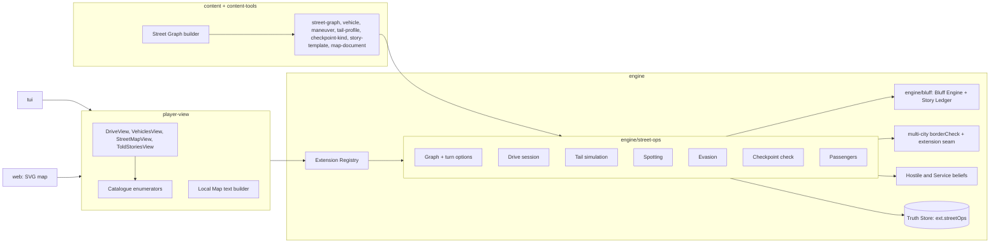

# Design Document

## Overview

Street-ops puts the player behind the wheel of a car in a real city. The player drives by choosing turns, notices vehicles that keep reappearing, tries to lose a tail, passes checkpoints, carries people who must not be found, and lies to guards. It is an add-on: when it is off, the game is identical to the game without it.

Five decisions do most of the work.

1. **A street graph is new content, and the Sim holds it.** Cities have Districts, Locations and Routes measured in phases, but no streets. The graph is authored per city by a deterministic builder from an openly licensed dataset, with hand overrides for the period. The player sees only the part they know.
2. **The slice's tail decision stays where it is.** The Hostile Service already decides whether the player is tailed (`player.tailed`, set by the hostile side). Street-ops gives that decision a physical form (a Tail Team of vehicles on the graph) and writes the outcome back. There is no second surveillance AI.
3. **Truth and view are split exactly as in the slice.** Where every tail vehicle is, what is in the car, and which of the player's statements were lies live in the Truth Store. The player gets Observations (true statements that a vehicle was seen), which they must interpret.
4. **Outcomes are pure functions with monotonic properties.** The checkpoint check, the concealment check and the bluff assessment take explicit inputs and a PRNG, return one outcome, and are tested for monotonicity. Models only voice lines and transcribe typed answers. They never decide.
5. **The add-on needs an extension seam, so we build the smallest one.** `Action` is a closed union and the state and Truth Store have fixed shapes. An **Extension Registry** lets an add-on register action kinds, a state slice, a Truth slice, content kinds, Fact Line templates, a catalogue enumerator and a describer. Existing kinds are untouched.

### Key decisions

| Decision | Choice | Rationale |
|---|---|---|
| Action extensibility | Namespaced kinds (`street-ops.*`) in one `ExtensionAction` member of the union, dispatched by an Extension Registry | Exhaustive switches over existing kinds stay valid. Disabling the add-on removes the registrations |
| State and Truth | One `ext` map on `WorldState` and one on the Truth Store, each slice versioned and schema-validated | Save, load and the isolation tests keep working. A slice absent from a save is initialised, so old saves load |
| Time | Drive Ticks inside a session. The clock advances a phase each time ticks cross a boundary. A session costs at least one phase | Respects Slice Req 3.1 (every action costs a phase or more) while letting a drive be finer than a phase |
| Zero-phase steps | A new `phaseAccounting: 'sub-phase'` flag, allowed only while the extension's session state is open | The same mechanism setting-generalization needs for Instant Actions. Defined once, here and there |
| Tail model | Trail-following with per-vehicle lag, a skill-based hold check at manoeuvres, and hand-off | Cheap, deterministic, explainable to the player in Observations. No pathfinding per tail per step |
| Randomness | One `street` stream family. Each draw comes from a sub-stream keyed by `(sessionKey, kind, stableKey)` | Independent of processing order. Cannot perturb any other stream |
| Bluff | A general `engine/bluff` module. Checkpoints are its first user | The player-side deception gap is general. Consulates and cold approaches can use it later |
| Narration | Off for ordinary Drive Steps, on for arrival, Checkpoints and Bluff scenes | Keeps a step fast. Fact Lines always come first (Slice Req 15.5) |
| Street data | The user fetches it from a named source and builds the graph locally. Nothing third-party is committed | The repository carries no third-party data and no share-alike obligation. A city without a built graph simply cannot be driven. A small original graph ships for tests and the demo |
| Maps | The Sim holds the full graph. The Player View holds Street Knowledge. Text map for the TUI, SVG for the web, both from the same view | Requirement 16. No client can show more than the view contains |

## Architecture



### Package changes

- **`engine/extension`** (new): the Extension Registry (below). Small, with its own tests.
- **`engine/street-ops`** (new): graph, drive, tail, spotting, evasion, checkpoint, passengers, hooks, config.
- **`engine/bluff`** (new): the Bluff Engine, Story Templates evaluation and the Story Ledger.
- **`engine`** (small edits): `Action` gains `ExtensionAction`; `quote` and `resolve` get a default branch that delegates to the registry; `WorldState` and the Truth Store gain `ext`; the Objective Evaluator factory accepts extension objective kinds; the hostile belief module is called, not changed.
- **`multi-city`** (amendment, see Requirement 8.1): `borderCheck` accepts an optional extension, and Requirement 3 gains a criterion for it.
- **`content`**: new kinds registered through the Content Kind Registry, and their Zod schemas.
- **`content-tools`**: the Street Graph builder and linter rules.
- **`player-view`**: views, catalogue enumerators registered by the add-on, the Local Map text builder, and the street-ops Phrasebook entries.
- **`tui`** and **`web`**: render the views. The web client adds an SVG map.
- **`app`**: composition-root registers the add-on when `streetOps.enabled`.
- **`config/scenario.yaml`**: a `streetOps` block.

### PRNG streams

`streetStream = derive(seed, STREET_STREAM_ID)`. Every draw is `sub(streetStream, key)` where `key` hashes `(sessionKey, kind, stableKey)`: for example `(sessionKey, 'traffic', segmentId + ':' + tickWindow)` or `(sessionKey, 'hold', teamId + ':' + stepIndex)`. `sessionKey` is `(day, phase, startLocation, ordinal of drive sessions that phase)`. Draws therefore do not depend on the order in which Tail Vehicles or Segments are processed, and an inserted Observation cannot shift a later draw. Bluff and checkpoint draws use the same family with their own kinds. No existing stream is touched.

## Components and Interfaces

### Extension Registry (`engine/extension`)

```ts
interface ActionExtension<A extends ExtensionAction = ExtensionAction> {
  readonly kind: `${string}.${string}`;                       // e.g. 'street-ops.turn'
  readonly schema: ZodType<A>;
  readonly phaseAccounting: 'standard' | 'sub-phase';          // sub-phase: 0 phases, needs an open session
  readonly requiresSession?: string;                           // the state slice key that must be open
  quote(state: WorldState, a: A, ctx: ResolverContext): ActionQuote;
  resolve(state: WorldState, a: A, rng: Prng, ctx: ResolverContext): ResolveResult;
  location?(a: A): LocId | undefined;                          // for the Location gate
}

interface StateSliceExtension<S> {
  readonly key: string;                                         // 'streetOps'
  readonly version: number;
  readonly schema: ZodType<S>;
  initial(world: WorldState, ctx: ResolverContext): S;
  migrate?(old: unknown, from: number): S;
}

interface TruthSliceExtension<T> { readonly key: string; readonly schema: ZodType<T>; initial(): T }

interface ObjectiveKindExtension { readonly kind: string; build(def: ObjectiveDef): ObjectiveEvaluator }

interface HookExtension { readonly id: string; phase(state, rng, ctx): StateDelta; day?(state, rng, ctx): StateDelta }

interface ExtensionRegistry {
  register(ext: AddOn): void;     // AddOn bundles any of the above plus content kinds and fact templates
  readonly actions: ReadonlyMap<string, ActionExtension>;
  // ...
}
```

- An `AddOn` bundle is `{ id, version, actions, state, truth, objectives, hooks, contentKinds, factTemplates, describers, enumerators, phrasebook }`. Enumerators and describers are for `player-view` and are carried in a view-side half of the bundle, so `engine` never imports them.
- `Action` becomes `BuiltInAction | ExtensionAction`, where `ExtensionAction` is an object whose `kind` is a namespaced string of the form `<addon>.<name>` (for example `street-ops.turn`) and whose other fields are JSON values validated by the registered schema. `quote` and `resolve` handle built-in kinds in their existing `switch`, then delegate in `default`. A kind that is not registered quotes as `allowed: false, reason: 'unavailable'`.
- **Sub-phase accounting.** The Turn Pipeline treats a quote with `phases === 0` from an action whose registry entry says `sub-phase` and whose required session is open as "no clock advance". Anything else with zero phases is rejected as today (`phase-cost-accounting.spec.ts` stays valid). setting-generalization's Instant Actions use the same flag with their own session predicate.
- The registry is built once by the Composition Root. With `streetOps.enabled: false` nothing is registered, the `ext` map is empty, and no code path of the add-on runs.
- The Content Manifest includes the add-on id and version and its packs. A save made with the add-on cannot be loaded without it (Slice Req 31.6).

### Street Graph (`engine/street-ops/graph` and the `street-graph` kind)

File shape (YAML, committed in an extension pack that `requires` the city pack):

```yaml
kind: street-graph
city: vienna
sources:
  - { name: "…", licence: "CC-BY-4.0", attribution: "…", retrieved: "2026-10-01", url: "…" }
junctions:
  - { id: j-0001, name: "Schwarzenbergplatz", x: 1204, y: -388, district: d-innere-stadt }
segments:
  - { id: s-0001, street: "Kärntner Ring", from: j-0001, to: j-0002, lengthM: 240,
      speed: normal, oneWay: false, lanes: 2,
      traffic: { morning: 3, afternoon: 4, evening: 2, night: 1 },
      shape: [[1204,-388],[1260,-402],[1440,-410]], yearRange: [1946, 1965],
      landmarks: [ { at: 0.5, loc: loc-cafe-central } ] }
frontages:
  - { location: loc-cafe-central, segment: s-0001, at: 0.5, side: right }
checkpoints:
  - { id: cp-ring-sector, kind: sector-line, segment: s-0102, at: 0.8, service: svc-soviet, visibleM: 120, hours: [morning, afternoon, evening] }
```

Runtime form:

```ts
interface StreetGraph {
  readonly junctions: ReadonlyMap<JunctionId, Junction>;
  readonly segments: ReadonlyMap<SegmentId, Segment>;
  readonly out: ReadonlyMap<JunctionId, readonly Directed[]>;   // directed edges honouring one-way
  turnOptions(arrival: Directed): readonly TurnOption[];
  frontageOf(loc: LocId): Frontage | undefined;
}
interface Directed { readonly segment: SegmentId; readonly dir: 'fwd' | 'rev' }
type Relative = 'u-turn' | 'hard-left' | 'left' | 'bear-left' | 'straight' | 'bear-right' | 'right' | 'hard-right';
interface TurnOption { readonly relative: Relative; readonly to: Directed; readonly street: string; readonly ticks: number }
```

- **Turn options.** At a junction, take each outgoing directed edge. The relative direction is the signed angle between the arrival bearing (reversed to the incoming heading) and the exit bearing, bucketed: within ±20° straight; 20–60° bear; 60–120° left or right; 120–160° hard; a U-turn is the reverse edge when it is two-way and the junction allows it. Edges the graph forbids (one-way against, barred turns listed on the junction) are not generated. Two exits that bucket to the same relative direction are disambiguated by street name ("second left", then by name).
- **Ticks per segment.** `ceil(lengthM / speedMPerTick[speedClass] * trafficFactor(phase) )`, with the player's speed setting (slow, normal, fast) scaling ticks and, in the tail check, Tail Vehicle hold difficulty.
- **Frontages.** A Location is entered from its Segment at the given offset. Parking at a Frontage ends the Drive Session and places the player at the Location exactly as the slice's `travel` does. Starting a session from a Location puts the Vehicle at its Frontage.
- **Linting.** The Pack Linter checks Requirement 2.3: strong connectivity of two-way streets, one-way consistency, every Frontage reachable from the hub Location, every checkpoint on a Segment, a graph size within configured bounds, and `yearRange` inside the Era Pack's Period Window.
- **City without a graph.** `drive` quotes `allowed: false, reason: 'no usable street map'`. Nothing else changes.

### State, Truth and Player View split

```ts
// WorldState.ext.streetOps (view-safe: things the player could know)
interface StreetOpsState {
  readonly vehicles: readonly VehicleRecord[];          // the player's vehicles, plates, 'known-burned' marks the player was told about
  readonly knowledge: Readonly<Record<SegmentId, KnowledgeSource>>;   // 'driven' | 'seen' | 'map' | 'local' | 'aid'
  readonly session?: DriveState;
  readonly told: readonly ToldStory[];                  // the player's own told list
  readonly counters: { sessions: number };
}

// Truth.ext.streetOps (Truth-branded)
interface StreetOpsTruth {
  readonly teams: Readonly<Record<TeamId, TailTeam>>;
  readonly vehicleContents: Readonly<Record<VehicleId, readonly Hidden[]>>;
  readonly knownBy: Readonly<Record<VehicleId, readonly ServiceId[]>>;         // services that logged the plate
  readonly ledger: Readonly<Record<ServiceId, readonly StoryEntry[]>>;
  readonly statements: readonly PlayerStatementTruth[];                          // wasLie per statement
}
```

Player View carries `StreetOpsState` through the facade's projections. It never receives `StreetOpsTruth`. The debrief reveals it.

### Drive session (`engine/street-ops/drive`)

```ts
interface DriveState {
  readonly sessionKey: string;
  readonly vehicle: VehicleId;
  readonly at: Directed;                  // the segment and direction the vehicle is on
  readonly progress: number;              // 0..1 along the segment, 0 at the junction just left
  readonly speed: 'slow' | 'normal' | 'fast';
  readonly ticks: number;                 // total in this session
  readonly phasesCharged: number;         // starts at 0; the session pays at least 1 by its end
  readonly path: readonly Directed[];     // the trail, newest last (truth-safe: the player drove it)
  readonly passengers: readonly Passenger[];
  readonly pendingCheckpoint?: CheckpointId;
}
```

Actions (all registered through the Extension Registry; all committed as ordinary turns):

| Kind | Accounting | Meaning |
|---|---|---|
| `street-ops.drive` | standard, charges the session's first phase on end | Start a session at the Location's Frontage in a chosen Vehicle |
| `street-ops.turn` | sub-phase | Take a Turn Option at the next Junction |
| `street-ops.speed` | sub-phase | Change speed |
| `street-ops.look` | sub-phase, 1 tick | `look-around` or `check-mirror` (raises attention for this step) |
| `street-ops.maneuver` | sub-phase | An Evasion Maneuver offered at this Junction |
| `street-ops.stop` | sub-phase | Stop at the kerb for N ticks (needed for pickups and for letting a car pass) |
| `street-ops.park` | closes the session | Park at a Frontage: end the session, arrive at the Location |
| `street-ops.pickup`, `street-ops.dropoff` | sub-phase | Take on or let off a Passenger at a Frontage (Requirement 9) |
| `street-ops.declare` | sub-phase | Respond at a Checkpoint (Requirement 10) |

**Clock rules.** Ticks accumulate. When `ticks` crosses a multiple of `ticksPerPhase` (default 360), the pipeline calls the slice's `advanceWorld` for one phase, so the day-boundary hooks, Plot and schedules run as normal, and `phasesCharged` increments. When the session closes, if `phasesCharged < 1` it advances one phase, so a session costs at least one phase (Slice Req 3.1). Checkpoint hours, closing times of Frontage Locations and traffic read the current phase.

**Save and load.** The session is part of `ext.streetOps`, so a save mid-drive resumes at the same Segment and progress. Because each step is an action in the action log, replay is step by step.

**What a step shows.** Fact Lines, never Flavour, by default: the street and heading, the Turn Options (`left: Schwarzenbergplatz`, `straight: Kärntner Ring`, `u-turn`), the Frontages and Landmarks on the approach, traffic ("heavy"), a visible Checkpoint, and the Observations of Requirement 6. The Narrator is invoked only on arrival, at a Checkpoint and in a Bluff scene (`streetOps.narrateSteps: false`).

### Tail simulation (`engine/street-ops/tail`)

**Origin of a tail.** The slice's hostile side already sets `player.tailed`. In street-ops that decision is read, not replaced:

1. A day-boundary hook, `materialiseTails`, looks at each Service that has decided to tail the player (the slice flag for the Hostile Service, the equivalent field on multi-city's `ServiceState`) and has no live team. It draws a `TailTeam` from the Service's Tail Profile and the Game Year's Surveillance Methods, on the `street` stream keyed by `(day, serviceId)`.
2. A team lasts until it loses the player for `lostTimeout` phases, is withdrawn by the Service, or the Service stops tailing.
3. After every Tail Status change the add-on writes `player.tailed` back (attached or handed-off is true; lost or burned is false), so the slice's plain `travel` action and its Cover Suspicion rules continue to work when the player does not drive.

```ts
interface TailTeam {
  readonly id: TeamId; readonly service: ServiceId; readonly profile: ProfileId;
  readonly vehicles: readonly TailVehicle[];       // each: { id, vehicleDef, descriptor, lag, role: 'lead'|'parallel'|'backup' }
  readonly status: 'attached' | 'lost' | 'handed-off' | 'burned';
  readonly since: number;                          // session tick
  readonly lastKnown?: Directed;
}
```

**Position.** A Tail Vehicle sits on the player's own `path` at index `max(0, playerIndex - lag)` where `lag` is the vehicle's following gap in segments from the Tail Profile, with one deterministic jitter step from `sub(street, (sessionKey,'jitter',vehicleId+':'+step))`. Lead vehicles keep a small gap, parallel vehicles ride one Segment off the trail when the graph has one, and backups wait at the previous Junction. A team that is `lost` stops following. Its vehicles hold at `lastKnown`, which matters if the player drives back past.

**Hold check at manoeuvres and checkpoints.** For a manoeuvre `m` with quality `q` the hold probability is

```text
pHold = clamp( profile.skill × (1 − m.quality) × teamFactor(vehicles) × trafficFactor(segment, phase) + profile.discipline × 0.1 , 0, 1 )
```

with coefficients from the Tail Profile and the Difficulty Preset, and `teamFactor` rising with the number of vehicles. The draw is `sub(street, (sessionKey,'hold',teamId+':'+step))`. Outcomes:

- hold: status stays `attached`, the lag may widen by one.
- hand-off (when the team has a backup and `profile.handoff` allows): the lead vehicle is replaced by a backup with a new descriptor, status `handed-off`, and the player sees only a new vehicle in later Observations.
- lost: status `lost`.
- burned: the team's vehicle was recognised or the manoeuvre was reckless. Status `burned` and the service learns the player is "running a counter-surveillance" (belief update below).

**Beliefs.** Each status change calls the slice's belief functions (`hostile/beliefs`, `hostile/consequences`; the exact entry points are bound in implementation) with a reason code:

| Event | Effect |
|---|---|
| Obvious evasion (a manoeuvre with `obvious: true`, or a hold check failing by a margin) | Cover Suspicion up by the content amount, Exposure unchanged |
| Quiet loss (the team lost the player without a flagged manoeuvre) | No Cover Suspicion change |
| Arrival at a Location with an attached team | The service logs the Location and the people who meet the player there, as watchers do now, and raises an Asset's Exposure by the slice factor |
| A plate logged by a team or a checkpoint | `knownBy[vehicle]` gains the service. The Vehicle is burned for that service |

### Spotting (`engine/street-ops/spot`)

At each step the Sim builds the set of **visible vehicles**:

1. **Tail vehicles** whose trail index is within `sightWindow` of the player and whose graph distance to the player is below `sightRange`.
2. **Innocent Traffic.** For the current Segment and neighbours, a deterministic count from the Segment's `traffic` level draws pseudo-vehicles from the vehicle table with descriptors, keyed by `(sessionKey,'traffic',segmentId+':'+window)`. A small per-session pool of **regulars** (a delivery van on the Ring, a tram-side taxi) recurs by design, at a rate from the Difficulty Preset, to produce false alarms.
3. For each visible vehicle, an observation draw:

```text
pNotice = clamp( base × attention × conspicuousness × (1 − discipline) × trafficVisibility × distanceFactor , 0, 1 )
```

where `attention` is 1 normally, higher after `look` or `check-mirror`, and lower while driving `fast` (eyes on the road). The draw is keyed `(sessionKey,'notice',vehicleId+':'+step)`.

A noticed vehicle becomes an **Observation** (the slice type) with a descriptor (colour, kind, a partial registration) and the Segment. Observations become Fact Lines in the Journal: "A grey sedan, partial plate W-4..., was behind you on Kärntner Ring." They are true as statements and carry no claim that the vehicle is a tail. The same descriptor noticed again is the player's evidence. The Sim never says "you are being followed".

Missed tails and false alarms arise from the same draw. The Difficulty Preset sets base rates and the regular pool size.

### Evasion (`engine/street-ops/maneuver`)

```yaml
kind: evasion-maneuver
id: contraflow-one-way
quality: 0.75
ticks: 2
obvious: true
requires: { junction: { hasOneWayExit: true, trafficAtMost: 3 } }
fact: "You swung into the one-way street the wrong way and out the far end."
```

- `requires` is evaluated by the Sim against the Street Graph and the phase. A maneuver is offered as a Turn Option only where it holds (a dead-end turn needs a dead end; a parking structure needs a Frontage of that kind; a tram crossing needs a flagged Junction; a Checkpoint pass-through needs a Checkpoint).
- The Sim resolves the hold check above, writes the status, applies belief effects and emits a Fact Line.
- A **Surveillance Detection Route** is a named route (a list of Junction ids in a content file) the player can follow. When the player completes it, the Sim summarises the Observations made on it, with no verdict (Requirement 7.7).
- The player learns a tail is gone only because Observations stop. The Sim never reports `lost`.

### Vehicles (`vehicle` kind and `engine/street-ops/vehicle`)

```yaml
kind: vehicle
id: veh-opel-kapitan
name: "Opel Kapitän"
years: [1948, 1963]
speed: normal
seats: 5
conspicuousness: 0.3
spots:
  - { id: boot, capacity: 1, difficulty: 0.5, endurance: 45, reachedBy: [boot, undercarriage] }
  - { id: rear-footwell, capacity: 1, difficulty: 0.25, endurance: 20, reachedBy: [interior, boot] }
```

Vehicles are instances (`VehicleRecord`) with a plate tied to an identity. Hire, borrow and return are ordinary actions at Locations that offer them (a garage Location Type tag). A plate or vehicle swap is an action at a Location with a workshop tag and clears `knownBy` for the swapped item at a cost and a risk. The Player View shows the player's vehicles and the burn marks the player was told about. It omits `conspicuousness`, `difficulty` and `endurance`.

### Checkpoint check (`engine/street-ops/checkpoint`)

`checkpoint.ts` implements multi-city's Border Check Extension Seam for a traveller in a Vehicle (Requirement 8.1). It is a pure function:

```ts
interface VehicleCheckInput {
  readonly service: ServiceState;          // controlling service: strictness, watch list, doctrine
  readonly post: CheckpointDef;            // kind, strictness, searchThoroughness, kinds of search available
  readonly vehicle: VehicleRecord;
  readonly contents: readonly Hidden[];    // from Truth
  readonly occupants: readonly Occupant[]; // driver, declared, concealed (with composure, spot, ticksConcealed)
  readonly papers: Papers;
  readonly story: CoverStory | undefined;
  readonly ledger: readonly StoryEntry[];
  readonly preset: DifficultyPreset;
}
type VehicleCheckResult = { outcome: BorderOutcome | 'vehicle-seized' | 'turned-back'; ticks: number; found: readonly Hidden[]; facts: readonly FactLine[]; deltas: BeliefDeltas };
function vehicleCheck(input: VehicleCheckInput, rng: Prng): VehicleCheckResult;
```

Order of evaluation:

1. **Papers and registration** against the post's requirements (multi-city's validity rules): missing or invalid leads to refusal or detention as `borderCheck` defines.
2. **Watch List.** A hit on any occupant's identity or the Vehicle's registration leads to detention.
3. **Interview.** If the post interviews, the Bluff Engine assesses the Cover Story (Requirement 10). A contradiction or a ledger conflict raises the search level and Cover Suspicion, or leads to detention above a threshold.
4. **Search level.** From post strictness, the Cover Suspicion the service holds, and the interview result, the search is one of none, visual, interior, boot, undercarriage. The draw is keyed `(sessionKey,'search',postId+':'+step)`.
5. **Detection.** For each Hidden item or Concealed Passenger in a spot the search `reachedBy` includes:

```text
z = a·thoroughness + b·searchLevelRank − c·spot.difficulty − d·composure − e·(ticksConcealed / spot.endurance) + f·suspicion
pFound = logistic(z)
```

   with fixed positive coefficients `a, b, f` on the "more likely found" side and `c, d` on the "less likely" side. Spots the search does not reach are never found by it.
6. **Outcome mapping.** Found contraband: seizure and Cover Suspicion. Found Passenger: detention of occupants, vehicle seizure, Cable to the Regional Station (multi-city). Nothing found: pass, or secondary inspection if the interview raised suspicion.

**Monotonicity.** `pFound` is non-decreasing in `thoroughness`, `searchLevelRank`, `suspicion` and `ticksConcealed`, and non-increasing in `difficulty` and `composure`. Property 8 tests each by generated pairs. The draw is a threshold on `pFound` with the same uniform for both inputs of a pair, which makes the monotonicity exact rather than statistical.

**Checkpoint visibility.** A Checkpoint has `visibleM`, and the drive step shows it when the remaining distance is within that. The player may slow, change route or turn back. A turn-back is noticed with the post's doctrine flag (`watchesAvoidance`), and raises Cover Suspicion only when set. A Tail Vehicle at a Checkpoint is delayed by the same check ticks, which feeds the hold check for the team.

**Where the check runs.** For fixed posts (Border Posts, Sector Lines) the multi-city `borderCheck` calls `vehicleCheck` through the seam when the traveller's context carries a Vehicle. For roadblocks and random stops the add-on creates a transient `CheckpointDef` from the ambient-world City Event (police crackdown) or from the police-pressure metric draw keyed by `(sessionKey,'stop',segmentId+':'+window)`.

### Passengers (`engine/street-ops/passenger`)

```ts
interface Passenger { readonly npc: NpcId; readonly mode: 'declared' | 'concealed'; readonly spot?: SpotId; readonly ticksConcealed: number; readonly composure: number }
```

- **Arranging.** The player uses the slice's `arrange-meeting` to bring the NPC to a Frontage Location. The NPC must be present and willing (Asset trust above a content threshold, or a defector Directive). `pickup` puts them in the Vehicle as declared or concealed, if a spot has capacity.
- **Composure** is derived from the NPC's archetype Tags through a `composure-by-tag` content table (calm, steady, nervous, reckless) plus a persona factor. It is truth-adjacent (it comes from the NPC record), so it lives in the Truth slice and never reaches the view.
- **Endurance.** Each step adds the step's ticks to `ticksConcealed`. When it exceeds the spot's `endurance`, the Passenger becomes `strained`: the Sim shows the player a Fact Line ("Your passenger is struggling to stay quiet") and sets composure to its floor. A search that reaches the spot finds a strained Passenger with certainty.
- **Delivery.** `dropoff` at the destination Frontage records a `smuggle-delivered` event. The `smuggle` objective kind (registered through the Extension Registry) lets the Objective Evaluator mark a Directive complete. Plot and Side Thread templates may use it through Tag Queries. No Plot Stage may.
- **Failure.** A found Passenger leads to the checkpoint outcome, the NPC's Exposure and the slice's consequences for a blown Asset.

### Bluff Engine (`engine/bluff`)

The slice models NPC lies (Told List, Chickenfeed, Dangles) and gives the player Cover Identity and cold approaches. It has no way for the player to lie on purpose and be held to it. This module adds one.

```ts
interface CoverStory {
  readonly identity: IdentityRef;                   // from Cover Identity and the Papers carried
  readonly purpose: StoryTemplateId;
  readonly origin: PlaceRef; readonly destination: PlaceRef;
  readonly declaredPassengers: readonly PassengerDecl[];
  readonly declaredCargo: readonly CargoDecl[];
}
interface Assessment { readonly contradictions: readonly Contradiction[]; readonly plausibility: number; readonly facts: readonly FactLine[] }
function assess(story: CoverStory, ctx: TruthCtx, controller: ControllerCtx, ledger: readonly StoryEntry[]): Assessment;
```

- **Story Templates** (`story-template` kind) are authored: id, label, the slots they fix (purpose, plausible origins and destinations by Tag Query), the Cover Identities they suit, required Papers, follow-up question templates and Year Range. The player chooses from templates that fit their Cover Identity and Papers. A template unsuited to the Papers is not offered.
- **Assessment** compares each claim with: the Truth (what is in the Vehicle, where the player really is going), the Papers, the controller's Knowledge Slice and public city facts (a hotel that exists, a street that is one-way), and the Story Ledger. It is pure and deterministic.
- **Follow-Up Questions** come from the template and the controller's Knowledge Slice (for example the declared hotel's name and street). The player answers by selecting among canned answers or by typing.
  - **Selected answers** map to Propositions directly. The outcome is model-free.
  - **Typed answers** are transcribed by the `bookkeeping` role through the slice's claim extraction into canonical Propositions. The Sim compares the Propositions. Model output is therefore an input to the comparison and never the decision, which is the same trust model as NPC speech (Slice Req 7). Replay uses the recorded Gateway output, as for dialogue.
  - The controller's spoken lines are Flavour from the `voice` or `fast` role under the Leak Guard. They are written after the Sim has fixed the outcome and cannot change it.
- **Story Ledger.** Each told story and answer set is stored as `StoryEntry { day, place, service, slots, propositions }` for the Controlling Service and for each Service that shares records with it (multi-city liaison and rivalry tables, or the same Service in single-city play). A new story is checked against the ledger by slot: differing `origin`, `purpose`, `occupation` or `declared-passengers` for the same identity within a content-defined window is a contradiction.
- **Truth record.** Each statement is saved to `statements` with `wasLie` computed against Truth. The Player View shows the player their own told stories (like the slice's Told List for NPCs). `wasLie` is revealed only in the debrief.
- **No statistic.** `plausibility` is computed from preparation only: Papers consistent with the identity and the story, Cover Identity fit, ledger consistency and what is actually in the Vehicle.

### Hooks (`engine/street-ops/hooks`)

- **Day boundary:** `materialiseTails`, expiry of lost teams, regular pool refresh, wear on vehicles (none in v1), purge of ledger entries older than the retention window.
- **Phase boundary:** none beyond the clock rules above. The add-on adds no per-phase cost when no session is open and no team exists.

### Player View and clients

```ts
interface DriveView {
  readonly vehicle: { name: string; plate: string };
  readonly street: string; readonly heading: string;            // "north-east"
  readonly options: readonly { relative: Relative; street: string; ticks: number; action: Action }[];
  readonly speed: 'slow' | 'normal' | 'fast';
  readonly onApproach: readonly { loc: LocId; name: string }[];
  readonly traffic: 'light' | 'moderate' | 'heavy';
  readonly checkpointAhead?: { name: string; distanceBand: 'near' | 'far' };
  readonly observations: readonly ObservationView[];             // this step
  readonly clock: { phase: Phase; ticksInPhase: number };
  readonly passengers: readonly { label: string; mode: 'declared' | 'concealed' }[];
  readonly lastManeuver?: string;                                // the player's own action, for audio and help
}
interface StreetMapView {
  readonly nodes: readonly { id: JunctionId; x: number; y: number; name?: string }[];
  readonly edges: readonly { id: SegmentId; from: JunctionId; to: JunctionId; street?: string; known: 'driven' | 'seen' | 'map' | 'local' | 'aid'; shape: readonly [number, number][]; oneWay: boolean }[];
  readonly locations: readonly { loc: LocId; name: string; at: readonly [number, number] }[];
  readonly checkpoints: readonly { name: string; at: readonly [number, number]; seen: boolean }[];
  readonly sectorLines: readonly { name: string; polyline: readonly [number, number][] }[];
  readonly position?: { at: readonly [number, number]; headingDeg: number };
}
```

- `StreetMapView` is a pure projection from `ext.streetOps.knowledge` and the graph, filtered to known segments. Unknown streets are omitted, and a segment known only from a map Document shows the Document's version (Requirement 16.9). No Tail, no other vehicle, no unseen checkpoint, no search detail.
- **Local Map (text).** `renderLocalMap(view)` returns the lines for the TUI. Example:

```text
You are on Kärntner Ring, heading north-east, in the Opel Kapitän.

                 Ringstraße (straight, 3 min)
                       |
 Schwarzenbergplatz ---+--- Kärntner Straße
     (left, 1 min)     |        (right, 1 min)
                       ^
                  you are here
 Ahead: Café Central on the right. Checkpoint (Sector Line) 120 m on Ringstraße.
```

  It places each Turn Option at its relative position, keeps the street names, and truncates to the terminal width. It adds nothing that is not in `DriveView`.
- **Web map.** `layoutStreetMap(view, size)` is a pure function in `web/client` that fits the nodes to the viewport (north up), draws edges as polylines from `shape`, styles `driven`, `seen` and `map` differently (solid, dashed, dotted), draws one-way arrows, labels streets at readable zoom, marks known Locations and seen Checkpoints, and rotates a marker for `position.headingDeg`. Everything is derived from `StreetMapView`.
- **Catalogue.** The add-on's enumerators add `street-ops.drive` (one per owned or available Vehicle, only from a Location with a Frontage), the Turn Options and maneuvers in an open session, `pickup`, `dropoff`, `look`, `park`. They are quoted by the registry. Outside a session the catalogue shows only `drive`.
- **Phrasebook.** `drive`, `turn`, `park`, `look in the mirror`, `pull over`, `let him through`, with the street-ops risky set (`pickup` of a Concealed Passenger, `maneuver`) so natural-language-commands asks for confirmation.
- **Notifications.** Detention and vehicle seizure notify through multi-city's Cable. Tail events produce no Notification, by design.

## Content

| Kind | Directory | Notes |
|---|---|---|
| `street-graph` | `street-ops/graphs/` (shipped mini-graph) and `packs/street-ops-local/` (built, git-ignored) | City-scoped. One file per city. Built graphs carry `sources` and an attribution file |
| `vehicle` | `street-ops/vehicles/` | With `spots` |
| `evasion-maneuver` | `street-ops/maneuvers/` | With `requires` predicates over graph features |
| `tail-profile` | `street-ops/tails/` | Referenced by Service Definitions |
| `surveillance-method` | `street-ops/methods/` | Year Range, Capability Requirement (setting-generalization) |
| `checkpoint-kind` | `street-ops/checkpoints/` | Search kinds, thoroughness, hours, doctrine flags |
| `story-template` | `street-ops/stories/` | Slots, fits, follow-ups |
| `composure-table` | `street-ops/composure/` | Archetype Tags to composure |
| `map-document` | `street-ops/maps/` | A Document kind: segments revealed, Year Range, errors |

All are registered through the Content Kind Registry with Field Declarations, in packs of role `extension`. Shipped content for the Core City (Requirement 14.1): one small hand-authored graph (the Inner City and the Sector Line, original work, for tests and the demo), six vehicles, eight maneuvers, three tail profiles, the Sector Line checkpoint kinds, ten story templates, a composure table and one map Document (a folded city map at newsstands).

## Street Graph builder (`content-tools`)

`pnpm content street-graph build` is deterministic and offline.

```text
inputs : --city <id> --area <bbox or polygon> --data <GeoJSON|Overpass JSON file(s)> --locations <city pack path> --overrides <yaml> --out <pack dir>
steps  : 1 read features → keep drivable highway classes with names
         2 build a planar graph, splitting ways at shared nodes
         3 contract degree-2 nodes into one segment, keeping `shape` (simplified by tolerance)
         4 merge parallel duplicates, drop dead-end stubs under a length floor
         5 compute lengthM, bearings, one-way flags, speed class from the highway class
         6 assign district from the city pack's district polygons
         7 snap each Location to the nearest segment as a Frontage (offset, side)
         8 place sector-line and fixed checkpoint definitions on named segments
         9 apply overrides (rename, close, reverse one-way, delete, add), each with a reason
        10 write YAML with sorted ids and coordinates rounded to 1 m; write `sources`
```

- Input files are fetched by a separate, explicit command (below) and are never committed. The builder never touches the network.
- It refuses a dataset that has no recorded licence acceptance, and writes the attribution into `sources` and into an attribution file beside the graph.
- Size: the builder aims for 300 to 1500 junctions per city (configurable). A larger result is simplified harder, never silently.
- **Period.** Modern data rarely matches 1950. Overrides carry the differences the author knows (a bridge, a one-way, a renamed street). The linter compares the Era Pack's Period Window to the data's date and warns unless overrides cover known differences.
- **Period names (automated).** `pnpm content street-graph period --city <id> --year <yyyy>` resolves street names for the year from a Period Name Source. For Vienna this is the Wien Geschichte Wiki, a Semantic MediaWiki whose street pages carry `Datum von`, `Datum bis`, `Name seit` and `Frühere Bezeichnung` fields, readable through its API. For example, `Universitätsring` (since 2012) links back to `Dr.-Karl-Lueger-Ring (1)` (1934–2012), `Ring des 12. November (1)` (1919–1956) and `Franzensring (1)` (1870–1919). The command follows the chain, emits overrides that cite each record, marks streets whose first name postdates the year as not yet built, and writes a Period Report of anything uncertain. In the example, 1952 falls inside two overlapping ranges, so it is reported rather than guessed. Report items are resolved by an agent reading the cited record and writing an override with its reason. Only names, dates and links are stored; the wiki's text and images are not. Geometry still comes from OpenStreetMap, and changed layouts (rebuilt blocks, new bridges) remain overrides.
- **Removals, additions and rebuilt areas (imagery review).** Dated names catch renames, but not streets that have disappeared, streets added since, or areas rebuilt after the war. Those come from a review of georeferenced period imagery. For Vienna the City's Open Government Data (CC BY 4.0) provides the war-damage plan of about 1946 (WMS `BOMBENSCHADENOGD`, drawn on a pre-war base plan with street names and damage colouring), the aerial photo plans of 1956 and 1938 (WMTS `lb1956`, `lb1938` at `maps.wien.gv.at`, Web Mercator) and the 1912 general city plan. The 1956 aerial is closest to the game's period and shows the real layout; the 1946 plan gives names and wartime damage; 1938 shows what stood before the war. `street-graph review-sheets` cuts the Verified Area into tiles (about 300 m square) and writes, for each, the modern Segments drawn over each layer at the same extent. An agent (Claude) reviews the sheets tile by tile and writes overrides — `remove`, `add`, `close`, `reclassify`, `replace-area` — each citing the layer and tile and carrying a confidence. Anything not readable with confidence becomes an open Period Report item. The Verified Area is kept small (the Inner City, the Ring, the Danube Canal bridges and the sector-line crossings), and everything outside it loads as `unmapped`, so no unreviewed street reaches play. Coverage in the Period Report shows what share of the Verified Area is confirmed, changed or unchecked.
- **Where the data comes from.** `pnpm content street-data fetch --source <name> --city <id> --area <bbox> --accept-licence <name>` downloads from a **named source** listed in `config/street-sources.yaml` (name, retrieval method, the licence the source states, required attribution). The command prints the licence and attribution, refuses to run without the explicit acceptance flag for that source, and writes the data and an acceptance record (source, area, date) to `data/street-sources/`, which is git-ignored. `pnpm content street-graph build` then reads that directory and writes the built pack to `packs/street-ops-local/`, also git-ignored. Each source entry's licence is whatever the source itself states, and whoever adds an entry checks it. Candidate sources include OpenStreetMap (via a named extract service) and, for US cities, the US Census TIGER/Line files. The repository ships no third-party data, so it carries no share-alike obligation from them. If you distribute a built game, the attribution file and the credits screen carry the required credit, and the licence of each source you used then applies to what you distribute. I am not a lawyer, and this is worth checking against the source you pick.

## Data Models

```ts
interface StreetOpsConfig {
  readonly enabled: boolean;
  readonly ticksPerPhase: number;               // 360
  readonly speedMPerTick: Record<'slow'|'normal'|'fast', number>;
  readonly narrateSteps: boolean;               // false
  readonly sightRangeM: number;
  readonly lostTimeoutPhases: number;
  readonly checkpointVisibleDefaultM: number;
}
```

`scenario.yaml`:

```yaml
streetOps:
  enabled: false
  ticksPerPhase: 360
  narrateSteps: false
  sightRangeM: 250
  lostTimeoutPhases: 2
```

The Difficulty Preset gains optional `streetOps` ranges (tail skill band, regular pool size, false-alarm rate, detection coefficients), with defaults so existing presets stay valid.

## Correctness Properties

### Property 1: Disabled equals absent

With `streetOps.enabled: false`, for every golden seed and scripted game in the repository and for every earlier follow-on spec's goldens, the World State, results and replay hashes are identical to those of a build without the add-on.

### Property 2: Determinism and stream independence

For any seed and action log with the add-on enabled, repeated runs produce the same World State. Adding, removing or reordering Tail Vehicles or Segments inside a step does not change any draw outside that step, because each draw is keyed by its stable key.

### Property 3: Legal moves only

For every Junction and arrival Heading of every shipped graph, every Turn Option offered is a legal directed edge of the graph, and every legal directed edge (other than a barred turn) is offered.

### Property 4: Time accounting

For any session, `phasesCharged` equals the number of phase boundaries crossed, plus one if none were crossed, and the clock after the session equals the clock before plus `phasesCharged`. Steps never run the clock backwards.

### Property 5: Tail truth never reaches the view

For any world and session, no value in `DriveView`, `StreetMapView`, `VehiclesView`, `ToldStoriesView`, Notifications or the Journal is derived from `ext.streetOps` truth other than Observations. The isolation tests of Slice Req 2 include the street-ops Truth slice.

### Property 6: Observations are true

For any Observation the player receives, a vehicle matching its descriptor was within sight range on that Segment at that step (a tail vehicle or an Innocent Traffic vehicle).

### Property 7: No oracle for the tail

For any two worlds that differ only in whether a team is attached, and in which the player's sequence of Observations is equal, every Player View projection is equal. (A team that is never noticed is indistinguishable from none.)

### Property 8: Checkpoint monotonicity

For any two inputs that differ only in a raised `thoroughness`, `searchLevelRank`, `suspicion` or `ticksConcealed`, or a lowered `spot.difficulty` or `composure`, with the same draw, the second finds at least what the first finds.

### Property 9: Search reach

An item or Passenger in a spot that the chosen search level does not reach is never found by that search, whatever the draw.

### Property 10: Endurance

A Concealed Passenger whose `ticksConcealed` exceeds the spot's `endurance` is found by any search that reaches the spot.

### Property 11: Bluff independence

For the selection path, the Assessment and the Bluff outcome are identical across different fake model replies. For the typed path, the outcome is a function of the extracted Propositions alone: equal Propositions give equal outcomes, whatever the controller's Flavour.

### Property 12: Ledger consistency

For any sequence of told stories to a Service and to Services that share records with it, a contradiction is recorded exactly when two entries for the same identity differ on a protected slot inside the window, and never otherwise.

### Property 13: Replay equality

For any recorded Drive Session, replaying the action log reproduces the same World State and the same Observations step by step.

### Property 14: Solvability unaffected

For any seed, discovery-path verification (Slice Req 1.4) gives the same verdict with the add-on enabled or disabled, and no generated Plot Stage names a street-ops action or objective.

### Property 15: Map view is a projection

For any state, `StreetMapView` contains only Segments and Junctions in `knowledge`, and `layoutStreetMap` and `renderLocalMap` read nothing but their view argument.

## Error Handling

- **No street graph for the city.** `drive` is disallowed with a reason. Nothing else is affected.
- **Graph invalid at load.** The loader refuses to start and names the pack, file and rule (Slice Req 31.2). A graph that fails strong connectivity or Frontage reachability is a lint error in the release profile.
- **Unregistered extension action in a save or log.** Load fails with a typed error naming the add-on, because the Content Manifest records it.
- **Vehicle at a Location with no Frontage.** `drive` is disallowed with a reason.
- **Typed answer extraction failure.** The `bookkeeping` call falls back as the slice does for dialogue: the answer is recorded as unparsed, the Sim treats it as an evasive answer with a fixed penalty, and the Fact Line says so. The outcome never depends on a missing model in a way the player cannot see.
- **Session interrupted by game end.** A Plot completion or burn closes the session and charges its phases.

## Testing Strategy

- **Unit tests** (Vitest): turn-option bucketing at synthetic junctions; tick accounting; the sub-phase pipeline rule; hold-check coefficients; spotting draws; vehicle and spot data; `vehicleCheck` branches; bluff assessment by slot; ledger comparison; the Local Map text on fixtures; the SVG layout on fixtures; registry registration and the disabled path.
- **Property tests** (fast-check): Properties 2–13 and 15 over generated worlds, graphs (including a generator that builds random valid street graphs) and sessions. Property 7 uses paired worlds. Property 8 uses pairs with a shared uniform draw.
- **Golden tests**: the disabled-add-on goldens (Property 1) run in CI on every change to the engine. A recorded Drive Session on the shipped Vienna graph is a golden replay.
- **Content tests**: lint over the shipped pack, Coverage Report, and the quantity targets.
- **Builder tests**: determinism (same inputs, same bytes), a small fixture dataset with known one-ways and a bridge, an overrides file, licence refusal.
- **Evals**: a Bluff transcription set for typed answers (does extraction produce the Propositions the author intended), and a Narrator check that street names stay inside the Specifics Guard allowlist.
- **Playtest**: a scripted route through the shipped graph that passes a Sector Line with and without a Concealed Passenger, run over the featured seeds to calibrate the Difficulty Preset coefficients.

## Open Items for the Author

- **Street data (decided).** The user pulls street data themselves from a named source (above). `config/street-sources.yaml` ships with OpenStreetMap (ODbL, fetched through the Overpass API by bounding box) for street geometry in every city including Washington, D.C. For Vienna it also lists the Wien Geschichte Wiki as the Period Name Source and the City of Vienna's Open Government Data layers (CC BY 4.0) as Period Imagery Sources. Others (such as TIGER/Line for U.S. cities) can be added later as more entries.
- **Pace.** `ticksPerPhase: 360` treats a tick as about one minute, since a phase is about six hours. If you want fewer decisions per phase, raise the speed figures or lower the number. It is configuration.
- **Zero-phase steps touch the Turn Pipeline.** I believe the pipeline asserts that an action costs a phase. The sub-phase flag needs a small, tested change there, shared with setting-generalization's Instant Actions. I have not changed any code.
- **Vienna in 1950.** Modern street data does not describe 1950s Vienna. The Ring and most of the Inner City's lanes survive, but traffic directions, pedestrian zones, bridges and tunnels, rebuilt blocks, street names and the occupation sector lines all differ, and the further from the centre the less the data can be trusted. For that reason the graph declares a Period Fidelity (`modern-base`, `period-checked`, `period-authored`) and the shipped Vienna graph is small, hand-authored and limited to the Inner City and the Sector Line crossings. A larger Vienna is built from OpenStreetMap geometry, the automated period-name pass and the imagery review (above), with the Period Report resolved inside the Verified Area before it counts as `period-checked`. A modern setting such as Washington, D.C. in 2020 has no such problem, and a `modern-base` graph is correct there.
