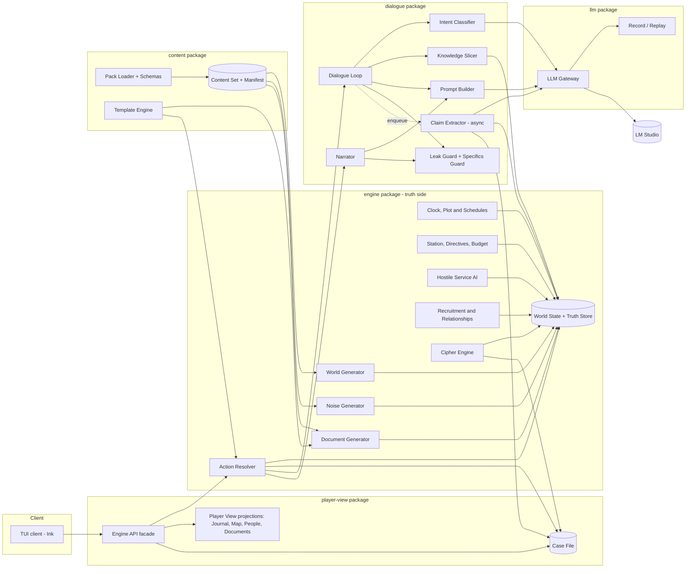
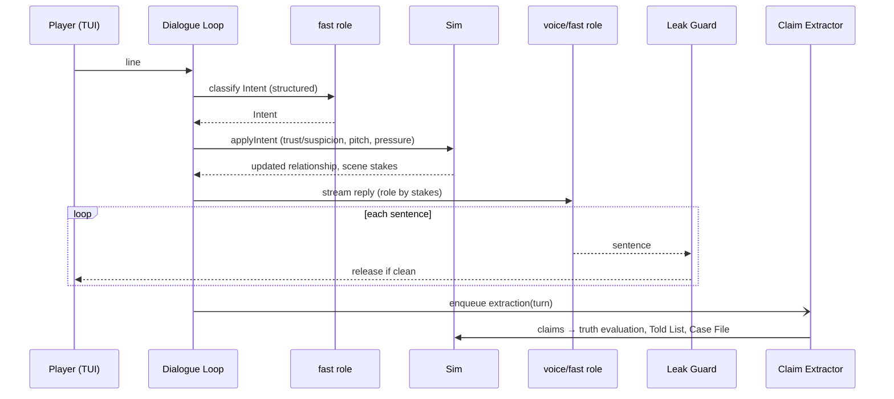
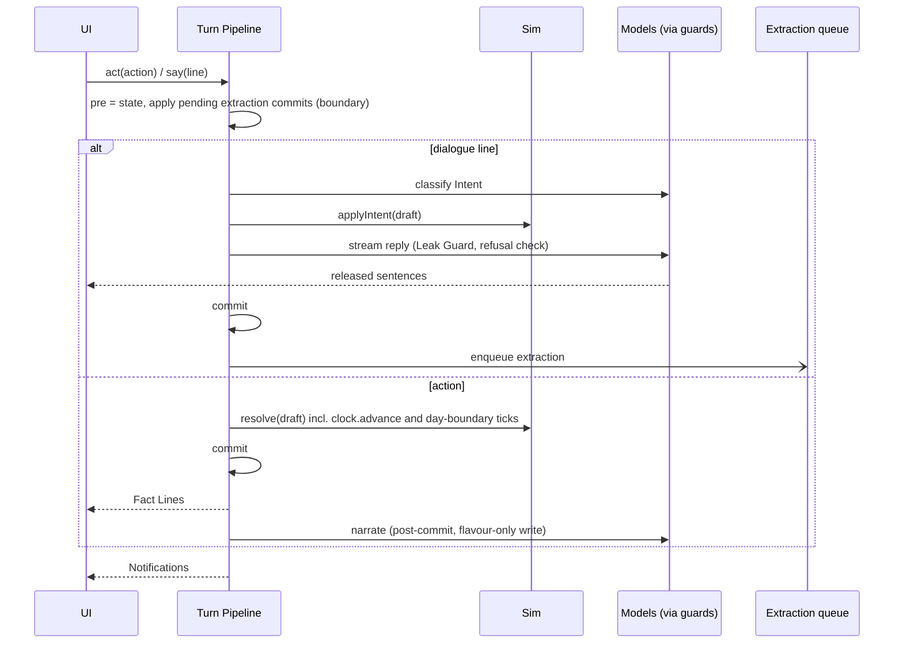

# Design Document

## Overview

Tradecraft splits responsibilities cleanly between two kinds of component:

- **The Sim (deterministic TypeScript)** generates the world from a seed and the Content Set, owns ground truth, advances time and the Plot, resolves every player action, runs the Hostile Service, resolves recruitment and counterintelligence, generates ciphers and Documents, and decides what each NPC and the player know.
- **Language models (via LM Studio)** do four narrow jobs: voice an NPC from a bounded prompt, write descriptive Flavour from Sim-supplied Fact Lines, classify the player's dialogue Intent, and transcribe what an NPC asserted into canonical Propositions.

Every piece of information a model sees is chosen by the Sim. Everything a model produces is either displayed after the guards approve it, or parsed into typed data that the Sim evaluates. No model output becomes a fact.

### Fact and Flavour

| | Fact | Flavour |
|---|---|---|
| Produced by | Sim templates (Fact Lines, Documents, Case File entries) | `voice`, `fast` (NPC speech) and `narrator` (description) roles |
| Truth status | Observations are true; Documents and Claims are assertions whose truth is in the Truth Store | None. NPC speech becomes Claims only via extraction; Narrator prose never does |
| Guards | None needed (deterministic) | Leak Guard; Narrator also has the Specifics Guard |
| Stored in | Case File, Journal fact log, save | Transcripts and the Location Flavour cache only |
| Rendering | Plain style | Distinct style (dim italic), so the player can always tell them apart |

### Key decisions

| Decision | Choice | Rationale |
|---|---|---|
| Setting | Early Cold War Vienna (1950s, four-power occupation), real places, fictional characters only; no real historical individuals as NPCs | Period texture grounds the espionage loop; further cities follow in the content-expansion spec |
| Language | TypeScript (Node 22+), ESM monorepo | Strong typing for the truth/view boundary; one language for engine, TUI and evals |
| Validation | Zod | Runtime schemas that also generate JSON Schema for structured output and content files |
| Tests | Vitest + fast-check | Property-based tests for the determinism and containment invariants |
| PRNG | In-repo xoshiro128** with serializable state and `derive(seed, n)` | No dependency; state is saved with the game; named streams keep subsystems independent |
| Model client | `openai` npm client pointed at LM Studio's OpenAI-compatible server | Any compatible server can be swapped in |
| Model management | `@lmstudio/sdk` for load/unload and memory estimation; `lms get` for downloads | Loading is automatic and explicit; downloads are a deliberate step, never a silent side effect; inference stays on the portable endpoint |
| TUI | Ink | Streaming text, panes and keyboard navigation in the terminal |
| Ground truth access | Separate package plus branded types plus an import-boundary lint rule | The UI cannot reach the truth at compile time or lint time |
| Narrator role | Own `narrator` role key, mapped by default to the `fast` model | No third resident model; ≤ 2 s first sentence; can be remapped in config without code |
| Narration safety | Fact Lines first, Flavour after, both guards on Flavour, fact-only fallback | The game is fully playable with narration off or the model down |
| Content | YAML Content Packs under `packages/content/packs/`, Zod-validated, hashed into a Content Manifest | Follow-on specs add packs, not code |
| Predicates | Data-defined in packs; truth evaluation picks from a closed set of built-in evaluator kinds | New predicates need no code unless they need a new evaluation rule |
| Templates | A small deterministic template language validated at load | Fact Lines, Documents, hints and predicate renderers share one engine |

## Architecture



**Boundary rule:** `tui` may import only `player-view`. `player-view` exposes projections that strip all truth fields. A dependency-cruiser rule fails CI on any other import path from `tui`. Truth-bearing types are branded (`Truth<T>`) so they cannot be passed to view constructors. `content` depends on nothing but Zod and `yaml`; `engine`, `dialogue` and `player-view` (for hints, help and glossary) depend on it.

### Package layout

```
packages/
  content/       pack schemas, loader, manifest, template engine; packs/core/ data
  engine/        world gen, noise, truth store, clock, plot, locations, actions, station, budget,
                 documents, hostile service, recruitment, ciphers, outcome record
  dialogue/      knowledge slicer, prompt builder, leak guard, specifics guard, narrator,
                 intent classifier, claim extractor
  llm/           gateway, role routing, reasoning adapters, record/replay
  player-view/   engine API facade, case file, journal, map, people, document views (no truth)
  tui/           Ink client
  evals/         harness, fixtures, rubric, report writers
config/
  models.yaml    role → model mapping and per-role settings
  scenario.yaml  difficulty preset or overrides, mole toggle, packs to load, narration mode, hints
saves/           snapshots; saves/outcomes/ holds Outcome Records
```

### PRNG streams

All randomness comes from the seed through named streams so subsystems cannot perturb each other:

| Stream | Seed | Used for |
|---|---|---|
| core | `seed`, retry *k* uses `derive(seed, k)` | City, orgs, Principal NPCs, Plot, knowledge, brief |
| noise | `derive(seed, 0x10000)`, retry *k* uses `derive(thatSeed, k)` | Background NPCs, Side Threads, Rumours, Noise Traffic |
| daily | `derive(seed, 0x20000 + day)` | Weather, newspaper selection, Walk-ins |
| runtime | saved `PrngState` | Action resolution, checks, Hostile Service ticks |

#### PRNG stream registry

Follow-on specs derive their streams from the game seed (or from a seed named below) with `derive()` offsets inside the block allocated to them here. A spec's own stream table must stay within its block. **A new spec must claim a block in this table before it adds a stream.**

| Owner | Block | Streams |
|---|---|---|
| slice | `0x10000`, `0x20000`–`0x2FFFF` | noise `derive(seed, 0x10000)`; daily `derive(seed, 0x20000 + day)` (unchanged) |
| content-expansion | `0x30000`–`0x30FFF` | setting `derive(seed, 0x30000 + j)` for setting attempt *j*: Start Date, Instantiated City, and slice step 1 on the Core City path |
| plot-library | `0x31000`–`0x31FFF` | select `derive(seed, 0x31000)`; reselection *k* uses `derive(thatSeed, k)`. plot-library has no `city` stream; the city comes from the content-expansion setting stream |
| ambient-world | `0x50000`–`0x5FFFF` | ambient-init `0x50000`; exo `0x51000 + day`; react `0x52000 + day`; life `0x53000 + day`; local `0x54000 + day`; notice `0x55000 + day`; gossip `0x56000 + day`; news `0x57000 + day`; townsfolk `0x58000`; cover `0x59000 + week` |
| campaign-career | `0x60000`–`0x6FFFF` on the Posting seed; `0xC0000` on the Campaign Seed | carry `derive(postingSeed, 0x60000)`; arc `derive(postingSeed, 0x61000)`; campaign `derive(campaignSeed, 0xC0000)` |
| multi-city | `0x70000`–`0x7FFFF` | region `derive(seed, 0x70000)`; per-City streams are derived from `regionSeed` as specified in the multi-city design |
| unallocated | `0x40000`–`0x4FFFF`, `0x80000` and above | Reserved for future specs |

**Generator version.** Two follow-on changes alter slice output for the same inputs: content-expansion's setting step (slice step 1 moves to the setting stream, also on the Core City path) and plot-library's selection stream and generation order. They share one `generatorVersion` bump, declared in the content-expansion design (Setting selection). Golden replays are re-recorded once for it.

## Components and Interfaces

### Content Packs (`content`)

A pack is a directory with a manifest and typed YAML files:

```
packs/core/
  pack.yaml
  predicates.yaml        archetypes/*.yaml      location-types.yaml
  personas/*.yaml        descriptors.yaml       cover-identities.yaml
  plots/*.yaml           side-threads/*.yaml    rumours.yaml
  documents/*.yaml       public-texts/*.yaml    city.yaml (district and street name pools, weather tables)
  hints.yaml             glossary.yaml          difficulty.yaml
```

```yaml
# pack.yaml
id: core
version: 1.0.0
contentSchema: 1          # schema generation; loader rejects unknown values
requires: []              # e.g. [{ id: core, range: "^1.0.0" }]
overrides: []             # ids this pack may redefine, e.g. [core/bartender]
```

```ts
interface ContentLoader {
  load(dirs: string[], selected: string[]): Result<ContentSet, ContentError[]>;
}
interface ContentError { pack: string; file: string; path: string; message: string; }
interface ContentManifest { schema: number; packs: { id: string; version: string; hash: string }[]; }
```

Loading runs in this order:

1. Parse each `pack.yaml`, check `contentSchema`, and resolve `requires` (semver ranges).
2. Order packs topologically, breaking ties by pack id. A missing dependency, an incompatible version or a cycle is an error.
3. Parse every file with its Zod schema. Ids are namespaced `<pack>/<name>`.
4. Merge into registries per kind. A duplicate id is an error unless the later pack lists it in `overrides`.
5. Check cross-references, for example archetype → persona pools, Plot template → predicates and archetypes, Location Type → action ids, and template slots → declared slots.
6. Compile templates and the predicate registry.
7. Hash each pack as SHA-256 over its files' canonical JSON (keys sorted), in path order, and build the Content Manifest.

All errors are collected, not just the first. The manifest goes into saves, recordings and Outcome Records. The generator's determinism contract is `(seed, generatorVersion, ContentManifest, DifficultyPreset)`.

**Content kinds** (each has a Zod schema exported from `content`):

| Kind | Key fields |
|---|---|
| Archetype | role (cell, hostile-officer, station-staff, contact, civilian), allowed allegiances, MICE ranges, wariness, persona pools, descriptor pools, schedule templates (Location Type per phase and weekday), knowledge hooks |
| Location Type | public/private, allowed actions, opening hours, crowd curve per phase and weekday, weather modifiers, base risk, allows dead drops, name patterns, description and atmosphere tag pools |
| Plot template | role slots with archetype constraints, materiel and target slots, stages (requires, produces, deadline ranges, structured traces as `TraceTemplate`, `onDisrupted` weights), public-trace article templates |
| Side Thread template | same shape as a Plot template, with no Cell roles and no deadline pressure |
| Document template | kind, title pattern, body sections, slots |
| Persona library | name pools by culture and gender, voice traits, mannerisms, backgrounds |
| Descriptor library | shared build, hair, face and grooming pools, and named clothing pools of garments and accessories; every entry carries a `fits` tag (any, female or male) |
| Cover Identity | title, employer org, plausible Location Types (fit), Cover Suspicion modifiers |
| Rumour template | predicate pattern with distortions (swap subject, shift day, invent target) |
| Hint | trigger (from a fixed enum such as `first-unidentified-subject` or `budget-low`), text template |
| Difficulty Preset | every field in Req 34.2 |
| Predicate definition | see below |

**Template language.** Text is `{slot}`, `{slot.attr}`, `{pick:pool-id}`, `{when}` and `{place}`, with `{?slot}…{/slot}` for optional sections. Templates are parsed at load into an AST. Every slot must be declared and every pool must exist. Rendering is pure: `render(ast, bindings, namer, rng)`. The `namer` decides how entities appear, so a Fact Line names a person the player has not identified by their Unidentified Subject descriptor.

### Predicate definitions (`content` + `engine/truth`)

```yaml
- id: MEETS_AT
  subject: [npc, unk]
  object: { entity: [npc, unk] }
  place: required            # required | optional | none
  window: required
  evaluator: fact-match      # fact-match | fact-match-symmetric | alias | membership-transitive
  fieldCode: MT
  render:
    second: "You meet {object} at {place} {when}."
    third: "{subject} meets {object} at {place} {when}."
  extractorHint: "Two people meet at a place, usually on a schedule."
  implication: { role: either, other: [hostile-person] }   # optional; used by the arrest gate
```

Object kinds may also be a literal (`object: { literal: text | amount | time }`). `implication.role` is `subject | object | either`, and `other` lists the hostile marks the other argument must carry (`hostile-org`, `hostile-person`, `materiel`, `hostile-channel`, or `none`). See Arrest Evidence.

From the loaded definitions the Sim derives:

- the renderers (second person for NPC prompts, third person for Fact Lines and Documents);
- the Claim Extractor schema, a Zod discriminated union on `predicate` with per-predicate argument kinds, converted to JSON Schema;
- the field-message codes used by the Cipher Engine;
- truth evaluation, by looking up `evaluator` in a code registry.

Built-in evaluator kinds:

- `fact-match`: a matching fact exists with an overlapping window.
- `fact-match-symmetric`: as `fact-match`, but subject and object may be swapped.
- `alias`: checks the Truth Store's identity mapping.
- `membership-transitive`: follows `MEMBER_OF` and `REPORTS_TO` chains.

A predicate that needs a new rule needs a code change to add an evaluator kind. This is the only extension point that does. The core pack defines the initial 15 predicates.

### World Generator (`engine/worldgen`)

```ts
interface WorldGenerator {
  generate(seed: string, content: ContentSet, preset: DifficultyPreset, scenario: ScenarioConfig): WorldState; // pure
}
```

Core stream steps:

1. City: 5–7 Districts and 16–22 Locations instantiated from Location Types, with Routes and risk ratings.
2. Organizations: the Station, the Hostile Service and the Cell.
3. Principal NPCs from archetypes: Cell, hostile officers, Chief of Station and 2–3 staff, and 2–3 starting contacts. Each gets a true and an apparent allegiance, a MICE profile, a persona with a gender, a descriptor and a schedule. The apparent allegiance comes from the NPC's public post: a Cell member presents as `neutral`, a hostile officer presents as `hostile` only in a declared hostile-power post (such as the Soviet mission), and Station staff present as `station`. Both values are engine-side; the Player View learns apparent affiliation only from Claims and Dossiers. Descriptors draw only entries that fit the persona's gender and are redrawn until every two Principals differ in at least two elements. Names are redrawn so that no two Principals share a given or family name and no two NPCs share a full name (Req 1.7, 1.8).
4. The Plot, instantiated from a Plot template chosen by the PRNG with stage count and deadline slack from the preset.
5. Channels and Dead Drops for the Plot, the Hostile Service and the Station.
6. Knowledge assignment: NPC Knowledge Slices by role and stage proximity, the Station's Knowledge Slice (including HQ false beliefs at the preset rate), Cover Stories and Agendas.
7. The mole, if enabled: one Station staff NPC whose true allegiance is the Hostile Service. Generation applies the `MoleAssignment`: it rewrites the NPC's true allegiance, leaves its apparent allegiance as `station`, sets `station.mole` and adds the mole's `REPORTS_TO` and `MEMBER_OF` facts to the Truth Store.
8. Cover Identity and the Starting Brief (see below).
9. Public texts for book ciphers.
10. Discovery-path verification. On failure, restart the core stream with `derive(seed, attempt)`.

Noise stream steps run next (see Noise Generator), followed by re-verification. When the World State is assembled, the Truth Store is seeded with every core and noise ground-truth Proposition (memberships, the mole's facts, Plot and Side Thread facts), so `holds` answers from the first turn.

**Discovery paths.** The verifier builds a learnability graph. Its root is the Starting Brief's known entities, Claims, Channels and Documents. Its edges are:

- Meet a reachable NPC → that NPC's knowledge. An NPC is reachable if they are present at a known Location per their schedule, or have a Contact Channel.
- Surveil a known Location → events there.
- Intercept a known Channel → its plaintext Propositions.
- Read an obtainable Document → its Propositions.
- Learn a Proposition → its entities, places and channels (via `USES_CHANNEL`) become known.

For each Plot Stage's key Proposition, and for the mole's identity when a mole is enabled, there must be two paths that share no intermediate NPC or Channel. One path must use a meeting edge (human) and the other an intercept or surveillance edge (signal). A stage's key Propositions are the ones its traces evidence (`TraceTemplate.evidences`), and a Channel joins the known set only when the Starting Brief, a learned `USES_CHANNEL` or an observed transmission reveals it.

### Noise Generator (`engine/noise`)

This runs on the noise stream, after the core world has been verified:

1. Background NPCs (count from the preset) from civilian archetypes, with schedules at public Locations.
2. Side Threads from templates (count from the preset). Participants are Background NPCs or non-Cell Principal NPCs. Each thread has true Propositions, traces and its own Channel traffic.
3. Rumours from Rumour templates, applied to Plot, Side Thread or local Propositions. Rumours are held as false beliefs by Background NPCs and are available to newspapers.
4. Noise Traffic Channels (diplomatic, commercial, criminal) with message schedules at the preset ratio.

Noise only adds entities and beliefs. It never mutates core entities except to append Background-NPC acquaintances to known-entity lists. Re-verification runs on the full world. On failure, the generator retries with the next noise seed, up to 8 attempts, and then throws a `GeneratorError` naming the seed.

### Starting Brief (`engine/brief`)

```ts
interface StartingBrief {
  coverIdentity: CoverIdentity; chief: NpcId;
  knownEntities: EntityId[];   // Station staff, public Locations, public figures, starting contacts
  leads: Claim[];              // 2–4, source { kind: 'document', id: <brief cable> }
  dossiers: DocId[]; channels: ChannelId[]; deadDrops: DeadDropId[];
  directives: Directive[]; budget: number; contacts: NpcId[]; // starting Contact Channels
}
```

Leads are drawn from the Station's Knowledge Slice, so some may be HQ false beliefs. The brief is delivered as a Cable Document. The optional briefing is a talk scene with the Chief, voiced from the Station's Knowledge Slice.

### Truth Store (`engine/truth`)

```ts
interface TruthStore {
  facts(): ReadonlyArray<Truth<Proposition>>;
  holds(p: Proposition, at: GameTime): boolean;      // dispatches on predicate evaluator kind
  recordClaimTruth(r: ClaimTruthRecord): void;
  allegiance(npc: NpcId): Truth<Allegiance>;
  identityOf(unk: UnkId): Truth<NpcId>;              // Unidentified Subject mapping
}
```

Only Sim transitions can call the mutation methods. The store is never serialized into the Player View. `holds` resolves `unk:` ids through `identityOf` before it evaluates.

### Clock, Plot and Schedules (`engine/clock`)

```ts
interface Clock {
  now(): GameTime;                       // { day, phase }
  advance(phases: number): SimEvent[];   // runs plot, schedules, channels, cables; hostile tick and newspaper at day boundary
}
```

Each Plot Stage has `requires: PropId[]`, `produces: PropId[]`, `deadline`, `traces: TraceTemplate[]` and `onDisrupted: 'delay' | 'reroute' | 'abort'` (doctrine-weighted). Traces become Sim events: meetings at Locations, transmissions on Channels, dead-drop loads and movements. Surveillance and interception observe these events.

A trace is structured data, not prose:

```ts
interface TraceTemplate {
  kind: 'meeting' | 'transmission' | 'drop-loaded' | 'drop-emptied' | 'npc-moved';
  roles: RoleSlotId[];                       // participants: two for a meeting, one otherwise
  place?: { locationType: LocationTypeId } | { target: TargetSlotId }; // meeting, drop or movement destination
  channel?: 'radio' | 'numbers' | 'courier'; // transmission or courier hand-off
  materiel?: MaterielSlotId;                 // what a drop load, drop collection or courier run carries
  evidences: PredicateId[];                  // key Propositions the event makes observable (MEETS_AT, CARRIES, USES_CHANNEL, ...)
  text: string;                              // prose summary for the debrief and the Narrator's scene descriptor
}
```

At instantiation, `roles` resolve to the bound role holders, `place` to a generated Location of that type (preferring the role holders' scheduled Locations) or to the target slot's Location, `channel` to the owning organisation's Channel of that kind, and `materiel` to the bound item. Execution emits exactly that event (Req 3.6). A transmission trace mints its Intercept through the Cipher Engine with the stage's Propositions as plaintext (Req 9.1), and the Transmission and Intercept are appended to the World State, where the intercept action collects them (Req 25.3). Side Thread traces follow the same rules on their own Channels, and Noise Traffic Channels mint noise Intercepts on their schedules (Req 29.4). A stage's participants, Channels and deliveries are the ones its own traces name. A delivery is a `drop-loaded` trace's materiel, and the stage that requires it is the one whose `drop-emptied` trace collects it.

**Plot abort (Req 38).**

```ts
interface PlotState {
  status: 'running' | 'completed' | 'aborted';
  stages: StageState[]; materiel: ItemId; leader: NpcId; target: EntityId;
  abortPressure: number; pressureKeys: string[];   // dedupe keys of counted disruptions and beliefs
  abortCause?: AbortTrigger;
}
type AbortTrigger = 'pressure' | 'leader-suspicion' | 'materiel-seized' | 'disruption-draw' | 'no-reroute';
const abortTolerance = (d: Doctrine) => 1 + Math.round(3 * d.riskTolerance);
const leaderAbortThreshold = (d: Doctrine) => 0.9 - 0.3 * d.riskTolerance;
function abortCheck(plot: PlotState, ctx: { leaderSuspicion: number; materielSeized: boolean; doctrine: Doctrine }): AbortTrigger | null; // pure
```

- A stage is disrupted when a delivery its own traces collect is seized, a participant in its own traces is arrested or has fled, or a Channel its own traces use is in `hostile.beliefs.compromisedChannels` (Req 3.7). Each distinct disruption key adds 1 to `abortPressure`, then `onDisrupted` is drawn on the runtime stream. A draw of `abort`, or `reroute` with no alternative role holder or Location, aborts at once.
- A belief adopted under the adaptation rules (Hostile Service section) that the Station knows or suspects the Plot target or a Cell member adds 1, once per belief key.
- `abortCheck` runs after each disruption, after each belief adoption and in the daily tick. The materiel counts as seized when it is taken from a hostile drop (`seize`) or from an arrested carrier.
- On abort the Sim emits a hidden `plot-aborted` event and sets `ended` with outcome `success`. The debrief names the trigger.

### Locations and Movement (`engine/city`)

```ts
interface Location {
  id: LocId; name: string; aliases: Alias[]; type: LocationTypeId; district: DistrictId;
  public: boolean; description: string; atmosphere: string[];
  hours: Record<Phase, boolean>; risk: number; deadDropSites: DeadDropId[];
}
interface Route { a: DistrictId; b: DistrictId; cost: 0 | 1; }
function crowdLevel(loc: Location, t: GameTime, weather: Weather): 'empty' | 'sparse' | 'busy' | 'packed'; // pure
function travelCost(city: City, from: LocId, to: LocId, countersurveillance: boolean): number;            // Dijkstra + 1 if CS
```

The description and atmosphere tags are drawn from Location Type pools at generation, so they are facts. The Narrator elaborates them as Flavour. Weather comes from the daily stream through `city.yaml` weather tables. A countersurveillance route multiplies the probability that a hostile tail on the player persists by the preset factor (default 0.3).

### Action Resolver (`engine/actions`)

Every action goes through two pure functions:

```ts
type Action =
  | { kind: 'talk' | 'approach'; npc: NpcId | UnkId }
  | { kind: 'travel'; to: LocId; countersurveillance: boolean }
  | { kind: 'arrange-meeting'; npc: NpcId; at: LocId; slot: GameTime }
  | { kind: 'surveil'; at: LocId; phases: 1 | 2 } | { kind: 'follow'; target: NpcId | UnkId }
  | { kind: 'service-drop'; drop: DeadDropId; leave: ItemRef[]; hostileMode?: 'copy' | 'seize' }
  | { kind: 'intercept'; channel?: ChannelId }
  | { kind: 'decrypt'; intercept: InterceptId; submission: KeySubmission }
  | { kind: 'read'; doc: DocId } | { kind: 'cable'; body: CableRequest }
  | { kind: 'task'; asset: NpcId; task: AssetTask } | { kind: 'pay'; npc: NpcId; amount: number }
  | { kind: 'confront'; npc: NpcId; claim: ClaimId } | { kind: 'arrest'; npc: NpcId | UnkId }
  | { kind: 'turn-agent'; npc: NpcId; lever: MiceLever; offer?: number }
  | { kind: 'feed'; asset: NpcId; items: FeedItem[]; label?: 'credibility' | 'deceive' }
  | { kind: 'wait'; phases: 1 | 2 | 3 | 4 };
// grade, link, note and help are Case File / view operations with no time cost.

interface ActionQuote { allowed: boolean; reason?: string; phases: number; money: number; }
function quote(state: WorldState, a: Action): ActionQuote;                                  // pure; shown in UI
function resolve(state: WorldState, a: Action, rng: Prng): { next: WorldState; result: ActionResult }; // pure

interface ActionResult {
  observations: Observation[]; factLines: string[]; scene: SceneDescriptor;
  openScene?: TalkSceneRequest; events: SimEvent[]; claimsAdded: ClaimId[];
}
```

`resolve` applies exactly the quoted cost. A disallowed action, a closed Location or insufficient Budget returns `allowed: false`, and the state is unchanged. Observations become Fact Lines through the predicate third-person templates with the player-perspective `namer`. Observations of Propositions also become Case File Claims.

**Mechanics per action:**

- **Talk.** Requires the NPC to be present. Opens the Dialogue Loop.
- **Approach (Cold Approach).** First contact succeeds with `σ(a·coverFit(cover, locType, archetype) − b·wariness − c·suspicion + d·persona.openness)` against the runtime PRNG. Success opens talk and creates a Contact Channel. Failure plays a fixed brush-off Fact Line and adds suspicion.
- **Travel.** Costs `travelCost`. A hostile tail (if the Hostile Service is tailing the player) persists per route. Arriving adds Cover Suspicion equal to the Location's risk × preset factor if the player is tailed.
- **Arrange meeting.** Requires a Contact Channel and a slot in the next 3 days. Acceptance is `σ(trust − riskAversion·loc.risk − scheduleConflict + agendaInterest)`. Dangles and handlers seeking access have high `agendaInterest`. The reply arrives as an event in the next phase, or immediately for Assets. At the slot, if both are present, a talk scene opens. If the player is absent, trust drops. Exposure added is `k1·loc.risk + k2·crowdPenalty + k3·recentContacts`.
- **Surveil.** For each event at the Location in the window, the observation check passes with `p = base × crowdFactor × weatherFactor × (1 − participant.tradecraft)`. Each participating NPC with `securityConsciousness > 0` also runs a detection check with `p = presetBase × security × (1 − crowdCover) × (1 + 0.5·repeatCount)`. On detection, the participant's suspicion and the player's Cover Suspicion rise, the participant may reschedule (Cell members trigger a Plot adaptation check), and a "you may have been made" Fact Line shows with the preset reveal probability.
- **Follow.** Steps the target's schedule within the current phase and observes each move and contact. It ends when the target enters a non-public Location, the phase ends, or detection fires. Detection risk per step is higher than for static surveillance.
- **Service dead drop.** Costs 1 phase. For the player's own drops, it delivers the contents and accepts left items (tasking, payment, Documents). Exposure added is half a meeting's. For hostile drops, `copy` creates seized-material Documents and Intercepts and leaves the drop intact. `seize` also removes the contents, marks any Plot Stage requiring that delivery as disrupted, and alerts the Hostile Service. Both run a detection check against the drop's watcher (if any).
- **Intercept.** At the Station, this collects every uncollected transmission on known radio and numbers Channels whose time is within the retention window. Each carries metadata. At a Location on a courier Route during its window, it produces the courier's Intercept and runs a detection check.
- **Read.** Marks the Document read. On the first read, it adds the Document's asserted Propositions as Claims with source `document`. Reading again is a no-op.
- **Cable.** Supported requests are trace, funds and report. Replies arrive as Cable Documents after the preset delay.
- **Pay.** A Budget debit. It satisfies retainers and adds trust for money-motivated NPCs.
- **Wait.** Advances 1–4 phases. At a public, open Location it runs surveillance observation at ×0.4 rate with no active detection. It stops at closing.
- **Decrypt, task, confront, turn-agent, feed and arrest** are as specified in the Cipher Engine, Recruitment, Arrest Evidence and Hostile Service sections.

`quote` decides eligibility for `turn-agent`, `feed` and `arrest` from Player View and Case File data only, so an allowed/disallowed answer never reveals truth.

**Unidentified Subjects.** When an Observation involves an NPC that the player has not identified, the Sim allocates (or reuses) a `unk:N` id per NPC and records `identityOf(unk) = npc` in the Truth Store. The Player View shows `unk:N` with the NPC's descriptor. Identification happens at a face-to-face introduction (talk with name given), when a Dossier with photograph is received, or from an Asset report naming them. It emits an `IS_ALIAS_OF(unk:N, npc:X)` Claim, and the People view merges the two.

### Station, Directives and Budget (`engine/station`)

```ts
interface Directive {
  id: DirectiveId; text: string; objective: DirectiveObjective;   // e.g. identify(role), recruit(n), arrest(role), intercept(channel)
  deadline: GameTime; reward: number; status: 'open' | 'met' | 'failed';
}
interface Ledger { start: number; entries: { at: GameTime; amount: number; reason: LedgerReason; ref?: string }[]; }
function balance(l: Ledger): number;                    // start + Σ amounts
function debit(l: Ledger, amount: number, reason: LedgerReason): Ledger | 'insufficient';
```

Directive objectives come from a fixed enum, so the Sim can check them each phase. Standing moves by the reward on success, minus the reward on failure, −2 per wrongful arrest and −1 per Asset arrested. A funds request grants `fundsBase × (1 + Standing/10)`, capped by the preset, at most once per 2 days. Retainers are due weekly per Asset. Each phase overdue past the 2-day grace period reduces trust for NPCs whose dominant MICE lever is money. The money pitch lever term is `leverMatch × min(1, amount / npc.moneyNeed)`.

### Document Generator (`engine/docs`)

```ts
interface Document {
  id: DocId; kind: 'newspaper' | 'public-text' | 'dossier' | 'cable' | 'seized';
  title: string; date: GameTime; body: string;             // rendered template text (fact layer)
  asserts: PropId[];                                        // Propositions the text asserts (not necessarily true)
  obtainableAt?: LocId[];                                   // kiosk, library, bookshop
}
```

- **Newspaper.** At each day start, 3–6 articles are chosen on the daily stream. Candidates are city events, public Plot traces (from Plot template article templates), Side Thread traces, Rumours, and Hostile Service plants when `deceptionAppetite` is high. Today's edition is obtainable at kiosks and cafés.
- **Public texts.** Book-cipher keys (almanac, poetry anthology, railway timetable) are generated at world generation from corpus word lists. Each is long enough for the page-line-word scheme of every book cipher keyed to it. They are obtainable at the library or bookshop.
- **Dossier.** Composed from the Station's Knowledge Slice: apparent allegiance as the slice records it (its `MEMBER_OF` and `WORKS_FOR` beliefs about the subject, true or false), cover employment, descriptor, known associates and HQ false beliefs. No field is read from the NPC record, so a Dossier cannot reveal or contradict the truth through a field. Dossiers never contain truth fields.
- **Cable.** Brief, Directives, replies, Standing changes.
- **Seized.** Contents of hostile drops and items from arrests.

### Hostile Service AI (`engine/hostile`)

This is deterministic doctrine, not a language model.

```ts
interface HostileService {
  doctrine: { riskTolerance: number; securityConsciousness: number; deceptionAppetite: number };
  beliefs: HostileBeliefs; // what it thinks the player knows; suspected assets; Cover Suspicion; compromised player channels and drops
  dailyTick(state: WorldState, rng: Prng): SimEvent[];
}
```

`dailyTick` runs the following steps:

1. Counterintelligence detection on each player Asset (Req 12.2).
2. Response to each detection: arrest, double or feed (Req 12.3).
3. Mole report ingestion, if a mole exists (Req 12.4).
4. Dangle and Walk-in management (Req 11.2, 22.7).
5. Plot adaptation to beliefs, which may change timing, target or security (Req 11.4).
6. Tailing decisions for the player, from Cover Suspicion.
7. Newspaper plants.
8. Generation of comms traffic for the Cipher Engine.

Doctrine values are drawn from the preset's ranges.

**Feed ingestion (Req 37).** A `feed` action schedules a hidden `feed-delivered` event at the turned agent's next contact with its handler (from the handler's schedule, at most 2 days ahead). On delivery:

```ts
interface HostileBeliefs {
  credibility: Record<NpcId, number>;      // per agent, starts at the agent's pre-turn trust (0.5–0.8)
  agentSuspicion: Record<NpcId, number>;
  adopted: Proposition[]; compromisedChannels: ChannelId[]; /* plus existing fields */
}
function ingestFeed(hs: HostileServiceState, agent: NpcId, props: Proposition[], truth: TruthStore, d: Doctrine):
  { next: HostileServiceState; classes: ('chickenfeed' | 'deception')[] };   // pure
```

For each Proposition `p`:

- Classification is `chickenfeed` if `truth.holds(p, deliveryTime)`, else `deception`. It is stored only in the Truth Store and shown in the debrief.
- **Confirm** if `p` is in the Hostile Service's own Knowledge Slice: credibility +0.1.
- **Refute** if the Hostile Service knows a Proposition with the same subject and predicate that contradicts `p` (different object, place or non-overlapping window): credibility −0.3 and agent suspicion +0.2. Agent suspicion feeds the daily detection check, so a refuted feed can blow the agent.
- **Unverifiable** otherwise: adopted when credibility ≥ `0.4 + 0.4 × securityConsciousness`.

**Belief-driven adaptation rules** (step 5 of `dailyTick`, applied to beliefs adopted since the last tick from any source):

| Adopted belief | Effect |
|---|---|
| `KNOWS`/`SUSPECTS(org:station, X)`, X a Cell member | X's pending stages reroute to another role holder, else delay; Cell security +0.2; Abort Pressure +1 |
| `KNOWS`/`SUSPECTS(org:station, X)`, X the Plot target | Retarget to an alternate target slot candidate, else delay; Abort Pressure +1 |
| `KNOWS(org:station, chan)`, chan a Plot Channel | Channel added to `compromisedChannels`; stages switch to an alternate Channel, else courier (this is also a stage disruption) |
| `LOCATED_AT`/`MEETS_AT` placing Station staff or the player at L during W | Stages scheduled at L during W reroute to another Location of the same type |
| `KNOWS`/`SUSPECTS(org:station, Y)`, Y not in the Cell | Cell security −0.2 (the Station looks distracted) |

`KNOWS` and `SUSPECTS` accept an organisation subject in the core pack, so the player can compose "the Station suspects X".

### Recruitment and Relationships (`engine/recruit`)

```ts
interface Relationship {
  npc: NpcId; trust: number; suspicion: number; exposure: number;
  recruited: boolean; contacts: number; lastContact?: GameTime; channel: boolean;
  coverState: 'intact' | 'strained' | 'cracking' | 'blown';
  retainer?: { amount: number; paidThrough: GameTime };
  asset?: AssetProfile;
}
interface AssetProfile {
  access: Truth<{ locs: LocId[]; orgs: OrgId[]; npcs: NpcId[] }>; // from workplace, schedule and acquaintances
  reliability: Truth<number>;          // 0..1, from archetype and persona
  turned: boolean;                     // turned by the player (the player knows this)
  hostileControlled: Truth<boolean>;   // quietly doubled by the Hostile Service
}
function applyIntent(rel: Relationship, intent: Intent, npc: Npc, ctx: SceneCtx): Relationship; // pure
function resolvePitch(npc: Npc, rel: Relationship, lever: MiceLever, offer: number, rng: Prng): PitchOutcome; // pure
function pressureCheck(npc: Npc, rel: Relationship, evidence: Claim[], rng: Prng): CoverState;  // pure
function firstContact(npc: Npc, cover: CoverIdentity, loc: Location, rel: Relationship, rng: Prng): boolean; // pure
```

`resolvePitch` computes success as `σ(w₁·leverMatch + w₂·trust − w₃·suspicion − w₄·exposureRisk + persona)` and rolls against the seeded PRNG. `leverMatch` for money uses the offer scaling above. The weights live in `scenario.yaml`.

**Asset reporting (Req 10.4, 10.6).** A `collect` task on target T gathers candidate truth facts since the last report whose subject or object is in `access.npcs`, whose place is in `access.locs`, or whose subject is a member of an org in `access.orgs`. Each candidate is reported with p = `reliability`. A reported candidate is distorted with p = `(1 − reliability) × 0.5` using a Rumour distortion operator. At most 3 Propositions are returned per task. If `hostileControlled`, the results are replaced by the Hostile Service's feed selection (Chickenfeed and deception per doctrine). Results become Claims with source `npc`. A turned agent's `access.orgs` includes its hostile org.

**Turning (Req 36).**

```ts
type TurnLeverage = 'custody' | 'cracking' | 'evidence';
function turnEligibility(view: PlayerView, cf: CaseFile, npc: NpcId): TurnLeverage | null;   // player-side only
function resolveTurn(npc: Npc, rel: Relationship, lever: MiceLever, offer: number,
                     leverage: TurnLeverage, evidence: number, rng: Prng): 'accepted' | 'refused' | 'refused-reported'; // pure
```

- **Eligibility** (priority order): `custody` if the NPC is in Station Custody; `cracking` if the last cover-state Fact Line the player received for the NPC said cracking or blown (held in the People view as `observedCoverState`); `evidence` if a talk scene with the NPC is open and `evidenceCount ≥ 1`.
- **Resolution:** if the true allegiance is not the Hostile Service, the result is `refused`. Otherwise success is `σ(w₁·leverMatch + w₂·L − w₃·loyalty − w₄·suspicion + w₅·trust − persona.resilience)` with L = 1.0 (custody), 0.6 (cracking) or `0.3 × min(1, evidence / arrestThreshold)` (evidence). On failure, `refused-reported` occurs with p = `loyalty × (1 − L)`; the Hostile Service then marks the agent's channels to the player as compromised and the player's Cover Suspicion rises by 0.1.
- **Effects of `accepted`:** `allegiance.true` becomes the Station, `apparent` is unchanged, `rel.recruited = true`, `asset.turned = true`, and the Agenda's `conceal` list is cleared of the agent's own role. Hostile beliefs are untouched. A custody release then adds `0.1 × phases in custody` to `hostile.beliefs.agentSuspicion[npc]`.
- **All failures** render the same refusal Fact Line and add suspicion, so a refusal does not distinguish an innocent from a loyal agent.
- Station Custody lasts `custodyPhases` (scenario, default 4). After that the NPC is handed over and can no longer be turned.

**Feed composition (Req 37.1–37.2).**

```ts
type FeedItem = { from: 'claim'; claim: ClaimId } | { from: 'composed'; prop: ComposedProposition };
interface ComposedProposition { predicate: PredicateId; subject: EntityId; object: EntityId | Literal; place?: LocId; window?: { from: GameTime; to?: GameTime }; }
function validateFeed(items: FeedItem[], view: PlayerView, content: ContentSet): Result<Proposition[], FeedError[]>; // pure, player-side
```

Validation uses the same derived per-predicate schema as the Claim Extractor. It accepts 1–3 items, entities only from the player's known set, and `unk:` ids only if a held `IS_ALIAS_OF` Claim resolves them to a known NPC (the Hostile Service knows real identities). Windows must be within the next 7 days. `feed` is allowed when `asset.turned` holds and a Contact Channel exists. It costs 0 phases and 0 money. The optional `label` goes only into a Journal note; the Sim ignores it.

### Cipher Engine (`engine/cipher`)

```ts
type CipherSpec =
  | { kind: 'caesar'; shift: number }
  | { kind: 'vigenere'; key: string }
  | { kind: 'columnar'; key: string }
  | { kind: 'book'; textId: DocId; scheme: 'page-line-word' }
  | { kind: 'otp'; padId: string; reusedWith?: InterceptId };

interface CipherEngine {
  encrypt(plain: string, spec: CipherSpec): string;
  decrypt(cipher: string, spec: CipherSpec): string;
  encodePropositions(props: Proposition[], style: HostileTradecraft): string; // terse field-message plaintext using predicate fieldCodes
  parseFieldMessage(plain: string): Proposition[];
  makeIntercept(source: PlotStage | SideThreadStage | NoiseSchedule, owner: OrgId, rng: Prng): Intercept;
}
```

The Hostile Service's tradecraft errors (Req 9.4) are generated deliberately at the preset probability. Examples include a reused pad, a fixed message header such as `NR` plus a date group, or a book-cipher text that also exists in-game as a public Document. Noise Traffic uses the same engine with cipher kinds weighted by owner. Diplomatic traffic is usually strong, criminal traffic usually weak, so the player can triage.

### LLM Gateway (`llm`)

```ts
type Role = 'voice' | 'fast' | 'narrator' | 'bookkeeping' | 'judge';

interface RoleConfig {
  model: string;               // id exactly as LM Studio reports it
  temperature: number;
  maxTokens: number;
  timeoutMs: number;
  reasoning: 'off' | 'low' | 'on';
}

interface LLMGateway {
  listModels(): Promise<string[]>;
  stream(role: Role, messages: ChatMessage[], opts?: CallOpts): AsyncIterable<string>;
  structured<T>(role: Role, messages: ChatMessage[], schema: ZodType<T>, opts?: CallOpts): Promise<T>;
}
```

- **Reasoning adapters.** Each model family has its own mechanism for switching reasoning off or on (chat-template flag, system directive, or none). A `ReasoningAdapter` per family hides this. Unknown families default to "no control" and log a warning.
- **Structured output.** Calls send `response_format` with a JSON Schema generated from the Zod schema, then re-validate the response with Zod.
- **Priority queue.** Interactive calls run in the order intent → voice → narrator → extraction. Extraction jobs are small and run between turns while the player reads or types. A narrator call is cancelled if the player issues the next action before its first sentence.
- **Record and replay.** `RecordingGateway` wraps the live gateway and appends `{ requestHash, request, response, timings }` to a JSONL file. `ReplayGateway` serves those records by `requestHash`.
- **Play metrics (Req 15.3, 15.6).** Every call appends `{ at, role, model, purpose, ttfsMs, durationMs, completionTokens, tokensPerSec, outcome }` to the metrics log (`scenario.metrics.path`, default `logs/metrics.jsonl`). The gateway measures duration and tokens. `ttfsMs` is time to the first sentence *released by the guards*, which the dialogue and narrator layers report back through a `CallHandle.markReleased()` callback. Writes are asynchronous and best effort, never part of a save. The eval harness reads the same record format.

### Knowledge Slicer and Prompt Builder (`dialogue`)

The NPC prompt is assembled from most static to most dynamic (Req 15.1):

| # | Block | Changes when |
|---|---|---|
| 1 | Global frame: fiction framing, in-character rules, "name only entities from your list", output style | Never during a session |
| 2 | Persona: voice, mannerisms, background, Cover Story, Agenda | Rarely (only on cover-state change) |
| 3 | Knowledge Slice, rendered as plain sentences, plus known-entity list | When the NPC learns something |
| 4 | Told List (compact) and relationship summary | After each extraction |
| 5 | Recent turns (last N exchanges) | Every turn |
| 6 | Player's latest line plus the classified Intent as a stage direction | Every turn |

Propositions are rendered to sentences by the predicates' second-person templates. For example, `MEETS_AT(npc:ana, npc:viktor, place: loc:pier, tue/evening)` becomes "You meet Viktor at the Pier on Tuesday evenings." The renderer is deterministic, so the same state always produces byte-identical blocks 1–4.

When the prompt exceeds the token budget (Req 15.2), recent turns are trimmed from block 5 first, oldest first. Then the Told List in block 4 is compressed to one line per subject. Blocks 1–3 are never trimmed. If they alone exceed the budget, the world generator's knowledge assignment is buggy, so the builder throws an error.

### Narrator (`dialogue/narrator`)

```ts
interface SceneDescriptor {
  location: { name: string; description: string; atmosphere: string[] };   // from the Player View
  time: GameTime; weather: string; crowd: CrowdLevel;
  visible: { label: string }[];                                            // known name or descriptor
  kind: 'arrival' | 'surveillance' | 'follow' | 'dead-drop' | 'intercept' | 'wait' | 'scene-open' | 'arrest';
}
interface Narrator {
  narrate(scene: SceneDescriptor, factLines: string[], known: EntityId[]): AsyncIterable<GuardedSentence>;
}
```

The Narrator's prompt is built from most static to most dynamic:

| # | Block | Changes when |
|---|---|---|
| 1 | Narrator frame: second person, present tense, at most 3 sentences, sensory texture only, name nothing not listed, no numbers, days or times, do not add events | Never |
| 2 | City style sheet (from content) | Never |
| 3 | Location block: name, description, atmosphere | On Location change |
| 4 | Time, weather, crowd, visible persons, Fact Lines | Every call |

The Narrator runs on the `narrator` role with temperature 0.9, `maxTokens` 160 and reasoning off.

**Flow.** `resolve` produces the Fact Lines. The UI prints them immediately (Req 15.5). The Narrator then streams, and each sentence passes:

1. **Leak Guard** against the player's known-entity set. Names of unidentified persons never enter the prompt, so they can only appear by chance and are caught here.
2. **Specifics Guard.** The sentence is tokenized. It is rejected if it contains a numeral or number word (excluding a small allowlist such as "one" in "no one"), a weekday or month name, a clock pattern or "o'clock", a time-of-day word that contradicts the current phase, or a capitalized non-sentence-initial token that is not in the allowed-name set. The allowed-name set is the scene descriptor names, the visible labels, the known-entity aliases and the pack's common-word allowlist. Tokens that appear verbatim in the Fact Lines or scene descriptor are always allowed.

On a rejection, the rest of that Flavour is discarded and the Narrator regenerates once with the violation class named. If that fails too, the result is fact-only. Released Flavour is stored only in transcripts. It never reaches the extractor, Case File or Journal fact log.

**Location Flavour cache.** On arrival, a separate `arrival` narration describes the Location itself. It is keyed by `(locId, phase, crowdBand)`, stored in the save, and reused, so the café looks the same each Tuesday morning. Action narrations are not cached.

**Modes.** `narration: full | brief | off` in `scenario.yaml`. `brief` caps Flavour at one sentence, and `off` skips the Narrator.

### Dialogue Loop and Leak Guard (`dialogue`)



**Leak Guard.** The Entity Registry holds each entity's canonical name and distinctive aliases. Generic words, such as "pier" where the location is "The Pier", are listed as non-distinctive and skipped. Each sentence is scanned with a case-insensitive, whole-word match against the aliases of entities not in the allowed set. For NPC dialogue, the allowed set is the NPC's known set. For the Narrator, it is the player's known set.

- On a hit, the guard stops the stream and discards the rest of the turn. It then regenerates with an added instruction naming the violation class (not the entity), up to the retry limit, and falls back to a persona deflection line after that.
- Sentences already released stay released, because they passed the check.

**Chance leaks.** A model can guess correctly, for example by naming the right meeting day without being told it. The Claim Extractor flags any Claim that matches a concealed Proposition the speaker does not know. In this slice, those are logged (Req 5.6) and measured by the eval harness rather than blocked, because blocking would need synchronous extraction. If chance-leak rates are material, a synchronous check for high-value Propositions is the follow-up.

**Refusal and meta detection.** A cheap heuristic (phrases like "As an AI", "I can't help with", or responses that break the second person) runs first. The `fast` role confirms only when the heuristic is uncertain. The retry adds a reinforced fiction frame, and the fallback is a deflection line (Req 16.3).

### Claim Extractor (`dialogue/extract`)

The schema is generated from the loaded predicate definitions:

```ts
// One branch per predicate definition; subject/object enums come from the Entity Registry ids + 'unknown'.
const ExtractedClaim = z.discriminatedUnion('predicate', predicateBranches(content.predicates, registry));
const ExtractionResult = z.object({ claims: z.array(ExtractedClaim).max(8) });
// each branch: { predicate, subject, object, place?, when?, hedged: boolean }
```

For each extracted Claim, the Sim performs these steps:

1. Evaluates its truth against the Truth Store at the claim time.
2. Determines whether the speaker believed it, by checking the speaker's Knowledge Slice and false beliefs.
3. Marks it as a deliberate lie if it is believed false or is part of the Agenda's promote list.
4. Writes the `ClaimTruthRecord` to the Truth Store.
5. Appends the Claim to the speaker's Told List.
6. Adds a view-safe `Claim` to the Case File.

### Turn Pipeline (`player-view/turn`)

Each action or dialogue line is one Turn Transaction (Req 42). World State is immutable, so a draft is a new value and a commit is a reference swap.



1. **Begin.** Allocate `turnId`. Apply any finished extraction results (step 7) as their own commits. Then take `pre = state`, `draft = pre`.
2. **Classify** (dialogue only). The `fast` role returns an Intent.
3. **Simulate.** `applyIntent` or `resolve` runs on `draft` with `draft.rng`. Any clock advance, Plot execution, Hostile tick and abort check happen here and emit `SimEvent`s.
4. **Stream** (dialogue only). The reply streams through the Leak Guard and refusal check. A deflection fallback counts as completion.
5. **Commit.** `state = draft`. In the same step: append `ActionLogEntry`s (the input plus `model` references for every call), append Journal Fact Lines, run `notify()` over this turn's events, and push Notifications. For an action, commit happens before Fact Lines are shown and before the Narrator starts (Req 15.5, 42.2).
6. **Narrate** (action only, after commit). Flavour writes only to `transcripts` and `flavourCache`. A Narrator failure leaves the commit intact (Req 42.6).
7. **Extract** (asynchronous). The job carries `{ turnId, speaker, utterance, speakerKnowledgeAtTurn }`. A finished result is held until the next turn boundary and committed as its own transaction in `turnId` order. A result for turn *n+1* waits for turn *n*. The commit writes the `ClaimTruthRecord`, Told List and Case File Claims and appends an `extraction-commit` log entry, so replay applies it at the same boundary. After a failed schema retry it commits the unparsed note. If the endpoint is unreachable the job stays queued with a status-bar notice, and the game does not pause.

**Failure before commit** (steps 2–4): `draft` is discarded and the state, PRNG, log, Journal and Notifications stay at `pre`. An unreachable endpoint yields a `paused` chunk (Req 16.1). `retry()` re-runs from step 2 with `pre`, so the same Intent and PRNG draws reproduce. Sentences released by the failed attempt get an `interrupted` chunk in the UI and are excluded from transcripts. Timeouts follow the gateway's retry and fallback rules inside the step; only a final failure aborts the turn.

### Case File (`player-view/casefile`)

```ts
interface Claim {
  id: ClaimId;
  source:
    | { kind: 'npc'; npc: NpcId }
    | { kind: 'intercept'; id: InterceptId }
    | { kind: 'surveillance'; loc: LocId }
    | { kind: 'document'; id: DocId };
  prop: Proposition;                // may reference unk: ids
  observedAt: GameTime;
  hedged: boolean;
  grade?: AdmiraltyGrade;           // player-assigned
  links: ClaimId[];                 // player-assigned
  relation: 'none' | 'corroborated' | 'conflicted'; // computed from Case File claims only
}
```

`relation` is a pure function of the Claims in the Case File (Req 7.4). It never consults the Truth Store. Two Claims about `unk:3` and `npc:viktor` relate only after the player holds an `IS_ALIAS_OF` Claim linking them.

### Arrest Evidence (`player-view/casefile/evidence`)

The arrest gate (Req 19.1, 40) is computed from the Case File, the Starting Brief and the predicate `implication` rules only.

```ts
interface HostileMarks { orgs: Set<OrgId>; persons: Set<EntityId>; materiel: Set<ItemId>; channels: Set<ChannelId>; }
function aliasClasses(cf: CaseFile): (id: EntityId) => EntityId;              // union-find over held IS_ALIAS_OF Claims
function hostileMarks(cf: CaseFile, brief: BriefView, preds: PredicateRegistry): HostileMarks; // least fixpoint
function implicates(c: Claim, target: EntityId, marks: HostileMarks, canon: (id: EntityId) => EntityId, preds: PredicateRegistry): boolean;
function evidenceCount(cf: CaseFile, target: EntityId, brief: BriefView, preds: PredicateRegistry): number;
```

- **Aliases.** Every id is replaced by its alias-class representative, so `unk:3` and `npc:viktor` are the same target once an `IS_ALIAS_OF` Claim links them. Any held alias Claim counts, whatever its grade.
- **Hostile marks** are computed to a fixpoint from corroborated Claims only:
  - `orgs`: the organisations the Starting Brief designates as hostile (the Hostile Service and the Cell).
  - `persons`: subjects of corroborated `MEMBER_OF` or `WORKS_FOR` Claims whose object is a hostile org.
  - `materiel`: items named in Brief leads, plus objects of corroborated `PLANS` or `CARRIES` Claims whose subject is a hostile person.
  - `channels`: Brief-designated hostile Channels, plus objects of corroborated `USES_CHANNEL` Claims whose subject is a hostile person.
- **`implicates`** is true when the Claim's predicate has an `implication` rule, the canonical target fills `role`, and the other argument carries one of the marks in `other` (or `other` is `none`).
- **`evidenceCount`** is the number of distinct keys `(predicate, canon(subject), canon(object), place)` over Claims with `relation = 'corroborated'` that implicate the target. Two corroborating Claims count once.

Core pack rules:

| Predicate | role | other |
|---|---|---|
| `MEMBER_OF`, `WORKS_FOR` | subject | hostile-org |
| `REPORTS_TO` | subject | hostile-person, hostile-org |
| `MEETS_AT` | either | hostile-person |
| `CARRIES`, `SUPPLIES` | subject | materiel |
| `USES_CHANNEL` | subject | hostile-channel |
| `PLANS`, `TARGETS` | subject | none |

`quote({ kind: 'arrest' })` returns `allowed` iff `evidenceCount ≥ preset.arrestThreshold` and arrest authority remains.

### Predicate Vocabulary (core pack)

`MEMBER_OF`, `WORKS_FOR`, `REPORTS_TO`, `MEETS_AT`, `LOCATED_AT`, `TRAVELS_TO`, `PLANS`, `TARGETS`, `SCHEDULED_FOR`, `CARRIES`, `SUPPLIES`, `USES_CHANNEL`, `KNOWS`, `SUSPECTS`, `IS_ALIAS_OF`.

Adding a predicate means adding a definition to a pack (Req 32). A code change is needed only for a new evaluator kind.

### Player Aids (`player-view`)

- **Journal.** An append-only list of `{ at, factLines, refs }` built from `ActionResult`s and delivered events, plus player notes `{ at, attachTo: day | EntityId | ClaimId, text }`. Flavour is excluded.
- **Map view.** Known Locations grouped by District, Routes with costs, hours, risk, current crowd level, known Dead Drops and last visit. The TUI draws a District adjacency list with costs, not a spatial map.
- **People view.** Known NPCs and Unidentified Subjects, with name or descriptor, apparent affiliation (from Claims and Dossiers only), linked aliases, last sighting, Asset status, and a rapport band (cold, neutral, warm or trusted, from trust; suspicion is not shown). It also shows Claim counts as subject and as source, and holds a parallel list of known organisations and items.
- **Help and hints.** Help lists `quote()` results for the current Location plus the glossary. Hints are content-defined `{ trigger, text }`. Seen flags live in the view state, not the Sim.

### Notifications (`player-view/notify`)

Every `SimEvent` kind has a fixed `visibility` (see Data Models). `notify` sees only player-visible events and builds each Notification from a content template, with the player-perspective `namer`.

```ts
type Notification = { id: NotificationId; at: GameTime; factLine: string; dismissed: boolean } & (
  | { kind: 'cable'; doc: DocId }
  | { kind: 'directive'; directive: DirectiveId; status: 'issued' | 'met' | 'failed' }
  | { kind: 'meeting-reply'; npc: NpcId; accepted: boolean; meeting: MeetingId }
  | { kind: 'meeting-due'; meeting: MeetingId }
  | { kind: 'meeting-no-show'; meeting: MeetingId }
  | { kind: 'walk-in'; npc: NpcId }
  | { kind: 'newspaper'; doc: DocId }
  | { kind: 'drop-unserviced'; drop: DeadDropId }
  | { kind: 'asset-silent'; npc: NpcId; days: number }
  | { kind: 'retainer-due'; npc: NpcId; amount: number }
);
function notify(events: SimEvent[], view: PlayerView): Notification[]; // pure; ignores visibility === 'hidden'
```

**Timing.** Events produced during a turn, including those from multi-phase actions and day-boundary ticks, are delivered together at that turn's commit, in event-time order. Their Fact Lines go to the Journal under each event's own day and phase. The status bar's alerts are the undismissed Notifications.

**Hidden events and their observable consequences.** The engine raises the derived player-visible events at phase boundaries. It decides them only from expectations the player set up: arranged meetings, own Dead Drops, and `lastContact`.

| Hidden event | What the player can observe |
|---|---|
| Asset arrested by the Hostile Service | `meeting-no-show` at the next arranged meeting the player attends; `drop-unserviced` when the player next services a drop the Asset should have loaded; `asset-silent` after `silenceDays` (scenario, default 3) with no contact; a newspaper arrest article with p = `1 − deceptionAppetite` |
| Asset quietly doubled | Nothing directly; only the content of later reports changes |
| Plot Stage executed | Public-trace newspaper articles from the Plot template; traces found by surveil, follow, wait or intercept |
| Hostile detection, beliefs, tailing | Only through action Fact Lines (for example "you may have been made") |
| Walk-in by a Dangle | The same `walk-in` Notification as a genuine Walk-in |

### Engine API (`player-view/api`)

The only surface the TUI uses (Req 13.5).

```ts
interface EngineApi {
  newGame(opts: { seed?: string; preset: string; mole: boolean; narration: NarrationMode }): Promise<GameView>; // GameView includes the brief Cable
  status(): StatusView;                    // day, phase, location, budget, standing, open directives, alerts, ended?
  actions(): ActionOption[];               // every action with its quote; disallowed ones carry a reason
  quote(a: Action): ActionQuote;
  act(a: Action): TurnStream;
  say(line: string): TurnStream;           // only while a talk scene is open
  endScene(): TurnStream;
  retry(): TurnStream;                     // re-runs a paused turn
  validateFeed(items: FeedItem[]): Result<void, FeedError[]>;
  caseFile: { list(f: CaseFileFilter): ClaimView[]; grade(id: ClaimId, g: AdmiraltyGrade): void;
              link(a: ClaimId, b: ClaimId): void; unlink(a: ClaimId, b: ClaimId): void; evidence(target: EntityId): number };
  notes: { add(n: { attachTo: number | EntityId | ClaimId; text: string }): void };
  views: { scene(): SceneView; here(): HereView; journal(): JournalView; map(): MapView; people(): PeopleView;
           documents(): DocumentListView; document(id: DocId): DocumentView; intercepts(): InterceptListView;
           workbench(id: InterceptId): WorkbenchView; help(): HelpView; debrief(): DebriefView | null };
  notifications: { list(): Notification[]; dismiss(id: NotificationId): void; subscribe(fn: (n: Notification) => void): () => void };
  saves: { list(): SaveInfo[]; save(name: string): Promise<SaveInfo>; load(name: string): Promise<Result<GameView, LoadError>> };
}
type TurnChunk =
  | { kind: 'fact'; text: string } | { kind: 'flavour'; text: string } | { kind: 'speech'; speaker: string; text: string }
  | { kind: 'interrupted' } | { kind: 'notification'; n: Notification }
  | { kind: 'paused'; error: { endpoint: string; message: string } }
  | { kind: 'ended'; outcome: OutcomeRecord['outcome'] } | { kind: 'done' };
type TurnStream = AsyncIterable<TurnChunk>;
type LoadError = { kind: 'manifest-mismatch'; differing: { id: string; saved?: string; loaded?: string }[] }
               | { kind: 'version'; saved: number; supported: number } | { kind: 'corrupt'; message: string };
interface SaveInfo { name: string; seed: string; difficulty: string; at: GameTime; savedAt: string; manifestMatches: boolean; }
```

Grade, link, unlink and note are time-free view operations, logged as `view-op` entries. `debrief()` returns `null` until `ended` is set.

### Difficulty Presets (`content/difficulty.yaml`)

| Field | easy | standard | hard |
|---|---|---|---|
| Plot stages / deadline slack (days) | 4 / 3 | 5 / 2 | 6 / 1 |
| Background NPCs / Side Threads / Rumours | 10 / 1 / 3 | 16 / 2 / 6 | 20 / 3 / 10 |
| Noise Traffic ratio (noise : plot) | 1 : 1 | 2 : 1 | 4 : 1 |
| HQ false-belief rate in Station slice | 0 | 0.15 | 0.3 |
| Doctrine ranges (risk, security, deception) | 0.2–0.4 each | 0.3–0.6 | 0.5–0.8 |
| Detection base (surveil / meeting / drop) | 0.05 / 0.03 / 0.02 | 0.10 / 0.06 / 0.04 | 0.18 / 0.10 / 0.07 |
| "Made" reveal probability | 1.0 | 0.6 | 0.3 |
| Tradecraft-error probability | 0.5 | 0.3 | 0.15 |
| Allowed ciphers | caesar, vigenere, columnar, book | + otp with errors | all |
| Arrest threshold / wrongful-arrest penalty | 2 / −1 authority | 3 / −1 | 3 / −2 and +alertness |
| Starting Budget | 5000 | 3000 | 1800 |
| Trace-request delay (phases) | 1 | 2 | 4 |
| Cover Suspicion burn threshold | 1.0 | 0.8 | 0.6 |
| Hints default | on | on | off |

The values are starting points for tuning. `scenario.yaml` may override any field.

### Outcome Record (`engine/outcome`)

```ts
interface OutcomeRecord {
  schema: 1; campaignId?: string;
  outcome: 'success' | 'failure-plot' | 'failure-burned'; endedAt: GameTime;
  seed: string; generatorVersion: string; content: ContentManifest; difficulty: string;
  standing: number; directives: { id: DirectiveId; status: Directive['status'] }[];
  survivingAssets: { npc: NpcId; archetype: string; persona: Npc['persona']; lever: MiceLever;
                     trust: number; exposure: number; doubled: boolean }[];
  cover: { identity: string; blown: boolean; suspicion: number };
  hostileMemory: { knownCover: boolean; suspectedAssets: NpcId[]; compromisedChannels: ChannelId[];
                   compromisedDrops: DeadDropId[]; doctrineShift: Partial<Doctrine> };
  budgetRemaining: number;
}
function buildOutcomeRecord(final: WorldState): OutcomeRecord; // pure
```

The record is written to `saves/outcomes/<seed>-<endedAt>.json` after Zod validation. Nothing in this slice reads it.

### TUI (`tui`)

The screen has a main pane, a side pane, and a status bar.

- **Scene** (main): Fact Lines in plain style, then Flavour in dim italic as it streams. Dialogue shows the speaker's name.
- **Here** (side): the current Location, crowd, weather, visible persons and allowed actions with quotes.
- **Case File:** filterable by entity, source (npc, intercept, surveillance, document) and grade, with grade and link editing.
- **Workbench:** the selected Intercept with metadata, frequency table, shift preview, and a key/plaintext entry.
- **Documents:** a reader for newspapers, public texts, Dossiers, Cables and seized material.
- **Journal, Map and People:** as in Player Aids.
- **Status bar:** day and phase, Location, Budget, Standing, open Directives, the highlighted action's phase and money cost, and alerts.
- **Start screen:** seed (shown or entered), Difficulty Preset, mole toggle and narration mode, followed by the brief Cable.
- **Feed composer:** pick Case File Claims or compose a Proposition (predicate, then subject, object, place and window, chosen only from known entities). It shows `validateFeed` errors inline.
- **Game-over screen:** shown on an `ended` chunk. It gives the outcome, end day and phase and the abort or burn cause where known, with options to open the debrief, save or quit.
- **Debrief screen:** renders `views.debrief()` in sections: true allegiances, Plot timeline, lies, Side Threads and Rumours, fed Propositions with their classification, Directive results, and grading accuracy.
- **Save/load screen:** lists `saves.list()`. Saves with `manifestMatches: false` are marked. Loading one shows the `manifest-mismatch` pack list and leaves the current game unchanged.
- **Endpoint error screen:** shown on a `paused` chunk. It names the endpoint and message and offers retry (`retry()`) or save and quit. Dialogue stays paused until one is chosen.

The client calls only the `player-view` API (Req 13.5).

## Data Models

```ts
type EntityId = `npc:${string}` | `loc:${string}` | `org:${string}` | `item:${string}` | `doc:${string}` | `chan:${string}` | `unk:${number}`;
type GameTime = { day: number; phase: 0 | 1 | 2 | 3 };
type Literal = { kind: 'text'; value: string } | { kind: 'amount'; value: number } | { kind: 'time'; value: GameTime };

interface Proposition {
  id: PropId; subject: EntityId; predicate: PredicateId;
  object: EntityId | Literal; place?: LocId; window?: { from: GameTime; to?: GameTime };
}

interface Npc {
  id: NpcId; name: string; aliases: Alias[]; archetype: ArchetypeId; role: NpcRole;
  tier: 'principal' | 'background';
  allegiance: Truth<{ true: OrgId; apparent: OrgId }>;
  mice: Truth<{ money: number; ideology: number; coercion: number; ego: number }>;
  moneyNeed: Truth<number>;
  persona: { voice: string; background: string; mannerisms: string[]; resilience: number; openness: number };
  descriptor: string;                       // "a tall woman in a green raincoat"
  coverStory: Proposition[];
  knowledge: { known: PropId[]; falseBeliefs: Proposition[]; knownEntities: EntityId[] };
  agenda: { conceal: PropId[]; promote: Proposition[]; goals: string[] };
  schedule: ScheduleEntry[];                // { weekday, phase, loc }
  loyalty: Truth<number>;                   // 0..1; meaningful for hostile agents (turning)
  status: 'active' | 'arrested' | 'fled' | 'missing';
  custody?: { by: 'station' | 'hostile'; since: GameTime; until?: GameTime }; // station custody ends after custodyPhases
}

interface WorldState {
  meta: { seed: string; generatorVersion: string; content: ContentManifest; preset: DifficultyPreset; scenario: ScenarioConfig };
  time: GameTime; rng: PrngState;
  city: { districts: District[]; locations: Record<LocId, Location>; routes: Route[]; weather: Record<number, Weather> };
  orgs: Record<OrgId, Org>; npcs: Record<NpcId, Npc>; relationships: Record<NpcId, Relationship>;
  plot: PlotState; sideThreads: SideThreadState[];
  channels: Record<ChannelId, Channel>; deadDrops: Record<DeadDropId, DeadDrop>;
  transmissions: Transmission[]; intercepts: Record<InterceptId, Intercept>;
  documents: Record<DocId, Document>; newspapers: Record<number, DocId>;
  meetings: Record<MeetingId, Meeting>;     // { npc, loc, slot, status: 'proposed' | 'accepted' | 'declined' | 'held' | 'missed' | 'no-show' }
  station: { org: OrgId; chief: NpcId; staff: NpcId[]; mole?: Truth<NpcId>; knowledge: KnowledgeSlice;
             directives: Directive[]; standing: number; ledger: Ledger; pendingCables: PendingCable[]; lastFundsGrant?: GameTime };
  hostile: HostileServiceState;              // doctrine, beliefs (incl. credibility, adopted), alertness
  player: { loc: LocId; cover: CoverIdentity; coverSuspicion: Truth<number>; tailed: Truth<boolean>;
            known: { entities: EntityId[]; channels: ChannelId[]; drops: DeadDropId[] }; contacts: NpcId[];
            arrestAuthority: number; scene?: SceneState; burned: boolean };
  scheduled: SimEvent[];                     // future events, ordered by time
  ended?: { outcome: OutcomeRecord['outcome']; at: GameTime; cause: AbortTrigger | 'leader-arrested' | 'plot-completed' | 'burned' };
}

type TraceOrigin = Truth<{ kind: 'plot'; stage: StageId } | { kind: 'side-thread'; thread: ThreadId }
                       | { kind: 'noise'; schedule: string } | { kind: 'deception' } | { kind: 'routine' }>;
type SimEvent = { id: EventId; at: GameTime; visibility: 'player' | 'hidden' } & (
  // hidden
  | { kind: 'npc-moved'; npc: NpcId; from: LocId; to: LocId }
  | { kind: 'meeting'; participants: NpcId[]; loc: LocId; origin: TraceOrigin }
  | { kind: 'transmission'; channel: ChannelId; intercept: InterceptId; origin: TraceOrigin }
  | { kind: 'drop-loaded' | 'drop-emptied'; drop: DeadDropId; by: NpcId; items: ItemRef[]; origin: TraceOrigin }
  | { kind: 'stage-executed' | 'stage-disrupted'; stage: StageId; cause?: string }
  | { kind: 'plot-adapted'; change: string } | { kind: 'plot-completed' } | { kind: 'plot-aborted'; trigger: AbortTrigger }
  | { kind: 'asset-detected' | 'asset-arrested' | 'asset-doubled'; npc: NpcId }
  | { kind: 'feed-delivered'; agent: NpcId; props: Proposition[] } | { kind: 'belief-adopted'; prop: Proposition }
  | { kind: 'tail-started' | 'tail-ended' } | { kind: 'player-burned' } | { kind: 'mole-report'; summary: string }
  | { kind: 'walk-in-approach'; npc: NpcId; genuine: Truth<boolean> }
  // player-visible
  | { kind: 'day-start'; weather: Weather } | { kind: 'newspaper'; doc: DocId } | { kind: 'cable'; doc: DocId }
  | { kind: 'directive'; directive: DirectiveId; status: 'issued' | 'met' | 'failed' }
  | { kind: 'walk-in'; npc: NpcId }
  | { kind: 'meeting-reply'; meeting: MeetingId; accepted: boolean }
  | { kind: 'meeting-due' | 'meeting-no-show' | 'meeting-missed-by-player'; meeting: MeetingId }
  | { kind: 'drop-unserviced'; drop: DeadDropId } | { kind: 'asset-silent'; npc: NpcId; days: number }
  | { kind: 'retainer-due'; npc: NpcId; amount: number } | { kind: 'custody-released'; npc: NpcId }
);
// visibility is fixed per kind (table in engine/events); player-visible kinds never carry Truth fields.

type ActionLogEntry = { seq: number; turn: TurnId; at: GameTime } & (
  | { kind: 'action'; action: Action }
  | { kind: 'line'; text: string }                                          // player dialogue line
  | { kind: 'view-op'; op: { grade: [ClaimId, AdmiraltyGrade] } | { link: [ClaimId, ClaimId] } | { unlink: [ClaimId, ClaimId] } | { note: NoteInput } | { dismiss: NotificationId } }
  | { kind: 'model'; role: Role; purpose: 'intent' | 'voice' | 'narrator' | 'extract' | 'refusal-check'; requestHash: string; outcome: 'ok' | 'timeout' | 'fallback' | 'rejected' }
  | { kind: 'extraction-commit'; forTurn: TurnId }                          // where the async result was applied
);
```

Replay (Req 17.4) regenerates the world from the seed, then applies entries in `seq` order. It serves each `model` entry from the recording by `requestHash` and applies each `extraction-commit` at its logged position, so asynchronous timing does not affect the result.

```ts

interface Channel {
  id: ChannelId; kind: 'radio' | 'numbers' | 'courier' | 'dead-drop';
  owner: Truth<OrgId>; schedule: { weekday: number; phase: Phase }[];
  route?: LocId[]; callsign?: string;
}
interface DeadDrop { id: DeadDropId; loc: LocId; concealment: string; owner: Truth<OrgId> | 'player'; contents: ItemRef[]; watchedBy?: Truth<NpcId>; }

interface Observation {
  id: ObsId; at: GameTime; loc: LocId; kind: 'sighting' | 'meeting' | 'drop-activity' | 'transmission' | 'item';
  prop?: Proposition;                       // player-perspective ids
}

interface ClaimTruthRecord {
  claimId: ClaimId; trueAtTime: boolean; speakerBelieved: boolean;
  deliberateLie: boolean; chanceLeak: boolean;
}

interface Intercept {
  id: InterceptId; at: GameTime; channel: ChannelId;
  meta: { length: number; header?: string; callsign?: string };
  ciphertext: string; spec: Truth<CipherSpec>; plaintextProps: Truth<PropId[]>;
  origin: Truth<'plot' | 'side-thread' | 'noise' | 'deception'>;
  hint?: string; // e.g. header pattern, broadcast schedule
}

interface SaveSnapshot {
  version: number; generatorVersion: string; seed: string; content: ContentManifest; difficulty: DifficultyPreset;
  rng: PrngState; world: WorldState; truth: TruthStoreState;      // the ledger lives in world.station.ledger
  caseFile: CaseFileState; journal: JournalState; notifications: Notification[]; viewState: ViewState; // hints seen, observedCoverState
  flavourCache: Record<string, string>; events: SimEvent[]; transcripts: TranscriptEntry[];
  actionLog: ActionLogEntry[]; extractionQueue: ExtractionJob[];
}
```

## Model Configuration

Two resident models at 4-bit on the Reference Machine. The model choices are hypotheses for the eval harness (Req 18) to confirm or overturn. `narrator` shares the `fast` model, so it adds no memory.

```yaml
# config/models.yaml — use the ids LM Studio reports
endpoint: http://localhost:1234/v1
profiles:
  gemma-voice:
    voice:       { model: <gemma-4-31b>,      temperature: 0.8, maxTokens: 320, timeoutMs: 20000, reasoning: off }
    fast:        { model: <qwen3.6-35b-a3b>,  temperature: 0.7, maxTokens: 220, timeoutMs: 8000,  reasoning: off }
    narrator:    { model: <qwen3.6-35b-a3b>,  temperature: 0.9, maxTokens: 160, timeoutMs: 6000,  reasoning: off }
    bookkeeping: { model: <qwen3.6-35b-a3b>,  temperature: 0.0, maxTokens: 400, timeoutMs: 15000, reasoning: off }
    judge:       { model: <gemma-4-31b>,      temperature: 0.0, maxTokens: 300, timeoutMs: 30000, reasoning: on }
  qwen-voice:
    voice:       { model: <qwen3.8-27b>,      temperature: 0.8, maxTokens: 320, timeoutMs: 20000, reasoning: off }
    fast:        { model: <gemma-4-26b-a4b>,  temperature: 0.7, maxTokens: 220, timeoutMs: 8000,  reasoning: off }
    narrator:    { model: <gemma-4-26b-a4b>,  temperature: 0.9, maxTokens: 160, timeoutMs: 6000,  reasoning: off }
    bookkeeping: { model: <qwen3.8-27b>,      temperature: 0.0, maxTokens: 400, timeoutMs: 15000, reasoning: low }
    judge:       { model: <qwen3.8-27b>,      temperature: 0.0, maxTokens: 300, timeoutMs: 30000, reasoning: on }
active: gemma-voice
```

The judge should not be the model under test when comparing voice quality. The harness warns when `judge.model == voice.model` and records the judge identity in every report.

### Model Manager (`llm/models`)

The Gateway talks to the OpenAI-compatible endpoint, but *getting the right models resident* is a separate concern the Model Manager owns through LM Studio's official SDK (`@lmstudio/sdk`). Inference never goes through the SDK — only setup does — so the rest of the app stays portable against any compatible server (Requirement 43.7).

A startup **preflight** runs before the first model call and, like config validation, refuses to start on failure (Requirement 43.8):

1. **Connect, starting the server if needed.** Connect through the SDK; if the LM Studio server is not up, start it (`lms server start`) and retry. Loading waits on the SDK's `client.llm.load()` rather than shelling out to `lms load`, because newer CLI versions can block during model discovery and time out at startup.
2. **Check downloads, never pull silently.** Compare the active profile's models against the SDK's downloaded set. A missing model prints the exact `lms get` command(s) and fails the preflight; the actual download happens only behind an explicit `pnpm models:pull` (Requirement 43.2). A 35–40 GB fetch is never a side effect of launching the game.
3. **Estimate memory first.** Use the SDK's estimate-only path (which accounts for the configured context length) to size the active profile's resident set. Refuse to load a profile that will not fit, reporting the shortfall, rather than letting macOS silently push layers off the GPU (Requirement 43.3).
4. **Load explicitly.** Load each profile model through `client.llm.load()` with a stable `identifier` and the configured context length (≈ 8K for the slice's ~3K-token prompts). A model that serves two roles (the `fast`/`narrator`/`bookkeeping` sharing in each profile) is loaded once; loading it twice would double its weights in memory. Set LM Studio so a resident model is not auto-evicted or idle-unloaded during play (models loaded explicitly stay; models loaded on first request unload after ~60 idle minutes) (Requirement 43.4).
5. **Verify GPU residency.** After loading, read the SDK's loaded-model listing and warn, by identifier, on any model only partially on the GPU — it still runs but far slower (Requirement 43.5).

The `identifier` a model is loaded under is exactly the `model` string `config/models.yaml` carries and the Gateway sends to the endpoint, so swapping a build or a quant never touches config (Requirement 43.7). Switching profiles for the eval harness (Requirement 18) is `unloadProfile()` then `loadProfile(name)` (Requirement 43.6).

```ts
interface ModelManager {
  preflight(profile: string): Promise<PreflightResult>;   // connect, check downloads, estimate, (no load)
  loadProfile(profile: string): Promise<void>;            // explicit load with identifiers + context length
  unloadProfile(profile: string): Promise<void>;
  listLoaded(): Promise<LoadedModel[]>;                   // identifier + GPU-residency
  pullMissing(profile: string): Promise<void>;            // only from `pnpm models:pull`
}
interface PreflightResult {
  ok: boolean;
  missing: string[];                 // model keys to `lms get`
  estimatedBytes: number; fitsBytes: number;
  partialGpu: string[];              // identifiers not fully resident (post-load check)
  issues: string[];                  // human-readable causes, as config errors are reported
}
```

### Config schemas (`engine/config`, `llm/config`)

Both files are parsed with `yaml` and validated with Zod at startup. Every issue is reported as `<file>: <field path>: <message>`, and the game refuses to start (Req 41.2).

```ts
const RoleConfig = z.object({
  model: z.string().min(1), temperature: z.number().min(0).max(2), maxTokens: z.number().int().positive(),
  timeoutMs: z.number().int().positive(), reasoning: z.enum(['off', 'low', 'on']),
}).strict();
const ModelsConfig = z.object({
  endpoint: z.string().url(),
  profiles: z.record(z.object({ voice: RoleConfig, fast: RoleConfig, narrator: RoleConfig, bookkeeping: RoleConfig, judge: RoleConfig }).strict()),
  active: z.string(),
}).strict().refine(c => c.active in c.profiles, { path: ['active'], message: 'unknown profile' });

const Weights = (keys: readonly string[]) => z.object(Object.fromEntries(keys.map(k => [k, z.number()]))).strict();
const ScenarioConfig = z.object({
  difficulty: z.object({ preset: z.string(), overrides: DifficultyPreset.deepPartial().default({}) }).strict(),
  mole: z.boolean().default(false),
  packs: z.object({ dirs: z.array(z.string()).default(['packages/content/packs']), load: z.array(z.string()).min(1).default(['core']) }).strict(),
  narration: z.enum(['full', 'brief', 'off']).default('full'),
  hints: z.boolean().optional(),                         // unset: preset default
  recruitment: z.object({
    pitch: Weights(['w1', 'w2', 'w3', 'w4']), firstContact: Weights(['a', 'b', 'c', 'd']),
    meeting: Weights(['trust', 'riskAversion', 'scheduleConflict', 'agendaInterest']),
    exposure: Weights(['k1', 'k2', 'k3']), turn: Weights(['w1', 'w2', 'w3', 'w4', 'w5']),
  }).strict(),
  retries: z.object({
    leakGuard: z.number().int().min(0).max(5).default(2), narrator: z.number().int().min(0).max(2).default(1),
    refusal: z.number().int().min(0).max(2).default(1), extraction: z.number().int().min(0).max(2).default(1),
    timeout: z.number().int().min(0).max(2).default(1),
  }).strict(),
  tokenBudget: z.number().int().min(1000).default(3000),
  custodyPhases: z.number().int().min(1).default(4),
  silenceDays: z.number().int().min(1).default(3),
  interceptRetentionDays: z.number().int().min(1).default(2),
  metrics: z.object({ enabled: z.boolean().default(true), path: z.string().default('logs/metrics.jsonl') }).strict(),
}).strict();
```

After validation the preset is resolved: the named preset from the Content Set, deep-merged with `overrides` and re-validated against `DifficultyPreset`. An unknown preset or pack id is reported as a field error. The default `config/scenario.yaml` selects `standard`, loads `core` and carries the starting weights.

## Error Handling

| Failure | Handling |
|---|---|
| Endpoint unreachable during dialogue | Pause the game with a recoverable error and retry on user command; no state change (Req 16.1) |
| Endpoint unreachable during narration | Fact Lines only, with a single status-bar notice; no pause (Req 16.5) |
| Timeout | Retry once, then fall back to the `fast` role; log timings (Req 16.2). The Narrator does not fall back, it goes fact-only |
| Leak Guard trip | Stop the stream, regenerate up to the limit, then use a deflection line (Req 5.3–5.4); for narration, regenerate once and then go fact-only (Req 20.5) |
| Specifics Guard trip | As a narration Leak Guard trip (Req 20.5) |
| Refusal or meta response | Retry with a reinforced frame, then use a deflection line (Req 16.3) |
| Schema validation failure | Retry once with a schema reminder, then add an unparsed note to the Case File (Req 7.5) |
| Missing model at startup | List the missing roles and offer to switch profile or continue with fallbacks (Req 14.3) |
| Invalid Content Pack | Refuse to start; print every `ContentError` with pack, file and path (Req 31.2) |
| Save with a different Content Manifest | Refuse to load; name the differing packs and versions (Req 31.6) |
| Generator cannot satisfy discovery paths | Retry with derived seeds; after the attempt limit throw `GeneratorError` naming the seed |
| Disallowed action, closed Location or insufficient Budget | `quote` returns `allowed: false` with a reason; `resolve` leaves state unchanged (Req 21.5, 28.3) |
| Any failed call | All writes happen in one transaction per turn, applied only after the call succeeds (Req 16.4, 42) |
| Failure mid-stream in dialogue | Discard the draft and mark released sentences `interrupted`; `retry()` re-runs from the pre-turn state (Turn Pipeline) |
| Extraction endpoint unreachable | Keep the job queued with a status-bar notice; no pause; commit when it succeeds |
| Invalid `scenario.yaml` or `models.yaml` | Refuse to start; print every issue as file, field path and message (Req 41.2) |
| Invalid feed | `validateFeed` returns `FeedError[]` (item index, field, reason); `quote` disallows; state unchanged (Req 37.2) |
| Turn attempt on an ineligible NPC | `quote` returns `allowed: false` with a player-side reason (no custody, no observed crack, no evidence) |

## Correctness Properties

*A property is a characteristic or behavior that should hold true across all valid executions of a system-essentially, a formal statement about what the system should do. Properties serve as the bridge between human-readable specifications and machine-verifiable correctness guarantees.*

Each property below is implemented as a single fast-check property test with at least 100 runs. Properties 1–14 are unchanged from the previous revision. Where a property says "for any seed", the core pack and every Difficulty Preset are in the generated input space.

**Property 1: Seed determinism.** For any seed and scenario config, `generate(seed, cfg)` called twice produces deep-equal World States.
*Validates: Requirements 1.1, 1.2*

**Property 2: Plot solvability.** For any seed, every Plot Stage has at least two disjoint discovery paths, one human and one signal.
*Validates: Requirement 1.4*

**Property 3: Truth isolation.** For any reachable state, the serialized Player View and Case File contain no truth-branded fields, true allegiances, MICE values, cipher specs, or Propositions from any NPC's `agenda.conceal` that the player has not observed.
*Validates: Requirements 2.1, 2.2, 7.3*

**Property 4: Model outputs cannot write facts.** For any state and action, replacing the voice and extractor outputs with arbitrary fuzzed strings and schema-valid fuzzed Claims leaves the Truth Store's fact set identical. Only the classified Intent enum may influence Sim transitions.
*Validates: Requirements 2.3, 2.4*

**Property 5: Knowledge containment.** For any NPC and state, every Proposition rendered into that NPC's prompt belongs to the union of the NPC's known Propositions, false beliefs, Cover Story, Told List and Agenda promote list.
*Validates: Requirements 4.1, 5.1*

**Property 6: Leak Guard soundness.** For any sentence built from registry aliases, the guard rejects it if any distinctive alias belongs to an entity outside the known set, and accepts it otherwise.
*Validates: Requirement 5.2*

**Property 7: Prefix stability and budget.** For any two consecutive turns in a conversation with no knowledge or cover-state change, prompt blocks 1–4 are byte-identical, and every prompt's estimated token count is within budget.
*Validates: Requirements 15.1, 15.2*

**Property 8: Cipher round-trip.** For every supported cipher, any key and any plaintext over the message alphabet, `decrypt(encrypt(m, k), k) = m`.
*Validates: Requirements 9.2, 9.3*

**Property 9: Intercept fidelity.** For any generated Intercept, decrypting with its true spec and parsing the plaintext yields exactly its source Propositions.
*Validates: Requirements 9.1, 9.5*

**Property 10: Corroboration independence.** For any Case File, the `relation` values are unchanged under any modification of the Truth Store.
*Validates: Requirement 7.4*

**Property 11: Recruitment and pressure determinism.** For any NPC, relationship, lever, evidence set and PRNG state, `resolvePitch` and `pressureCheck` return identical results on repeat calls.
*Validates: Requirements 6.4, 10.2*

**Property 12: Arrest gate.** For any Case File, Starting Brief and target, an arrest is granted if and only if `evidenceCount` (distinct corroborated implicating Propositions, alias-resolved through held `IS_ALIAS_OF` Claims) is at least the threshold. `evidenceCount` is unchanged under any Truth Store modification, and is equal for the target and for any Unidentified Subject linked to it.
*Validates: Requirements 19.1, 40.1, 40.2, 40.4*

**Property 13: Save/load round-trip.** For any reachable state, `load(save(s))` deep-equals `s`, including PRNG state.
*Validates: Requirements 17.1, 17.2*

**Property 14: Replay determinism.** For any recorded session, replaying its seed, action log and recorded model responses reaches a final state deep-equal to the original.
*Validates: Requirements 17.4*

**Property 15: Narrator containment.** For any reachable state, action result and fuzzed Narrator output:

- the Narrator prompt references only entities in the player's known set (unknown persons appear only as descriptors);
- every released Flavour sentence passes both the Leak Guard against the player's known set and the Specifics Guard against the supplied Fact Lines and scene descriptor;
- the Truth Store, Case File and Journal fact log are deep-equal to the same run with narration off.

*Validates: Requirements 20.2, 20.3, 20.4, 20.6*

**Property 16: Phase and cost accounting.** For any reachable state and sequence of actions, each allowed action advances the clock by exactly its quoted phases and changes the Budget by exactly its quoted money. Travel's quoted phases equal the shortest-route cost (plus one with countersurveillance). Disallowed actions leave the state unchanged.
*Validates: Requirements 3.1, 13.2, 21.2, 21.3, 21.5*

**Property 17: Surveillance fidelity.** For any reachable state and surveil, follow or wait action:

- every Observation corresponds to a Sim event at the target within the window;
- every resulting Claim holds in the Truth Store at its observed time after resolving `unk:` ids;
- two sightings share an Unidentified Subject id if and only if they are the same NPC.

*Validates: Requirements 23.1, 23.2, 23.3, 23.4, 25.5*

**Property 18: Interception completeness.** For any transmission schedule and sequence of intercept actions at the Station, every transmission on a known radio or numbers Channel is delivered at most once. Every such transmission is delivered if an intercept action occurs within its retention window.
*Validates: Requirement 25.3*

**Property 19: Starting Brief rootedness.** For any seed:

- the verifier's root set equals the Starting Brief's known entities, Claims, Channels and Documents;
- every initial lead is a member of the Station's Knowledge Slice (true Propositions or false beliefs);
- when a mole is enabled, the mole's identity has two disjoint discovery paths.

*Validates: Requirements 1.4, 26.2, 26.3, 27.6*

**Property 20: Budget conservation.** For any start balance and sequence of credit and debit requests, the balance always equals the start plus applied credits minus applied debits. It never goes negative, and every rejected debit leaves the ledger unchanged.
*Validates: Requirements 28.1, 28.2, 28.3*

**Property 21: Noise independence and solvability.** For any seed and any two Difficulty Presets differing only in noise fields, the core world projections (everything outside the noise stream's additions) are deep-equal. For any seed and preset, the final world, noise included, passes discovery-path verification, and no Side Thread has a Cell member as a participant.
*Validates: Requirements 29.2, 29.5, 29.6*

**Property 22: Document reading idempotence.** For any state and Document, reading it twice yields the same Case File as reading it once, and the added Claims are exactly the Document's asserted Propositions with source `document`.
*Validates: Requirement 30.4*

**Property 23: Content validation.** For any generated valid pack set, loading succeeds and every cross-reference resolves. For any single corruption (a dangling reference, a duplicate id without override, an undeclared template slot, an unknown evaluator kind, or a duplicate field code), loading fails with an error whose pack, file and path locate the corruption.
*Validates: Requirements 31.2, 31.4, 32.2, 32.4*

**Property 24: Content load order independence.** For any valid pack set, loading the packs from any permutation of input directories yields an identical Content Set and Content Manifest.
*Validates: Requirements 31.3, 31.5*

**Property 25: Predicate-derived round-trip.** For any generated valid predicate definition set and any well-typed Proposition over it, `parseFieldMessage(encodePropositions([p]))` equals `[p]`, and the derived extractor schema accepts the Proposition's claim form.
*Validates: Requirements 32.3, 7.2*

**Property 26: Outcome Record derivation.** For any reachable final state, `buildOutcomeRecord` is deterministic, its output passes the Outcome Record schema, and `survivingAssets` is exactly the set of recruited NPCs whose status is active.
*Validates: Requirements 35.2, 35.3*

**Property 27: Abort soundness.** For any Plot state, doctrine and sequence of disruptions, belief adoptions and leader-suspicion changes:

- `abortPressure` equals the number of distinct counted disruption and belief keys;
- the Plot is aborted if and only if one of the Req 38.4 triggers has occurred;
- an aborted Plot sets `ended.outcome = 'success'`.

*Validates: Requirements 19.4, 38.2, 38.3, 38.4, 38.5, 38.6*

**Property 28: Notification soundness.** For any event sequence and Player View:

- `notify(events, view)` equals `notify(events.filter(e => e.visibility === 'player'), view)`;
- every Notification references only entities in the player's known set and contains no truth-branded field;
- adding a hidden event that produces no player-visible event (for example a quiet doubling) leaves the Notification stream unchanged.

*Validates: Requirements 39.2, 39.4, 39.5, 39.7*

**Property 29: Turn atomicity.** For any pre-turn state and turn, injecting a failure at any model call before commit leaves the World State, Truth Store, PRNG state, action log, Journal and Notifications deep-equal to their pre-turn values. Retrying with successful responses yields the same post-turn state as an uninterrupted run.
*Validates: Requirements 16.4, 42.1, 42.4*

**Property 30: Feed ingestion.** For any Hostile Service state, turned agent, feed and Truth Store:

- `ingestFeed` is deterministic;
- each Proposition is classified as Chickenfeed if and only if it holds in the Truth Store at delivery;
- a confirmed Proposition never lowers the agent's credibility, and a refuted one never raises it;
- a Proposition is adopted if and only if it is unverifiable and credibility meets the adoption threshold.

*Validates: Requirements 37.3, 37.4*

**Property 31: Turning soundness.** For any NPC, relationship, lever, offer, leverage and PRNG state:

- `resolveTurn` is deterministic and never returns `accepted` when the NPC's true allegiance is not the Hostile Service;
- on `accepted`, the true allegiance is the Station, the apparent allegiance is unchanged and the Hostile Service's beliefs are unchanged;
- `turnEligibility` and the refusal Fact Line are unchanged under any Truth Store modification.

*Validates: Requirements 36.1, 36.2, 36.3, 36.4, 36.5, 36.6*

**Property 32: Asset report filtering.** For any Asset, access profile, reliability and PRNG state, every Proposition in a collect result concerns an entity within the Asset's access. Every undistorted result from a non-hostile-controlled Asset holds in the Truth Store, and a hostile-controlled Asset returns only Propositions from the Hostile Service's feed selection.
*Validates: Requirements 10.4, 10.6*

**Property 33: World coherence.** For any seed, Difficulty Preset and mole setting, the generated world satisfies all of the following:

- with a mole enabled, the mole's true allegiance is the Hostile Service, its apparent allegiance is the Station, and the Truth Store holds its `REPORTS_TO` fact;
- no Cell member presents as `cell`, and no Dossier states an allegiance the Station slice does not hold;
- every descriptor entry an NPC wears fits its gender, and every two Principals' descriptors differ in at least two elements;
- no two NPCs share a full name, and no two Principals share a given or family name;
- every executed trace event has the kind, participants, place, Channel and materiel its template trace names.

*Validates: Requirements 1.3, 1.5, 1.7, 1.8, 3.6, 30.5*

## Testing Strategy

- **Unit tests (Vitest)** cover the predicate renderers, the template engine, recruitment and first-contact math, crowd and weather functions, meeting acceptance, detection checks, Directive checks, retainer decay, each cipher, the Case File relation logic, the budget trimmer, the Specifics Guard token classes, the reasoning adapters, and narrator fallback ordering (Fact Lines before the Narrator call; fact-only on failure).
- **Property tests (fast-check)** implement Properties 1–32, each as one test with `numRuns ≥ 100`. Each is tagged `// Feature: tradecraft, Property N: <title>`. Generators build arbitrary seeds, presets, scenario configs, city graphs, NPC slices, transmission schedules, ledgers, Case Files, valid and corrupted Content Packs, predicate definitions, and fuzzed model outputs.
- **Content smoke test:** the core pack loads, every Difficulty Preset validates, and one world per preset generates.
- **Config tests:** the shipped `config/scenario.yaml` and `config/models.yaml` validate, and example-based tests check that representative bad fields are reported with their paths. These are not property tests.
- **Golden replays** check recorded sessions into `evals/replays/`. CI replays them through `ReplayGateway` and asserts identical final state. Any intentional generator or core-pack change bumps `generatorVersion` or the pack version and re-records.
- **TUI** uses `ink-testing-library` snapshot tests for the fact and flavour styles, status bar, and each view. These are not property tests.
- **Model evaluation** runs the harness (`pnpm evals --profile <name>`) manually against LM Studio. It is not part of CI, because results depend on local models. CI does run the harness in replay mode to keep it working.
- **Playtest checklist** for the vertical slice: complete one campaign on each of three fixed seeds, once winning by human sources and once by Intercepts. Also confirm a burn is reachable through reckless contact patterns, and that at least one Side Thread lead is pursued and recognised as noise in the debrief.
