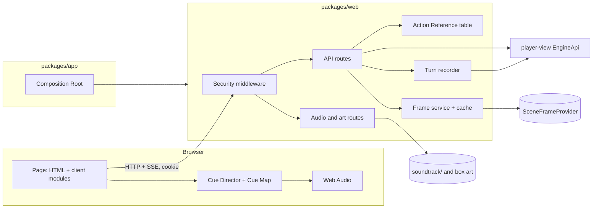

# Design Document

## Overview

The Web Shell is a second client for the game. It is a thin Express server in a new package, `packages/web`, that serves a plain page and relays the `player-view` `EngineApi` as JSON and server-sent events. It adds no game logic. Four decisions do most of the work.

1. **The server is a facade over a facade.** `packages/web` imports only `player-view`, enforced by a new dependency-cruiser rule. Everything it can say about the game is something `EngineApi` already returned. Truth isolation is inherited, then tested again at the HTTP boundary.
2. **Loopback binding is the first lock and a token is the second.** Binding to `127.0.0.1` keeps other machines out. It does not keep out other programs on this machine or a hostile web page in the player's own browser. A per-start random token, a session cookie, `Host` and `Origin` checks and a strict content policy cover those.
3. **The client can only ask for what was offered.** Every action in a response carries a reference that is valid for one state version. The client sends the reference, never an `Action` object. `EngineApi.act` re-quotes it anyway.
4. **Audio and pictures are view-side decoration.** The Cue Director runs in the browser from a closed list of Player View inputs, so music cannot reveal hidden facts. The Still-Frame Hook is an interface with a no-op default, and frames live in a cache outside the save and outside the determinism contract.

The soundtrack (twelve tracks, two takes each) and the box art exist only for this client. The cue map's own text says the title cue "covers the image render batch", so the hook is designed for a batch prepared at new-game setup as well as for single frames.

### Key decisions

| Decision | Choice | Rationale |
|---|---|---|
| Framework | Express 5, in `packages/web` only | Small, familiar, easy to test with Node's `http`. No other package gains the dependency |
| Client code | TypeScript compiled by `tsc` to plain ES modules, no bundler, no framework | Requirement 9.1. Client modules that hold logic (Cue Director, action rendering) are pure and run under Vitest unchanged |
| Turn transport | `POST` that answers with `text/event-stream`, read with `fetch` streaming | `EventSource` is GET-only. A POST keeps the action out of the URL and inside the `Origin` check |
| Notification transport | `GET /api/events` as `EventSource` | Fits long-lived push and reconnects on its own |
| Credential | 256-bit random token in memory, exchanged once for a session id cookie | The token never persists and never appears after the exchange. The cookie can be revoked server-side |
| Action input | Action Reference plus validated parameters | A crafted request cannot name an action the interface did not offer |
| Turn safety | The server finishes and records a turn even if the client disconnects | The Turn Pipeline is a transaction. A closed tab must not abort it halfway |
| Audio engine | Web Audio API, decoded buffers for loops and stingers, state machine in a pure module | Sample-accurate loops and crossfades. Logic testable in Node |
| Audio format | Offline encode to Ogg Opus, MP3 as fallback, WAV only if configured | MP3 has encoder padding, so loops are not gapless without compensation. WAV files are about 30 MB each (the folder is 743 MB) |
| Take choice | Browser randomness, never the previous Take | Variety, with no link to the Sim or its PRNG |
| Frame hook | Provider interface, content-hash cache, async delivery by event | Requirement 11. A slow or absent renderer can never touch a turn |

## Architecture



### Package changes

- **`packages/web`** (new): server, security, routes, frame service, audio route, client modules and static page assets. Depends on `@tradecraft/player-view`, `express` and `zod`. Dev dependencies: Express typings.
- **`.dependency-cruiser.cjs`**: add `web-imports-only-player-view`, a copy of `tui-imports-only-player-view` for `^packages/web/`. Also forbid `packages/web` from importing anything under `packages/app`.
- **`packages/app`**: new `scripts/play-web.ts` and `src/lib/web-launcher.ts`; the Composition Root gains no code, because `createGame` already returns the `EngineApi`. Integration tests that need the engine for truth fingerprints live here, because `app` may import everything.
- **`packages/player-view`**: one additive change. `HereView.location` and `SceneView.location` gain `type` (the public Location Type id) and `tags` (public tags only), and `district` (id and name). The Cue Map needs them. They are published content the player can already see, so no truth is exposed.
- **`package.json`**: scripts `play:web` and `soundtrack:encode`.
- **`config/web.yaml`** (new).

### Process and request flow

1. `play-web.ts` runs the same launcher steps as `play.ts` (config, Model Manager, `createGame`) and then calls `startShellServer(api, config)` instead of rendering Ink.
2. `startShellServer` generates the Access Token, binds to `127.0.0.1`, learns the port, builds the allowed-`Host` set and prints the Launch URL.
3. Each request passes the middleware chain in a fixed order (below), reaches a route, which calls `EngineApi` and serialises the result.

### Middleware order

1. **Peer check.** If `req.socket.remoteAddress` is not `127.0.0.1` (or the IPv4-mapped form), destroy the socket.
2. **Host guard.** `Host` must be `127.0.0.1:<port>` or `localhost:<port>`, else 421.
3. **Security headers.** CSP, `nosniff`, `Referrer-Policy: no-referrer`, `X-Frame-Options: DENY`, `Cache-Control: no-store` on API routes.
4. **Lockout.** If the failure counter is over the limit within the window, 429 with `Retry-After`.
5. **Launch route** (`GET /launch`): the only route that accepts the token in the query. On success it creates a session, sets the cookie and answers a tiny page with `<meta http-equiv="refresh" content="0; url=/">`. A meta refresh is a navigation the page itself makes, so a `SameSite=Strict` cookie is sent with it even when the first visit came from a terminal link. The token is not echoed.
6. **Authentication.** Valid cookie session or `Authorization: Bearer <token>`. Constant-time comparison (`crypto.timingSafeEqual` over equal-length digests). Failure increments the lockout counter and returns a bare 401.
7. **Origin guard** for every non-GET: `Origin` equals one of the two allowed origins, and `Sec-Fetch-Site`, if present, is `same-origin`. `Content-Type` must be `application/json`.
8. **Body parser** with a size limit.
9. **Router.**

Cross-origin preflight (`OPTIONS`) is answered 403 with no CORS headers.

## Components and Interfaces

### Server (`web/server`)

```ts
export interface ShellConfig {
  readonly port: number;                 // 0 = ephemeral
  readonly lockout: { readonly maxFailures: number; readonly windowMs: number; readonly blockMs: number };
  readonly maxBodyBytes: number;
  readonly openBrowser: boolean;
  readonly soundtrackDir: string;
  readonly audioFormats: readonly ('opus' | 'mp3' | 'wav')[];
  readonly artDir: string;               // repository root by default
  readonly frames: { readonly dir: string; readonly artDirection: string };
}

export interface ShellServer {
  readonly port: number;
  readonly launchUrl: string;            // contains the token; printed once, never logged
  close(): Promise<void>;                // stop accepting, let the in-flight turn commit, close streams
}

export function startShellServer(
  api: EngineApi,
  config: ShellConfig,
  deps?: { frameProvider?: SceneFrameProvider; random?: () => Buffer },
): Promise<ShellServer>;
```

`deps.random` lets tests fix the token. The default host is a constant. There is no config key for it, which makes Requirement 2.2 true by construction. The loader still rejects a `host` key if one appears in the file.

### Sessions and lockout (`web/security`)

```ts
interface SessionStore { create(): string; has(id: string): boolean; clear(): void }   // 128-bit ids
interface Lockout { fail(): void; blocked(): number | undefined /* retry-after seconds */ }
```

The lockout is global, not per peer, because every client has the same address. The session store is in memory and empties on restart, so a restart invalidates every cookie (Requirement 3.7).

The cookie is `tc_session=<id>; HttpOnly; SameSite=Strict; Path=/`. There is no `Secure` flag, because the origin is plain HTTP on loopback, and no `__Host-` prefix, which requires `Secure`.

### Action References (`web/api/action-refs`)

```ts
interface OfferedAction {
  readonly ref: string;                  // `${stateVersion}.${index}`
  readonly option: ActionOption;         // from EngineApi.actions()
  readonly template?: TemplateSpec;      // parameter slots the client must supply
}
class ActionRefTable {
  issue(options: readonly ActionOption[], stateVersion: number): OfferedAction[];
  resolve(ref: string, stateVersion: number): OfferedAction | StaleRef | UnknownRef;
}
```

- `stateVersion` is a counter the server bumps whenever a turn commits, a save loads or a game starts. A reference from an older version is `stale-ref` (409). An unknown one is `unknown-ref` (400).
- A template's parameter slots are declared in a table keyed by action kind, validated by Zod: decrypt submission, pay amount, cable report body, feed items, confront Claim, pitch offer. The table is typed against `Action` from `player-view`, so a new kind that needs parameters without an entry fails to typecheck.
- `complete(option, params)` produces the final `Action` by merging validated parameters into the offered one. It cannot change the kind or any field the template does not declare.
- Add-on action kinds (street-ops) arrive through the same `actions()` list. A kind with no template declaration is acted on as offered, which is correct for kinds with no free input.

### Routes (`web/api/routes`)

| Method and path | Backed by | Notes |
|---|---|---|
| `GET /api/state` | `status()`, `views.here()`, `views.scene()`, `actions()` | One call for the main screen. Includes `stateVersion`, `paused` and the issued Action References |
| `GET /api/views/{journal,map,people,documents,intercepts,help,debrief}` | `views.*` | `debrief` returns 404 until the engine returns one |
| `GET /api/views/document/:id`, `GET /api/views/workbench/:id` | `views.document`, `views.workbench` | Id validated against the type |
| `GET /api/casefile` | `caseFile.list(filter)` | Filter validated |
| `POST /api/casefile/{grade,link,unlink}` | `caseFile.*` | |
| `POST /api/notes` | `notes.add` | |
| `POST /api/quote` | `quote` | Body is an Action Reference plus parameters |
| `POST /api/act` | `act` | Streams. 409 if a turn is in flight or the reference is stale |
| `POST /api/say`, `POST /api/end-scene`, `POST /api/retry` | `say`, `endScene`, `retry` | Stream |
| `GET /api/turn/last` | Turn recorder | Replays the last turn's chunks for a reconnecting client |
| `GET /api/events` | `notifications.subscribe` and frame events | `EventSource` |
| `POST /api/notifications/:id/dismiss` | `notifications.dismiss` | |
| `GET /api/saves`, `POST /api/saves`, `POST /api/saves/:name/load` | `saves.*` | Load returns a typed `LoadError` |
| `POST /api/new-game` | `newGame` | Starts a Frame Batch if a provider is configured |
| `GET /api/frames/:key` | Frame cache | Bytes and media type. 404 if absent |
| `GET /audio/*`, `GET /art/*` | Disk | Allow-listed names only |
| `GET /`, `GET /static/*` | Page assets | |

Every JSON body carries `schemaVersion: 1`. Responses are plain serialisations. There is no mapping layer that could add a field.

### Turn pipeline and recorder (`web/api/turn`)

```ts
class TurnGate {
  run(open: () => TurnStream): TurnHandle | 'busy';       // one at a time
}
interface TurnHandle { readonly id: number; chunks(): AsyncIterable<TurnChunk>; done: Promise<void> }
```

- `run` calls the `EngineApi` method, then drives the stream to completion in the background and appends every chunk to the **Turn Recorder**. A request handler subscribes to the recorder and forwards chunks as SSE. A client that disconnects only unsubscribes.
- The recorder keeps the last turn only. `GET /api/turn/last` replays it, so a reload during a turn shows the chunks so far and then continues.
- A `paused` chunk leaves the gate open for `POST /api/retry` only. Any other state-changing call gets 409 `paused`.
- `stateVersion` increments when the stream ends with `done` or `ended`.

SSE framing: `event: chunk` with `data: <TurnChunk JSON>`. A final `event: end` carries `{ ok: boolean, error?: WebError }`. A comment line (`: hb`) every fifteen seconds keeps the connection alive.

### Errors (`web/api/errors`)

```ts
type WebError =
  | { code: 'bad-request'; issues: ZodIssueSummary[] }
  | { code: 'unauthorized' } | { code: 'busy' } | { code: 'paused' }
  | { code: 'stale-ref' } | { code: 'unknown-ref' }
  | { code: 'not-allowed'; reason: string }          // the quote's reason
  | { code: 'load-error'; error: LoadError }
  | { code: 'feed-error'; errors: FeedError[] }
  | { code: 'not-found' } | { code: 'internal' };
```

`internal` carries no message. Server logs get the cause. Logging records method, route, status and duration only.

### Page (`web/client`)

Static files: `index.html`, `app.css`, and ES modules under `client/`. No inline script or style, so the CSP can be `default-src 'none'; script-src 'self'; style-src 'self'; img-src 'self' blob:; media-src 'self' blob:; connect-src 'self'; frame-ancestors 'none'; base-uri 'none'; form-action 'self'`.

- **Layout.** A status bar (day, phase, Location, Budget, Standing, alerts) always visible. A main column with the scene text (Fact Lines plain, Flavour dim italic, speech labelled by speaker). A side column with Here and the action list. Tabs or a nav list for Journal, Map, People, Documents, Workbench, Case File, Notifications, Help, Saves.
- **Actions.** Each Offered Action is a button showing label, phase cost and Budget cost (Slice Req 26.2). A disallowed action is shown disabled with its reason. A template action opens a small form.
- **Dialogue.** While a scene is open the input line calls `say`. The natural-language-commands spec later adds a command box without changing this layout.
- **Accessibility.** Landmarks (`header`, `nav`, `main`, `aside`), labelled controls, an `aria-live="polite"` region for streamed text, visible focus, and no information carried by colour alone.
- **Modules.** `api.ts` (typed fetch wrappers, SSE reader), `render/*.ts` (pure view-to-DOM functions), `state.ts`, `title.ts`, `audio/*.ts`.

### Cue Director (`web/client/audio`)

The Director is a pure decision function plus a thin Web Audio player.

```ts
// cue-engine.ts: no DOM, no Web Audio, runs under Vitest
export interface CueInputs {
  readonly screen: 'title' | 'city' | 'talk' | 'workbench' | 'intercept' | 'gameover';
  readonly district?: string;
  readonly locationType?: string;
  readonly locationTags: readonly string[];       // public tags only, e.g. 'sector:soviet', 'type:kaffeehaus'
  readonly phase: 'morning' | 'afternoon' | 'evening' | 'night';
  readonly lastActionKind?: string;                // the player's own action
  readonly lastIntent?: string;                    // the player's own classified Intent
  readonly factKinds: readonly string[];           // fact kinds shown this turn, e.g. 'border-outcome:detained'
  readonly alerts: readonly string[];              // notification kinds currently shown
  readonly dialogueStreaming: boolean;
  readonly gameOver?: 'success' | 'burned' | 'plot-completes';
  readonly minutesInState: number;
}

export interface CueDecision {
  readonly music: CueId | 'silence' | undefined;   // undefined = leave unchanged
  readonly stinger?: CueId;
  readonly ambience?: CueId | 'off';
  readonly transition: Transition;                 // crossfade | cut | after-stinger
  readonly duck: boolean;
}

export function decide(map: CueMap, manifest: CueManifest, prev: DirectorState, inputs: CueInputs): { decision: CueDecision; next: DirectorState };
```

`decide` is a pure function. Rules are evaluated in order, first match wins, and the previous state supplies hysteresis (for example a minimum dwell, and the exploration timer). Nothing else may be passed in. That is the structural guarantee behind Requirement 15.2: `CueInputs` is the entire input type, and the browser fills it only from API responses.

The Web Audio side:

- `Player` owns an `AudioContext`, a master gain, a music bus, a stinger bus and an ambience bus.
- Each Cue plays from a decoded `AudioBuffer`. Buffers are fetched on demand with a small prefetch of the next likely Cue, and evicted least-recently-used with a memory cap.
- A loop uses `loopStart` and `loopEnd` from the Take's metadata. A crossfade schedules gain ramps on the audio clock at the next phrase boundary of the outgoing Take when its metadata has one.
- Ducking lowers the music bus by a fixed amount while `dialogueStreaming` is true, with a short ramp.
- `AudioContext` is created or resumed only in a user-gesture handler on the title screen (Requirement 15.10).

**Take choice.** `pickTake(cue, lastTake, rand = Math.random)` returns a random Take other than `lastTake` when two or more exist. It is called by the `Player` when a Cue starts, never by `decide`. The Director state stores only the Cue id, so the decision sequence stays identical across runs and the Take choice stays out of the non-oracle property.

### Cue Map and Cue Manifest (`soundtrack/` and `web/audio`)

`soundtrack/cue-map.md` stays as the human description. A machine copy, `soundtrack/cue-map.yaml`, is validated by Zod at start:

```yaml
version: 1
cues:
  title:         { kind: music, file: "Tradecraft",       loop: { section: middle } }   # one Take, about 5.5 minutes
  opening:       { kind: music, file: "Opening",          loop: none }
  exploration:   { kind: music, file: "City" }
  soviet:        { kind: music, file: "Soviet-Sector" }
  cafe:          { kind: music, file: "Café",             duck: true }
  interrogation: { kind: music, file: "Interrogation" }
  checkpoint:    { kind: music, file: "Checkpoint" }
  workbench:     { kind: music, file: "Cipher Workbench" }
  numbers:       { kind: music, file: "Numbers Station" }
  pursuit:       { kind: music, file: "Pursuit" }
  success:       { kind: music, file: "Success",          loop: none }
  burned:        { kind: music, file: "Burned",           loop: none }
  # Derived Cue: a plot-completes failure has no track yet, so it plays the first section of Burned as a stand-in.
  burned-plot:   { kind: music, from: burned, take: 1, slice: { section: first }, loop: none, fadeOut: 3 }
  # No stingers and no ambience beds exist as files. Rules that name one fall back to a crossfade or to silence.
rules:
  - when: { screen: title }
    music: title
  - when: { all: [ { screen: city }, { locationTags: { has: 'sector:soviet' } } ] }
    music: soviet
    transition: { type: crossfade, seconds: 2.5, boundary: phrase }
  # ... one rule per row of cue-map.md
```

The predicate language is deliberately tiny: `all`, `any`, `not`, equality on scalar inputs, `has` and `in` on lists, and numeric comparison on `minutesInState`. It can read only `CueInputs` fields, which the schema enforces by key. A rule naming an unknown input fails validation.

**Rule order.** Rules are evaluated first-match-wins, in this order, so that the most specific situation decides the music: game over, title and opening, numbers-station intercept, workbench, a burned-asset hold, checkpoint, pursuit, interrogation, café or hotel, then exploration. Exploration is `Soviet-Sector` when the current Location has the `sector:soviet` tag and `City` otherwise. Putting the sector rule inside exploration and last is what lets `Soviet-Sector` stand for "the city, but in the Soviet sector" without hiding a café or an interrogation that happens there.

`cue-map.md` rows, and what changes when they meet the non-oracle rule:

| Row in `cue-map.md` | Player View trigger | Note |
|---|---|---|
| Title and new-game setup | `screen: title` | Covers Frame Batch preparation |
| Exploring Western sector or Inner City | `screen: city`, any phase | `City` for day and night. There is no separate night variant. After the configured exploration time the Director drops to silence for a while, because there is no ambience bed |
| Exploring Soviet sector | `screen: city` and `locationTags` has `sector:soviet` | `Soviet-Sector` is the exploration music in the Soviet sector, in place of `City`. Crossfade 2–3 s on a phrase boundary when the player crosses in or out. Scene cues (café, interrogation, checkpoint, pursuit) still take precedence over it |
| Café or hotel scene | `locationTags` has `type:kaffeehaus` or `venue:hotel-bar`, duck while dialogue streams | `Café` for both the café trio and the hotel-bar piano |
| High-stakes conversation | The player's own pitch or confront Intent in the open scene | `Interrogation`. **Changed trigger.** "High-stakes" is Sim knowledge. The Intent is the player's own |
| Switch to cracking variant | None | There is no cracking variant. If one is made, it must trigger on a shown contradiction Fact Line and never on the NPC's cover state, which is truth (Requirement 15.5) |
| Sector crossing | `factKinds` has `border-outcome:*` or a Sector Line travel result | `Checkpoint`, then a crossfade to the new sector's track. There are no cleared or detained stingers |
| Cipher workbench | `screen: workbench` | `Cipher Workbench`. There is no "solved" stinger |
| Numbers-station intercept | `screen: intercept` and the shown transmission kind | `Numbers Station`, which is the interval signal followed by the spoken digits. All other music stops underneath |
| Pursuit | street-ops: the player's own `fast` speed or an Evasion Maneuver | `Pursuit`. Never triggered by the Tail's existence |
| An asset is burned | `alerts` has `asset-burned` | No stinger exists. The music stops and the Director holds 20–30 s of silence, then resumes exploration |
| Game over | `gameOver` | `Success`, or `Burned`. A plot-completes failure has no track yet, so it plays `burned-plot`, the first section of `Burned`. No loop, then silence |

**Derived Cues.** A Cue with `from` and `slice` is a time slice of one Take of another Cue (negative offsets count from the end), with optional fades, loop and gain. The Cue Director decodes the source Take once and plays the slice from the same buffer, so a Derived Cue costs no extra file and no extra download. A slice is given either as `start` and `end` seconds or as a named `section` from the Take's metadata. A Derived Cue stays within one Take (Requirement 15.16). When a real file for the same Cue id appears in the manifest, it replaces the slice with no change to the Cue Map rules. The only Derived Cue shipped today is `burned-plot` (the first section of `Burned`).

`CueManifest` is built at server start by scanning `soundtrack/`:

```ts
interface CueManifest {
  readonly takes: ReadonlyMap<CueId, readonly Take[]>;   // all discovered files, by format
  readonly missing: readonly CueId[];                    // named in the map, no audio
  readonly singleTake: readonly CueId[];                 // reported, still played
}
interface Take { readonly id: string; readonly files: Partial<Record<'opus'|'mp3'|'wav', string>>; readonly meta?: TakeMeta }
```

Discovery uses file names: `<Name>.mp3` and `<Name> 2.mp3` are Takes 1 and 2 of one Cue. The mapping from a Cue id to file stem is in `cue-map.yaml` (for example `cafe: "Café"`). Normalisation to NFC handles accented names. The twelve existing stems are: Burned, Café, Checkpoint, Cipher Workbench, City, Interrogation, Numbers Station, Opening, Pursuit, Soviet-Sector, Success, Title. All have two Takes. (`Tradecraft (Modern)`, the marketing title song, is not mapped to a Cue.) The other Takes run from about one minute (Numbers Station) to about 3.5 minutes. An audit with `ffprobe` and silence detection found each file to be one continuous piece with no short stingers and no separate ambience beds.

`TakeMeta` is optional and lives in `soundtrack/take-meta.yaml`: `bpm`, `beatsPerPhrase`, `firstBeatOffset`, `loopStart`, `loopEnd`, and named `sections` (for example `first: [0, 42.5]`). `Burned` take 1 (`Burned.wav`) has `first: [0, 68]`: a loudness analysis shows a clear quiet break at about 68 seconds, so the stand-in ends there with a 3-second fade. Take 2 has no clean break this early, so `burned-plot` always uses take 1. If a named section is missing, it defaults to the first 45 seconds with the Cue's fade-out. The `soundtrack:encode` script writes Opus files into `soundtrack/web/` (git-ignored) and can estimate beats, but meta can also be written by hand. Without meta the Director crossfades at once and does not loop sample-accurately.

### Audio and art routes (`web/audio/route`)

- `GET /audio/<file>`: only names that the manifest produced. Range requests are supported (`Accept-Ranges`, `206`). Content types from the extension. Format choice follows `audioFormats`; the client asks for a Take and the server answers with the first available format. WAV is served only if listed.
- `GET /art/box-wide.jpg` and `GET /art/box-square.jpg`: fixed names that map to `box_art.jpeg` and `box_art-1-1.jpeg` in the repository root.
- Both routes are behind authentication, so the files cannot be read cross-origin or by another local process.

### Frame service (`web/frames`)

```ts
export type FrameKind = 'scene' | 'portrait' | 'title';

export interface FrameRequest {
  readonly kind: FrameKind;
  readonly key: string;                       // sha256 of the canonical request, hex
  readonly location: { name: string; type: string; description: string; atmosphere: readonly string[] };
  readonly phase: Phase;
  readonly crowd: CrowdLevel;
  readonly weather: string;
  readonly visible: readonly { label: string; descriptor: string }[];   // portrait/scene subjects
  readonly artDirection: string;
}

export interface Frame { readonly bytes: Uint8Array; readonly mediaType: 'image/png' | 'image/jpeg' | 'image/webp' }

export interface SceneFrameProvider {
  readonly id: string;
  render(req: FrameRequest, signal: AbortSignal): Promise<Frame | undefined>;
  prepare?(batch: readonly FrameRequest[], onProgress: (done: number, total: number) => void, signal: AbortSignal): Promise<void>;
}
```

- `buildFrameRequest(scene: SceneView, here: HereView, config)` is a pure function over Player View data. Its canonical form is JSON with sorted keys and the Frame Key is its hash. The key covers the art direction, so a style change re-renders.
- The `FrameService` checks the cache (`config.frames.dir/<key>.<ext>`), and on a miss calls `render` with a timeout, never awaited by a route. On success it writes the file and emits a `frame` event on the events stream. The page then swaps the image in.
- `prepareBatch` builds one scene request per known Location at the current phase and crowd band for the first phase, and a portrait request for each visible NPC descriptor. It runs only if the provider has `prepare` or can `render`. Progress arrives as `frame-progress` events.
- The default `NullFrameProvider.render` returns `undefined`. The page therefore never reserves space for a missing frame.
- The cache is a plain directory outside `saves/`. It is not read at load, is not in the Content Manifest, and deleting it changes nothing about the game.

The hook's documentation states the model budget constraint (Requirement 11.10): a renderer that loads a model competes with the two resident language models and needs its own spec.

## Data Models

```ts
interface ShellState {                      // all in memory, none persisted
  stateVersion: number;
  offered: ActionRefTable;
  turn?: { id: number; running: boolean; recorder: TurnRecorder; paused?: { endpoint: string } };
  sessions: SessionStore;
  lockout: Lockout;
  frames: FrameService;
  manifest: CueManifest;
}
```

`config/web.yaml`:

```yaml
port: 0                     # 0 picks a free port, printed at start
openBrowser: false
lockout: { maxFailures: 8, windowMs: 60000, blockMs: 60000 }
maxBodyBytes: 65536
soundtrackDir: soundtrack
audioFormats: [opus, mp3]
frames:
  dir: .cache/frames
  artDirection: "1950s Vienna, black-and-white film still, grainy, wide shot"
```

The Zod schema rejects unknown keys, so `host: 0.0.0.0` fails at load with the located error format the other configs use.

## Correctness Properties

### Property 1: Loopback only

For any configuration the schema accepts, the listening socket's address is `127.0.0.1`. For any connection whose peer is not loopback, no response bytes are written.

### Property 2: Credential required

For any request without a valid session cookie or bearer token, on any route other than the launch route and its redirect, the response is 401 with an empty body, and the game state is unchanged.

### Property 3: Cross-origin state change refused

For any non-GET request whose `Origin` is absent or not an allowed origin, or whose `Sec-Fetch-Site` is not `same-origin`, the response is 403 and the game state is unchanged. For any request whose `Host` is not an allowed host, the response is 421.

### Property 4: Offered actions only

For any request body sent to `/api/act`, the `Action` passed to `EngineApi.act` is the result of `complete(option, params)` for an Action Reference that was issued for the current `stateVersion`. A body containing an `Action` object, an unknown reference or a stale reference never reaches `act`.

### Property 5: Truth isolation at the boundary

For any generated world in the corpus, and any sequence of Shell Server requests, no response body contains any string in the world's Truth fingerprint (true allegiances, concealed Propositions, MICE profiles and ids that appear only in the Truth Store), until `views.debrief()` returns a debrief.

### Property 6: Client parity with the engine

For any seed and scripted action log, driving the log through the Shell Server and driving it directly through `EngineApi` yield the same final world-state hash.

### Property 7: Turn atomicity under disconnect

For any turn whose client closes the connection at any chunk boundary, the final world state equals that of a turn whose client stayed connected, and `GET /api/turn/last` returns the same chunks.

### Property 8: One turn at a time

For any interleaving of state-changing requests, at most one `EngineApi` turn method is in flight, and every request that arrives while one is in flight gets 409.

### Property 9: Cue sequence is a function of Player View alone

For any two games that give identical `CueInputs` sequences, `decide` returns identical decision sequences, whatever the Truth Store holds. Checked by running the same scripted Player View traces against worlds that differ only in hidden truth, and by the type: `decide` accepts nothing but `CueInputs`.

### Property 10: Take choice independence

`pickTake` never returns the previous Take when two or more exist, and takes no argument derived from the game. Changing the random source changes no `CueDecision`.

### Property 11: Frames are inert

For any frame provider, including one that always throws, hangs or returns garbage, every response to a state-changing request and the final world-state hash are identical to those with the null provider.

### Property 12: Cue Map validity

For any Cue Map the validator accepts, every rule reads only `CueInputs` fields and every cue it names exists in the map; a rule naming a Cue with no audio degrades to its fallback and never throws.

## Error Handling

- **Port in use or bind failure.** The launcher prints the port and the cause, and exits before starting a game.
- **Invalid config.** Located Zod issues, as for the other configs.
- **Model endpoint down mid-turn.** The engine's `paused` chunk is relayed. The page shows the paused state and a retry button.
- **Client protocol errors.** Typed 400, 401, 403, 409, 421, 429, with bodies from `WebError` only.
- **Missing audio or art.** Typed 404. The Cue Director falls back to silence with one visible notice. A Cue missing from the manifest is logged once at start.
- **Frame provider failure.** Caught, logged without the request body, and ignored by the turn path.
- **Shutdown.** `SIGINT` stops accepting new connections, waits for the in-flight turn to commit, closes event streams, then exits.

## Testing Strategy

- **Unit tests** (Vitest): token, session and lockout; Host, Origin and header guards; Action Reference issue, resolve and completion; parameter schemas; error mapping; Cue Map validation; `decide` over table-driven traces from each row of `cue-map.md`; manifest discovery over a fixture directory (including `Café`/`Café 2`); `pickTake`.
- **Integration tests** (in `packages/app`, using the fake seams): start the Shell Server on port 0, then drive it with Node `fetch`. Cover Properties 1–4, 7 and 8, the launch flow, SSE framing and heartbeat, reconnect through `/api/turn/last`, range requests for audio, art routes, and the 404 and 401 behaviours.
- **Property tests** (fast-check): Property 5 over generated worlds with a Truth fingerprint built from the engine's Truth Store; Property 6 over scripted games; Property 9 with paired worlds; Property 11 with a hostile provider.
- **Dependency check.** `pnpm dep-cruise` fails on a forbidden import from `packages/web`.
- **Manual checklist** (not automated): autoplay gesture on Safari, Chrome and Firefox; crossfade and loop audibility on a phrase boundary; keyboard-only play-through; screen reader pass of the main screen.
- **No live model.** Everything runs on the Composition Root's fake seams, as the other app tests do.

## Open Items for the Author

- **Cue assignment (decided).** `Title` is the title cue (two Takes themed for the game; the marketing song `Tradecraft (Modern)` is not used), `Opening` is the game's opening cue, and every other track plays the cue of the same name as listed above. A plot-completes failure plays the first section of `Burned` until it has its own track.
- **Where `Burned`'s first section ends (decided).** Measured from the audio: take 1 drops in loudness at about 68 seconds, so `burned-plot` plays take 1 from 0 to 68 seconds with a 3-second fade. Adjust `take-meta.yaml` by ear if it cuts in the wrong place.
- **Cues with no recordings.** There are no stingers (asset burned, sector cleared or detained, cipher solved) and no ambience beds, and there is no night, cracking or separate hotel-bar variant. The design degrades each of those to a crossfade or to deliberate silence, and the Cue Manifest reports them at start. They can be added later by dropping files in with the same Cue ids.
- **Repository size.** `soundtrack/` is 743 MB, mostly WAV. This design serves Opus or MP3 and leaves WAV unused. Consider moving the WAV masters out of git (Git LFS or a separate store) and git-ignoring the encoded `soundtrack/web/` directory.
