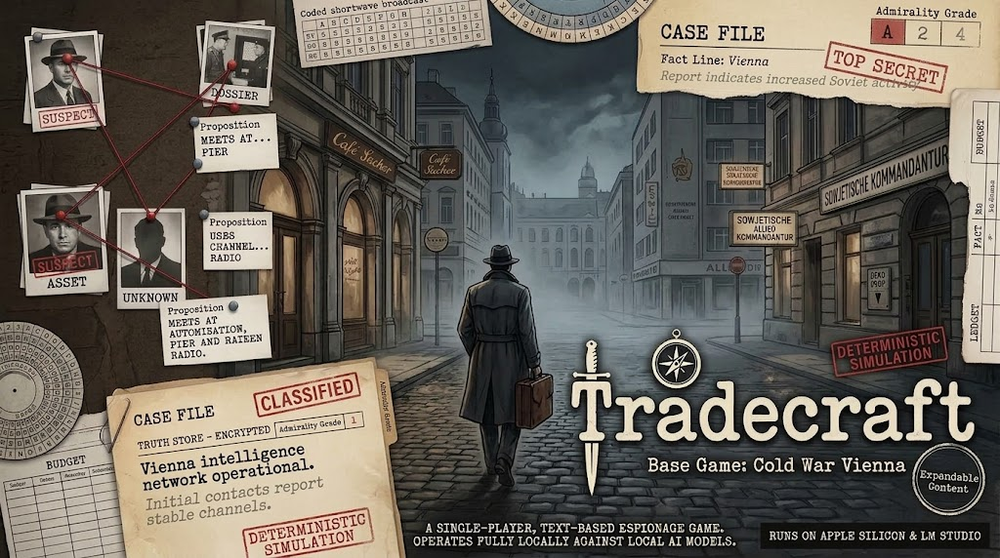

# Tradecraft



A text espionage game set in occupied Vienna, 1952. You run agents for a Western intelligence Station, work out who is lying to you, and try to stop a hostile Plot before it completes. Every playthrough is generated from a seed.

A deterministic simulation owns all ground truth: who works for whom, where people go, what was said and what really happened. Local language models only voice characters and describe scenes. They never create, change or reveal facts, so the mystery stays fair and every game can be replayed exactly.

## How it plays

- **Human sources.** Approach people, build trust, pitch them on money, ideology, coercion or ego, task them, and judge whether what they tell you is true.
- **Signals.** The Station's antenna hears radio and numbers traffic on the air, and the Cell talks more as its operation advances. Break it by hand on the Workbench (Caesar, Vigenère, columnar, book and one-time-pad ciphers, with tradecraft errors to exploit; a one-time pad only falls when its operator reused it).
- **The Case File.** Every Claim you collect is graded on the Admiralty scale (A–F / 1–6), linked, and checked for corroboration and conflict. A Claim is corroborated only by an independent source about the same moment: HQ's Cables and Dossiers are one voice, so they point you at suspects but cannot confirm them. An arrest needs a strong enough case: each fact confirmed in the field adds to it, intent (what someone plans and targets) counts most, and HQ's word alone counts for nothing.
- **Counterintelligence.** A Hostile Service watches you. Its watchers sit at risky places, so walking straight into them, careless approaches, meetings and drops raise hidden Cover Suspicion; it can tail you and eventually burn you. Countersurveillance routes cost time and avoid the watchers. It also runs dangles, plants stories in the papers, and may have a mole in your own Station.
- **Deception.** NPCs keep cover stories and lie consistently. You can turn agents and feed the Hostile Service chickenfeed and deception through them.
- **Noise.** Side Threads and Rumours look like leads. The debrief at the end shows what was real.

## Status

The vertical slice is playable end to end through `pnpm play`: the Turn Pipeline runs the day-boundary hooks (Plot, schedules, the Hostile Service, newspapers, Directives, Cable replies, end detection), every action is dispatched, the App Shell drives the game, and new games, saves and debriefs work. `pnpm run check` is green across all eight packages.

The developer playtest (slice-integration task 20) is still to do: full campaigns through `pnpm play` with live models, and an evals run to set the active model profile.

## Requirements

- macOS or Linux, Node.js 22, pnpm 11 (via Corepack)
- [LM Studio](https://lmstudio.ai) with the `lms` CLI, for anything that talks to a model
- The reference machine is an Apple M4 Max with 64 GB. The default profiles keep two 4-bit models resident. Smaller machines need smaller models in `config/models.yaml`.

Everything runs locally. No cloud models are used.

## Setup

```sh
corepack enable
pnpm install
pnpm run check          # typecheck, lint, dependency rules, tests
```

To use live models:

```sh
# Edit config/models.yaml so the model ids match what LM Studio lists, then:
pnpm models:pull        # downloads missing models for the active profile (the only command that downloads)
pnpm repl --seed vienna-alpha   # scripted first live session, recorded to packages/evals/replays/
```

## Commands

| Command | What it does |
| --- | --- |
| `pnpm play [--seed <s>] [--profile <name>]` | Launch the game: validate the configs, start the Model Manager (connect, preflight, load the active profile), then open the App Shell. `--seed` pre-fills the start screen; `--profile` overrides the active profile in `config/models.yaml` |
| `pnpm play:web [--profile <name>]` | Same startup as `pnpm play`, then serve the game to your browser on 127.0.0.1 only, with the soundtrack. See `docs/web-shell.md` |
| `pnpm evals [--profile <name>] [--out <dir>]` | Run the model evaluation harness and write a Markdown + CSV comparison report (default `logs/evals/`). With `--profile <name>` it runs that one profile; with none it compares every profile, unloading each before loading the next |
| `pnpm run check` | Typecheck, lint, dependency-cruiser boundary rules and all tests |
| `pnpm world --seed <s> [--preset easy\|standard\|hard] [--reveal]` | Generate a world and print the Starting Brief; `--reveal` adds the hidden truth (allegiances, mole, Plot, noise) |
| `pnpm sim --seed <s> --script <actions.json>` | Run scripted actions through the engine with no model and print the Fact Lines and Case File (example: `packages/evals/scripts/example-actions.json`) |
| `pnpm repl [--seed <s>]` | One scripted live session through LM Studio with recording on, then a Case File, Journal and truth dump |
| `pnpm models:pull` | Download the active profile's missing models with `lms get` |
| `pnpm seeds:vet` | Rebuild `config/featured-seeds.json`: play candidate seeds with the expert playability probe (offline, about a second each) and keep those won mid-way through the operation. A seedless new game starts on one of them |

### Saves Directory

Saves and outcome records live under `saves/` at the repo root (gitignored). Each save is one `saves/<name>.save.json` file, written atomically so an interrupted write never corrupts the previous save. Outcome Records from finished games are written beside them under `saves/outcomes/`.

### App Shell key map

The App Shell owns these global keys on every screen (shown in the in-game help overlay, `?`):

| Key | Screen / action |
| --- | --- |
| `c` | Case File |
| `d` | Documents |
| `w` | Workbench |
| `j` | Journal |
| `m` | Map |
| `p` | People |
| `f` | Feed composer for the selected turned Asset |
| `s` | Save |
| `l` | Load |
| `?` | Toggle the help overlay |
| `q` | Quit (confirms first) |

Within a scene, `Enter` opens the action menu or submits a typed line and `Esc` goes back (ending a Talk Scene).

## Balance

Every preset is calibrated against three scripted player models that play whole games offline through the real engine (`packages/app/src/lib/playability-probe.ts`, `scripted-games.ts`):

| Model | Plays | Expected |
| --- | --- | --- |
| Expert | Works the leads, the Station's traffic and informants placed where the operation shows itself, and arrests as soon as the case allows | Usually wins, with the win landing mid-way through the operation rather than in its opening days or on its last |
| Reckless | Takes direct routes into risky places and cold-approaches strangers | Burned by the Hostile Service on `standard` and `hard` |
| Idle | Only waits | Always loses when the operation completes |

Measured on 100 seeds per preset when the arrest thresholds were last set:

| Preset | Arrest threshold | Expert wins | Median win (share of the operation's timeline) | Reckless burned |
| --- | --- | --- | --- | --- |
| easy | 6 | 100% | 41% | n/a |
| standard | 7 | 90% | 53% | 87% |
| hard | 7 | 91% | 63% | 97% |

The expert reads ground truth to decide where to look and stands in for perfect cryptanalysis, so these are upper bounds; a human player finds the evidence more slowly. `packages/app/src/lib/playability.calibration.spec.ts` holds the bands in CI on a fixed sample. When a deliberate change moves them, re-measure, update the bands and this table together, and re-run `pnpm seeds:vet`.

## Architecture

A pnpm + Nx monorepo of eight TypeScript packages:

| Package | Role |
| --- | --- |
| `content` | Zod schemas and the Content Pack loader. Imports only `zod` and `yaml`. |
| `engine` | The deterministic simulation: seeded PRNG streams, world generation, actions, clock, Plot, Hostile Service, ciphers, endings. Owns all truth. |
| `llm` | OpenAI-compatible Gateway (routing by Model Role, retries, recording and replay) and the LM Studio Model Manager (preflight, load/unload). |
| `dialogue` | Knowledge slicing, prompt building, intent classification, Leak/Specifics/Refusal guards, the Narrator and Claim extraction. |
| `player-view` | The truth boundary: Case File, Journal, view projections, the Turn Pipeline, saves and debrief. |
| `tui` | Ink terminal screens. May import only `player-view`. |
| `app` | The Composition Root (`createGame`), the `pnpm play` launcher, file-backed saves and Outcome Records, the Fake Seams, and the playability probe and featured seeds. Nothing but `evals` may import it. |
| `evals` | Golden replays, the model evaluation harness and the debug CLIs. |

Boundaries are enforced by `.dependency-cruiser.cjs`. Ground-truth values are branded `Truth<T>` in the engine and never cross into `player-view` projections.

Configuration lives in `config/models.yaml` (role → model, two profiles), `config/scenario.yaml` and `config/featured-seeds.json` (written by `pnpm seeds:vet`). Content lives in `packages/content/packs/core/`.

### Content Packs

Content is data, versioned in packs (`pack.yaml` with `id`, `version`, `contentSchema`, `requires`, `overrides`). An extension pack can add new archetypes, personas, Location Types, Plots, Side Threads, Rumours and documents under its own namespace, reference other packs' content by namespaced id, and override listed ids. Saves record a Content Manifest and refuse to load against different packs.

Packs cannot add new mechanics (action kinds, channel kinds, cipher kinds). Those are code.

## Roadmap

1. **slice-integration** (`.kiro/specs/slice-integration/`) — assembled the slice into a playable game: the day-boundary hooks in the Turn Pipeline, every action dispatched, `newGame`/saves/`validateFeed`, the Prompt Builder in live dialogue, the TUI App Shell and the Composition Root. Remaining: the final playtest (slice task 24).
2. **content-expansion** — pack roles, a Content Kind Registry, Era Packs, Library Packs, real-city packs (Vienna, Berlin, Istanbul, Lisbon, Trieste) and authoring tools.
3. **plot-library** — more Plot templates and cross-city stage hooks.
4. **ambient-world** — a living city: events, NPC lives, gossip, rolling news, cover-job demands.
5. **campaign-career** — careers across games via Outcome Records.
6. **multi-city** — a Region of 2–4 cities with intercity travel, borders, papers and several rival services.

Under consideration: a localhost web interface over the same `player-view` facade, AI-rendered still frames for scenes, natural-language commands, street-level movement with car tails, smuggling through checkpoints, and settings outside the early Cold War.

## Specs

Specs live in `.kiro/specs/<name>/` as `requirements.md`, `design.md` and `tasks.md`: `tradecraft` (the slice), `slice-integration` (assembles the slice into a playable game; the specs after it depend on it), `content-expansion`, `plot-library`, `ambient-world`, `campaign-career` and `multi-city`.
